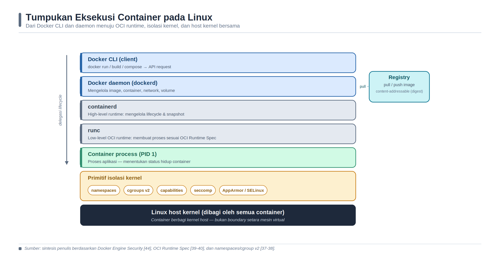

<a id="bab-02"></a>

# Bab 2 — Konsep Container dan Instalasi Docker

Topik utama: containerization, Docker Engine, Docker CLI, Docker Desktop, Dockerfile, image layer.

## Tujuan Pembelajaran dan Kompetensi Utama

**Setelah menyelesaikan bab ini, pembaca diharapkan mampu:**

1. Menjelaskan perbedaan virtual machine dan container dari sisi isolasi, ukuran, startup time, dan overhead.

2. Mengidentifikasi komponen Docker: client, daemon, registry, image, container, network, dan volume.

3. Menginstal Docker Engine pada Ubuntu serta Docker Desktop pada Windows berbasis WSL2.

4. Menjalankan container pertama, melakukan inspeksi image, melihat log, dan membangun image custom sederhana.

## Konsep Inti dan Landasan Teori

### Containerization sebagai Isolasi Proses

Containerization adalah pendekatan untuk mengemas aplikasi beserta userspace, dependensi, dan konfigurasi eksekusinya ke dalam unit yang dapat dijalankan secara konsisten. Secara teknis, container pada Linux bukan komputer virtual yang memiliki kernel sendiri. Container adalah satu atau beberapa proses biasa pada host yang memperoleh tampilan resource berbeda melalui namespace, pembatasan resource melalui cgroup, serta pengurangan privilege melalui mekanisme keamanan kernel. Dokumentasi Docker mendefinisikan container sebagai instance yang dapat dijalankan dari sebuah image; container dapat dihubungkan ke network dan storage, tetapi tetap berbagi kernel sistem operasi host [36]. Perbedaan ini menjelaskan mengapa container umumnya memiliki waktu mulai dan overhead lebih rendah daripada virtual machine, sekaligus menjelaskan mengapa boundary keamanannya tidak identik dengan hypervisor.

Istilah portabel pada container juga perlu digunakan secara hati-hati. Image menyatukan filesystem aplikasi dan parameter eksekusi sehingga mengurangi perbedaan dependensi antarlingkungan. Namun, portabilitas tetap dibatasi oleh sistem operasi, arsitektur CPU, kemampuan kernel, konfigurasi network, storage, secret, dan layanan eksternal. Image Linux untuk arsitektur amd64 tidak otomatis berjalan secara native pada host arm64, kecuali tersedia varian multi-platform atau emulasi. Oleh sebab itu, container meningkatkan konsistensi packaging, tetapi tidak menghapus kebutuhan rekayasa platform dan pengujian kompatibilitas.

Perbandingan container dan virtual machine sebaiknya didasarkan pada model isolasi, bukan sekadar ukuran berkas. VM memvirtualisasikan perangkat keras dan menjalankan guest kernel, sehingga menyediakan boundary yang secara umum lebih kuat tetapi memerlukan resource lebih besar. Container memvirtualisasikan pandangan proses terhadap resource kernel. Pilihan di antara keduanya bergantung pada tingkat isolasi, jenis workload, kepatuhan, kepadatan, waktu startup, serta kemampuan operasi. Pada praktik modern, keduanya sering digunakan bersama: container berjalan di dalam VM agar organisasi memperoleh unit deployment yang ringan sekaligus boundary infrastruktur yang lebih tegas.

### Namespace: Pemisahan Pandangan terhadap Resource

Namespace menyediakan mekanisme kernel untuk membuat sekelompok proses melihat instance resource yang berbeda. PID namespace memisahkan penomoran dan visibilitas proses; mount namespace memisahkan tampilan mount point; network namespace memisahkan interface, alamat IP, routing, dan port; IPC namespace memisahkan objek komunikasi antarproses; UTS namespace memisahkan hostname; user namespace memetakan UID dan GID; sedangkan cgroup namespace mengubah pandangan proses terhadap hierarki cgroup. Dokumentasi kernel Linux menempatkan namespace sebagai fasilitas administrasi kernel, sementara Docker membuat sekumpulan namespace ketika container dijalankan [37,36].

Isolasi namespace bersifat spesifik terhadap resource. PID namespace tidak membatasi konsumsi memori, dan network namespace tidak mencegah proses menggunakan CPU secara berlebihan. Konfigurasi yang membagikan namespace host, misalnya host network atau bind mount yang terlalu luas, sengaja mengurangi isolasi untuk memperoleh fungsi tertentu. Karena itu, parameter runtime harus dibaca sebagai keputusan arsitektur. Penggunaan --pid=host, --network=host, --privileged, atau mount Docker socket tidak boleh diperlakukan sebagai variasi sintaks biasa; pilihan tersebut mengubah boundary kepercayaan container.

### cgroup: Akuntansi dan Pengendalian Resource

Control group atau cgroup mengorganisasikan proses secara hierarkis dan mendistribusikan resource sistem secara terkontrol [38]. Docker menggunakan cgroup untuk mengukur dan membatasi CPU, memori, I/O, serta jumlah proses. Tanpa limit, container tidak otomatis memperoleh jatah resource yang adil; satu workload dapat menghabiskan memori host atau menciptakan terlalu banyak proses sehingga mengganggu layanan lain. Flags seperti --memory, --cpus, dan --pids-limit pada akhirnya diterjemahkan menjadi konfigurasi cgroup oleh runtime.

Limit resource memiliki implikasi pada perilaku aplikasi. Batas memori yang terlalu kecil dapat memicu out-of-memory termination, sedangkan kuota CPU dapat menyebabkan throttling dan meningkatkan latency. Oleh karena itu, penetapan limit tidak boleh sekadar menyalin angka dari contoh. Baseline diperoleh dari pengukuran workload, kemudian ditambah margin dan diuji pada beban puncak. Metrics throttling, working set, OOM event, dan restart count diperlukan untuk membedakan kekurangan kapasitas dari bug aplikasi. cgroup adalah kontrol availability dan fairness, bukan kontrol kerahasiaan; ia tidak menggantikan namespace, permission, atau kebijakan akses.

| Mekanisme | Objek yang Diatur | Peran pada Container | Batasan |
| --- | --- | --- | --- |
| PID namespace | Nomor dan visibilitas proses | Membentuk pohon proses tersendiri | Tidak membatasi CPU atau memori |
| Mount namespace | Tampilan mount point dan filesystem | Memberi root filesystem serta mount terpisah | Bind mount tetap dapat membuka data host |
| Network namespace | Interface, alamat, route, port, firewall | Membentuk network stack logis per container | Konektivitas tetap ditentukan bridge dan policy host |
| User namespace | Pemetaan UID dan GID | Memetakan root di container ke ID non-root host | Kompatibilitas workload perlu diuji |
| cgroup v2 | CPU, memori, I/O, jumlah proses | Mengukur dan membatasi konsumsi resource | Bukan pemisah visibilitas atau hak akses |
| Capabilities/seccomp/LSM | Privilege, system call, dan kebijakan akses | Mengurangi kemampuan proses ketika dieksploitasi | Harus disesuaikan dengan kebutuhan aplikasi |

> Sumber: sintesis penulis berdasarkan dokumentasi Linux namespaces dan cgroup v2 [37-38], serta Docker Engine Security [44].

### Image, Layer, dan Standar OCI

Image adalah template read-only yang memuat filesystem dan metadata untuk membuat container. Dockerfile menyatakan langkah build, sedangkan hasil build disusun sebagai layer. Layer menyimpan perubahan terhadap layer sebelumnya, bukan salinan penuh filesystem. Ketika container dibuat, runtime menambahkan writable layer di atas image. Strategi copy-on-write memungkinkan banyak container berbagi layer read-only yang sama dan hanya menyimpan perubahan lokalnya [42]. Efisiensi ini mempercepat distribusi dan mengurangi duplikasi storage, tetapi writable layer bersifat sementara dan akan hilang ketika container dihapus.

Open Container Initiative menstandardisasi tiga bagian yang berbeda: Image Specification untuk format image, Runtime Specification untuk konfigurasi dan lifecycle filesystem bundle, serta Distribution Specification untuk pertukaran content melalui registry [39-40]. Image OCI terdiri atas manifest, konfigurasi, dan kumpulan filesystem layer; image index dapat menunjuk beberapa manifest untuk platform berbeda. Standar tersebut mengurangi ketergantungan pada satu vendor karena image dan runtime dapat diimplementasikan oleh berbagai proyek. Docker tetap menyediakan pengalaman pengguna, build system, daemon, network, volume, dan integrasi registry di atas komponen yang mengikuti standar tersebut.

Image bersifat content-addressable: digest kriptografis mengidentifikasi content tertentu, sedangkan tag adalah nama yang dapat dipindahkan untuk menunjuk versi lain. Tag memudahkan manusia, tetapi tidak cukup untuk reproduksibilitas yang kuat. Penggunaan base image dengan tag spesifik mengurangi ambiguitas dibanding latest, sementara pinning digest mengikat build pada content tertentu. Konsekuensinya, proses pemeliharaan harus tetap memperbarui pin ketika base image menerima perbaikan keamanan. Reproducible tidak berarti tidak pernah berubah; artinya perubahan dilakukan secara sadar, terversi, dan dapat diverifikasi.

### Arsitektur Docker dan Lifecycle docker run

Arsitektur Docker terdiri atas client, daemon atau Docker host, dan registry. Docker client mengirim permintaan melalui API kepada daemon. Daemon mengelola object seperti image, container, network, dan volume. Pada arsitektur runtime modern, daemon mendelegasikan pengelolaan lifecycle container kepada containerd, sedangkan low-level runtime seperti runc membuat proses sesuai OCI Runtime Specification. Pemisahan lapisan ini penting untuk troubleshooting: kegagalan perintah CLI dapat berasal dari konektivitas API, daemon, download image, snapshot storage, runtime, atau proses aplikasi.

ByteByteGo merangkum aliran docker run menjadi lima langkah: menarik image dari registry, membuat container, mengalokasikan filesystem read-write, membuat interface network, dan memulai container [41]. Dokumentasi Docker menambahkan bahwa image hanya ditarik ketika belum tersedia lokal, konfigurasi runtime menentukan network dan storage, dan proses utama container menentukan status hidup container [36]. Dengan demikian, container berhenti ketika proses PID 1 di dalamnya selesai. Restart policy dapat memulai kembali container, tetapi tidak memperbaiki aplikasi yang terus gagal; log dan exit code tetap harus dianalisis.



*Gambar 4. Tumpukan eksekusi container pada Linux.*

> Sumber: digambar ulang oleh penulis berdasarkan arsitektur Docker [36,41], Linux namespaces dan cgroup [37-38], serta spesifikasi OCI [39-40].

### Jaringan Container

Network namespace membuat container melihat interface, alamat, route, gateway, DNS, dan port miliknya sendiri. Pada Linux, Docker menyediakan driver bridge sebagai pilihan umum satu host. Container pada user-defined bridge dapat berkomunikasi menggunakan nama container melalui DNS internal; segmentasi beberapa network membantu memisahkan frontend, backend, dan data. Driver host menghilangkan isolasi network antara container dan host, sedangkan none menonaktifkan konektivitas. Driver overlay digunakan untuk komunikasi multi-host pada Swarm, sementara macvlan dan ipvlan menghubungkan container lebih dekat dengan jaringan fisik [43].

EXPOSE pada Dockerfile merupakan metadata yang mendokumentasikan port aplikasi; instruksi tersebut tidak otomatis membuka port ke luar host. Opsi -p atau deklarasi ports pada Compose membuat pemetaan dari alamat dan port host ke port container. Published port tanpa alamat bind yang dibatasi dapat terekspos pada seluruh interface host. Karena itu, publikasi port harus mengikuti prinsip least exposure: hanya service yang diperlukan yang dipublikasikan, service internal ditempatkan pada network terpisah, dan akses administratif dibatasi melalui firewall atau reverse proxy.

### Storage dan Persistensi Data

Writable layer container cocok untuk data sementara, cache yang dapat dibuat ulang, dan output proses yang tidak perlu bertahan. Data tersebut terikat pada lifecycle container. Untuk data yang harus persisten atau digunakan bersama, Docker menyediakan volume dan bind mount. Volume dikelola Docker dan lebih mudah dipindahkan antarworkflow Docker, sedangkan bind mount menghubungkan path host tertentu ke container. tmpfs menyimpan data sementara di memori host. Pemilihan mekanisme harus mempertimbangkan persistensi, performa, backup, ownership, portabilitas, dan boundary akses host.

Dokumentasi Docker menegaskan bahwa storage driver mengelola image layer dan writable layer, sedangkan volume direkomendasikan untuk data write-intensive dan data yang harus bertahan melewati umur container [42]. Database tidak seharusnya mengandalkan writable layer karena copy-on-write dapat menambah overhead dan penghapusan container menghilangkan perubahan lokal. Persistensi juga bukan sinonim backup. Volume tetap dapat rusak atau terhapus; organisasi membutuhkan jadwal backup, retensi, enkripsi, verifikasi integritas, dan uji restore.

### Model Keamanan Container

Keamanan Docker harus dianalisis pada empat wilayah: kemampuan isolasi kernel, attack surface daemon, kelemahan konfigurasi container, dan fitur hardening kernel [44]. Namespace dan cgroup menyediakan fondasi, tetapi proses masih menggunakan kernel yang sama. Linux capabilities memecah privilege root menjadi unit lebih kecil; seccomp membatasi system call; AppArmor atau SELinux menerapkan mandatory access control; read-only filesystem, no-new-privileges, user namespace, dan rootless mode mengurangi dampak kompromi. Kontrol tersebut harus disusun berlapis dan diuji agar tidak merusak fungsi aplikasi.

Docker daemon secara tradisional memiliki kewenangan tinggi pada host. Keanggotaan dalam group docker memberikan kemampuan yang pada praktiknya setara dengan akses root, karena pengguna dapat menjalankan container privileged atau memasang filesystem host. Oleh sebab itu, group tersebut bukan mekanisme least privilege. Akses socket daemon harus dibatasi, API jarak jauh harus diautentikasi dan dienkripsi, dan workload CI sebaiknya tidak memperoleh socket host tanpa desain isolasi yang jelas. Rootless mode dapat mengurangi risiko daemon dan runtime, tetapi memiliki persyaratan serta trade-off network dan resource control yang perlu diuji [46].

Image juga merupakan bagian dari attack surface. Base image yang terlalu besar membawa paket dan CVE yang tidak diperlukan. Image dari sumber tidak terpercaya dapat memuat backdoor, default credential, atau konfigurasi berbahaya. Praktik minimum mencakup memilih official atau verified image yang relevan, meminimalkan paket, menjalankan proses sebagai non-root, tidak menyimpan secret dalam layer, melakukan scan, serta mengidentifikasi image dengan digest. Pemindaian tidak membuktikan image aman; hasilnya harus dipadukan dengan provenance, review Dockerfile, dan verifikasi runtime.

### Dockerfile, Build Cache, dan Reproduksibilitas

Dockerfile adalah spesifikasi build deklaratif, tetapi setiap instruksi memiliki konsekuensi terhadap layer, cache, ukuran, dan keamanan. Urutan instruksi yang stabil meningkatkan reuse cache: file manifest dependensi disalin dan dependensi dipasang sebelum source code yang lebih sering berubah. .dockerignore membatasi build context agar file rahasia, artefak lokal, dan direktori yang tidak relevan tidak dikirim kepada builder. Penggabungan langkah perlu seimbang; terlalu banyak operasi dalam satu RUN sulit dibaca, sedangkan langkah yang salah dapat mempertahankan cache atau data sementara pada layer terdahulu.

Multi-stage build memisahkan lingkungan kompilasi dari runtime. Compiler, package manager, source, dan test tool digunakan pada stage build, lalu hanya binary atau artefak yang dibutuhkan disalin ke stage final. Dokumentasi Docker merekomendasikan pendekatan ini untuk mengurangi ukuran image dan attack surface [45]. Image kecil bukan tujuan estetis: download lebih cepat, dependency lebih sedikit, dan ruang analisis lebih sempit. Namun, image minimal tetap harus menyediakan sertifikat, timezone, library, atau alat diagnostik yang benar-benar dibutuhkan aplikasi.

Build yang dapat direproduksi memerlukan lebih dari Dockerfile yang sama. Base image, repository package, arsitektur, build argument, waktu, locale, dependency lockfile, dan toolchain dapat memengaruhi output. Pipeline perlu merekam commit, builder version, image digest, serta parameter build. Cache mempercepat build, tetapi cache hit bukan bukti bahwa dependency masih aman atau terbaru. Organisasi harus menyeimbangkan pinning untuk determinisme dengan rebuild berkala untuk memperoleh patch keamanan, kemudian memvalidasi perubahan melalui test dan scan.

### Sintesis Konsep Inti

Container adalah mekanisme isolasi proses berbasis kernel yang membungkus aplikasi bersama dependensi yang dibutuhkan. Dibanding virtual machine, container berbagi kernel host sehingga lebih ringan, lebih cepat dibuat, dan lebih sesuai untuk workflow microservices serta CI/CD. Kelemahannya, boundary isolasi container tidak sama dengan boundary VM; konfigurasi keamanan tetap harus diperhatikan.

Docker Engine menyediakan daemon yang mengelola lifecycle image dan container. Docker CLI mengirim perintah ke daemon melalui API. Image bersifat read-only dan terdiri dari beberapa layer. Saat image dijalankan, Docker menambahkan writable layer pada container.

Dockerfile adalah resep deklaratif untuk membangun image. Praktik baik awal adalah memakai base image spesifik, menyalin dependensi sebelum source code untuk memaksimalkan cache, menjalankan aplikasi sebagai non-root bila memungkinkan, dan menghindari secret di dalam image.

| Aspek | Virtual Machine | Container |
| --- | --- | --- |
| Kernel | Setiap VM membawa guest OS sendiri | Berbagi kernel host |
| Ukuran image | Umumnya GB | Umumnya MB hingga ratusan MB |
| Startup | Detik hingga menit | Umumnya detik atau kurang |
| Isolasi | Lebih kuat karena boundary hypervisor | Lebih ringan, perlu hardening runtime |
| Use case | Multi-OS, isolasi kuat, workload legacy | Dev/test, microservices, CI/CD, scaling cepat |

| Perintah | Fungsi |
| --- | --- |
| docker run | Membuat dan menjalankan container dari image |
| docker ps -a | Melihat container berjalan dan berhenti |
| docker logs | Melihat log stdout/stderr container |
| docker exec -it | Masuk ke proses/shell container yang sedang berjalan |
| docker build | Membangun image dari Dockerfile |
| docker system df | Melihat penggunaan disk Docker |

## Arsitektur Laboratorium dan Prasyarat Lingkungan

Gunakan satu direktori kerja per bab agar file konfigurasi, volume bind mount, dan laporan mudah dipisahkan. Jalankan perintah cleanup setelah praktikum selesai, terutama jika port yang sama digunakan pada bab berikutnya.

```bash
# Struktur direktori umum Bab 2
mkdir -p ~/docker-lab/bab-2
cd ~/docker-lab/bab-2
# Simpan file compose, Dockerfile, konfigurasi, dan log di direktori ini.
```

## Langkah Praktikum Eksploratif

### Instalasi Docker Engine Ubuntu

Jalankan langkah berikut secara berurutan, lalu verifikasi hasil sebelum melanjutkan ke sub-langkah berikutnya.

```bash
sudo apt update
sudo apt install -y ca-certificates curl gnupg lsb-release
sudo install -m 0755 -d /etc/apt/keyrings
curl -fsSL https://download.docker.com/linux/ubuntu/gpg |   sudo gpg --dearmor -o /etc/apt/keyrings/docker.gpg
sudo chmod a+r /etc/apt/keyrings/docker.gpg
echo "deb [arch=$(dpkg --print-architecture) signed-by=/etc/apt/keyrings/docker.gpg] https://download.docker.com/linux/ubuntu $(lsb_release -cs) stable" |   sudo tee /etc/apt/sources.list.d/docker.list > /dev/null
sudo apt update
sudo apt install -y docker-ce docker-ce-cli containerd.io docker-buildx-plugin docker-compose-plugin
sudo usermod -aG docker $USER
newgrp docker
docker version
docker run hello-world
```

### Container Nginx dan Ubuntu interaktif

Jalankan langkah berikut secara berurutan, lalu verifikasi hasil sebelum melanjutkan ke sub-langkah berikutnya.

```bash
docker pull nginx:1.26
docker run -d --name web-public -p 8080:80 nginx:1.26
docker ps
docker logs --tail 20 web-public
curl http://localhost:8080
docker run -it --name ubuntu-test ubuntu:22.04 /bin/bash
cat /etc/os-release
exit
docker rm -f web-public ubuntu-test
```

### Dockerfile custom web statis

Jalankan langkah berikut secara berurutan, lalu verifikasi hasil sebelum melanjutkan ke sub-langkah berikutnya.

```dockerfile
mkdir -p ~/docker-lab/custom-web && cd ~/docker-lab/custom-web
cat > index.html << 'EOF'
<h1>Docker Lab PENS</h1>
<p>Container berhasil berjalan.</p>
EOF
cat > Dockerfile << 'EOF'
FROM nginx:1.26-alpine
LABEL maintainer="admin@pens.ac.id"
COPY index.html /usr/share/nginx/html/index.html
EXPOSE 80
CMD ["nginx", "-g", "daemon off;"]
EOF
docker build -t pens-web:1.0 .
docker run -d --name pens-app -p 9090:80 pens-web:1.0
curl http://localhost:9090
```

## Verifikasi dan Skenario Pengujian

[ ] Docker Engine aktif dan docker version menampilkan Client serta Server.

[ ] User non-root dapat menjalankan docker ps tanpa sudo.

[ ] Container Nginx dapat diakses dari browser melalui port host.

[ ] Image pens-web:1.0 berhasil dibangun dan dijalankan.

[ ] Mahasiswa dapat menjelaskan perbedaan EXPOSE dan -p.

| Prinsip troubleshooting: Mulai dari status container, baca logs, cek network, cek volume, lalu validasi konfigurasi. Jangan langsung menghapus volume sebelum memahami apakah data masih dibutuhkan. |
| --- |

```bash
docker compose ps
docker compose logs --tail 100
curl -v http://localhost:8080
docker network ls
docker volume ls
docker inspect <container-name>
```

## Troubleshooting dan Analisis Hasil

| Gejala | Penyebab yang mungkin | Tindakan korektif |
| --- | --- | --- |
| Gate berbeda antara lokal dan pipeline | Versi tool, input efektif, atau konfigurasi tidak sama | Pin versi; simpan konfigurasi efektif dan identitas artefak. |
| Service sehat tetapi security gate gagal | Healthcheck hanya memeriksa availability | Tinjau policy, scan, identity, signature, dan evidence secara terpisah. |
| Evidence tidak dapat ditelusuri | Commit, digest, waktu, atau owner tidak dicatat | Gunakan manifest evidence dan metadata yang konsisten. |
| Deployment gagal dipulihkan | Rollback, backup, atau credential rotation belum diuji | Lakukan recovery exercise dan dokumentasikan hasilnya. |

## Evaluasi dan Latihan Mandiri

1. Mengapa penggunaan tag latest tidak dianjurkan untuk deployment yang harus reproducible?

2. Jelaskan peran containerd dan runc dalam arsitektur Docker.

3. Apa konsekuensi keamanan dari memasukkan user ke group docker?

4. Bandingkan layer image nginx:1.26-alpine dan image custom yang Anda buat.

5. Kapan sebaiknya memilih VM daripada container?

## Format Laporan Praktikum

Laporan Bab 2 dikumpulkan dalam PDF maksimum 5 halaman. Isi laporan harus menunjukkan bukti eksekusi, analisis, dan refleksi keamanan/operasional.

Bukti minimum:

- Screenshot docker compose ps atau docker ps yang menunjukkan service berjalan.

- Screenshot hasil curl/browser/API/dashboard sesuai target bab.

- Cuplikan log atau query yang membuktikan sistem bekerja.

Analisis wajib:

- Jelaskan satu masalah yang muncul dan cara Anda mendiagnosisnya.

- Jelaskan risiko keamanan atau operasional yang relevan pada bab ini.

- Berikan rekomendasi perbaikan bila lab ini akan dibawa ke production-like environment.
