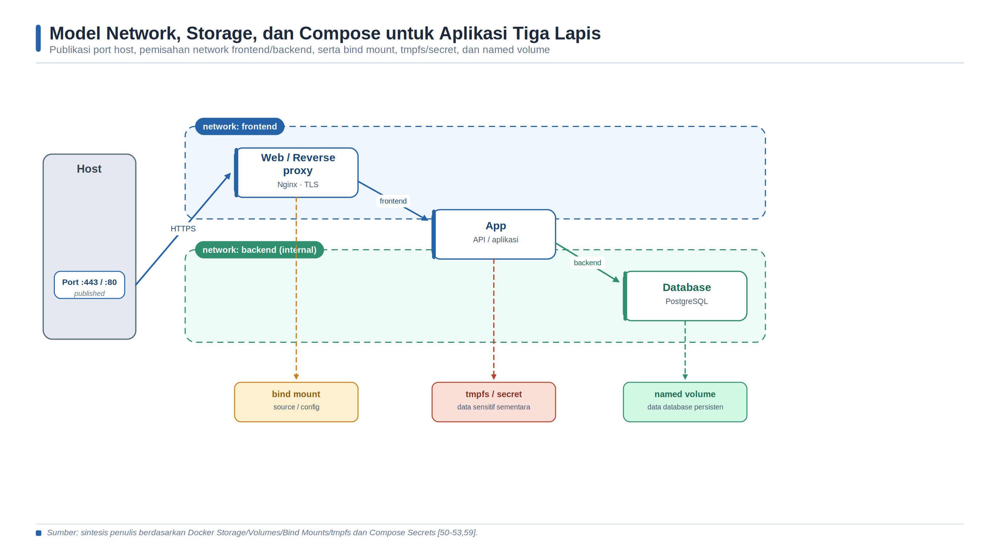

<a id="bab-03"></a>

# Bab 3 — Docker Network, Volume, Bind Mount, tmpfs, dan Compose

Topik utama: bridge network, volume, bind mount, tmpfs, Compose.

## Tujuan Pembelajaran dan Kompetensi Utama

**Setelah menyelesaikan bab ini, pembaca diharapkan mampu:**

1. Membuat user-defined bridge network dan membuktikan name resolution antar container.

2. Membedakan volume, bind mount, dan tmpfs dari sisi persistensi, portabilitas, dan keamanan.

3. Menulis file Compose untuk aplikasi multi-container yang memiliki service, network, volume, dan healthcheck.

4. Mengelola lifecycle aplikasi dengan docker compose up, ps, logs, stop, start, down, dan down -v.

## Konsep Inti dan Landasan Teori

### Network sebagai Graf Keterjangkauan

Jaringan container tidak hanya menyediakan alamat IP, tetapi membentuk graf keterjangkauan antarkomponen. Sebuah service dapat berkomunikasi dengan service lain apabila keduanya berbagi network dan kebijakan host mengizinkannya. Docker network karena itu harus dipandang sebagai boundary arsitektur: network frontend menghubungkan reverse proxy dengan aplikasi, sedangkan network backend menghubungkan aplikasi dengan database. Database tidak perlu bergabung ke frontend dan umumnya tidak perlu memublikasikan port ke host. Model ini mengurangi jalur serangan sekaligus memperjelas dependensi komunikasi.

Pada Linux, setiap container biasanya memiliki network namespace yang memuat interface, alamat, routing table, port, dan konfigurasi DNS. Driver bridge membuat jaringan virtual pada satu host dan menghubungkan container melalui pasangan interface virtual. Dari perspektif container, antarmuka tersebut menyerupai NIC biasa; implementasi bridge, NAT, dan firewall berada pada host. Dokumentasi Docker menegaskan bahwa container hanya melihat detail jaringan lokalnya dan tidak perlu mengetahui apakah peer merupakan container lain atau layanan eksternal [47]. Abstraksi ini meningkatkan portabilitas, tetapi troubleshooting tetap memerlukan pemeriksaan dari sisi container dan host.

### User-Defined Bridge, DNS, dan Identitas Service

Default bridge cocok untuk eksperimen sederhana, tetapi user-defined bridge menyediakan isolasi yang lebih baik dan resolusi DNS otomatis berdasarkan nama atau alias container [48]. Pada Compose, setiap service secara default terdaftar pada DNS internal dan dapat diakses melalui nama service. Identitas logis ini lebih stabil daripada alamat IP. Ketika container dibuat ulang, alamat IP dapat berubah, sedangkan nama service tetap sama. Aplikasi karena itu seharusnya menggunakan db:5432 atau app:5000, bukan alamat IP yang dicatat manual [56].

Nama service bukan mekanisme autentikasi. DNS internal membantu discovery, tetapi tidak membuktikan identitas cryptographic peer dan tidak mengenkripsi lalu lintas. Workload yang memproses data sensitif tetap memerlukan autentikasi aplikasi, credential yang dikelola, dan TLS apabila model ancaman membutuhkannya. Network segmentation juga tidak menggantikan authorization. Service aplikasi yang terhubung ke frontend dan backend berfungsi sebagai jalur yang sah di antara dua zona; apabila aplikasi dikompromikan, penyerang dapat menggunakan jalur backend yang memang dimiliki service tersebut.

### Port Publishing, NAT, dan Firewall Host

Port container hanya memiliki arti di dalam network namespace. Opsi -p HOST_PORT:CONTAINER_PORT membuat aturan pada host agar traffic ke host diteruskan menuju port container. Pada bridge network, Docker menggunakan firewall rules, NAT/PAT, dan masquerading untuk mendukung akses masuk serta koneksi keluar [49]. Pemetaan 8080:80 berarti klien mengakses port 8080 host, sementara proses di container tetap mendengarkan port 80. Komunikasi service-to-service menggunakan port container, bukan host port.

Publikasi port tanpa alamat host secara default dapat mengikat semua interface host. Karena itu, -p 8080:80 berpotensi membuka layanan ke jaringan eksternal, sedangkan -p 127.0.0.1:8080:80 membatasinya ke loopback pada konfigurasi modern [49]. Prinsip least exposure menyarankan hanya reverse proxy atau API publik yang dipublikasikan. Database, message broker, dan dashboard administratif sebaiknya tetap internal atau dibatasi pada alamat manajemen. EXPOSE pada image hanyalah metadata dan tidak membuat aturan publikasi.

Docker membuat aturan firewall untuk bridge network. Perubahan manual pada iptables atau nftables tanpa memahami chain Docker dapat menghasilkan policy yang tampak benar tetapi tidak berlaku pada traffic container. Validasi harus dilakukan dari sumber jaringan yang relevan, bukan hanya melalui curl dari host. Operator perlu memeriksa binding port, docker network inspect, routing, firewall, dan listening socket di dalam container. Diagnosis berlapis ini membedakan kegagalan aplikasi, DNS, port mapping, dan policy host.

### Pemilihan Driver Network

Driver bridge sesuai untuk komunikasi beberapa container pada satu Docker host. Driver host membagikan network stack host dan menghilangkan isolasi port; opsi publish tidak berlaku pada mode ini. Driver none menonaktifkan networking. Overlay menghubungkan service lintas node pada Swarm, sedangkan macvlan atau ipvlan mengintegrasikan container lebih langsung dengan jaringan fisik [47]. Pemilihan driver ditentukan oleh scope, kebutuhan performa, integrasi underlay, dan model keamanan. Driver yang lebih dekat ke jaringan fisik membawa konsekuensi IPAM, VLAN, observability, serta policy eksternal yang lebih besar.

### Lifecycle Data dan Pemilihan Mount

Container idealnya bersifat replaceable: instance dapat dihentikan dan dibuat ulang tanpa kehilangan state bisnis. Prinsip tersebut menuntut pemisahan antara image, writable layer, konfigurasi, dan data persisten. Writable layer mengikuti umur container dan sesuai untuk file sementara yang dapat dibuat kembali. Docker menyediakan volume, bind mount, dan tmpfs untuk data di luar writable layer [50]. Ketiganya terlihat sebagai path biasa dari dalam container, tetapi memiliki kepemilikan, lifecycle, performa, portabilitas, serta risiko yang berbeda.

Named volume dikelola oleh container engine dan merupakan mekanisme yang direkomendasikan untuk data persisten yang dihasilkan container [51]. Volume tetap ada ketika container dihapus, dapat digunakan beberapa container, dan dapat diberi driver untuk backend lain. Namun, persistent tidak sama dengan protected. Volume dapat terhapus melalui down -v atau prune, mengalami korupsi, dan tidak otomatis memiliki backup. Rencana data harus mencakup konsistensi aplikasi, snapshot atau dump, retensi, enkripsi, monitoring kapasitas, dan uji restore.

Bind mount memetakan file atau direktori host secara langsung ke container. Mekanisme ini efisien untuk source code, konfigurasi, dan artefak development, tetapi membuat deployment bergantung pada struktur serta permission host [52]. Mount memiliki akses tulis secara default; proses container dapat mengubah atau menghapus file host. Opsi read_only atau :ro harus digunakan bila write tidak diperlukan. Mount ke direktori container yang telah berisi file akan menutupi isi tersebut selama mount aktif, sehingga salah target sering tampak sebagai file image yang hilang.

tmpfs menyimpan data di memori host dan menghapusnya ketika container berhenti [53]. Mekanisme ini sesuai untuk cache atau data temporer sensitif yang tidak boleh masuk writable layer. tmpfs bukan penyimpanan rahasia sempurna: data tetap dapat dibaca proses yang berwenang di container, menggunakan RAM, dan dalam kondisi tertentu dapat berinteraksi dengan swap host. Ukuran serta permission perlu dibatasi. Data yang diperlukan setelah restart tidak boleh ditempatkan pada tmpfs.

| Mekanisme | Persistensi | Ketergantungan Host | Kasus Penggunaan | Risiko Utama |
| --- | --- | --- | --- | --- |
| Writable layer | Hilang saat container dihapus | Rendah | Data sementara kecil | Sulit di-backup; CoW overhead |
| Named volume | Melampaui lifecycle container | Rendah-sedang | Database dan data aplikasi | Salah hapus; backup/restore belum otomatis |
| Bind mount | Mengikuti file host | Tinggi | Source, konfigurasi, artefak dev | Container dapat mengubah host; path tidak portabel |
| tmpfs | Hilang saat stop/restart | Linux dan memori host | Cache atau data temporer sensitif | Konsumsi RAM; bukan penyimpanan tahan lama |
| Compose secret | Selama deployment; sumber eksternal tetap ada | Bergantung sumber file/env | Password, token, certificate | Proteksi sumber dan permission tetap wajib |

> Sumber: sintesis penulis berdasarkan Docker Storage, Volumes, Bind Mounts, tmpfs, dan Compose Secrets [50-53,59].

### Compose sebagai Model Aplikasi Deklaratif

Docker Compose menyatakan model aplikasi multi-container dalam YAML. Elemen services mendefinisikan resource komputasi beserta image, build, command, environment, mount, network, healthcheck, dan runtime constraints. Elemen top-level networks, volumes, configs, dan secrets mendefinisikan resource yang kemudian diberikan secara eksplisit kepada service. Compose Specification adalah format yang direkomendasikan; deklarasi version 2.x dan 3.x lama telah disatukan sehingga field version pada file modern tidak lagi menjadi pilihan kemampuan utama [55].

Compose meningkatkan reproducibility konfigurasi, tetapi bukan jaminan bahwa hasil runtime identik. Image tag dapat berubah, file bind mount dapat berbeda, variable environment dapat memiliki precedence berbeda, dan resource external dapat berada pada keadaan yang tidak sama. Perintah docker compose config harus digunakan untuk melihat model akhir setelah interpolation dan merge. File Compose, .env.example, lockfile dependency, image digest, serta petunjuk pembuatan secret perlu dikelola sebagai satu unit versi.

Compose membuat nama resource berdasarkan project. Project name memisahkan stack dari direktori atau pipeline berbeda dan biasanya menjadi prefix network, volume, serta container. docker compose up merekonsiliasi keadaan aktual dengan model; service yang konfigurasinya berubah dapat dibuat ulang. docker compose stop menghentikan container tanpa menghapusnya, sedangkan down menghapus container dan network proyek. Named volume tidak dihapus oleh down biasa, tetapi down -v menghapus volume yang terkait dan karena itu bersifat destruktif terhadap data lab maupun data produksi.



*Gambar 5. Model network, storage, dan Compose untuk aplikasi tiga lapis.*

> Sumber: digambar ulang oleh penulis berdasarkan Docker Networking, Storage, dan Compose Specification [47-56].

### Dependency, Healthcheck, dan Readiness

depends_on mengatur urutan pembuatan dan penghentian service, tetapi service yang telah dimulai belum tentu siap menerima request. Database dapat memiliki proses hidup sambil masih melakukan recovery atau migration. Compose dapat menunggu healthcheck dependency apabila condition: service_healthy digunakan [57]. Healthcheck harus menguji fungsi yang bermakna, memiliki timeout serta retries yang wajar, dan tidak terlalu berat. Ia tetap bukan pengganti retry dengan backoff pada aplikasi karena dependency dapat gagal kembali setelah startup.

Liveness dan readiness memiliki tujuan berbeda. Liveness menjawab apakah proses perlu dimulai ulang; readiness menjawab apakah instance saat ini layak menerima traffic. Compose healthcheck menyediakan satu status kesehatan container, sehingga desain check perlu dipilih sesuai kebutuhan lokal. Pemeriksaan yang hanya memastikan proses ada dapat melewatkan kegagalan dependency, sedangkan pemeriksaan end-to-end yang terlalu luas dapat membuat semua service dianggap gagal ketika satu dependency mengalami gangguan sementara.

### Konfigurasi, Environment, dan Secret

Environment variable membantu memisahkan konfigurasi dari image, tetapi memiliki aturan precedence dan berpotensi terlihat melalui inspect, process environment, log, atau crash report. File .env terutama merupakan sumber interpolation bagi Compose dan tidak otomatis aman untuk menyimpan credential. Dokumentasi Docker menyarankan penggunaan secrets untuk data sensitif [58-59]. Secret Compose diberikan hanya kepada service yang memerlukannya dan tersedia sebagai file di /run/secrets. Perlindungan sumber file, permission host, backup, dan rotasi tetap menjadi tanggung jawab operator.

Contoh POSTGRES_PASSWORD dalam praktikum adalah nilai sintetis untuk lingkungan disposable. Pada lingkungan production-like, password tidak boleh dikomit ke repository. Gunakan secret manager atau minimal file secret yang dikeluarkan dari version control, batasi permission, dan rotasi setelah penggunaan. Konfigurasi nonrahasia seperti hostname, feature flag, atau log level dapat ditempatkan pada environment atau config, tetapi nilai akhir tetap perlu divalidasi dengan docker compose config tanpa membocorkan secret ke laporan.

### Keamanan dan Operasional Stack Compose

Compose memudahkan pembuatan stack, tetapi kemudahan tersebut dapat memperluas attack surface apabila semua service dipublikasikan, mount diberi write access, atau container dijalankan privileged. Baseline yang sehat adalah satu ingress yang diperlukan, network terpisah, mount read-only, filesystem read-only bila memungkinkan, user non-root, capability minimum, healthcheck, resource limit, logging, dan secret per service. Security control harus diuji pada model yang telah di-resolve, bukan hanya pada fragmen YAML.

Compose cocok untuk pengembangan, pengujian, laboratorium, dan deployment satu host yang kebutuhannya sesuai. Compose bukan otomatis pengganti orchestrator multi-node: scheduling, failover lintas host, rolling update terdistribusi, dan control plane cluster memerlukan platform lain. Keputusan menggunakan Compose pada produksi harus mempertimbangkan availability target, recovery host, backup, monitoring, patching image, serta prosedur rollback. Sederhana dapat menjadi pilihan yang kuat apabila risikonya dipahami dan operasi didesain secara eksplisit.

ByteByteGo merangkum network, volume, dan Compose sebagai konsep inti Docker [54]. Sintesis teknisnya adalah bahwa ketiganya menyelesaikan dimensi berbeda: network mengatur siapa dapat berbicara dengan siapa, mount mengatur di mana state hidup dan berapa lama bertahan, sedangkan Compose menyatakan bagaimana komponen serta resource tersebut dibentuk sebagai aplikasi. Kegagalan desain terjadi ketika ketiga dimensi dicampur, misalnya memublikasikan database untuk memecahkan masalah DNS internal atau menyimpan data pada bind mount yang tidak tersedia di host deployment.

### Sintesis Konsep Inti

Network Docker menyediakan isolasi komunikasi antar container. Default bridge mudah digunakan, tetapi user-defined bridge lebih sesuai untuk aplikasi multi-container karena mendukung DNS berbasis nama container atau nama service dan isolasi yang lebih jelas.

Volume dikelola oleh Docker dan cocok untuk data persisten seperti database. Bind mount memetakan path host secara langsung dan cocok untuk source code development. tmpfs menyimpan data di memori sehingga cocok untuk data sementara, cache, atau secret lab yang tidak perlu persist.

Docker Compose menyatukan konfigurasi banyak container dalam satu file YAML. Dengan Compose, service, network, volume, port, environment, dan dependency dapat didefinisikan secara version-controlled.

| Tipe mount | Lokasi | Persisten | Kapan digunakan |
| --- | --- | --- | --- |
| Volume | Dikelola Docker di /var/lib/docker/volumes | Ya | Database, data aplikasi, artifact jangka panjang |
| Bind mount | Path host yang ditentukan user | Ya | Live development, file konfigurasi host |
| tmpfs | RAM host | Tidak | Cache sementara, secret lab, file sensitif sementara |

| Perintah Compose | Kegunaan |
| --- | --- |
| docker compose up -d | Membuat dan menjalankan semua service di background |
| docker compose logs -f | Melihat log gabungan secara real-time |
| docker compose ps | Melihat status service |
| docker compose down | Menghapus container dan network dari project |
| docker compose down -v | Menghapus container, network, dan volume project |

## Arsitektur Laboratorium dan Prasyarat Lingkungan

Gunakan satu direktori kerja per bab agar file konfigurasi, volume bind mount, dan laporan mudah dipisahkan. Jalankan perintah cleanup setelah praktikum selesai, terutama jika port yang sama digunakan pada bab berikutnya.

```bash
# Struktur direktori umum Bab 3
mkdir -p ~/docker-lab/bab-3
cd ~/docker-lab/bab-3
# Simpan file compose, Dockerfile, konfigurasi, dan log di direktori ini.
```

## Langkah Praktikum Eksploratif

### User-defined bridge network

Jalankan langkah berikut secara berurutan, lalu verifikasi hasil sebelum melanjutkan ke sub-langkah berikutnya.

```bash
docker network create --driver bridge --subnet 172.20.0.0/16 lab-net
docker run -d --name server-a --network lab-net nginx:alpine
docker run -d --name server-b --network lab-net nginx:alpine
docker exec server-a ping -c 3 server-b
docker rm -f server-a server-b
```

### Volume backup dan restore

Jalankan langkah berikut secara berurutan, lalu verifikasi hasil sebelum melanjutkan ke sub-langkah berikutnya.

```bash
docker volume create data-vol
docker run -d --name writer -v data-vol:/app/data alpine:3.20   sh -c "while true; do date >> /app/data/log.txt; sleep 5; done"
sleep 15
docker rm -f writer
docker run --rm -v data-vol:/data alpine:3.20 cat /data/log.txt
docker run --rm -v data-vol:/source:ro -v $(pwd):/backup alpine:3.20   tar czf /backup/data-vol-backup.tar.gz -C /source .
```

### Compose multi-container Nginx-Flask-PostgreSQL

Jalankan langkah berikut secara berurutan, lalu verifikasi hasil sebelum melanjutkan ke sub-langkah berikutnya.

```yaml
services:
  web:
    image: nginx:alpine
    ports:
      - "8080:80"
    volumes:
      - ./html:/usr/share/nginx/html:ro
      - ./nginx.conf:/etc/nginx/conf.d/default.conf:ro
    networks: [frontend]
    depends_on: [app]
  app:
    build: ./app
    environment:
      DB_HOST: db
      DB_NAME: labdb
      DB_USER: labuser
      DB_PASS: labpass123
    networks: [frontend, backend]
    depends_on:
      db:
        condition: service_healthy
  db:
    image: postgres:16-alpine
    environment:
      POSTGRES_DB: labdb
      POSTGRES_USER: labuser
      POSTGRES_PASSWORD: labpass123
    volumes:
      - pg-data:/var/lib/postgresql/data
    networks: [backend]
    healthcheck:
      test: ["CMD-SHELL", "pg_isready -U labuser -d labdb"]
      interval: 5s
      timeout: 5s
      retries: 5
volumes:
  pg-data:
networks:
  frontend:
  backend:
```

## Verifikasi dan Skenario Pengujian

[ ] Container di user-defined bridge dapat saling resolve menggunakan nama.

[ ] Data di named volume tetap ada setelah container dihapus.

[ ] Bind mount menunjukkan perubahan file host tanpa rebuild image.

[ ] tmpfs kehilangan data setelah container restart.

[ ] Compose stack web-app-db berjalan dan API health menampilkan koneksi database.

| Prinsip troubleshooting: Mulai dari status container, baca logs, cek network, cek volume, lalu validasi konfigurasi. Jangan langsung menghapus volume sebelum memahami apakah data masih dibutuhkan. |
| --- |

```bash
docker compose ps
docker compose logs --tail 100
curl -v http://localhost:8080
docker network ls
docker volume ls
docker inspect <container-name>
```

## Troubleshooting dan Analisis Hasil

| Gejala | Penyebab yang mungkin | Tindakan korektif |
| --- | --- | --- |
| Gate berbeda antara lokal dan pipeline | Versi tool, input efektif, atau konfigurasi tidak sama | Pin versi; simpan konfigurasi efektif dan identitas artefak. |
| Service sehat tetapi security gate gagal | Healthcheck hanya memeriksa availability | Tinjau policy, scan, identity, signature, dan evidence secara terpisah. |
| Evidence tidak dapat ditelusuri | Commit, digest, waktu, atau owner tidak dicatat | Gunakan manifest evidence dan metadata yang konsisten. |
| Deployment gagal dipulihkan | Rollback, backup, atau credential rotation belum diuji | Lakukan recovery exercise dan dokumentasikan hasilnya. |

## Evaluasi dan Latihan Mandiri

1. Mengapa user-defined bridge lebih baik daripada default bridge untuk multi-container app?

2. Apa risiko bind mount terhadap keamanan host?

3. Apa perbedaan docker compose down dan docker compose down -v?

4. Kapan depends_on dengan healthcheck lebih tepat daripada depends_on biasa?

5. Bagaimana strategi backup volume untuk database produksi?

## Format Laporan Praktikum

Laporan Bab 3 dikumpulkan dalam PDF maksimum 5 halaman. Isi laporan harus menunjukkan bukti eksekusi, analisis, dan refleksi keamanan/operasional.

Bukti minimum:

- Screenshot docker compose ps atau docker ps yang menunjukkan service berjalan.

- Screenshot hasil curl/browser/API/dashboard sesuai target bab.

- Cuplikan log atau query yang membuktikan sistem bekerja.

Analisis wajib:

- Jelaskan satu masalah yang muncul dan cara Anda mendiagnosisnya.

- Jelaskan risiko keamanan atau operasional yang relevan pada bab ini.

- Berikan rekomendasi perbaikan bila lab ini akan dibawa ke production-like environment.
