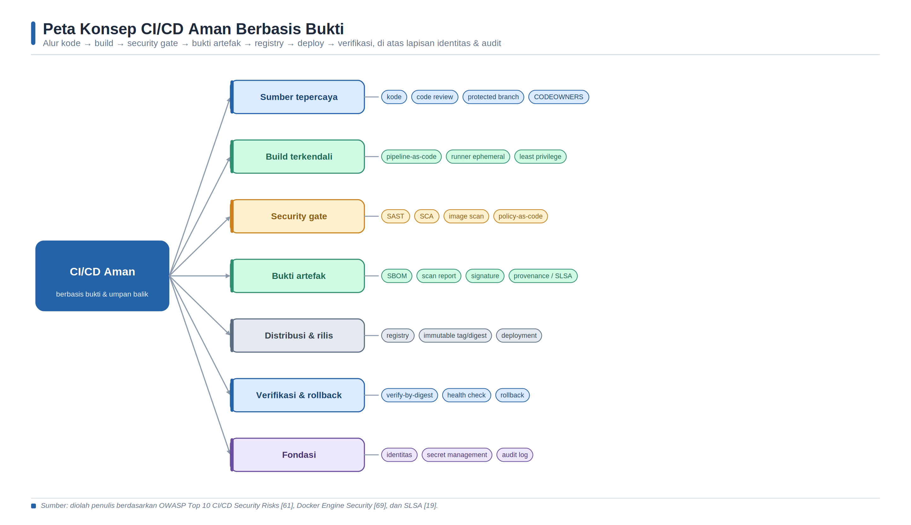
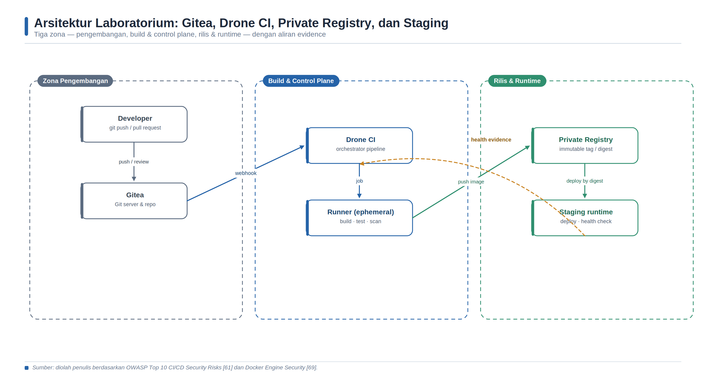

<a id="bab-10"></a>

# Bab 10 — CI/CD Pipeline dengan Docker: Gitea, Drone CI, Registry, dan Deploy

Topik utama: continuous integration, continuous delivery/deployment, pipeline-as-code, security gates, keamanan runner, manajemen rahasia, registry, SBOM, provenance, penandatanganan citra, deployment, dan rollback.

## Tujuan Pembelajaran dan Kompetensi Utama

Setelah menyelesaikan bab ini, pembaca diharapkan mampu:

1. Menjelaskan perbedaan continuous integration, continuous delivery, dan continuous deployment beserta implikasi pengendaliannya.

2. Memodelkan aset, aliran data, batas kepercayaan, dan risiko pada ekosistem Gitea–Drone–registry–runtime.

3. Menjalankan laboratorium CI/CD berbasis Docker secara terukur dan mendokumentasikan bukti setiap gerbang keamanan.

4. Menulis pipeline-as-code yang menjalankan pengujian, pemeriksaan kebijakan, build, pemindaian citra, promosi, deployment, dan verifikasi.

5. Menerapkan prinsip least privilege, pemisahan artefak kandidat dan rilis, tag immutable, serta secret management.

6. Menganalisis kegagalan pipeline, risiko residual, dan trade-off antara kecepatan delivery dengan tingkat assurance.

## Peta Konsep Bab



*Gambar 6. Peta konsep CI/CD aman berbasis bukti dan umpan balik.*

> Sumber: sintesis penulis berdasarkan NIST SSDF [14], OWASP DevSecOps Guideline [16], OWASP CI/CD Security Cheat Sheet [60], dan SLSA v1.2 [19].

## Konsep Inti dan Landasan Teori

### CI/CD sebagai sistem kendali sosio-teknis

Continuous integration (CI) adalah praktik mengintegrasikan perubahan kode secara sering ke repositori bersama dan memverifikasi perubahan tersebut melalui proses otomatis. Tujuan utamanya bukan sekadar mempercepat kompilasi, melainkan memperpendek jarak waktu antara munculnya cacat dan diterimanya umpan balik. Continuous delivery memperluas CI dengan memastikan bahwa artefak yang telah lulus verifikasi selalu berada dalam keadaan siap dirilis, sedangkan keputusan memindahkannya ke lingkungan produksi masih dapat memerlukan persetujuan manusia. Continuous deployment mengotomatisasi keputusan tersebut: setiap perubahan yang memenuhi kebijakan dipromosikan ke produksi tanpa langkah persetujuan manual. Perbedaan ini penting karena tingkat otomatisasi menentukan letak kontrol, pemilik risiko, dan bukti audit yang harus tersedia.

Pipeline CI/CD sebaiknya dipahami sebagai sistem kendali sosio-teknis. Komponen teknisnya mencakup repositori, webhook, orchestrator, runner, registry, secret store, dan lingkungan deployment. Komponen manusianya mencakup pengembang, reviewer, administrator platform, pemilik layanan, serta petugas keamanan. Kegagalan dapat berasal dari kode, dependensi, konfigurasi pipeline, kredensial, hak akses, atau keputusan manusia. Karena itu, keberhasilan satu job tidak identik dengan keamanan sistem. Pipeline yang matang menghubungkan setiap keputusan rilis dengan identitas pelaksana, commit, hasil pengujian, digest artefak, kebijakan yang berlaku, dan status deployment.

### Integrasi keamanan menurut SSDF dan DevSecOps

NIST Secure Software Development Framework (SSDF) menempatkan praktik pengembangan aman ke dalam empat kelompok: mempersiapkan organisasi, melindungi perangkat lunak, menghasilkan perangkat lunak yang terlindungi, dan merespons kerentanan [14]. Dalam CI/CD, kerangka tersebut diterjemahkan menjadi kontrol yang dapat dieksekusi dan diverifikasi. Persyaratan keamanan diwujudkan sebagai aturan branch, pemeriksaan kode, kriteria kelulusan uji, pembatasan kredensial, dan kebijakan promosi. Perlindungan perangkat lunak diwujudkan melalui kontrol integritas repositori, pemisahan tugas, penyimpanan artefak, dan bukti build. Respons kerentanan diwujudkan melalui pencatatan temuan, penetapan pemilik, batas waktu remediasi, pengecualian yang memiliki masa berlaku, dan kemampuan membangun ulang citra secara cepat.

Prinsip shift-left bermanfaat ketika pemeriksaan murah dan deterministik dijalankan sedini mungkin, misalnya linting, unit test, secret scanning, dan pemeriksaan Dockerfile. Akan tetapi, shift-left bukan alasan memindahkan seluruh tanggung jawab keamanan kepada pengembang. Sebagian risiko baru terlihat setelah aplikasi berjalan, sehingga pengujian integrasi, DAST, observability, dan verifikasi pascadeploy tetap diperlukan. OWASP DevSecOps Guideline menempatkan keamanan sebagai kegiatan yang terintegrasi dengan proses delivery, sedangkan OWASP CI/CD Security Cheat Sheet menekankan perlindungan pipeline itu sendiri [16,60]. Dengan demikian, model yang lebih tepat adalah shift-everywhere: kontrol dipilih berdasarkan visibilitas dan biaya deteksi pada setiap tahap.

### Aset, batas kepercayaan, dan ancaman pipeline

Pipeline memiliki konsentrasi hak istimewa yang tinggi. Runner dapat membaca source code, mengambil secret, mengunduh dependensi, membangun citra, menulis ke registry, dan kadang mengakses host atau cluster deployment. Kompromi pada runner dapat mengubah artefak tanpa mengubah source code. Kompromi pada token repositori dapat memasukkan perubahan berbahaya. Kompromi pada registry dapat mengganti tag yang dapat berubah. Kebocoran secret melalui log dapat memberikan akses persisten kepada pihak yang tidak berwenang. OWASP Top 10 CI/CD Security Risks mengelompokkan risiko seperti mekanisme alur yang tidak memadai, manajemen identitas dan akses yang lemah, serangan pada dependensi, eksekusi pipeline yang tidak terkendali, serta logging yang tidak memadai [61].

Batas kepercayaan muncul ketika data atau kontrol berpindah di antara aktor dan komponen dengan tingkat kepercayaan berbeda. Push dari workstation ke Gitea, webhook dari Gitea ke Drone, pengiriman job dari server ke runner, akses runner ke registry, serta deployment dari runner ke runtime merupakan batas yang harus dilindungi. Setiap lintasan idealnya memiliki autentikasi, otorisasi minimum, enkripsi transport, validasi integritas, pembatasan jaringan, dan audit trail. Diagram arsitektur tidak hanya menunjukkan konektivitas; diagram harus membantu menentukan siapa dapat melakukan apa, terhadap artefak mana, dari lingkungan mana, dan dengan bukti apa.

### Pipeline-as-code, review, dan protected branch

Pipeline-as-code menyimpan definisi proses build dan deployment dalam repositori sehingga perubahan dapat direview, diberi versi, dan diaudit. Keuntungan ini sekaligus menciptakan risiko: pelaku yang dapat mengubah file pipeline dapat mencoba mengekstraksi secret, memasang volume host, meminta mode privileged, atau mengganti tujuan deployment. Oleh sebab itu, file pipeline, Dockerfile, manifest deployment, dan kebijakan harus diperlakukan sebagai kode kritis. Protected branch pada Gitea dapat membatasi push dan merge serta mewajibkan alur review pada branch tertentu [62]. Kontrol yang disarankan meliputi pull request, minimal satu reviewer independen, status check wajib, larangan force-push, dan pembatasan administrator yang boleh mengubah aturan.

Drone mendefinisikan pipeline di berkas .drone.yml; setiap langkah Docker pipeline dieksekusi dalam container, dan kode keluar nonnol menghentikan langkah serta pipeline [12,64]. Isolasi container membantu konsistensi, tetapi tidak otomatis menjadikan runner aman. Host volume, mode privileged, atau akses ke Docker socket dapat mengubah container build menjadi jalur eskalasi ke host. Drone menyediakan signature konfigurasi YAML untuk membantu memverifikasi autentisitas konfigurasi pada repositori yang dilindungi [66]. Signature pipeline tidak menggantikan review dan branch protection, tetapi menambah kontrol integritas terhadap perubahan tidak sah.

### Security gate berbasis risiko

Security gate adalah keputusan kebijakan yang mengubah hasil pengujian menjadi tindakan: lulus, gagal, memerlukan persetujuan, atau diterima sementara melalui pengecualian. Gate yang hanya berbunyi “tidak boleh ada kerentanan” biasanya tidak operasional karena basis data kerentanan berubah, tingkat keparahan tidak selalu mencerminkan eksposur, dan tidak semua temuan memiliki perbaikan. Sebaliknya, gate yang selalu mencatat temuan tetapi tidak pernah menghentikan promosi tidak memberikan assurance. Kebijakan yang sehat menjelaskan scope, severity, exploitability, status perbaikan, pemilik, bukti, serta masa berlaku pengecualian.

Kode keluar merupakan mekanisme sederhana tetapi penting. Dokumentasi Trivy menjelaskan bahwa pemindai secara default dapat keluar dengan kode 0 walaupun menemukan isu; opsi --exit-code diperlukan bila temuan harus menggagalkan pipeline [71]. Implikasinya, menambahkan scanner tanpa konfigurasi gate dapat menghasilkan security theater. Gate juga harus ditempatkan pada artefak yang tepat. Pemeriksaan source dan konfigurasi dilakukan sebelum build; pemindaian citra dilakukan pada citra kandidat; verifikasi signature dan provenance dilakukan sebelum promosi atau deployment; healthcheck dan security regression dilakukan setelah deployment.

### Least privilege, secret, dan keamanan runner

Least privilege mengharuskan setiap identitas memperoleh hak minimum untuk tugas dan durasi minimum yang dibutuhkan. Token Gitea untuk membaca repositori tidak perlu memiliki hak administrasi organisasi. Kredensial registry untuk pipeline kandidat sebaiknya hanya dapat menulis namespace kandidat, sedangkan identitas promosi memiliki hak terpisah untuk namespace rilis. Kredensial deployment sebaiknya dibatasi pada satu lingkungan. Pemisahan ini mengurangi blast radius dan mendukung pemisahan tugas. Token berumur pendek lebih baik daripada secret statis ketika platform mendukung federasi identitas.

Secret tidak boleh ditulis pada source code, .drone.yml, Dockerfile, argumen build, atau log. Docker menjelaskan bahwa ARG dan ENV tidak sesuai untuk membawa secret build karena dapat terekspos pada citra atau metadata; BuildKit secret mount memberikan mekanisme yang tidak mempersistenkan secret ke hasil build [30]. Drone dapat mengambil secret dari penyimpanan eksternal melalui secret extension, termasuk pola integrasi dengan Vault [65]. Untuk laboratorium, secret repositori dapat digunakan, tetapi peserta wajib menguji bahwa nilai tidak muncul dalam log. Masking log bukan pengganti kontrol akses karena transformasi atau encoding dapat melewati masking.

Akses ke /var/run/docker.sock setara dengan kemampuan mengendalikan Docker daemon dan secara praktis dapat memberikan hak tingkat root pada host. Dokumentasi Docker juga memperingatkan bahwa keanggotaan grup docker memberikan hak tingkat root [69]. Rootless mode mengurangi risiko daemon dan container dengan menjalankannya di dalam user namespace tanpa hak root host [31], meskipun kompatibilitas dan performanya perlu diuji. Dalam produksi, runner sebaiknya ephemeral, dipisahkan menurut tingkat kepercayaan repositori, tidak menerima job dari fork tidak tepercaya dengan secret, dan tidak berbagi cache tanpa kontrol integritas.

### Artefak immutable, SBOM, provenance, dan signature

Tag seperti latest adalah pointer yang dapat berubah, sehingga tidak cukup untuk audit dan rollback. Identitas artefak yang kuat menggunakan digest kriptografis. Pipeline sebaiknya membangun satu citra kandidat, mencatat digest, memindainya, lalu mempromosikan digest yang sama tanpa rebuild. Rebuild pada tahap promosi berisiko menghasilkan bit yang berbeda karena dependensi atau base image berubah. Namespace kandidat dan rilis membantu membedakan artefak yang belum dan sudah memenuhi kebijakan.

Software Bill of Materials (SBOM) adalah inventaris komponen yang membentuk artefak. SBOM meningkatkan transparansi dan mendukung pencarian dampak ketika kerentanan baru diumumkan, tetapi SBOM tidak membuktikan bahwa artefak dibangun oleh pipeline tepercaya atau bebas kerentanan. Provenance menjelaskan di mana, kapan, bagaimana, dan dari material apa artefak diproduksi. SLSA v1.2 menggunakan tingkat Build L0 sampai L3, dari tanpa jaminan menuju provenance, hosted build platform, dan hardened build platform [19]. Docker Build mendukung attestation untuk SBOM dan provenance melalui BuildKit/Buildx [67,68].

Signature mengikat identitas penandatangan dengan digest artefak. Cosign dapat menandatangani dan memverifikasi citra, dan verifikasi secara default memeriksa kecocokan digest yang terkandung pada payload signature [20,70]. Signature tidak membuktikan bahwa citra aman; signature membuktikan bahwa identitas tertentu menyatakan sesuatu tentang artefak tertentu. Keputusan deployment harus menggabungkan signature, provenance, hasil scan, dan kebijakan. Kunci privat harus disimpan dalam KMS/HSM atau secret store yang sesuai; keyless signing dengan identitas OIDC dapat mengurangi pengelolaan kunci statis apabila ekosistem mendukungnya.

### Promosi, deployment, verifikasi, dan rollback

Promosi adalah perubahan status kepercayaan, bukan pembangunan ulang. Artefak kandidat yang lulus gate dipindahkan atau diberi referensi rilis berdasarkan digest. Deployment kemudian menggunakan digest tersebut dan mencatat lingkungan, waktu, identitas, serta konfigurasi. Strategi rolling, blue-green, atau canary dapat dipilih menurut toleransi risiko. Akan tetapi, strategi apa pun harus mempunyai definisi keberhasilan yang terukur: readiness, error rate, latency, security regression, dan stabilitas log.

Rollback harus diuji sebelum dibutuhkan. Rollback yang hanya mengembalikan citra tetapi tidak mempertimbangkan migrasi basis data, konfigurasi, dan secret dapat memperburuk insiden. Oleh karena itu, pipeline perlu memisahkan perubahan backward-compatible dan perubahan yang membutuhkan prosedur restore. Evidence bundle untuk satu rilis minimal berisi commit, image digest, SBOM, provenance, hasil pengujian, hasil scan, approval, manifest deployment, dan hasil healthcheck. Kumpulan bukti ini mengubah pipeline dari mesin otomasi menjadi mekanisme assurance yang dapat diaudit.

| [High confidence] Prinsip arsitektur dan pengendalian pada bab ini bersumber dari standar serta dokumentasi resmi. [Medium confidence] Tag image, opsi CLI, dan variabel konfigurasi dapat berubah antarversi; verifikasi kembali dokumentasi resmi pada tanggal praktikum sebelum diterapkan di lingkungan produksi. |
| --- |

| Istilah | Tujuan utama | Batas otomatisasi | Bukti minimum |
| --- | --- | --- | --- |
| Continuous Integration | Mengintegrasikan perubahan kecil dan memberi umpan balik cepat. | Berakhir pada build dan verifikasi perubahan. | Commit, log build, hasil test, status check. |
| Continuous Delivery | Menjaga artefak selalu siap dirilis. | Rilis produksi dapat memerlukan approval. | Digest kandidat, gate, approval, release record. |
| Continuous Deployment | Mempromosikan setiap perubahan yang lulus kebijakan. | Tidak ada approval manual rutin. | Policy decision, digest, deployment event, health evidence. |

> Sumber: sintesis penulis berdasarkan NIST SSDF [14], OWASP DevSecOps Guideline [16], dan Drone Pipeline Configuration [64].

| Aset/antarmuka | Ancaman utama | Kontrol prioritas | Bukti audit |
| --- | --- | --- | --- |
| Repositori dan branch utama | Perubahan tanpa review; force-push; token bocor. | Protected branch, MFA, review wajib, token scope minimum. | PR, approval, status check, audit log. |
| Webhook Gitea–Drone | Pemalsuan event atau replay. | Secret/signature webhook, TLS, pembatasan jaringan. | Delivery ID, waktu, signature validation. |
| Konfigurasi pipeline | Eksfiltrasi secret; privileged step; tujuan deploy diganti. | CODEOWNERS/review, protected mode, signature YAML. | Diff, reviewer, signature pipeline. |
| Runner | Escape, persistence, cache poisoning, Docker socket abuse. | Runner ephemeral, segmentasi, least privilege, cache isolation. | Job identity, runner ID, lifecycle log. |
| Registry | Tag overwrite; artefak tidak dipindai; kredensial luas. | Immutable tag/digest, RBAC namespace, TLS, retention. | Digest, push identity, scan report. |
| Runtime | Deploy citra salah; konfigurasi drift; rollback gagal. | Verify-by-digest, policy admission, health/security check. | Deployment record, health result, rollback record. |

> Sumber: diolah penulis berdasarkan OWASP Top 10 CI/CD Security Risks [61], Docker Engine Security [69], dan SLSA [19].

## Arsitektur Laboratorium dan Prasyarat Lingkungan



*Gambar 7. Arsitektur laboratorium Gitea, Drone CI, private registry, dan staging.*

> Sumber: rancangan penulis berdasarkan dokumentasi Gitea [11,62], Drone [12,64–66], dan Docker Registry/Engine [2,69].

Laboratorium menggunakan satu host Linux untuk tujuan pembelajaran. Gitea berfungsi sebagai source control dan penyedia OAuth, Drone Server menerima webhook serta menjadwalkan job, Drone Runner mengeksekusi langkah pipeline, private registry menyimpan citra kandidat, dan container staging menjadi target deployment. Model satu host memudahkan observasi, tetapi tidak boleh dianggap sebagai arsitektur produksi. Pada produksi, komponen control plane, runner, registry, dan runtime idealnya dipisahkan menurut trust zone dan blast radius.

| Komponen | Peran | Data sensitif | Kontrol lab | Peningkatan produksi |
| --- | --- | --- | --- | --- |
| Gitea | Repositori, review, webhook, OAuth. | Source, token, metadata akun. | Volume persisten; akun admin terbatas. | TLS, SSO/MFA, backup, protected branch. |
| Drone Server | Orkestrasi job dan integrasi SCM. | OAuth secret, RPC secret. | Secret di .env yang tidak di-commit. | External secret store, HA, audit terpusat. |
| Drone Runner | Menjalankan step pipeline. | Job token, source, secret terpilih. | Host khusus lab; capacity dibatasi. | Ephemeral runner, tanpa socket host, segmentasi. |
| Registry | Menyimpan candidate dan release. | Image, manifest, signature/attestation. | Bind ke loopback; namespace terpisah. | TLS, RBAC, immutability, retention, replication. |
| Staging | Verifikasi aplikasi pascadeploy. | Konfigurasi dan log aplikasi. | Port lokal; healthcheck. | Network policy, secret runtime, observability, rollback. |

> Sumber: sintesis penulis berdasarkan dokumentasi resmi Gitea, Drone, dan Docker [11,12,31,62–69].

### Prasyarat dan Batasan Eksperimen

Prasyarat: host Linux dengan Docker Engine dan plugin Docker Compose yang berfungsi; minimal 4 vCPU, RAM 8 GB, ruang disk 20 GB, perintah curl, git, openssl, serta browser. Seluruh eksperimen dilakukan pada jaringan laboratorium yang diotorisasi. Jangan mengekspos Gitea, Drone, registry HTTP, atau Docker API ke Internet. Cadangkan pekerjaan lain sebelum mengaktifkan repository trusted karena pipeline contoh memperoleh akses Docker socket untuk kebutuhan deployment lokal.

| Peringatan keamanan laboratorium: mount /var/run/docker.sock membuat job pipeline dapat mengendalikan daemon host. Gunakan hanya pada VM khusus yang dapat dipulihkan. Untuk produksi, gunakan runner terisolasi/ephemeral, rootless build, remote builder dengan mTLS, atau mekanisme build tanpa daemon host. |
| --- |

```bash
mkdir -p ~/devsecops-lab/bab-10/{app,deploy,evidence,scripts}
cd ~/devsecops-lab/bab-10
umask 077
openssl rand -hex 32 > .drone-rpc-secret
printf "127.0.0.1 gitea.lab drone.lab registry.lab app.lab\n" | sudo tee -a /etc/hosts
docker version
docker compose version
```

Catat versi Docker Engine, Docker Compose, sistem operasi, arsitektur CPU, dan waktu eksperimen pada laporan. Informasi versi diperlukan karena sintaks, default keamanan, dan kompatibilitas image dapat berubah.

## Langkah Praktikum Eksploratif

### 1. Membuat aplikasi uji dan kebijakan deterministik

```dockerfile
cat > app/app.py <<'PY'
from flask import Flask, jsonify
app = Flask(__name__)

@app.get("/health")
def health():
    return jsonify(status="ok"), 200

@app.get("/")
def index():
    return jsonify(service="devsecops-lab", version="1.0")

if __name__ == "__main__":
    app.run(host="0.0.0.0", port=8080)
PY

cat > app/requirements.txt <<'EOF'
Flask>=3.0,<4.0
gunicorn>=22,<24
pytest>=8,<9
EOF

cat > app/test_app.py <<'PY'
from app import app
def test_health():
    response = app.test_client().get("/health")
    assert response.status_code == 200
    assert response.json["status"] == "ok"
PY
cat > app/Dockerfile <<'EOF'
# Pin digest base image sebelum produksi; tag digunakan agar lab mudah diikuti.
FROM python:3.12-slim
WORKDIR /app
COPY requirements.txt .
RUN pip install --no-cache-dir -r requirements.txt
COPY app.py .
RUN useradd --system --uid 10001 appuser
USER 10001
EXPOSE 8080
HEALTHCHECK --interval=10s --timeout=3s --retries=3 \
  CMD python -c "import urllib.request; urllib.request.urlopen('http://127.0.0.1:8080/health')"
CMD ["gunicorn", "--bind", "0.0.0.0:8080", "app:app"]
EOF

cat > .dockerignore <<'EOF'
.git
.env
evidence/
__pycache__/
*.pyc
EOF
cat > scripts/policy-check.sh <<'SH'
#!/bin/sh
set -eu
grep -Eq '^USER[[:space:]]+[1-9][0-9]*' app/Dockerfile || {
  echo 'GATE FAIL: Dockerfile wajib memakai USER non-root'; exit 1; }
grep -Eq '^HEALTHCHECK[[:space:]]+' app/Dockerfile || {
  echo 'GATE FAIL: HEALTHCHECK tidak ditemukan'; exit 1; }
if grep -RInE '(password|token|secret)[[:space:]]*=[[:space:]]*[^$<{[:space:]]+' \
  --exclude-dir=.git --exclude='*.md' .; then
  echo 'GATE FAIL: kandidat secret plaintext ditemukan'; exit 1
fi
echo 'GATE PASS: baseline policy terpenuhi'
SH
chmod +x scripts/policy-check.sh
./scripts/policy-check.sh
```

### 2. Menjalankan Gitea, registry, Drone Server, dan Runner

Buat berkas .env dan compose.yaml. Tag mayor pada contoh dipilih untuk keterbacaan laboratorium. Sebelum digunakan kembali, verifikasi rilis yang didukung dan pin image ke versi atau digest yang telah disetujui. Berkas .env tidak boleh dimasukkan ke Git.

```yaml
RPC_SECRET=$(cat .drone-rpc-secret)
cat > .env <<EOF
DRONE_RPC_SECRET=$RPC_SECRET
DRONE_GITEA_CLIENT_ID=ISI_SETELAH_OAUTH_DIBUAT
DRONE_GITEA_CLIENT_SECRET=ISI_SETELAH_OAUTH_DIBUAT
DRONE_ADMIN=adminlab
EOF
chmod 600 .env

cat > compose.yaml <<'YAML'
services:
  gitea:
    image: docker.gitea.com/gitea:1
    restart: unless-stopped
    environment:
      USER_UID: "1000"
      USER_GID: "1000"
      GITEA__server__ROOT_URL: http://gitea.lab:3001/
    ports: ["127.0.0.1:3001:3000", "127.0.0.1:2222:22"]
    volumes: ["gitea-data:/data"]

  registry:
    image: registry:2
    restart: unless-stopped
    ports: ["127.0.0.1:5000:5000"]
    volumes: ["registry-data:/var/lib/registry"]

  drone-server:
    image: drone/drone:2
    restart: unless-stopped
    environment:
      DRONE_GITEA_SERVER: http://gitea.lab:3001
      DRONE_GITEA_CLIENT_ID: ${DRONE_GITEA_CLIENT_ID}
      DRONE_GITEA_CLIENT_SECRET: ${DRONE_GITEA_CLIENT_SECRET}
      DRONE_RPC_SECRET: ${DRONE_RPC_SECRET}
      DRONE_SERVER_HOST: drone.lab:8080
      DRONE_SERVER_PROTO: http
      DRONE_USER_CREATE: username:${DRONE_ADMIN},admin:true
    extra_hosts: ["gitea.lab:host-gateway"]
    ports: ["127.0.0.1:8080:80"]
    volumes: ["drone-data:/data"]
    depends_on: [gitea]

  drone-runner:
    image: drone/drone-runner-docker:1
    restart: unless-stopped
    environment:
      DRONE_RPC_PROTO: http
      DRONE_RPC_HOST: drone-server
      DRONE_RPC_SECRET: ${DRONE_RPC_SECRET}
      DRONE_RUNNER_CAPACITY: "1"
      DRONE_RUNNER_NAME: lab-runner-01
    volumes: ["/var/run/docker.sock:/var/run/docker.sock"]
    depends_on: [drone-server]

volumes:
  gitea-data:
  registry-data:
  drone-data:
YAML
```

Bootstrap dilakukan dua tahap. Pertama, jalankan Gitea dan registry. Buka http://gitea.lab:3001, selesaikan instalasi, buat akun adminlab, kemudian buat OAuth2 application untuk Drone dengan redirect URI http://drone.lab:8080/login. Salin Client ID dan Client Secret ke .env, lalu jalankan seluruh stack.

```bash
docker compose up -d gitea registry
docker compose ps
# Setelah OAuth dibuat dan .env diperbarui:
docker compose up -d
docker compose ps
docker compose logs --tail 80 drone-server drone-runner
```

### 3. Membuat repositori dan mengaktifkan kontrol perubahan

Di Gitea, buat repositori privat bernama secure-flask. Inisialisasi Git dari direktori bab, pastikan .env, berkas secret, dan evidence tidak dilacak. Push branch utama, kemudian aktifkan repositori tersebut pada dashboard Drone. Pada Gitea, lindungi branch main: larang force-push, wajibkan pull request, dan wajibkan status check pipeline sebelum merge. Pada Drone, aktifkan Protected mode apabila signature konfigurasi akan digunakan [62,66].

```bash
cat > .gitignore <<'EOF'
.env
.drone-rpc-secret
evidence/
cosign.key
EOF

git init
git branch -M main
git add app deploy scripts .gitignore compose.yaml
git commit -m "feat: baseline secure CI/CD lab"
git remote add origin http://gitea.lab:3001/adminlab/secure-flask.git
git push -u origin main
```

### 4. Menambahkan pipeline build–scan–promote–deploy

Pipeline berikut memakai Docker socket agar dapat membangun, memindai, dan menjalankan deployment pada host lab. Karena host volume hanya diizinkan untuk repositori trusted, administrator Drone harus menandai repositori ini sebagai trusted. Tindakan tersebut hanya sah pada VM lab khusus. Citra dibangun dengan tag commit penuh, dipush ke namespace candidate, dipindai, kemudian baru diberi tag release dan dideploy. Dengan pola ini, artefak yang gagal scan tidak menjadi rilis.

```yaml
cat > deploy/compose.yaml <<'YAML'
services:
  app:
    image: ${APP_IMAGE}
    restart: unless-stopped
    ports: ["127.0.0.1:8088:8080"]
    read_only: true
    tmpfs: ["/tmp:rw,noexec,nosuid,size=32m"]
    security_opt: ["no-new-privileges:true"]
    cap_drop: ["ALL"]
YAML

cat > .drone.yml <<'YAML'
kind: pipeline
type: docker
name: secure-delivery

volumes:
- name: docker-sock
  host:
    path: /var/run/docker.sock

steps:
- name: unit-test
  image: python:3.12-slim
  commands:
  - pip install --disable-pip-version-check -r app/requirements.txt
  - cd app && pytest -q

- name: policy-and-secret-baseline
  image: alpine:3.20
  commands:
  - ./scripts/policy-check.sh

- name: trivy-config
  image: aquasec/trivy:latest
  commands:
  - trivy config --exit-code 1 --severity HIGH,CRITICAL .

- name: build-candidate
  image: docker:cli
  volumes:
  - name: docker-sock
    path: /var/run/docker.sock
  commands:
  - export CANDIDATE=localhost:5000/lab/secure-flask:${DRONE_COMMIT_SHA}
  - docker build --pull -t "$CANDIDATE" app
  - docker push "$CANDIDATE"

- name: scan-candidate
  image: docker:cli
  volumes:
  - name: docker-sock
    path: /var/run/docker.sock
  commands:
  - export CANDIDATE=localhost:5000/lab/secure-flask:${DRONE_COMMIT_SHA}
  - docker run --rm --network host aquasec/trivy:latest image
      --exit-code 1 --severity CRITICAL --ignore-unfixed "$CANDIDATE"

- name: promote-and-deploy-staging
  image: docker:cli
  volumes:
  - name: docker-sock
    path: /var/run/docker.sock
  commands:
  - export CANDIDATE=localhost:5000/lab/secure-flask:${DRONE_COMMIT_SHA}
  - export RELEASE=localhost:5000/release/secure-flask:${DRONE_COMMIT_SHA}
  - docker tag "$CANDIDATE" "$RELEASE"
  - docker push "$RELEASE"
  - printf 'APP_IMAGE=%s\n' "$RELEASE" > deploy/release.env
  - docker compose --env-file deploy/release.env -f deploy/compose.yaml up -d
  - sleep 5
  - wget -qO- http://host.docker.internal:8088/health
  when:
    branch: [main]
    event: [push]

trigger:
  event: [push, pull_request]
YAML
```

| Catatan portabilitas: host.docker.internal tidak tersedia secara seragam pada semua instalasi Linux. Bila healthcheck gagal karena resolusi nama, gunakan alamat gateway bridge yang terverifikasi atau jalankan verifikasi melalui docker exec/curl pada host. Sintaks dan image tag perlu divalidasi terhadap versi Drone/Docker yang digunakan. |
| --- |

### 5. Menambahkan secret secara benar

Untuk registry yang memerlukan autentikasi, buat secret repository pada Drone, misalnya registry_username dan registry_password. Referensikan secret melalui from_secret, jangan menulis nilainya ke YAML. Batasi penggunaan secret hanya pada event dan branch tepercaya. Pada pull request dari fork, jangan inject secret. Untuk produksi, gunakan secret extension atau federasi identitas agar secret tidak disimpan statis pada setiap repositori [65].

```bash
# Fragmen YAML; nilai dikelola pada Drone, bukan di Git.
environment:
  REGISTRY_USERNAME:
    from_secret: registry_username
  REGISTRY_PASSWORD:
    from_secret: registry_password
commands:
- printf '%s' "$REGISTRY_PASSWORD" | docker login registry.example \
    --username "$REGISTRY_USERNAME" --password-stdin
```

### 6. Menjalankan pipeline dan mengumpulkan evidence

Commit berkas pipeline melalui pull request. Setelah reviewer menyetujui dan status check lulus, merge ke main. Drone menerima webhook, menjalankan step secara serial, dan berhenti saat perintah menghasilkan kode nonnol [12,64]. Simpan log setiap tahap, digest citra, hasil scan, dan respons health endpoint sebagai evidence.

```bash
git checkout -b feature/secure-pipeline
git add .drone.yml deploy/compose.yaml
git commit -m "ci: add evidence-driven secure delivery pipeline"
git push -u origin feature/secure-pipeline
# Buat Pull Request di Gitea, review, lalu merge setelah gate lulus.

curl -fsS http://app.lab:8088/health
curl -fsS http://localhost:5000/v2/_catalog
docker image inspect localhost:5000/release/secure-flask:<COMMIT_SHA> \
  --format '{{index .RepoDigests 0}}' | tee evidence/image-digest.txt
docker compose -f deploy/compose.yaml --env-file deploy/release.env ps \
  | tee evidence/deploy-status.txt
```

### 7. Eksperimen SBOM, provenance, dan signature

Eksperimen berikut memperkenalkan bukti rantai pasok. Dukungan attestation bergantung pada builder dan image store. Dokumentasi Docker menyatakan Buildx dapat menghasilkan SBOM dan provenance dengan flag --sbom dan --provenance [67,68]. Gunakan registry yang mendukung OCI artifact dan TLS untuk implementasi produksi. Jangan menyimpan cosign.key di repositori.

```bash
# Verifikasi builder terlebih dahulu.
docker buildx ls
docker buildx build --push \
  --tag localhost:5000/candidate/secure-flask:<COMMIT_SHA> \
  --sbom=true --provenance=mode=max app/

# Contoh verifikasi metadata Docker; opsi dapat berbeda menurut versi.
docker buildx imagetools inspect \
  localhost:5000/candidate/secure-flask:<COMMIT_SHA>

# Dengan Cosign terpasang, gunakan referensi berbasis digest.
cosign generate-key-pair
cosign sign --key cosign.key \
  localhost:5000/release/secure-flask@sha256:<DIGEST>
cosign verify --key cosign.pub \
  localhost:5000/release/secure-flask@sha256:<DIGEST>
```

Untuk lingkungan CI yang memiliki penyedia OIDC tepercaya, keyless signing dapat dipertimbangkan. Kebijakan verifikasi harus mengikat certificate identity dan issuer yang diizinkan, bukan menerima identitas arbitrer [70].

## Verifikasi dan Skenario Pengujian

| ID | Skenario | Prosedur | Hasil yang diharapkan | Bukti |
| --- | --- | --- | --- | --- |
| T10-01 | Alur positif | Commit valid melalui PR ke main. | Semua gate lulus; citra release dideploy; /health=200. | Log job, digest, status container, respons health. |
| T10-02 | Unit test gagal | Ubah ekspektasi status menjadi nilai salah. | Pipeline berhenti di unit-test; tidak ada tag release baru. | Exit code pytest dan daftar tag registry. |
| T10-03 | Policy non-root gagal | Hapus USER dari Dockerfile. | policy-check gagal sebelum build. | Pesan GATE FAIL dan job status. |
| T10-04 | Secret plaintext | Tambahkan file uji berisi dummy_password = nilai_dummy. | Policy/secret gate menolak commit. | Lokasi temuan; pastikan nilai nyata tidak digunakan. |
| T10-05 | Kerentanan kritis | Jalankan scan candidate dengan DB terkini. | Promosi hanya terjadi bila threshold terpenuhi. | Versi/DB scanner, JSON/report, keputusan gate. |
| T10-06 | Branch tidak tepercaya | Push dari feature branch atau PR. | Build/test boleh berjalan; promosi/deploy tidak berjalan. | Trigger log dan absence deployment event. |
| T10-07 | Tamper tag | Bandingkan digest release dengan digest yang dideploy. | Perbedaan digest terdeteksi; deployment ditolak/diinvestigasi. | RepoDigest dan deployment record. |
| T10-08 | Rollback | Deploy commit N, lalu kembalikan ke digest N-1. | Layanan kembali sehat; bukti rollback tercatat. | Digest sebelum/sesudah dan healthcheck. |

> Sumber: rancangan pengujian penulis berdasarkan prinsip NIST SSDF [14], OWASP [60,61], dan SLSA [19].

### Percobaan Negatif yang Aman

Percobaan negatif menggunakan data dummy dan perubahan lokal yang segera dikembalikan. Jangan menempatkan kredensial nyata. Tujuannya adalah membuktikan bahwa gate menghentikan promosi, bukan membuktikan bahwa scanner menemukan seluruh kelas kerentanan.

```bash
# T10-03: gate USER non-root
cp app/Dockerfile /tmp/Dockerfile.bak
sed -i '/^USER /d' app/Dockerfile
./scripts/policy-check.sh || true
mv /tmp/Dockerfile.bak app/Dockerfile

# T10-04: pola secret dummy
printf 'dummy_password = nilai_dummy\n' > app/secret-test.txt
./scripts/policy-check.sh || true
rm app/secret-test.txt

# Pastikan workspace kembali bersih.
git status --short
```

### Matriks Security Gate

| Gate | Target | Kebijakan baseline | Keputusan | Pengecualian |
| --- | --- | --- | --- | --- |
| Review | Source, pipeline, Dockerfile | Approval independen dan status check wajib. | Blok merge. | Emergency change tercatat dan direview retrospektif. |
| Unit test | Fungsi aplikasi | Semua test wajib lulus. | Blok build. | Tidak disarankan; perbaiki test atau kode. |
| Secret/policy | Repo dan IaC | Tidak ada secret plaintext; USER non-root; healthcheck. | Blok build. | Temuan palsu didokumentasi dengan owner dan expiry. |
| Image scan | Candidate digest | Tidak ada Critical yang melampaui kebijakan risiko. | Blok promosi. | Risk acceptance terbatas waktu dan scope. |
| Integrity | Release digest | Signature/provenance sesuai identitas builder. | Blok deploy. | Tidak ada bypass diam-diam; gunakan approval darurat. |
| Post-deploy | Staging/runtime | Healthcheck dan security regression lulus. | Rollback/hold. | Observasi manual dengan batas waktu dan owner. |

> Sumber: kebijakan baseline penulis; threshold wajib disesuaikan dengan threat model dan risk appetite organisasi.

## Analisis Hasil

Analisis pertama memeriksa keterlacakan. Pilih satu deployment dan buktikan hubungan satu-ke-satu antara commit, job pipeline, image tag, image digest, scan report, dan container yang berjalan. Bila salah satu hubungan tidak dapat dibuktikan, pipeline belum menghasilkan evidence chain yang memadai. Tag saja tidak cukup karena dapat berubah; digest adalah identitas artefak yang lebih kuat.

Analisis kedua memeriksa fail-closed behavior. Pada T10-02 sampai T10-05, kegagalan harus menghentikan tahap berikutnya. Perhatikan secara khusus apakah citra kandidat sempat dipush. Keberadaan kandidat setelah scan gagal tidak selalu merupakan pelanggaran apabila namespace kandidat tidak dapat dideploy dan tidak dipromosikan. Risiko muncul ketika runtime dapat menarik semua namespace atau ketika tag candidate dan release tidak dibedakan.

Analisis ketiga memeriksa least privilege dan blast radius. Daftar seluruh secret dan hak runner, lalu tanyakan dampak maksimum jika job berbahaya dieksekusi. Pada lab ini, Docker socket menghasilkan blast radius host penuh; temuan tersebut harus ditulis sebagai risiko tinggi yang diterima hanya karena host bersifat sementara dan terisolasi. Desain produksi harus menghilangkan atau membatasi jalur ini.

Analisis keempat memeriksa kualitas gate. Temuan scanner dapat berubah ketika database diperbarui. Karena itu, laporan harus mencatat versi scanner, waktu pembaruan database, severity filter, opsi ignore-unfixed, dan alasan pengecualian. Gate yang berubah tanpa kontrol konfigurasi mengurangi reproducibility. Sebaliknya, mengunci basis data terlalu lama dapat membuat pipeline buta terhadap kerentanan baru.

Analisis kelima memeriksa waktu pemulihan. Lakukan rollback ke digest sebelumnya dan ukur waktu sejak keputusan rollback sampai healthcheck kembali lulus. Jika rollback gagal karena perubahan skema atau konfigurasi, jelaskan dependensi yang tidak backward-compatible. Hasil ini lebih bernilai daripada sekadar screenshot pipeline hijau karena menunjukkan kemampuan sistem menghadapi kegagalan nyata.

| Aspek | Pertanyaan analitis | Indikator kuat | Indikator lemah |
| --- | --- | --- | --- |
| Traceability | Dapatkah deployment ditelusuri ke commit dan bukti? | Digest, provenance, report, approval terhubung. | Hanya tag latest dan screenshot. |
| Isolation | Seberapa jauh job berbahaya dapat bergerak? | Runner ephemeral, scope secret minimum, network terbatas. | Socket host, admin token, shared runner lintas trust. |
| Gate quality | Apakah gate konsisten dan dapat dijelaskan? | Policy versioned, threshold jelas, exception expiry. | Scanner ada tetapi exit code selalu 0. |
| Recovery | Apakah rollback benar-benar teruji? | Digest sebelumnya tersedia; health dan data diverifikasi. | Rollback hanya tertulis dalam dokumen. |
| Auditability | Apakah keputusan rilis dapat direkonstruksi? | Event, identitas, waktu, dan evidence bundle lengkap. | Log tersebar, tidak ada retention atau korelasi. |

> Sumber: kerangka analisis penulis berdasarkan NIST SSDF [14], OWASP [60,61], dan SLSA [19].

## Troubleshooting dan Analisis Hasil

| Gejala | Diagnosis terarah | Penyebab umum | Tindakan koreksi |
| --- | --- | --- | --- |
| Drone tidak menerima webhook | Periksa webhook Gitea dan log drone-server. | ROOT_URL/callback salah; DNS host lab; OAuth tidak cocok. | Samakan URL eksternal, callback /login, dan /etc/hosts. |
| Runner offline | Periksa log runner dan RPC secret. | DRONE_RPC_HOST/PROTO/SECRET tidak identik. | Perbarui .env; recreate runner; jangan tampilkan secret di log. |
| Host volume ditolak | Baca error pipeline dan status trusted repo. | Repositori tidak trusted atau protected policy. | Aktifkan hanya pada VM lab; jangan longgarkan runner bersama. |
| Push registry gagal | curl /v2/ dan periksa log registry. | Registry tidak reachable; HTTP/TLS mismatch; kredensial salah. | Gunakan loopback lab; konfigurasi TLS/RBAC untuk produksi. |
| Trivy gagal mengunduh DB | Periksa DNS, proxy, waktu sistem, rate limit. | Egress diblokir atau cache korup. | Konfigurasi proxy/mirror/cache; dokumentasikan usia DB. |
| Scan menemukan isu tetapi job hijau | Periksa argumen dan exit code. | --exit-code tidak diatur atau severity tidak cocok. | Tetapkan threshold eksplisit dan uji percobaan negatif. |
| Healthcheck tidak mencapai host | Uji resolusi host.docker.internal dari step. | Alias host tidak tersedia di Linux. | Gunakan gateway terverifikasi atau verifikasi dari host. |
| Deployment menarik image salah | Bandingkan RepoDigest dengan release record. | Tag mutable, cache, atau variabel APP_IMAGE lama. | Deploy by digest; catat digest; paksa pull secara terkendali. |
| Cosign/SBOM gagal pada registry lokal | Periksa dukungan OCI artifact, TLS, dan builder. | Registry/driver tidak mendukung attestation atau HTTP ditolak. | Gunakan registry kompatibel/TLS; verifikasi opsi versi CLI. |
| Disk penuh | docker system df dan volume registry. | Cache build, image candidate, log tanpa retention. | Terapkan retention; hapus hanya artefak yang terverifikasi aman. |

> Sumber: sintesis penulis berdasarkan dokumentasi troubleshooting Docker, Gitea, Drone, Trivy, dan Sigstore [11,12,23,69–71].

```bash
docker compose ps
docker compose logs --tail 120 gitea drone-server drone-runner registry
curl -v http://gitea.lab:3001/
curl -v http://drone.lab:8080/
curl -v http://localhost:5000/v2/
docker system df
docker inspect <nama-container>
```

## Kesimpulan

CI/CD yang aman bukan pipeline yang memiliki banyak scanner, melainkan sistem delivery yang membuat perubahan kecil, dapat ditinjau, dapat dihentikan, dapat ditelusuri, dan dapat dipulihkan. Gitea menyediakan kontrol source dan review; Drone mengorkestrasi langkah pipeline; registry menyimpan artefak; Docker menyediakan lingkungan build dan runtime. Nilai keamanan muncul ketika komponen tersebut diikat oleh protected branch, least privilege, secret management, security gate yang fail-closed, artefak immutable, SBOM, provenance, signature, dan verifikasi pascadeploy.

Eksperimen menunjukkan bahwa keamanan pipeline juga bergantung pada keamanan runner. Akses Docker socket memudahkan laboratorium tetapi memperbesar blast radius; penerapannya harus dibatasi pada VM terisolasi dan diganti dengan arsitektur build yang lebih aman untuk produksi. Artefak kandidat yang gagal boleh disimpan untuk forensik selama tidak dapat dipromosikan. Keputusan rilis harus berbasis digest dan evidence, bukan tag mutable atau keyakinan bahwa pipeline hijau selalu berarti aman.

## Evaluasi dan Latihan Mandiri

1. Mengapa continuous delivery dan continuous deployment memerlukan model persetujuan dan risiko yang berbeda?

2. Mengapa pipeline-as-code harus diperlakukan sebagai kode kritis dan dilindungi oleh review?

3. Jelaskan bagaimana akses Docker socket dapat memperluas blast radius kompromi runner.

4. Mengapa pemindaian setelah push ke namespace kandidat masih dapat diterima, tetapi push langsung ke namespace release tidak?

5. Bedakan fungsi SBOM, provenance, signature, dan vulnerability scan.

6. Mengapa tag commit lebih baik daripada latest, dan mengapa digest masih lebih kuat daripada tag commit?

7. Rancang kebijakan pengecualian kerentanan yang memiliki owner, alasan, scope, dan tanggal kedaluwarsa.

8. Bukti apa yang diperlukan untuk membuktikan bahwa container staging berasal dari commit yang disetujui?

9. Kapan rootless mode membantu dan keterbatasan apa yang harus diuji?

10. Bagaimana strategi rollback berubah ketika deployment mencakup migrasi basis data?

## Format Laporan Praktikum

Laporan Bab 10 disusun dalam bahasa formal akademis, maksimum 10 halaman di luar lampiran log mentah. Laporan harus menunjukkan bukti eksekusi dan argumentasi, bukan hanya screenshot.

Struktur laporan minimum:

- Tujuan, ruang lingkup, versi perangkat lunak, dan diagram arsitektur aktual.

- Threat model ringkas yang memuat aset, trust boundary, aktor, dan tiga risiko prioritas.

- Konfigurasi inti dengan secret disamarkan; jangan menyertakan kredensial atau token nyata.

- Hasil T10-01 sampai T10-08 beserta status, waktu, bukti, dan interpretasi.

- Evidence chain commit–job–digest–scan–deployment–healthcheck.

- Analisis least privilege, blast radius runner, kualitas gate, dan hasil rollback.

- Kesimpulan serta rekomendasi peningkatan menuju lingkungan production-like.

## Pembersihan Laboratorium

Pastikan evidence yang diperlukan telah disalin dan secret telah dicabut sebelum pembersihan. Perintah dengan opsi -v menghapus volume dan seluruh data Gitea, Drone, serta registry; jalankan hanya pada direktori dan host lab yang telah diverifikasi.

```bash
cd ~/devsecops-lab/bab-10
docker compose down
# Opsional dan destruktif untuk data lab:
# docker compose down -v
rm -f .drone-rpc-secret
# Cabut OAuth application dan repository secrets melalui antarmuka administratif.
```
