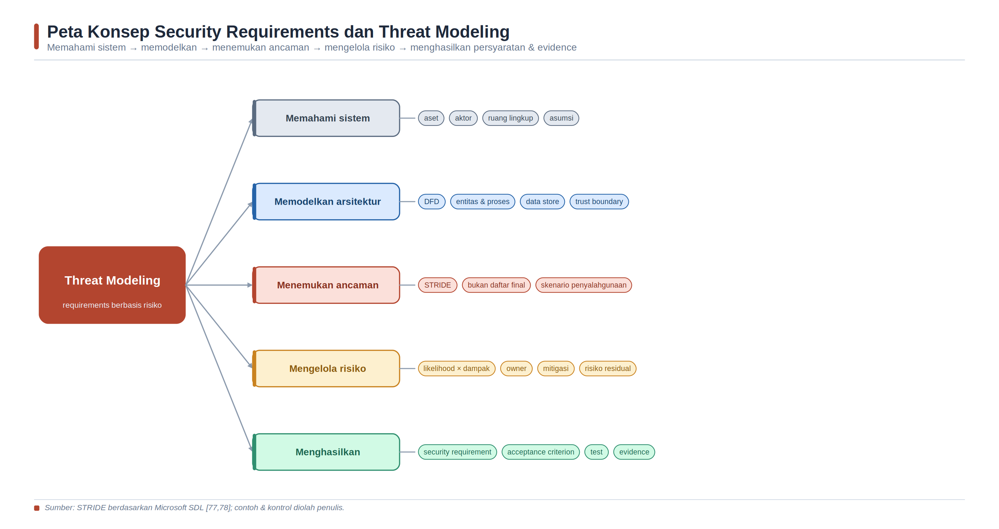
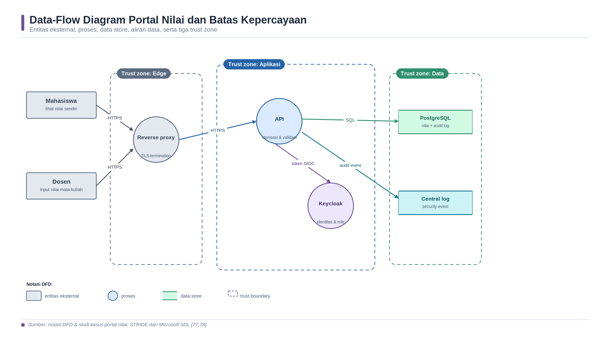

<a id="bab-11"></a>

# Bab 11 — Security Requirements dan Threat Modeling

Topik utama: persyaratan keamanan, ruang lingkup, aset, data-flow diagram, trust boundary, STRIDE, abuse case, penilaian risiko, risk register, mitigasi, acceptance criterion, dan keterlacakan pengujian.

Bab ini membantu mahasiswa mengubah pernyataan umum seperti “sistem harus aman” menjadi keputusan rekayasa yang jelas, dapat diuji, dan dapat dipertanggungjawabkan. Studi kasus menggunakan portal nilai mahasiswa yang berjalan pada container agar konsep dapat diamati melalui arsitektur sederhana.

## Tujuan Pembelajaran dan Kompetensi Utama

- Menjelaskan hubungan antara aset, ancaman, kerentanan, kontrol, dampak, likelihood, dan risiko.

- Menyusun ruang lingkup dan data-flow diagram yang menunjukkan entitas, proses, data store, aliran data, serta trust boundary.

- Menggunakan STRIDE sebagai teknik pemicu untuk menemukan ancaman tanpa menganggapnya sebagai daftar yang selalu lengkap.

- Menilai risiko secara konsisten dan mencatat asumsi, pemilik risiko, mitigasi, serta risiko residual.

- Menulis security requirement dan acceptance criterion yang spesifik, terukur, serta dapat ditautkan ke pengujian.

- Melakukan review dan pengujian sederhana terhadap threat model dalam alur DevSecOps.

## Peta Konsep Bab



*Gambar 8. Peta konsep security requirements dan threat modeling.*

> Sumber: sintesis penulis berdasarkan OWASP Threat Modeling [72,73], NIST SP 800-30 Rev. 1 [75], dan NIST SP 800-154 (draf) [74].

## Konsep Inti dan Landasan Teori

### Threat modeling sebagai kegiatan rekayasa

Threat modeling adalah proses terstruktur untuk memahami sistem, membayangkan kejadian yang merugikan, menentukan tindakan yang sesuai, dan memeriksa apakah tindakan tersebut cukup baik. Dengan kata lain, threat modeling membantu tim berpikir sebelum insiden terjadi. Kegiatan ini bukan ramalan yang menjamin seluruh serangan akan ditemukan. Threat model adalah model kerja: penyederhanaan sistem yang cukup akurat untuk mendukung keputusan keamanan. Karena sistem, pengguna, dependensi, dan lingkungan berubah, model juga harus diperbarui.

OWASP merangkum threat modeling melalui empat pertanyaan yang mudah diingat: apa yang sedang dibangun, apa yang dapat salah, apa yang akan dilakukan, dan apakah hasilnya sudah cukup baik [72,73]. Urutan tersebut penting. Tim tidak dapat menilai ancaman secara tepat jika ruang lingkup dan arsitektur belum dipahami. Tim juga belum selesai ketika daftar ancaman ditemukan; ancaman harus diberi prioritas, ditangani, lalu diverifikasi. Cara berpikir ini membuat threat modeling terhubung dengan pekerjaan pengembang, penguji, operator, pemilik layanan, dan pengelola risiko.

Threat modeling berbeda dari vulnerability scanning. Scanner mencari pola kelemahan yang dapat dideteksi pada kode, dependensi, citra, konfigurasi, atau sistem berjalan. Threat modeling menanyakan kemungkinan kegagalan pada desain dan aliran kepercayaan, termasuk masalah yang tidak mudah dideteksi scanner. Contohnya adalah dosen dapat mengubah nilai mata kuliah yang tidak diampunya karena aturan otorisasi salah. Tidak ada paket rentan yang diperlukan agar kesalahan desain tersebut berbahaya. Scanner dan threat model saling melengkapi, bukan saling menggantikan.

### Ruang lingkup, asumsi, dan konteks

Langkah awal threat modeling adalah menetapkan scope. Scope menjelaskan sistem, fitur, data, lingkungan, dan periode perubahan yang dianalisis. Scope yang terlalu luas membuat diskusi dangkal; scope yang terlalu sempit dapat menyembunyikan dependensi penting. Untuk praktikum, scope dapat dibatasi pada alur “dosen memasukkan nilai dan mahasiswa melihat nilai” mulai dari browser sampai basis data. Layanan email, sistem akademik lain, dan jaringan kampus dapat dicatat sebagai dependensi eksternal tanpa dianalisis secara mendalam.

Asumsi harus ditulis karena keputusan risiko bergantung pada konteks. Contoh asumsi adalah koneksi antarlayanan menggunakan jaringan privat, akun dosen dikelola Keycloak, administrator basis data bukan pengguna aplikasi, dan backup berada di luar scope. Asumsi bukan fakta abadi. Jika implementasi tidak sesuai asumsi—misalnya port basis data ternyata dipublikasikan—threat model harus diperbarui. Asumsi yang tidak terlihat sering menjadi sumber salah percaya terhadap kontrol.

### Aset, aktor, entry point, dan attack surface

Aset adalah sesuatu yang perlu dilindungi karena memiliki nilai bagi organisasi atau pengguna. Pada portal nilai, aset meliputi identitas mahasiswa dan dosen, nilai, token akses, log audit, konfigurasi otorisasi, kunci atau secret, dan ketersediaan layanan. Aset tidak selalu berupa data. Reputasi institusi, integritas proses akademik, dan kemampuan memulihkan layanan juga merupakan aset. Menentukan aset membantu tim menjelaskan dampak: perubahan satu nilai adalah masalah integritas, sedangkan pengungkapan seluruh transkrip adalah masalah kerahasiaan dan privasi.

Aktor adalah pihak yang berinteraksi dengan sistem, misalnya mahasiswa, dosen, administrator, layanan identitas, dan proses otomatis. Entry point adalah titik masuk data atau perintah, seperti endpoint API, form login, webhook, port jaringan, file impor, dan antarmuka administrasi. Attack surface adalah keseluruhan titik tempat pihak tidak tepercaya dapat mencoba memengaruhi sistem. OWASP menekankan hubungan dua arah: perubahan attack surface perlu memicu pembaruan threat model, dan threat modeling membantu memahami attack surface [76].

### Data-flow diagram dan trust boundary

Data-flow diagram (DFD) menggambarkan bagaimana data bergerak. Elemen dasarnya adalah entitas eksternal, proses, data store, dan data flow. DFD untuk threat modeling tidak harus menjadi diagram perangkat lunak yang sangat detail. Tujuannya adalah membuat arsitektur cukup jelas sehingga tim dapat menanyakan siapa mengirim data, ke mana data pergi, bagaimana data diproses, dan di mana data disimpan. Microsoft menjelaskan DFD sebagai representasi grafis sistem yang menunjukkan elemen, interaksi, dan konteksnya [77].

Trust boundary adalah batas ketika tingkat kepercayaan atau kendali administratif berubah. Contohnya adalah batas antara browser pengguna dan reverse proxy, antara aplikasi dan identity provider, atau antara runner CI dan lingkungan produksi. Data yang melintasi trust boundary perlu diperiksa: siapa pengirimnya, bagaimana identitas dibuktikan, apakah pengirim berwenang, bagaimana input divalidasi, apakah saluran dienkripsi, dan apakah kejadian dicatat. Trust boundary bukan sekadar garis putus-putus; garis tersebut menandai tempat keputusan keamanan harus dibuat.

Kesalahan umum mahasiswa adalah menggambar nama teknologi tanpa aliran data. Diagram berisi “Docker, Nginx, Flask, PostgreSQL” belum cukup bila tidak menjelaskan aliran token, nilai, query, dan log. Kesalahan lain adalah menganggap jaringan internal selalu tepercaya. Pada arsitektur modern, layanan internal tetap perlu autentikasi dan otorisasi karena kompromi satu container dapat menjadi titik awal pergerakan lateral.

### STRIDE sebagai teknik pemicu ancaman

STRIDE mengelompokkan ancaman menjadi Spoofing, Tampering, Repudiation, Information Disclosure, Denial of Service, dan Elevation of Privilege [78]. Spoofing berarti menyamar sebagai identitas lain. Tampering berarti mengubah data atau kode tanpa izin. Repudiation berarti pelaku menyangkal tindakan ketika bukti tidak memadai. Information Disclosure berarti data dibaca pihak yang tidak berwenang. Denial of Service berarti layanan atau sumber daya dibuat tidak tersedia. Elevation of Privilege berarti pihak memperoleh hak yang lebih tinggi daripada yang semestinya.

STRIDE sebaiknya digunakan sebagai daftar pertanyaan, bukan sekadar kepanjangan singkatan. Untuk setiap elemen dan aliran DFD, tanyakan: dapatkah identitas dipalsukan; dapatkah data diubah; dapatkah tindakan disangkal; dapatkah data bocor; dapatkah sumber daya dihabiskan; dan dapatkah hak akses dinaikkan? Tidak semua kategori relevan untuk setiap elemen. Hasil yang baik bukan jumlah ancaman sebanyak mungkin, tetapi ancaman yang memiliki skenario, aset terdampak, prasyarat, konsekuensi, dan tindakan yang jelas.

STRIDE juga tidak mencakup seluruh perspektif. Penyalahgunaan proses bisnis, privasi, keselamatan, fraud, ketergantungan rantai pasok, serta ancaman orang dalam memerlukan pertanyaan tambahan. Abuse case membantu tim menulis cerita tentang bagaimana fungsi sah dapat disalahgunakan, misalnya dosen mengubah nilai setelah periode penilaian ditutup atau mahasiswa melakukan enumerasi identitas melalui respons API. Pengetahuan domain tetap diperlukan agar model tidak berhenti pada ancaman teknis generik.

### Risiko, prioritas, dan risiko residual

Ancaman adalah kejadian atau tindakan yang berpotensi menimbulkan kerugian, sedangkan risiko mempertimbangkan kemungkinan kejadian dan besarnya dampak. NIST SP 800-30 Rev. 1 menempatkan threat, vulnerability, likelihood, dan impact sebagai faktor penting dalam penilaian risiko [75]. Untuk praktikum, matriks kualitatif tiga tingkat cukup digunakan selama kriteria didefinisikan. Likelihood tinggi dapat berarti jalur serangan mudah, terekspos, dan kontrolnya lemah. Impact tinggi dapat berarti pelanggaran integritas nilai dalam skala besar, kebocoran data sensitif, atau layanan akademik tidak tersedia pada periode kritis.

Skor risiko bukan kebenaran matematis. Rumus likelihood × impact membantu konsistensi, tetapi angka tetap berasal dari penilaian manusia dan informasi yang terbatas. Dua kelompok dapat memberi skor berbeda karena asumsi berbeda. Oleh sebab itu, alasan pemberian skor lebih penting daripada angka itu sendiri. Catat exposure, kemampuan penyerang, kontrol yang sudah ada, cakupan data, dan konsekuensi organisasi. Hindari presisi palsu seperti menyatakan risiko 7,43 tanpa data yang mendukung.

Setelah mitigasi dipilih, risiko tidak otomatis menjadi nol. Risiko yang tersisa disebut residual risk. Contohnya, rate limiting mengurangi kemungkinan brute force, tetapi tidak menghilangkan pencurian kredensial melalui phishing. Risk register perlu memuat pemilik risiko, keputusan—mitigate, avoid, transfer, atau accept—target waktu, status, dan bukti. Penerimaan risiko harus dilakukan oleh pihak yang memiliki kewenangan, bukan diam-diam oleh pengembang melalui komentar “akan diperbaiki nanti”.

### Security requirements yang dapat diuji

Security requirement menerjemahkan risiko menjadi perilaku atau batas yang harus dipenuhi sistem. Pernyataan “sistem harus aman” tidak dapat diuji karena tidak menjelaskan kondisi, objek, dan hasil. Pernyataan yang lebih baik adalah: “API perubahan nilai harus menolak token tanpa role dosen dengan HTTP 403, mencatat subjek, waktu, mata kuliah, dan hasil keputusan, serta tidak menyimpan token pada log.” Requirement tersebut memiliki subjek, kondisi, perilaku, dan bukti.

Acceptance criterion menjelaskan cara menentukan PASS atau FAIL. Format sederhana Given–When–Then membantu mahasiswa. Given pengguna berrole mahasiswa; When mengirim PATCH ke /api/grades/123; Then API mengembalikan 403 dan nilai tidak berubah. Kriteria ini dapat diubah menjadi integration test. OWASP ASVS menyediakan dasar untuk menguji kontrol teknis aplikasi web serta daftar requirement pengembangan aman [79]. ASVS dapat digunakan sebagai baseline, tetapi requirement tetap harus disesuaikan dengan konteks dan ancaman sistem.

Keterlacakan diperlukan agar tim dapat menjawab: risiko mana yang ditangani requirement ini, kontrol apa yang menerapkannya, test apa yang memverifikasinya, dan evidence apa yang dihasilkan. Rantai TM-03 → SR-03 → TEST-03 → report membuat keputusan dapat diaudit. Jika requirement berubah, test dan threat model ikut ditinjau. Inilah hubungan threat modeling dengan DevSecOps: hasil desain menjadi pekerjaan yang dapat dieksekusi pada backlog dan pipeline.

### Threat model yang hidup dalam DevSecOps

Threat model sebaiknya disimpan bersama dokumentasi arsitektur dan diberi versi. Pembaruan dipicu oleh perubahan trust boundary, fitur autentikasi, tipe data, endpoint publik, dependensi kritis, hak akses, atau lingkungan deployment. Review singkat pada pull request dapat menanyakan apakah perubahan menambah aset, data flow, entry point, atau privilege. Tidak semua perubahan membutuhkan workshop besar, tetapi perubahan risiko tinggi memerlukan review lintas peran.

Kualitas threat model dinilai dari kegunaannya. Model yang baik memiliki scope dan asumsi, arsitektur yang sesuai implementasi, ancaman yang masuk akal, prioritas yang dapat dijelaskan, pemilik mitigasi, requirement yang dapat diuji, serta bukti bahwa kontrol bekerja. Model yang indah tetapi tidak pernah diperbarui menjadi dokumentasi usang. Sebaliknya, daftar sederhana yang ditautkan ke backlog dan test dapat memberi nilai tinggi selama cukup jelas dan lengkap.

| [High confidence] Konsep inti pada bab ini merujuk pada OWASP, NIST, Microsoft SDL, dan OWASP ASVS. [Medium confidence] Skor risiko contoh bersifat pedagogis; organisasi harus menetapkan kriteria likelihood, impact, risk appetite, dan otoritas penerimaan risiko sesuai konteksnya. |
| --- |

| Istilah | Makna sederhana | Contoh portal nilai |
| --- | --- | --- |
| Aset | Sesuatu yang bernilai dan perlu dilindungi. | Nilai, identitas, token, audit log, ketersediaan. |
| Ancaman | Kejadian yang dapat menimbulkan kerugian. | Pihak tidak sah mengubah nilai. |
| Kerentanan | Kelemahan yang dapat dimanfaatkan. | API hanya memeriksa login, tidak memeriksa role. |
| Kontrol | Tindakan untuk mengurangi risiko. | RBAC, validasi server-side, audit log. |
| Likelihood | Tingkat kemungkinan skenario terjadi. | Endpoint publik dan mudah dicoba meningkatkan kemungkinan. |
| Impact | Besarnya konsekuensi jika terjadi. | Integritas akademik rusak dan perlu koreksi massal. |
| Residual risk | Risiko yang tersisa setelah kontrol. | Akun dosen sah masih dapat disalahgunakan. |

> Sumber: sintesis penulis berdasarkan NIST SP 800-30 Rev. 1 [75] dan OWASP Threat Modeling [72,73].

| Kategori | Pertanyaan pemicu | Contoh ancaman | Kontrol umum |
| --- | --- | --- | --- |
| Spoofing | Dapatkah seseorang menyamar sebagai pihak lain? | Token curian dipakai sebagai dosen. | MFA, validasi token, session management. |
| Tampering | Dapatkah data atau kode diubah tanpa izin? | Request mengubah nilai mata kuliah lain. | Object-level authorization, integrity check, review. |
| Repudiation | Dapatkah tindakan disangkal? | Perubahan nilai tidak memiliki audit trail. | Audit log terlindungi, waktu tersinkron, korelasi ID. |
| Information Disclosure | Dapatkah data dibaca pihak tidak sah? | Mahasiswa membaca nilai mahasiswa lain. | Authorization, minimisasi data, enkripsi. |
| Denial of Service | Dapatkah layanan dibuat tidak tersedia? | Endpoint pencarian dibanjiri request mahal. | Rate limit, timeout, quota, monitoring. |
| Elevation of Privilege | Dapatkah hak akses dinaikkan? | Role mahasiswa diubah menjadi administrator. | Least privilege, server-side policy, admin separation. |

> Sumber: STRIDE berdasarkan Microsoft SDL [77,78]; contoh dan kontrol diolah penulis.

## Arsitektur Laboratorium dan Prasyarat Lingkungan

Studi kasus adalah portal nilai sederhana. Mahasiswa dapat melihat nilai sendiri. Dosen dapat memasukkan nilai hanya untuk mata kuliah yang diampu. Keycloak menyediakan identitas dan role. Reverse proxy menerima koneksi pengguna. API memproses otorisasi dan validasi. PostgreSQL menyimpan nilai serta audit log, sedangkan centralized log menerima security event. Fokus model adalah alur melihat dan mengubah nilai; fungsi pembayaran, email, dan administrasi akademik lain berada di luar scope.



*Gambar 9. Data-flow diagram portal nilai dan batas kepercayaan.*

> Sumber: rancangan penulis berdasarkan elemen DFD Microsoft SDL [77,78] dan OWASP Threat Modeling [72,73].

| Elemen | Jenis | Data/aksi utama | Trust concern |
| --- | --- | --- | --- |
| Mahasiswa/Dosen | Entitas eksternal | Kredensial, token, request lihat/ubah nilai. | Perangkat dan input tidak otomatis tepercaya. |
| Reverse Proxy | Proses | Terminasi TLS, routing, rate limit. | Header spoofing, konfigurasi TLS, bypass port backend. |
| Portal Nilai API | Proses | Validasi token, otorisasi objek, logika nilai. | Broken access control, injection, error disclosure. |
| Keycloak | Proses eksternal | Identitas, role, token OIDC. | Issuer/audience, key rotation, akun berprivilege. |
| PostgreSQL | Data store | Nilai dan catatan audit. | Kerahasiaan, integritas, backup, DB privilege. |
| Central Log | Data store | Event autentikasi, otorisasi, perubahan. | Data sensitif pada log, tampering, retention. |

> Sumber: analisis penulis dari arsitektur praktikum.

## Langkah Praktikum Eksploratif

### 1. Menetapkan ruang lingkup dan asumsi

Buat direktori khusus dan dokumen scope. Mahasiswa harus menyepakati apa yang dianalisis sebelum mencari ancaman. Hindari menambahkan kontrol pada tahap ini; tujuan langkah pertama adalah memahami sistem.

```bash
mkdir -p ~/devsecops-lab/bab-11/{model,evidence,tests}
cd ~/devsecops-lab/bab-11

cat > model/scope.md <<'EOF'
# Scope Threat Model: Portal Nilai
## In scope
- mahasiswa melihat nilai miliknya
- dosen mengubah nilai mata kuliah yang diampu
- login melalui Keycloak
- aliran browser -> proxy -> API -> database/log
## Out of scope
- sinkronisasi ke sistem akademik pusat
- email notifikasi dan backup infrastruktur
## Asumsi
- TLS aktif pada akses pengguna
- role berasal dari issuer Keycloak yang disetujui
- port database tidak dipublikasikan ke Internet
## Aset prioritas
- integritas nilai, kerahasiaan data mahasiswa, token, audit trail, availability
EOF
```

### 2. Menyusun inventaris elemen dan aliran data

Tuliskan elemen DFD dalam format tabel agar diagram dapat diverifikasi terhadap daftar. Beri ID konsisten. ID ini akan digunakan pada ancaman dan requirement.

```bash
cat > model/dfd-elements.csv <<'EOF'
id,type,name,trust_zone
E1,external_entity,Mahasiswa,Internet
E2,external_entity,Dosen,Internet
P1,process,Reverse Proxy,Application
P2,process,Portal Nilai API,Application
P3,process,Keycloak,Identity-Data
D1,data_store,PostgreSQL,Identity-Data
D2,data_store,Central Log,Application
EOF

cat > model/data-flows.csv <<'EOF'
id,source,destination,data,protocol,crosses_boundary
F1,E1,P1,HTTPS request,HTTPS,yes
F2,E2,P1,HTTPS request,HTTPS,yes
F3,P1,P2,filtered request,HTTP-private,yes
F4,P2,P3,OIDC token and keys,HTTPS,yes
F5,P2,D1,grade and audit query,TLS,yes
F6,P2,D2,security event,TCP-private,no
EOF
```

Bandingkan daftar dengan Gambar 9. Bila ada komponen atau aliran pada implementasi yang tidak tercatat, perbarui model. Diagram harus mengikuti kenyataan, bukan sebaliknya.

### 3. Menemukan ancaman dengan STRIDE

Gunakan setiap aliran yang melintasi trust boundary sebagai titik awal. Tulis skenario konkret dengan pola: aktor atau kondisi, tindakan, aset, dan dampak. Hindari pernyataan terlalu umum seperti “hacker menyerang sistem”.

```bash
cat > model/threats.csv <<'EOF'
id,element,stride,scenario,asset,existing_control
TM-01,F4,Spoofing,"API menerima token dari issuer palsu",identitas,"validasi JWT sebagian"
TM-02,F5,Tampering,"dosen mengubah nilai kelas yang tidak diampu",integritas nilai,"login dan role dosen"
TM-03,P2,Repudiation,"perubahan nilai tidak dapat ditelusuri",audit trail,"application log"
TM-04,P2,Information Disclosure,"mahasiswa membaca objek nilai milik pengguna lain",data mahasiswa,"login"
TM-05,P1,Denial of Service,"request mahal memenuhi worker API",availability,"reverse proxy"
TM-06,P2,Elevation of Privilege,"claim role dari request dipercaya tanpa validasi",hak akses,"pemeriksaan role"
EOF
```

| ID | Skenario | Aset | Prasyarat | Konsekuensi |
| --- | --- | --- | --- | --- |
| TM-01 | API menerima token issuer palsu. | Identitas dan hak akses. | Issuer/audience tidak divalidasi. | Penyerang bertindak sebagai pengguna sah. |
| TM-02 | Dosen mengubah nilai kelas lain. | Integritas nilai. | Otorisasi hanya memeriksa role dosen. | Perubahan akademik tanpa kewenangan. |
| TM-03 | Perubahan nilai tidak dapat ditelusuri. | Audit trail. | Log tidak memuat actor, objek, waktu, hasil. | Sengketa tidak dapat diselesaikan. |
| TM-04 | Mahasiswa membaca nilai pengguna lain. | Kerahasiaan data. | Object ID dapat ditebak; ownership tidak diperiksa. | Kebocoran data pribadi. |
| TM-05 | Request mahal menghabiskan worker. | Availability. | Tanpa rate limit, timeout, dan query limit. | Portal tidak tersedia pada masa penilaian. |
| TM-06 | Claim role tidak tepercaya memberi hak admin. | Otorisasi. | Claim berasal dari request/header. | Elevation of privilege. |

> Sumber: contoh penulis berdasarkan STRIDE dan studi kasus portal nilai.

### 4. Menilai dan memprioritaskan risiko

Gunakan skala 1–3. Likelihood: 1 sulit dan jarang; 2 mungkin dengan kondisi tertentu; 3 mudah atau terekspos. Impact: 1 dampak terbatas; 2 berdampak pada sejumlah pengguna atau proses; 3 berdampak besar pada kerahasiaan, integritas, availability, kepatuhan, atau reputasi. Skor = likelihood × impact. Baseline praktikum: 1–2 rendah, 3–4 sedang, 6–9 tinggi. Selalu tulis alasan.

```bash
cat > model/risk-register.csv <<'EOF'
id,likelihood,impact,score,level,reason,owner,status
TM-01,2,3,6,high,"token mudah dipalsukan bila issuer tidak divalidasi",identity-team,open
TM-02,3,3,9,high,"endpoint tersedia bagi seluruh dosen; dampak integritas tinggi",app-team,open
TM-03,2,2,4,medium,"log ada tetapi field audit belum lengkap",platform-team,open
TM-04,3,3,9,high,"ID objek dapat diuji berulang",app-team,open
TM-05,2,2,4,medium,"proxy ada tetapi belum ada limit",platform-team,open
TM-06,2,3,6,high,"role menentukan akses perubahan nilai",identity-team,open
EOF
```

### 5. Menulis security requirements dan acceptance criteria

Setiap risiko tinggi harus memiliki tindakan, owner, dan cara verifikasi. Requirement berikut menggunakan bahasa yang cukup sederhana untuk dibaca mahasiswa, tetapi tetap memiliki kondisi dan hasil yang tegas.

```bash
cat > model/security-requirements.yaml <<'EOF'
requirements:
  - id: SR-01
    threats: [TM-01, TM-06]
    statement: >
      API hanya menerima access token yang signature-nya valid dan memiliki
      issuer, audience, expiry, serta role dari konfigurasi tepercaya.
    acceptance:
      - "token issuer salah menghasilkan HTTP 401"
      - "token tanpa role dosen menghasilkan HTTP 403 pada perubahan nilai"
    owner: identity-team
    tests: [TEST-01, TEST-02]

  - id: SR-02
    threats: [TM-02, TM-04]
    statement: >
      API memeriksa otorisasi pada setiap objek nilai; dosen hanya dapat
      mengubah kelas yang diampu dan mahasiswa hanya dapat membaca miliknya.
    acceptance:
      - "dosen mengubah kelas lain menghasilkan HTTP 403 dan data tetap"
      - "mahasiswa membaca objek pengguna lain menghasilkan HTTP 403 atau 404"
    owner: app-team
    tests: [TEST-03, TEST-04]

  - id: SR-03
    threats: [TM-03]
    statement: >
      Setiap percobaan perubahan nilai mencatat actor, object, action, time,
      correlation_id, dan result tanpa menyimpan token atau data sensitif.
    acceptance:
      - "event sukses dan gagal tersedia pada central log"
      - "token tidak muncul pada log"
    owner: platform-team
    tests: [TEST-05]
EOF
```

| Requirement lemah | Masalah | Requirement yang dapat diuji |
| --- | --- | --- |
| Sistem harus aman. | Tidak ada scope, kondisi, atau hasil. | API menolak token issuer salah dengan HTTP 401. |
| Data harus terlindungi. | Tidak menjelaskan data dan pihak. | Mahasiswa hanya dapat membaca objek nilai miliknya. |
| Semua aktivitas dicatat. | Berpotensi berlebihan dan membocorkan secret. | Perubahan nilai mencatat enam field audit tanpa token. |
| Sistem harus selalu tersedia. | Tidak realistis dan tidak terukur. | API mempertahankan p95 < 500 ms pada beban uji yang disetujui. |

> Sumber: contoh penulis; prinsip verifikasi merujuk pada OWASP ASVS [79].

### 6. Membuat matriks keterlacakan

```bash
cat > model/traceability.csv <<'EOF'
threat,requirement,test,evidence,owner
TM-01,SR-01,TEST-01,evidence/test-01-junit.xml,identity-team
TM-06,SR-01,TEST-02,evidence/test-02-junit.xml,identity-team
TM-02,SR-02,TEST-03,evidence/test-03-junit.xml,app-team
TM-04,SR-02,TEST-04,evidence/test-04-junit.xml,app-team
TM-03,SR-03,TEST-05,evidence/audit-event.json,platform-team
EOF
```

Matriks harus tidak memiliki baris kosong pada kolom requirement, test, evidence, dan owner untuk risiko yang wajib dimitigasi. Ancaman yang diterima harus memiliki risk owner, alasan, serta tanggal review.

## Verifikasi dan Skenario Pengujian

### Pengujian struktural dokumen threat model

Pengujian pertama tidak menyerang aplikasi. Pengujian ini memeriksa kelengkapan artefak threat model. Script menggunakan modul standar Python sehingga dapat dijalankan pada workstation laboratorium.

```python
cat > tests/validate_model.py <<'PY'
import csv
from pathlib import Path

root = Path(__file__).resolve().parents[1]
required = [
    root/'model/scope.md', root/'model/dfd-elements.csv',
    root/'model/data-flows.csv', root/'model/threats.csv',
    root/'model/risk-register.csv', root/'model/traceability.csv'
]
for path in required:
    assert path.exists() and path.stat().st_size > 0, f'missing: {path}'

with open(root/'model/threats.csv', newline='') as f:
    threats = {r['id']: r for r in csv.DictReader(f)}
with open(root/'model/risk-register.csv', newline='') as f:
    risks = {r['id']: r for r in csv.DictReader(f)}
with open(root/'model/traceability.csv', newline='') as f:
    traces = list(csv.DictReader(f))

assert threats.keys() <= risks.keys(), 'setiap threat harus ada pada risk register'
high = {k for k,v in risks.items() if v['level'] == 'high'}
traced = {r['threat'] for r in traces if all(r.values())}
assert high <= traced, f'high risk tanpa traceability: {high-traced}'
print('PASS: model lengkap dan seluruh high risk dapat ditelusuri')
PY
python3 tests/validate_model.py
```

### Pengujian requirement pada API

Contoh berikut bersifat pseudocode pytest dan harus disesuaikan dengan API dari bab sebelumnya. Pengujian menggunakan identitas dummy pada lingkungan yang diotorisasi. Jangan menyalin token produksi ke laporan.

```python
# TEST-03: dosen tidak boleh mengubah kelas yang tidak diampu
def test_lecturer_cannot_change_other_course(api, lecturer_token):
    before = api.get('/api/grades/123', token=lecturer_token).json()
    response = api.patch('/api/grades/123',
                         token=lecturer_token,
                         json={'score': 100})
    after = api.get('/api/grades/123', token=lecturer_token).json()
    assert response.status_code == 403
    assert after == before

# TEST-04: mahasiswa tidak boleh membaca nilai pengguna lain
def test_student_cannot_read_other_grade(api, student_token):
    response = api.get('/api/grades/other-student', token=student_token)
    assert response.status_code in (403, 404)
```

### Skenario uji dan evidence

| ID | Threat/requirement | Prosedur | PASS | Evidence |
| --- | --- | --- | --- | --- |
| TEST-01 | TM-01 / SR-01 | Kirim token dengan issuer salah. | HTTP 401; request tidak diproses. | JUnit/API log tanpa token. |
| TEST-02 | TM-06 / SR-01 | Token valid tanpa role dosen mengubah nilai. | HTTP 403; nilai tidak berubah. | JUnit + audit denial event. |
| TEST-03 | TM-02 / SR-02 | Dosen mengubah kelas lain. | HTTP 403; before = after. | JUnit + DB verification. |
| TEST-04 | TM-04 / SR-02 | Mahasiswa membaca objek pengguna lain. | HTTP 403/404; tanpa data sensitif. | JUnit + response sample. |
| TEST-05 | TM-03 / SR-03 | Lakukan perubahan sukses dan gagal. | Enam field audit ada; token tidak ada. | JSON event + query log. |
| TEST-06 | Model completeness | Jalankan validate_model.py. | High risk memiliki traceability. | Console log pipeline. |

> Sumber: rancangan pengujian penulis berdasarkan threat model studi kasus.

### Review Silang dan Eksperimen Perubahan

Tukar threat model dengan kelompok lain. Reviewer tidak langsung menambah ancaman. Pertama, reviewer menjelaskan kembali sistem hanya berdasarkan dokumen. Jika penjelasan berbeda dari maksud pembuat, diagram atau scope belum cukup jelas. Setelah itu, reviewer mencari elemen, data flow, trust boundary, asumsi, atau risiko yang hilang.

Lakukan eksperimen perubahan: tambahkan fitur impor nilai melalui file CSV. Jawab empat pertanyaan: aset baru apa yang muncul; entry point dan aliran data apa yang bertambah; ancaman apa yang relevan; serta requirement/test apa yang diperlukan. Contoh ancaman meliputi formula injection, file terlalu besar, pemetaan mahasiswa salah, dan audit import yang tidak lengkap. Eksperimen ini membuktikan bahwa threat model harus berubah ketika attack surface berubah.

## Analisis Hasil

Analisis pertama menilai ketepatan scope. Pastikan seluruh ancaman benar-benar berada dalam scope atau memiliki hubungan jelas dengan dependensi. Ancaman di luar scope tidak harus diabaikan; catat pemilik eksternal dan asumsi yang digunakan. Scope yang kabur biasanya menghasilkan kontrol yang tidak dapat ditugaskan.

Analisis kedua menilai kualitas DFD. Pilih setiap flow yang crosses_boundary=yes dan periksa apakah threat model membahas autentikasi, otorisasi, integritas, kerahasiaan, availability, serta audit sesuai kebutuhan. Jika aliran token atau log tidak terlihat, risiko spoofing dan disclosure mudah terlewat. Diagram yang dapat dijelaskan oleh reviewer tanpa bantuan pembuat merupakan indikator dokumentasi yang cukup jelas.

Analisis ketiga menilai prioritas. Bandingkan dua risiko dengan skor sama dan jelaskan apakah urgensinya benar-benar sama. TM-03 dan TM-05 dapat sama-sama bernilai sedang, tetapi waktu penanganan dapat berbeda karena periode akademik, kewajiban audit, atau adanya kontrol kompensasi. Risk score membantu diskusi, sedangkan keputusan tetap memerlukan konteks.

Analisis keempat menilai kualitas requirement. Requirement yang baik mengurangi satu atau beberapa risiko, tidak bergantung pada niat pembaca, dan memiliki hasil PASS/FAIL. Perhatikan bahwa HTTP 403 saja belum membuktikan integritas; TEST-03 juga membandingkan data sebelum dan sesudah. Pengujian negatif perlu memastikan operasi tidak menghasilkan efek samping.

Analisis kelima menilai residual risk. Setelah SR-01 diterapkan, akun dosen yang sah masih dapat disalahgunakan. Kontrol tambahan dapat berupa MFA, session timeout, notifikasi perubahan, approval untuk koreksi tertentu, atau anomaly detection. Jelaskan risiko mana yang diterima dan siapa yang berwenang menerimanya. Jangan menyatakan “risiko selesai” hanya karena test lulus.

| Dimensi | Pertanyaan review | Indikator kuat | Indikator lemah |
| --- | --- | --- | --- |
| Scope | Apakah batas dan asumsi jelas? | In/out scope, dependensi, asumsi terdokumentasi. | Seluruh sistem disebut tanpa batas. |
| Architecture | Apakah model sesuai implementasi? | Elemen dan flow memiliki ID; boundary dapat dijelaskan. | Hanya logo teknologi tanpa data flow. |
| Threat | Apakah skenario konkret? | Aktor/kondisi, tindakan, aset, dampak. | “Hacker menyerang aplikasi.” |
| Risk | Apakah skor dapat dijelaskan? | Likelihood/impact memiliki alasan dan konteks. | Angka tanpa kriteria. |
| Requirement | Apakah dapat diuji? | Kondisi, perilaku, PASS/FAIL, owner. | “Sistem harus aman.” |
| Traceability | Apakah keputusan dapat ditelusuri? | Threat–requirement–test–evidence terhubung. | Screenshot tanpa ID atau hubungan. |
| Lifecycle | Apakah model diperbarui? | Trigger perubahan dan review date tersedia. | Model hanya dibuat sekali. |

> Sumber: rubrik penulis berdasarkan OWASP Threat Modeling [72,73] dan Microsoft SDL [77,78].

## Troubleshooting dan Analisis Hasil

| Masalah | Penyebab yang mungkin | Perbaikan |
| --- | --- | --- |
| Diskusi menghasilkan ancaman terlalu umum. | Scope/DFD belum jelas atau peserta langsung menebak serangan. | Kembali ke elemen dan flow; tulis skenario dengan aset serta dampak. |
| Diagram terlalu kompleks. | Seluruh organisasi dimasukkan dalam satu model. | Bagi per use case/trust zone; tautkan dependensi eksternal. |
| Trust boundary tidak ditemukan. | Boundary disamakan dengan subnet saja. | Cari perubahan identitas, privilege, owner, dan domain administratif. |
| Semua risiko diberi nilai tinggi. | Kriteria likelihood/impact tidak ditentukan. | Definisikan skala dan bandingkan skenario dengan contoh kalibrasi. |
| Tim berdebat tentang angka. | Skor dianggap hasil eksak. | Catat asumsi dan alasan; eskalasi keputusan ke risk owner. |
| Requirement tidak dapat diuji. | Menggunakan kata aman, memadai, atau sesuai tanpa kondisi. | Tambahkan Given–When–Then, hasil, owner, dan evidence. |
| Mitigasi hanya “gunakan enkripsi”. | Tidak menjelaskan data, saluran, atau key management. | Tentukan data in transit/at rest, protokol, identitas, rotasi, dan test. |
| Scanner tidak menemukan ancaman desain. | Scanner diperlakukan sebagai threat model. | Gunakan scanner sebagai evidence tambahan; review logika dan trust flow. |
| validate_model.py gagal. | ID berbeda, kolom kosong, atau high risk belum ditautkan. | Samakan ID; isi requirement, test, evidence, dan owner. |
| Threat model cepat usang. | Tidak ada trigger dan pemilik pembaruan. | Tambahkan review pada PR untuk perubahan aset, flow, boundary, atau privilege. |

> Sumber: sintesis penulis dari pola kesalahan umum dalam latihan threat modeling.

## Kesimpulan

Threat modeling menghubungkan arsitektur dengan keputusan keamanan. Proses dimulai dari scope, aset, asumsi, dan DFD; dilanjutkan dengan identifikasi ancaman melalui STRIDE serta pengetahuan domain; kemudian risiko diprioritaskan, dimitigasi, dan diterjemahkan menjadi requirement yang dapat diuji. Nilai utama threat model bukan jumlah ancaman atau keindahan diagram, melainkan kemampuan tim menjelaskan keputusan dan menunjukkan bukti bahwa kontrol bekerja.

Bagi mahasiswa, cara paling efektif mempelajari threat modeling adalah menggunakan sistem kecil dan skenario konkret. Pertanyaan “siapa mengirim data apa, melewati batas mana, dengan hak apa, dan apa akibatnya jika salah” lebih berguna daripada menghafal daftar istilah. Threat model harus hidup bersama perubahan sistem. Setiap perubahan attack surface, data sensitif, identitas, privilege, atau dependensi dapat memicu pembaruan model, requirement, dan test.

## Evaluasi dan Latihan Mandiri

1. Jelaskan perbedaan ancaman, kerentanan, kontrol, dan risiko menggunakan satu contoh portal nilai.

2. Mengapa trust boundary tidak selalu sama dengan batas jaringan?

3. Mengapa STRIDE tidak boleh dianggap sebagai daftar ancaman yang selalu lengkap?

4. Ubah pernyataan “token harus aman” menjadi requirement dan acceptance criterion yang dapat diuji.

5. Mengapa HTTP 403 saja belum cukup membuktikan bahwa perubahan nilai ditolak tanpa efek samping?

6. Apa perbedaan inherent risk dan residual risk?

7. Siapa yang seharusnya menerima risiko dan mengapa pengembang tidak boleh menerima semua risiko sendiri?

8. Perubahan sistem apa saja yang harus memicu pembaruan threat model?

9. Jelaskan hubungan threat, requirement, test, dan evidence dalam matriks keterlacakan.

10. Tambahkan satu abuse case portal nilai yang tidak sepenuhnya tercakup oleh STRIDE.

## Format Laporan Praktikum

Laporan Bab 11 menggunakan bahasa formal akademis dan maksimum 10 halaman di luar lampiran artefak. Gunakan data dummy dan samarkan identitas. Laporan minimum memuat:

- Scope, asumsi, in-scope/out-of-scope, dan daftar aset prioritas.

- DFD dengan elemen, aliran data, protokol, trust zone, dan trust boundary.

- Minimal enam threat STRIDE dengan skenario, aset, prasyarat, dan dampak.

- Risk register dengan alasan likelihood/impact, owner, keputusan, dan residual risk.

- Minimal tiga security requirements dan acceptance criteria.

- Matriks threat–requirement–test–evidence serta hasil validate_model.py.

- Hasil review silang, satu perubahan model, analisis, kesimpulan, dan rekomendasi.
