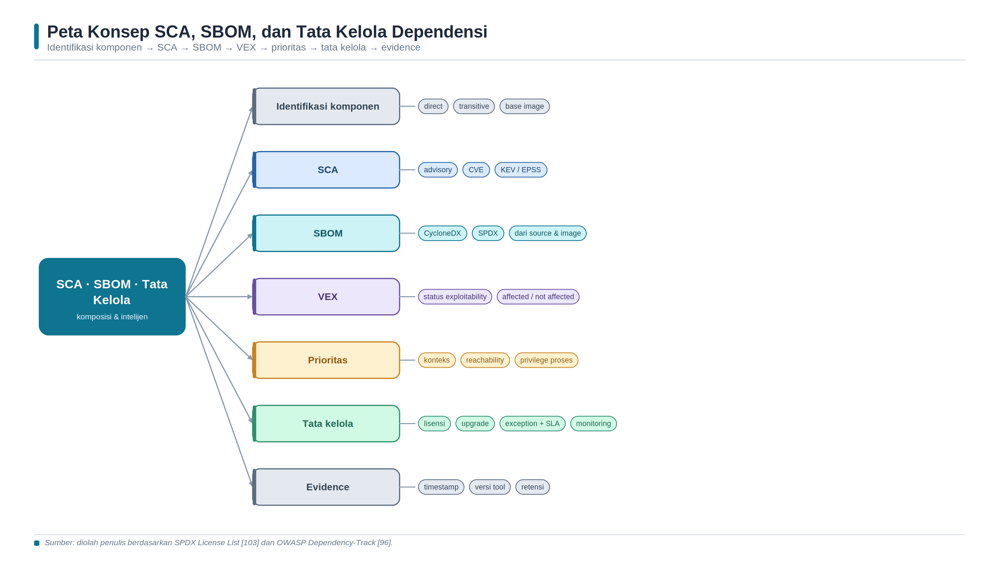
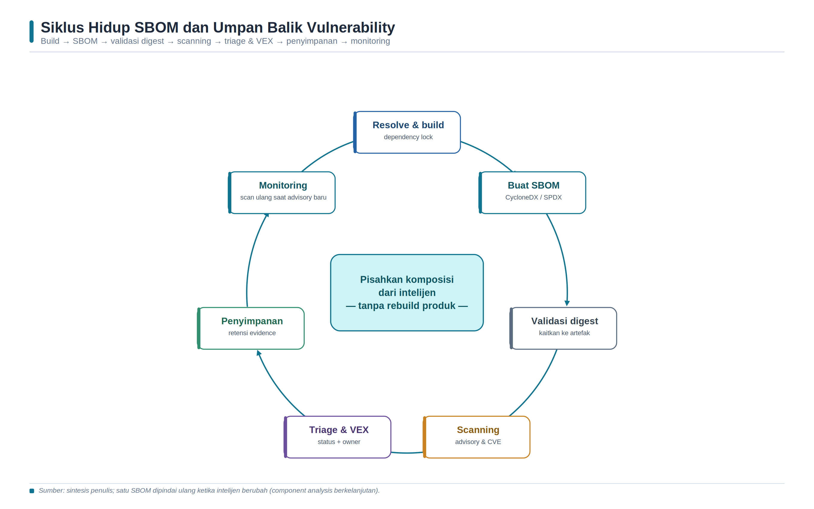

<a id="bab-13"></a>

# Bab 13 — SCA, SBOM, dan Tata Kelola Dependensi

Bab ini membahas Software Composition Analysis (SCA), Software Bill of Materials (SBOM), dan tata kelola dependensi sebagai satu sistem pengendalian. Mahasiswa tidak hanya menjalankan scanner, tetapi membangun inventaris yang dapat ditelusuri, menguji kualitasnya, menghubungkannya dengan identitas artefak, menafsirkan intelijen kerentanan dan lisensi, serta menyusun keputusan remediasi yang dapat diaudit. Hasil scan bersifat dinamis karena basis data advisory, mapping paket, dan informasi exploitability berubah dari waktu ke waktu.

## Tujuan Pembelajaran dan Kompetensi Utama

- Membedakan dependency manifest, lockfile, SCA, SBOM, vulnerability database, VEX, dan evidence pipeline.

- Menjelaskan direct, transitive, build, development, optional, bundled, serta operating-system dependency.

- Mengidentifikasi komponen dengan nama, versi, ecosystem, Package URL, hash, supplier, dan relasi dependensi.

- Mengevaluasi kualitas SBOM berdasarkan completeness, correctness, timeliness, consistency, dan traceability.

- Menghasilkan SBOM CycloneDX dan SPDX dari source serta container image, kemudian membandingkan hasilnya.

- Memindai SBOM, melakukan triage berbasis konteks, dan menyusun status remediasi atau VEX secara bertanggung jawab.

- Menyusun kebijakan lisensi, upgrade, exception, monitoring, dan retensi evidence yang dapat diaudit.

## Peta Konsep Bab



*Gambar 12. Peta konsep SCA, SBOM, dan tata kelola dependensi.*

> Sumber: sintesis penulis berdasarkan CISA [91], CycloneDX [92-93], SPDX [94], OWASP [95-96], dan FIRST [102].

## Konsep Inti dan Landasan Teori

### Dependensi sebagai Bagian dari Produk

Perangkat lunak modern dibangun dari kode yang ditulis organisasi, komponen open source, paket komersial, image dasar, library sistem operasi, runtime, dan alat build. Dependensi langsung dinyatakan oleh proyek, sedangkan dependensi transitif ditarik oleh komponen lain. Dependensi build dan development mungkin tidak dibutuhkan saat aplikasi berjalan, tetapi tetap dapat memengaruhi artefak atau proses pembangunannya. Bundled dependency dapat tersalin ke dalam paket, sedangkan optional dependency hanya aktif pada fitur atau platform tertentu. Klasifikasi ini penting karena daftar pada satu manifest belum tentu sama dengan komponen yang benar-benar terdapat pada artefak akhir.

Risiko dependensi tidak terbatas pada CVE. Komponen dapat tidak lagi dipelihara, memiliki lisensi yang tidak sesuai kebijakan, berasal dari sumber yang tidak dipercaya, mengandung nama yang membingungkan, atau memperkenalkan perubahan perilaku ketika diperbarui. Tata kelola yang hanya menghitung jumlah CVE akan melewatkan risiko asal-usul, integritas, lisensi, kedaluwarsa, dan konsentrasi pemasok. Sebaliknya, kebijakan yang melarang seluruh komponen lama tanpa menilai fungsi dan jalur migrasi dapat mengganggu operasi. Tujuan pengelolaan dependensi adalah membuat komposisi terlihat, keputusan konsisten, dan perubahan dapat diverifikasi.

### SCA, SBOM, dan Basis Data Kerentanan

Software Composition Analysis adalah proses dan kemampuan untuk menemukan komponen, mengidentifikasi versi, menghubungkan komponen dengan advisory serta lisensi, dan membantu prioritas perbaikan. OWASP Dependency-Check, misalnya, mencoba mengidentifikasi dependency dan mengaitkannya dengan CPE serta CVE [95]. Pendekatan berbasis CPE dapat berguna, tetapi mapping nama paket ke produk rentan tidak selalu tepat. Ekosistem bahasa modern juga menggunakan informasi package-native. OSV menyediakan skema yang memetakan vulnerability ke versi paket atau commit secara machine-readable [97]. Perbedaan sumber, waktu sinkronisasi, dan logika pencocokan menyebabkan dua scanner dapat menghasilkan temuan berbeda tanpa salah satu otomatis dianggap benar.

SBOM adalah rekaman formal mengenai komponen dan hubungan rantai pasok di dalam perangkat lunak [91]. SBOM bukan hasil penilaian keamanan, bukan daftar CVE, dan bukan jaminan bahwa seluruh komponen berhasil ditemukan. Ia merupakan artefak inventaris yang dapat digunakan oleh SCA, vulnerability management, procurement, incident response, dan compliance. SCA adalah aktivitas analitis yang dapat mengonsumsi SBOM; SBOM adalah objek data yang dapat dibuat, disimpan, dipertukarkan, ditandatangani, dan dipindai ulang. Pemisahan konsep ini memungkinkan SBOM tetap relatif stabil untuk satu artefak, sementara hasil vulnerability scan diperbarui lebih sering ketika advisory berubah.

| Artefak/aktivitas | Fungsi utama | Batas penting |
| --- | --- | --- |
| Manifest | Menyatakan dependensi yang diminta proyek. | Belum selalu memuat versi hasil resolusi atau komponen image. |
| Lockfile | Merekam versi hasil resolusi dan sering kali hash. | Hanya mencakup ecosystem dan proses resolusi tertentu. |
| SBOM | Merekam komponen, identitas, dan hubungan pada objek tertentu. | Kualitas bergantung pada target, tool, konfigurasi, dan waktu. |
| SCA | Menganalisis komposisi, vulnerability, license, atau kebijakan. | Finding memerlukan validasi dan konteks. |
| VEX | Menyatakan status exploitability untuk produk dan vulnerability tertentu. | Bukan suppress list tanpa alasan dan bukti. |
| Evidence | Membuktikan proses, input, output, identitas, dan keputusan. | Harus terkait commit, digest, waktu, dan versi alat. |

*Tabel 13.1. Perbedaan manifest, lockfile, SBOM, SCA, VEX, dan evidence.*

### Identitas Komponen dan Identitas Artefak

Analisis yang akurat memerlukan identitas yang tidak ambigu. Nama dan versi saja sering tidak cukup karena nama yang sama dapat muncul pada ecosystem berbeda. Package URL (purl) menyediakan sintaks terstandar untuk mengidentifikasi paket berdasarkan type, namespace, name, version, qualifier, dan subpath [98]. Contoh konseptualnya adalah pkg:pypi/flask@3.1.1. Identifier harus dibaca bersama versi dan ecosystem; menghapus qualifier atau distribusi dapat mengubah objek yang dimaksud. CPE masih banyak digunakan untuk produk dan sistem operasi, tetapi purl lebih dekat dengan model package manager dan lazim hadir pada SBOM modern.

Identitas komponen tidak sama dengan identitas produk. SBOM harus dikaitkan dengan artefak tertentu, misalnya container image berdasarkan digest sha256, binary berdasarkan hash kriptografis, atau release berdasarkan identifier yang tidak berubah. Tag image dapat dipindahkan sehingga tidak cukup sebagai anchor. Metadata juga perlu mencatat supplier atau author, timestamp, tool pembuat, versi format, serial number, serta hubungan dependency. Tanpa ikatan tersebut, organisasi dapat memiliki SBOM yang valid secara sintaksis tetapi tidak mengetahui image mana yang diwakilinya.

> **Prinsip utama: **SBOM yang tidak terkait dengan identitas artefak immutable berisiko menjadi inventaris tanpa objek yang dapat diverifikasi.

### CycloneDX dan SPDX

CycloneDX dan SPDX merupakan standar terbuka yang sama-sama dapat merepresentasikan SBOM, tetapi memiliki model dan ruang lingkup yang tidak identik. CycloneDX dirancang sebagai standar Bill of Materials yang modular dan mendukung komponen, service, dependency, vulnerability, VEX, serta berbagai jenis BOM [92-93]. SPDX adalah standar terbuka yang diakui sebagai ISO/IEC 5962:2021; SPDX 3.0 menggunakan profil untuk berbagai domain, termasuk software, security, licensing, build, dataset, dan AI [94]. Pemilihan format harus didasarkan pada kebutuhan pertukaran, dukungan tool, profil konsumen, serta kelengkapan informasi yang ingin dipertahankan.

Konversi format tidak selalu lossless. Field, relasi, ekstensi, atau semantics pada format asal mungkin tidak memiliki padanan yang persis pada format tujuan. Karena itu, organisasi sebaiknya menentukan format kanonis, versi schema, aturan validasi, dan test interoperability. Laboratorium menggunakan CycloneDX JSON untuk inspeksi dan scanning, serta SPDX JSON sebagai pembanding. Hasil tidak dinilai dari format mana yang “lebih baik”, melainkan dari apakah konsumen dapat memvalidasi, menghubungkan, dan menggunakan informasi yang diperlukan.

| Aspek | CycloneDX | SPDX |
| --- | --- | --- |
| Orientasi | BOM modular untuk transparansi dan risiko rantai pasok. | Pertukaran informasi sistem, software, lisensi, security, dan profil lain. |
| Identitas | bom-ref, purl, CPE, hash, serial number. | SPDX element identifier, external identifier, checksum, relationship. |
| Relasi | Dependency graph serta komponen dan service. | Relationship antar-element dalam model SPDX. |
| Security | Vulnerability, VEX, dan VDR didukung dalam model. | Security Profile mendukung informasi vulnerability. |
| Lisensi | License expression dan bukti lisensi dapat direpresentasikan. | Ekosistem SPDX License List dan expression sangat matang. |
| Keputusan | Pilih berdasarkan konsumen, toolchain, dan fidelity. | Validasi konversi; jangan mengasumsikan kesetaraan penuh. |

*Tabel 13.2. Perbandingan konseptual CycloneDX dan SPDX.*

### Kualitas SBOM dan Cakupan Target

SBOM yang dapat diparsing belum tentu berkualitas. Completeness menilai apakah komponen dan hubungan yang relevan tercakup. Correctness menilai ketepatan nama, versi, identifier, hash, dan relasi. Timeliness menilai kedekatan waktu SBOM dengan build atau release. Consistency menilai penggunaan format dan identifier secara seragam. Traceability menilai hubungan SBOM dengan source, build, artefak, generator, dan keputusan. Kualitas harus diuji dengan acceptance criteria, bukan hanya jumlah components lebih dari nol.

Target generation memengaruhi hasil. Pemindaian source atau lockfile cenderung melihat dependency yang dideklarasikan, termasuk development dependency. Pemindaian filesystem atau container image melihat paket yang tersedia pada artefak, termasuk paket sistem operasi dan file yang disalin pada tahap build. Namun, binary statis, plugin yang diunduh saat runtime, file vendor tanpa metadata, atau komponen yang dienkripsi dapat terlewat. Syft dapat menghasilkan SBOM dari image dan filesystem serta mendukung banyak ecosystem [99], tetapi kemampuan tool bukan bukti coverage mutlak. Pendekatan yang lebih kuat membandingkan beberapa sumber dan menjelaskan perbedaannya.

| Dimensi kualitas | Pertanyaan pengujian | Evidence |
| --- | --- | --- |
| Completeness | Apakah direct, transitive, OS package, dan artefak penting tercakup? | Perbandingan manifest/lockfile, image, dan sampel manual. |
| Correctness | Apakah versi, purl, hash, supplier, serta relasi benar? | Verifikasi ke package manager dan metadata artefak. |
| Timeliness | Apakah SBOM dibuat untuk build/release yang sama? | Timestamp, commit, build ID, dan digest. |
| Consistency | Apakah schema, identifier, dan aturan normalisasi seragam? | Schema validation dan policy check. |
| Traceability | Dapatkah SBOM ditelusuri ke generator, input, dan produk? | Versi tool, konfigurasi, log, checksum, serta lokasi evidence. |

*Tabel 13.3. Dimensi kualitas SBOM dan cara pembuktiannya.*

### Vulnerability Matching, Prioritas, dan VEX

Scanner mengorelasikan identitas dan versi komponen dengan advisory. Kesalahan dapat terjadi karena identifier tidak lengkap, fork menggunakan versi upstream, backport perbaikan tidak mengubah versi seperti yang diharapkan, rentang versi advisory ambigu, atau scanner tidak mengenali distribusi. Temuan karena itu harus dibaca sebagai hipotesis terstruktur: komponen A versi B mungkin terpengaruh oleh vulnerability C menurut sumber D pada waktu E. Reviewer memeriksa apakah paket benar-benar ada, versi masuk affected range, fix tersedia, dan advisory berlaku untuk distribusi yang digunakan.

CVSS menggambarkan severity berdasarkan karakteristik vulnerability, bukan risiko organisasi secara lengkap. CISA Known Exploited Vulnerabilities Catalog memberi sinyal adanya bukti eksploitasi aktif dan digunakan untuk membantu prioritas [101]. EPSS memperkirakan probabilitas bahwa eksploitasi terhadap CVE akan diamati dalam 30 hari; EPSS bukan severity dan bukan skor risiko lengkap [102]. Exposure, reachability, privilege, nilai aset, kontrol kompensasi, patch availability, dan dampak perubahan tetap diperlukan. Mengalikan CVSS dan EPSS secara sembarang menghasilkan angka yang tidak memiliki interpretasi yang dapat dipertanggungjawabkan.

Vulnerability Exploitability eXchange menyampaikan status apakah vulnerability memengaruhi produk dalam konteks tertentu. CycloneDX mendukung VEX untuk menghubungkan vulnerability, produk, status analisis, justification, response, dan detail [93]. Status not_affected harus disertai alasan seperti vulnerable code tidak hadir atau tidak berada pada jalur eksekusi, serta evidence yang dapat ditinjau. Status affected, fixed, dan under_investigation juga perlu owner dan tanggal pembaruan. VEX bukan sarana menghapus finding hanya demi meluluskan pipeline.

| Sinyal | Makna | Penggunaan yang tepat |
| --- | --- | --- |
| Severity/CVSS | Karakteristik teknis dan tingkat keparahan vulnerability. | Membantu memahami dampak teknis; bukan risk score organisasi. |
| CISA KEV | Ada bukti vulnerability dieksploitasi secara aktif. | Prioritaskan bila produk dan exposure relevan. |
| EPSS | Probabilitas eksploitasi teramati dalam 30 hari. | Gunakan sebagai likelihood signal, bukan severity. |
| Reachability | Kode atau fungsi rentan dapat dicapai aplikasi. | Validasi dengan analisis kode, runtime, dan konfigurasi. |
| VEX | Pernyataan status produk-vulnerability dengan alasan. | Dokumentasikan affected/not affected/fixed/investigation. |
| Business context | Nilai aset, exposure, privilege, dan kontrol. | Menetapkan owner, SLA, gate, dan treatment. |

*Tabel 13.4. Sinyal yang digunakan dalam prioritas vulnerability.*

### Lisensi dan Tata Kelola Dependensi

Pemindaian lisensi membantu mengidentifikasi kewajiban dan potensi konflik, tetapi hasil otomatis bukan nasihat hukum. Lisensi declared berasal dari metadata paket, sedangkan concluded license merupakan kesimpulan setelah bukti ditinjau. Nilai NOASSERTION atau unknown harus masuk antrean pemeriksaan, bukan otomatis dianggap aman atau dilarang. SPDX License List menyediakan identifier pendek, nama, teks, dan URL kanonis untuk lisensi serta exception [103]. Policy organisasi sebaiknya membedakan konteks penggunaan internal, distribusi binary, modifikasi, SaaS, mobile, firmware, dan source redistribution karena kewajiban dapat berbeda.

Kebijakan dependensi yang dapat dijalankan memiliki owner, daftar kategori yang diizinkan/dilarang/diperiksa, prosedur exception, SLA, expiry, dan evidence. Upgrade tidak boleh dilakukan tanpa functional test, security regression, serta review perubahan transitif. Dependensi yang tidak dipakai sebaiknya dihapus untuk mengurangi attack surface dan beban pemeliharaan. Dependensi kritis memerlukan monitoring advisory, rencana alternatif atau fork, dan pemahaman maintainer health. Platform seperti OWASP Dependency-Track menggunakan SBOM sebagai dasar component analysis berkelanjutan [96], sehingga satu SBOM dapat dipindai ulang ketika intelijen berubah tanpa membangun ulang produk.

### Siklus Hidup dan Evidence

SBOM idealnya dibuat sebagai bagian dari build yang dapat diulang, divalidasi, kemudian dikaitkan dengan digest artefak. Hasil scan harus menyimpan timestamp, versi tool, versi atau waktu database, parameter, exit code, dan scope. Triage menghasilkan status, owner, alasan, target perbaikan, exception, atau VEX. SBOM dan keputusan disimpan sesuai retensi organisasi, sedangkan monitoring memicu scan ulang ketika advisory baru muncul. Model ini memisahkan bukti komposisi dari intelijen yang berubah dan mencegah pipeline bergantung pada hitungan finding yang tidak stabil.



*Gambar 13. Siklus hidup SBOM dan umpan balik vulnerability.*

> Sumber: sintesis penulis berdasarkan CISA [91], CycloneDX [92-93], SPDX [94], Syft [99], dan Trivy [100].

## Arsitektur Laboratorium dan Prasyarat Lingkungan

Studi kasus menggunakan aplikasi Flask mini yang dibangun menjadi container image. Eksperimen membandingkan SBOM dari direktori source dengan SBOM dari image akhir, menghasilkan CycloneDX dan SPDX, memindai vulnerability serta lisensi, kemudian menyusun matriks triage. Jumlah finding tidak dijadikan expected result karena basis data dan mapping berubah. Keberhasilan dinilai dari validitas artefak, traceability, interpretasi, dan reproducibility.

- Docker Engine dan plugin Compose tersedia; jq digunakan untuk inspeksi JSON.

- Direktori kerja bersifat lokal dan tidak berisi credential, source rahasia, atau data pribadi.

- Image Syft dan Trivy diunduh dari sumber resmi; versi, image ID, dan RepoDigest dicatat sebelum eksperimen.

- Untuk produksi, image tool harus dipin pada digest yang telah diverifikasi. Penggunaan tag latest pada lab hanya untuk kemudahan dan wajib direkam hasil resolusinya.

- Seluruh laporan dianggap evidence internal; lakukan redaksi sebelum dibagikan.

## Langkah Praktikum Eksploratif

### Langkah 1 - Menyiapkan Proyek dan Baseline

```dockerfile
mkdir -p ~/devsecops-lab/ch13/{app,sbom,reports,evidence}
cd ~/devsecops-lab/ch13

cat > app/requirements.txt <<'EOF'
Flask==3.1.1
gunicorn==23.0.0
EOF

cat > app/app.py <<'EOF'
from flask import Flask, jsonify
app = Flask(__name__)

@app.get('/health')
def health():
    return jsonify(status='ok')
EOF

cat > app/Dockerfile <<'EOF'
FROM python:3.12-slim
WORKDIR /app
COPY requirements.txt .
RUN pip install --no-cache-dir -r requirements.txt
COPY app.py .
USER 65532:65532
EXPOSE 8080
CMD ["gunicorn", "-b", "0.0.0.0:8080", "app:app"]
EOF

docker build -t devsecops-lab:13.0 app
docker image inspect devsecops-lab:13.0 --format '{{.Id}}'   | tee evidence/application-image-id.txt
```

> **Catatan keselamatan: **Versi aplikasi pada contoh berfungsi sebagai baseline laboratorium, bukan klaim bahwa paket tersebut bebas vulnerability. Hasil harus diverifikasi pada waktu praktikum.

### Langkah 2 - Merekam Identitas Tool

```bash
docker pull anchore/syft:latest
docker pull aquasec/trivy:latest

docker image inspect anchore/syft:latest   --format '{{.Id}} {{join .RepoDigests " "}}'   | tee evidence/syft-image.txt
docker image inspect aquasec/trivy:latest   --format '{{.Id}} {{join .RepoDigests " "}}'   | tee evidence/trivy-image.txt

docker run --rm anchore/syft:latest version | tee evidence/syft-version.txt
docker run --rm aquasec/trivy:latest version | tee evidence/trivy-version.txt
```

### Langkah 3 - Menghasilkan SBOM dari Source dan Image

```bash
docker run --rm -v "$PWD:/work" anchore/syft:latest   dir:/work/app -o cyclonedx-json=/work/sbom/source.cdx.json

docker run --rm -v /var/run/docker.sock:/var/run/docker.sock   -v "$PWD:/work" anchore/syft:latest devsecops-lab:13.0   -o cyclonedx-json=/work/sbom/image.cdx.json   -o spdx-json=/work/sbom/image.spdx.json

jq -e '.bomFormat == "CycloneDX" and (.components | type == "array")'   sbom/source.cdx.json sbom/image.cdx.json
jq -e '.spdxVersion and .packages' sbom/image.spdx.json

jq '.components | length' sbom/source.cdx.json
jq '.components | length' sbom/image.cdx.json
jq '[.components[] | select(.purl != null)] | length' sbom/image.cdx.json
```

Catat perbedaan jumlah dan tipe komponen. Source scan mungkin menemukan dependency aplikasi, sedangkan image scan juga dapat menemukan paket sistem operasi dan runtime. Jika suatu komponen tidak muncul, jangan langsung menyimpulkan tool gagal; periksa apakah metadata paket tersedia, target benar, cataloger aktif, dan komponen memang terdapat pada objek yang dipindai.

### Langkah 4 - Memvalidasi Traceability dan Membandingkan SBOM

```bash
docker image inspect devsecops-lab:13.0   --format '{{json .RepoDigests}} {{.Id}}'   | tee evidence/application-image-identity.txt

jq -r '.components[]? | [.type,.name,.version,(.purl // "-")] | @tsv'   sbom/source.cdx.json | sort > evidence/source-components.tsv
jq -r '.components[]? | [.type,.name,.version,(.purl // "-")] | @tsv'   sbom/image.cdx.json | sort > evidence/image-components.tsv

comm -3 evidence/source-components.tsv evidence/image-components.tsv   | tee evidence/source-vs-image.diff

sha256sum sbom/*.json evidence/*.txt evidence/*.tsv   | tee evidence/SHA256SUMS.txt
```

### Langkah 5 - Memindai Vulnerability dan Lisensi

```bash
docker run --rm -v "$PWD:/work" aquasec/trivy:latest sbom   --scanners vuln,license --format json   --output /work/reports/trivy-image.json /work/sbom/image.cdx.json

jq '[.Results[]?.Vulnerabilities[]?] | length' reports/trivy-image.json
jq -r '.Results[]?.Vulnerabilities[]? |
  [.VulnerabilityID,.PkgName,.InstalledVersion,(.FixedVersion // "-"),.Severity] |
  @tsv' reports/trivy-image.json | sort -u   | tee evidence/vulnerability-summary.tsv

jq -r '.Results[]?.Licenses[]? |
  [.PkgName,.Name,.Category,.Severity] | @tsv' reports/trivy-image.json   | sort -u | tee evidence/license-summary.tsv
```

Jika struktur JSON berbeda pada versi Trivy yang digunakan, inspeksi dahulu dengan jq keys dan dokumentasikan penyesuaian query. Jangan mengubah report asli; buat ringkasan sebagai artefak turunan. Rekam waktu pemindaian dan versi database dari output tool agar perubahan hasil pada hari lain dapat dijelaskan.

### Langkah 6 - Melakukan Triage dan Menyusun VEX

```bash
cat > evidence/triage.csv <<'EOF'
id,component,installed,fixed,status,reason,owner,due_date,evidence
F-001,ISI_DARI_REPORT,ISI,ISI,under_investigation,validasi_awal,kelompok,YYYY-MM-DD,tautan_lokal
EOF

cat > evidence/vex-template.json <<'EOF'
{
  "vulnerability": "CVE-YANG-DIVERIFIKASI",
  "product": "DIGEST-ARTEFAK",
  "status": "under_investigation",
  "justification": "belum ditetapkan",
  "impact_statement": "isi setelah analisis",
  "action_statement": "isi tindakan dan tenggat",
  "evidence": ["path lokal ke test, konfigurasi, atau analisis"]
}
EOF
```

Pilih satu finding nyata dari report. Verifikasi identifier paket, affected range, fixed version, lokasi paket, exposure, dan apakah kode rentan dapat dijangkau. Template di atas adalah lembar kerja pembelajaran, bukan dokumen VEX yang diklaim conformant. Jika status not_affected dipilih, mahasiswa harus menyertakan alasan spesifik dan evidence; jika bukti belum cukup, gunakan under_investigation. Jangan membuat CVE, exploitability, atau fixed version yang tidak terdapat pada sumber terverifikasi.

### Langkah 7 - Menguji Perubahan Dependensi

```bash
docker run --rm -d --name ch13-app -p 18080:8080 devsecops-lab:13.0
curl -fsS http://127.0.0.1:18080/health | jq -e '.status == "ok"'
docker logs ch13-app > evidence/runtime.log 2>&1
docker stop ch13-app

# Setelah upgrade yang dipilih, build tag baru dan ulangi Langkah 3-5.
docker build -t devsecops-lab:13.1 app
docker image inspect devsecops-lab:13.1 --format '{{.Id}}'   | tee evidence/application-image-id-after.txt
```

Perbandingan sebelum dan sesudah upgrade harus mencakup fungsi aplikasi, perubahan komponen langsung dan transitif, perubahan base-image package, vulnerability yang hilang atau baru, lisensi, serta ukuran image. Keputusan upgrade dinyatakan berhasil apabila root cause ditangani tanpa merusak requirement yang sah. Menghilangnya finding karena perubahan mapping scanner tanpa perubahan artefak harus dipisahkan dari remediasi teknis.

## Verifikasi dan Skenario Pengujian

| ID | Pengujian | Kondisi PASS | Evidence |
| --- | --- | --- | --- |
| TEST-13-01 | Validitas format | CycloneDX dan SPDX dapat diparsing; field inti tersedia. | Output jq dan schema/tool version. |
| TEST-13-02 | Identitas artefak | SBOM dikaitkan dengan image ID/digest dan build yang benar. | Image inspect, commit, timestamp. |
| TEST-13-03 | Coverage source-image | Perbedaan komponen dijelaskan berdasarkan target dan packaging. | Daftar komponen dan diff. |
| TEST-13-04 | Purl dan versi | Sampel komponen memiliki identifier dan versi yang dapat diverifikasi. | Sampel purl, metadata package. |
| TEST-13-05 | Reproducibility | Versi/digest tool, parameter, dan checksum evidence tercatat. | Version log, command, SHA256SUMS. |
| TEST-13-06 | Triage | Finding nyata memiliki status, alasan, owner, tenggat, dan bukti. | triage.csv dan sumber advisory. |
| TEST-13-07 | Regression | Aplikasi tetap memenuhi health test setelah perubahan. | Output curl, log, dan image ID. |
| TEST-13-08 | Governance | License unknown dan exception tidak diabaikan tanpa keputusan. | Ringkasan lisensi dan register exception. |

*Tabel 13.5. Skenario pengujian dan evidence Bab 13.*

## Analisis Hasil

Analisis pertama membandingkan source SBOM dengan image SBOM. Perbedaan bukan sekadar masalah jumlah. Komponen pada source menjelaskan intention pengembang, sementara komponen pada image menjelaskan isi artefak yang didistribusikan. Paket development dapat tidak muncul pada image; sebaliknya, paket sistem operasi dan runtime dapat tidak terlihat pada manifest aplikasi. Mahasiswa harus menghubungkan perbedaan dengan Dockerfile, tahap build, package manager, dan file yang benar-benar disalin.

Analisis kedua menilai kualitas identitas. Finding yang hanya menampilkan nama tanpa ecosystem dan versi memiliki risiko salah korelasi. Purl, distribution, hash, serta dependency relation meningkatkan presisi, tetapi tetap perlu divalidasi pada sampel. Jika image dibangun ulang dengan tag sama, digest berubah dan SBOM lama tidak boleh dianggap mewakili image baru. Dengan demikian, traceability lebih penting daripada nama file SBOM yang tampak rapi.

Analisis ketiga menjelaskan perubahan hasil scan. Database vulnerability dapat diperbarui, advisory dapat dikoreksi, affected range dapat dipersempit, dan scanner dapat mengubah mapping. Perubahan jumlah finding tanpa perubahan digest artefak adalah perubahan pengetahuan, bukan perubahan produk. Sebaliknya, upgrade dependency dapat mengubah komponen transitif dan memunculkan finding baru. Laporan harus membedakan artefact delta, intelligence delta, dan policy delta agar audit tidak menyimpulkan sebab yang salah.

Analisis keempat mengevaluasi prioritas. Severity tinggi tidak selalu berarti finding harus menjadi pekerjaan pertama, tetapi tidak boleh diabaikan tanpa konteks. KEV, EPSS, exposure, reachability, privilege, fixed version, business impact, dan biaya perubahan membantu urutan kerja. Status not_affected membutuhkan evidence yang lebih kuat daripada pernyataan “fitur tidak digunakan”. Under_investigation adalah status yang jujur ketika analisis belum selesai, asalkan memiliki owner dan tenggat.

Analisis kelima membahas lisensi dan pemeliharaan. License unknown bukan bukti pelanggaran, tetapi juga bukan izin. Tim perlu memeriksa metadata, source distribution, notice, dan konteks distribusi. Dependensi tanpa maintainer aktif atau tanpa versi perbaikan meningkatkan risiko operasional sekalipun tidak memiliki CVE saat ini. Tata kelola yang matang menggabungkan vulnerability, lisensi, lifecycle, dan criticality tanpa mengandalkan satu skor gabungan yang tidak dapat dijelaskan.

| Dimensi review | Indikator kuat | Indikator lemah |
| --- | --- | --- |
| Scope | Target source dan image dibedakan; exclusion dicatat. | Hanya satu scan tanpa definisi target. |
| Identity | Digest, purl, version, supplier, dan relation tersedia. | Hanya nama paket atau tag mutable. |
| Quality | Completeness dan correctness diuji dengan sampel. | JSON valid dianggap otomatis lengkap. |
| Triage | Advisory, exposure, reachability, fix, dan owner ditinjau. | Severity scanner disalin sebagai risiko final. |
| VEX/exception | Status, alasan, evidence, scope, dan expiry jelas. | Suppress tanpa justifikasi atau masa tinjau. |
| Change | Artefact, intelligence, dan policy delta dibedakan. | Jumlah finding dibandingkan tanpa konteks. |
| Evidence | Tool/database, command, timestamp, hash, dan commit tercatat. | Screenshot tanpa input dan versi. |

*Tabel 13.6. Rubrik analisis SCA, SBOM, dan tata kelola dependensi.*

## Troubleshooting dan Analisis Hasil

| Gejala | Penyebab yang mungkin | Tindakan korektif |
| --- | --- | --- |
| Syft tidak melihat image | Docker socket tidak dipasang atau daemon tidak dapat diakses. | Periksa docker info; mount socket hanya pada lab tepercaya; cek nama/tag image. |
| SBOM kosong atau sedikit | Target salah, metadata paket tidak tersedia, atau cataloger tidak cocok. | Aktifkan output verbose; periksa filesystem, lockfile, dan target source/image. |
| CycloneDX gagal diparsing | File kosong, output tertimpa log, atau schema/version tidak didukung. | Periksa ukuran dan head file; pisahkan stdout/stderr; catat versi format. |
| Komponen source dan image berbeda | Build stage, dev dependency, OS package, atau file tidak disalin. | Telusuri Dockerfile dan packaging; klasifikasikan perbedaan, jangan paksa sama. |
| Trivy gagal membaca SBOM | Format/versi tidak didukung atau metadata khusus tidak tersedia. | Validasi format; coba SBOM dari target yang sama; baca limitation versi tool. |
| Finding berubah tanpa rebuild | Database/advisory, mapping, atau policy berubah. | Bandingkan digest; rekam waktu dan versi database; klasifikasikan intelligence delta. |
| False positive package | Purl/CPE salah, fork/backport, atau affected range tidak sesuai. | Verifikasi distribusi, versi, advisory vendor, lokasi paket, dan fix status. |
| Lisensi unknown | Metadata tidak ada, binary vendored, atau scanner tidak mengenali teks. | Periksa source/NOTICE; eskalasi ke review lisensi; jangan menebak identifier. |
| Upgrade merusak aplikasi | Breaking change atau dependency transitif berubah. | Baca changelog; pin lockfile; jalankan functional dan security regression. |
| VEX ditolak reviewer | Produk/vulnerability tidak terikat jelas atau evidence tidak cukup. | Gunakan digest/bom-ref; jelaskan status, justification, owner, dan tanggal review. |

*Tabel 13.7. Troubleshooting praktikum Bab 13.*

## Kesimpulan

SCA, SBOM, dan tata kelola dependensi memiliki fungsi yang saling melengkapi. SBOM memberikan transparansi komposisi; SCA mengorelasikan komponen dengan vulnerability, lisensi, dan kebijakan; tata kelola mengubah finding menjadi tindakan yang memiliki owner, tenggat, exception, dan evidence. Tidak satu pun artefak atau scanner membuktikan keamanan secara mutlak. Nilai muncul ketika identitas komponen dan artefak tepat, coverage diuji, hasil scan ditafsirkan secara kontekstual, dan keputusan dapat ditelusuri.

Bagi mahasiswa, kompetensi utama bukan menghafal perintah Syft atau Trivy, melainkan menjelaskan mengapa dua target menghasilkan inventaris berbeda, mengapa finding dapat berubah tanpa rebuild, dan mengapa severity bukan risk score final. Praktikum dinyatakan berhasil ketika SBOM valid serta terikat pada artefak, hasil scan dapat direproduksi, finding ditriage tanpa klaim berlebihan, perubahan diuji, dan evidence tersimpan secara aman.

## Evaluasi dan Latihan Mandiri

- Mengapa manifest, lockfile, source SBOM, dan image SBOM dapat memiliki daftar komponen berbeda?

- Apa perbedaan SCA sebagai aktivitas dengan SBOM sebagai artefak?

- Mengapa tag container tidak cukup untuk mengikat SBOM ke artefak?

- Bagaimana purl membantu mengurangi ambiguitas identitas komponen?

- Mengapa JSON yang valid belum membuktikan completeness dan correctness SBOM?

- Kapan status VEX not_affected dapat dipertanggungjawabkan dan evidence apa yang diperlukan?

- Mengapa CVSS, EPSS, KEV, reachability, dan business context tidak boleh diperlakukan sebagai konsep yang sama?

- Bagaimana membedakan perubahan artefak dari perubahan intelijen vulnerability?

- Mengapa license unknown membutuhkan review dan tidak boleh otomatis diizinkan atau dilarang?

- Kapan finding layak memblokir release dan kapan dapat masuk remediasi terjadwal?

## Format Laporan Praktikum

Laporan Bab 13 menggunakan bahasa formal akademis dan maksimum 12 halaman di luar lampiran evidence. Data harus sintetis atau telah diotorisasi. Laporan minimum memuat:

- Tujuan, scope, asumsi, arsitektur sederhana, target source/image, dan identitas artefak.

- Versi/digest tool, waktu pemindaian, perintah, konfigurasi, dan keterbatasan lingkungan.

- SBOM CycloneDX dan SPDX, hasil validasi, serta analisis perbedaan komponen.

- Hasil vulnerability dan license scan tanpa menganggap output alat sebagai risiko final.

- Satu triage mendalam, status VEX/keputusan, owner, tenggat, dan evidence.

- Perbandingan sebelum-sesudah perubahan, regression test, dan analisis residual risk.

- Checksum artefak evidence, kesimpulan, troubleshooting, dan rekomendasi tata kelola.
