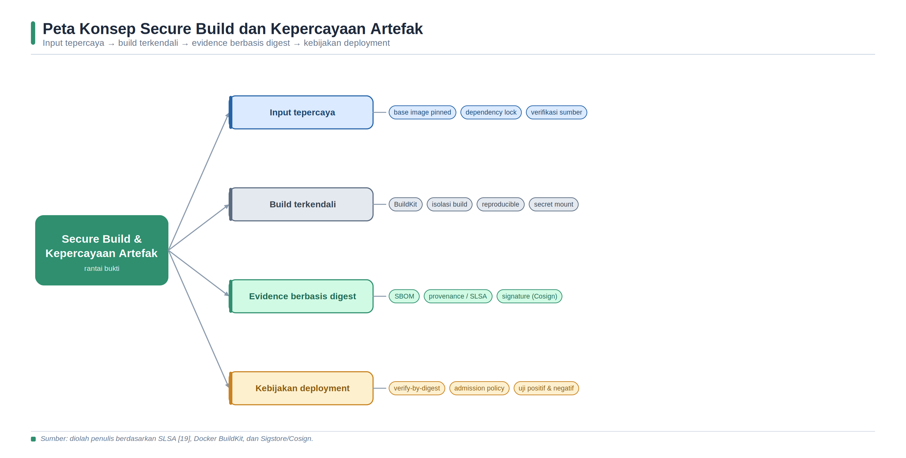
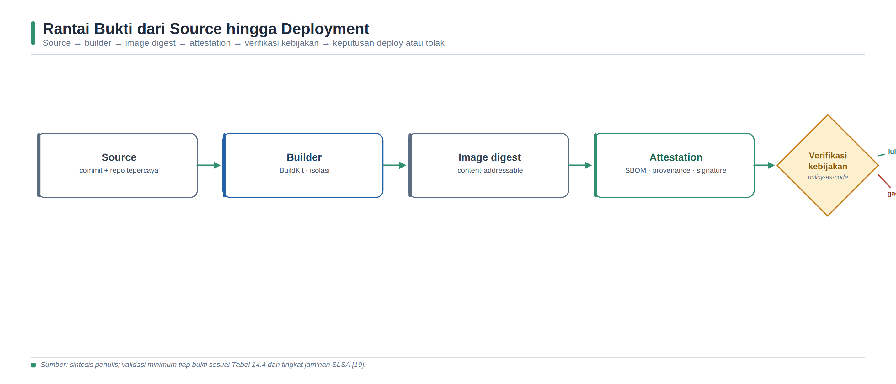

<a id="bab-14"></a>

# Bab 14 — Secure Build, Image Scanning, Signing, dan Provenance

Bab ini membahas keamanan proses build dan kepercayaan terhadap artefak perangkat lunak. Fokusnya bukan sekadar menghasilkan container image, melainkan memastikan bahwa input, builder, konfigurasi, output, metadata, serta keputusan rilis dapat ditelusuri dan diverifikasi. Mahasiswa mempelajari perbedaan tag dan digest, signature dan attestation, provenance dan SBOM, serta hasil vulnerability scan dan kebijakan deployment. Praktikum disusun untuk menunjukkan bahwa kepercayaan dibentuk oleh rangkaian kontrol dan evidence, bukan oleh satu tanda tangan atau satu alat pemindai.

## Tujuan Pembelajaran dan Kompetensi Utama

- Menjelaskan ancaman terhadap source, dependency, builder, cache, secret, registry, signature, dan metadata build.

- Membedakan tag, digest, signature, attestation, provenance, SBOM, vulnerability report, dan verification policy.

- Menerapkan multi-stage build, base image pinning, BuildKit secret mount, least privilege, dan pengurangan attack surface.

- Membangun serta mendorong image dengan SBOM dan provenance attestation menggunakan Docker Buildx.

- Memindai image berdasarkan digest, menandatangani artefak dengan Cosign, dan memverifikasi subjek serta identitas yang diharapkan.

- Melakukan pengujian positif dan negatif untuk membuktikan bahwa verifikasi gagal ketika key, digest, atau kebijakan tidak sesuai.

- Menyusun evidence rilis, analisis residual risk, dan rekomendasi kebijakan deployment yang dapat diaudit.

## Peta Konsep Bab



*Gambar 14. Peta konsep secure build dan kepercayaan artefak.*

> Sumber: sintesis penulis berdasarkan Docker [104-107], SLSA [108], Sigstore [109-110], OCI [111], dan NIST [114].

## Konsep Inti dan Landasan Teori

### Secure Build sebagai Sistem Pengendalian

Build adalah proses yang mentransformasikan source, dependency, konfigurasi, toolchain, dan lingkungan menjadi artefak. Karena transformasi ini memiliki hak untuk membaca input, mengunduh komponen, mengeksekusi skrip, dan menulis output, builder merupakan batas kepercayaan yang kritis. Source yang benar dapat menghasilkan artefak berbahaya apabila runner dikompromikan, dependency diganti, cache diracuni, atau secret bocor ke layer. Sebaliknya, artefak yang tampak bekerja normal belum tentu berasal dari source dan proses yang disetujui. Secure build karena itu mencakup pencegahan, deteksi, keterlacakan, dan verifikasi keluaran.

NIST Secure Software Development Framework menempatkan perlindungan perangkat lunak, produksi software yang terlindungi, respons terhadap vulnerability, dan persiapan organisasi sebagai praktik yang saling berkaitan [80]. NIST SP 800-204D memperluas perhatian pada integrasi strategi keamanan rantai pasok ke dalam CI/CD, termasuk perlindungan source, build, distribusi, dan deployment [114]. Dalam lingkungan DevSecOps, kontrol build perlu diterjemahkan menjadi aturan yang dapat dijalankan: siapa yang boleh memicu build, source revision apa yang digunakan, builder mana yang disetujui, dependency mana yang diizinkan, bagaimana secret diberikan, evidence apa yang harus dihasilkan, dan kondisi apa yang memblokir rilis.

Model ancaman harus memisahkan integritas input, integritas proses, dan integritas output. Integritas input berkaitan dengan commit, dependency, base image, dan konfigurasi. Integritas proses berkaitan dengan runner, builder, network, cache, credential, serta pemisahan tugas. Integritas output berkaitan dengan digest, registry, signature, attestation, serta kebijakan konsumsi. Pemisahan ini mencegah kesimpulan bahwa satu kontrol mencakup semuanya. Pinning digest, misalnya, mengurangi perubahan input yang tidak disengaja, tetapi tidak membuktikan bahwa image yang dipin bebas vulnerability. Signature mengikat pernyataan ke identity atau key, tetapi tidak membuktikan keamanan isi.

| Objek | Pertanyaan yang dijawab | Batas interpretasi |
| --- | --- | --- |
| Tag image | Nama mudah dibaca untuk memilih versi. | Mutable; nama yang sama dapat menunjuk digest berbeda. |
| Digest | Byte atau manifest mana yang dimaksud? | Membuktikan identitas konten, bukan kualitas atau keamanan. |
| Signature | Apakah subjek ditandatangani key/identity yang diverifikasi? | Tidak membuktikan artefak bebas vulnerability. |
| Attestation | Klaim terstruktur apa yang dibuat tentang subjek? | Kebenaran bergantung pada producer, predicate, dan verifikasi. |
| Provenance | Bagaimana, dari input apa, dan oleh builder mana artefak dibuat? | Bukan hasil vulnerability scan atau functional test. |
| SBOM | Komponen apa yang dilaporkan berada pada artefak? | Bukan jaminan completeness dan bukan daftar risiko final. |
| Scan report | Temuan apa yang diketahui scanner pada waktu tertentu? | Bergantung database, konfigurasi, scope, dan triage. |
| Policy | Kondisi evidence dan identity apa yang wajib dipenuhi? | Harus dikelola, diuji negatif, dan ditinjau berkala. |

*Tabel 14.1. Makna dan batas bukti pada secure build.*

### Identitas Artefak: Tag, Descriptor, dan Digest

Open Container Initiative Image Specification mendefinisikan descriptor yang menunjuk konten menggunakan media type, size, dan digest [111]. Digest kriptografis berfungsi sebagai content address: perubahan byte menghasilkan identifier yang berbeda. Saat registry mengembalikan content, konsumen seharusnya memverifikasi kesesuaiannya dengan digest descriptor. Properti ini membuat digest lebih tepat daripada tag untuk mengikat signature, attestation, SBOM, scan report, dan deployment. Tag tetap berguna bagi manusia, tetapi seharusnya diperlakukan sebagai pointer yang dapat berubah.

Pinning base image berdasarkan digest meningkatkan determinisme input dan mencegah tag bergerak tanpa diketahui [105]. Namun, pinning menciptakan kewajiban pemeliharaan: tim harus memonitor pembaruan keamanan dan secara sengaja memperbarui digest setelah pengujian. Menggunakan latest tanpa review membuat build dapat berubah tanpa perubahan source; tidak pernah memperbarui digest membuat komponen usang bertahan. Praktik yang bertanggung jawab menggabungkan pinning, proses pembaruan, vulnerability monitoring, dan regression test. Untuk evidence, catat referensi repository@sha256, bukan hanya repository:tag.

### Builder, Isolasi, Cache, Network, dan Secret

Builder menjalankan instruksi yang berasal dari Dockerfile, package manager, dan skrip dependency. Runner yang permanen dapat menyimpan credential, file kerja, atau state dari build sebelumnya. Runner ephemeral mengurangi persistensi, tetapi tidak otomatis aman apabila image runner, control plane, atau credential issuer dikompromikan. Least privilege membatasi dampak dengan mengurangi hak registry, cloud, repository, dan host. Pemisahan environment build dari production juga penting; builder seharusnya tidak memiliki credential deployment luas hanya karena pipeline berikutnya melakukan rilis.

Cache meningkatkan kinerja, tetapi key cache yang terlalu luas atau cache bersama yang tidak dipercaya dapat memasukkan output yang tidak berasal dari input saat ini. Cache perlu memiliki scope, ownership, dan mekanisme invalidasi yang jelas. Network egress selama build juga perlu dipahami. Build yang dapat mengakses Internet tanpa batas dapat mengunduh dependency yang berubah atau mengekfiltrasi data. Hermetic build secara konseptual memperoleh seluruh input dari sumber yang dideklarasikan dan tidak bergantung pada akses eksternal yang tidak tercatat. Hermeticity berbeda dari reproducibility: build dapat terisolasi tetapi tetap menghasilkan timestamp berbeda; dua build dapat menghasilkan output sama secara kebetulan tanpa membuktikan seluruh input terkontrol.

Secret tidak boleh diberikan melalui Dockerfile ARG atau ENV karena nilai dapat muncul pada history, metadata, cache, atau layer. Docker BuildKit menyediakan secret mount dan SSH mount yang hanya tersedia pada instruksi RUN yang membutuhkan [104]. Aplikasi juga tidak boleh menyalin secret ke output build. Pengujian harus memeriksa history, filesystem image, log pipeline, dan artefak evidence. Secret sintetis digunakan dalam praktikum agar mahasiswa dapat menguji kebocoran tanpa menggunakan credential nyata. Redaksi log tetap diperlukan karena alat dapat menampilkan argument, URL, atau error yang sensitif.

Multi-stage build memisahkan tool kompilasi dari runtime image [105]. Hanya artefak yang diperlukan disalin ke tahap akhir sehingga compiler, package cache, source, dan credential tidak ikut didistribusikan. Base image yang kecil dan tepercaya, .dockerignore, penghapusan paket yang tidak diperlukan, serta user non-root mengurangi attack surface [105]. Kontrol ini tidak berdiri sendiri: image minimal masih dapat rentan; non-root tidak menghilangkan semua privilege; dan multi-stage tidak aman bila perintah COPY secara tidak sengaja memindahkan seluruh workspace ke runtime.

| Ancaman | Kontrol preventif | Evidence dan pengujian |
| --- | --- | --- |
| Source atau dependency diganti | Branch protection, review, lockfile, checksum, pin digest. | Commit, approval, lockfile diff, material pada provenance. |
| Builder/runner dikompromikan | Ephemeral runner, hardening, isolation, least privilege. | Builder identity, image runner, audit log, provenance. |
| Cache poisoning | Scope cache, trusted exporter, cache key berbasis input. | Cache configuration dan rebuild tanpa cache. |
| Secret bocor | BuildKit secret mount, short-lived token, log redaction. | History/layer scan dan pencarian marker sintetis. |
| Output ditukar | Push berdasarkan digest, signature, protected repository. | Digest lokal/registry dan hasil verifikasi. |
| Key disalahgunakan | OIDC/keyless atau key terproteksi, rotation, limited scope. | Expected identity, issuer, key custody, transparency record. |
| Attestation palsu/tidak relevan | Verifikasi signer, subject digest, predicate type, builder. | Policy result dan negative test. |
| Tag dipindahkan | Deploy repository@digest dan monitor mutation. | Manifest digest pada release dan cluster. |

*Tabel 14.2. Ancaman secure build, kontrol, dan evidence.*

### SLSA dan Provenance

Supply-chain Levels for Software Artifacts (SLSA) menyediakan kerangka bertahap untuk meningkatkan jaminan rantai pasok. Spesifikasi SLSA v1.2 berstatus Approved dan memisahkan track agar organisasi dapat menilai properti tertentu secara bertahap [108]. Pada Build Track, provenance merupakan informasi yang dapat diverifikasi mengenai bagaimana artefak diproduksi. Level yang lebih tinggi menuntut provenance yang lebih kuat dan platform build yang memenuhi persyaratan tambahan. SLSA bukan sertifikat universal bahwa aplikasi aman; ia berfokus pada ancaman dan assurance tertentu dalam produksi artefak.

Docker BuildKit dapat menghasilkan provenance attestation yang mencatat metadata seperti sumber, parameter, lingkungan, serta material build [106]. Mode minimal mengurangi informasi yang disertakan dan sesuai untuk banyak penggunaan umum, sedangkan mode yang lebih kaya perlu ditinjau agar build argument atau metadata sensitif tidak dipublikasikan. Attestation BuildKit dibungkus dalam struktur in-toto dan dihubungkan dengan image manifest atau index [106]. in-toto Statement memisahkan subject, predicateType, dan predicate: subject mengikat klaim ke digest artefak, sedangkan predicateType memberi arti pada isi klaim [112]. Verifier harus memeriksa ketiganya, bukan hanya apakah JSON dapat diambil.

| SLSA Build Level | Ringkasan assurance | Implikasi praktis |
| --- | --- | --- |
| L0 | Tidak ada jaminan SLSA yang dinyatakan. | Build tetap dapat berjalan, tetapi evidence belum memenuhi level. |
| L1 | Provenance tersedia untuk artefak. | Konsumen memperoleh informasi asal-usul dasar. |
| L2 | Provenance dihasilkan hosted build platform. | Build service dan provenance memperkuat keterlacakan. |
| L3 | Platform build hardened dan provenance memenuhi persyaratan tertinggi track. | Mengurangi peluang pemalsuan atau manipulasi pada proses build. |

*Tabel 14.3. Ringkasan konseptual SLSA Build Track v1.2.*

> **Catatan akademis: **Klaim level SLSA harus dievaluasi terhadap persyaratan normatif versi spesifikasi yang digunakan. Menjalankan satu perintah provenance tidak otomatis membuat seluruh pipeline mencapai level tertentu.

### Signature, Keyless Identity, dan Kebijakan Verifikasi

Sigstore Cosign mendukung penandatanganan container image dan artefak OCI menggunakan key pair maupun alur keyless [109]. Pada alur key pair, kepercayaan bergantung pada perlindungan private key dan distribusi public key yang benar. Pada alur keyless, sertifikat berumur pendek mengikat public key sementara dengan identity dari OpenID Connect, dan transparency log dapat menyediakan catatan yang dapat diaudit. Keyless mengurangi pengelolaan private key jangka panjang, tetapi verifier tetap harus menetapkan identity dan OIDC issuer yang diharapkan; menerima signature kriptografis tanpa constraint tersebut terlalu permisif [110].

Verification policy menerjemahkan model kepercayaan menjadi syarat eksplisit: repository dan digest yang diperbolehkan, identity atau public key, issuer, workflow/repository source, predicate type, builder identity, serta hasil scan atau test. Policy controller dapat menegakkan aturan sebelum workload diterima pada Kubernetes [115]. Kegagalan pengambilan transparency log, registry, atau identity provider perlu memiliki perilaku yang didefinisikan. Untuk kontrol keamanan, fail-open harus menjadi keputusan risiko yang terdokumentasi, bukan fallback diam-diam.

### SBOM, Vulnerability Report, dan Evidence Rilis

Docker Buildx dapat menghasilkan SBOM attestation pada waktu build [107]. SBOM menyatakan komposisi yang ditemukan generator, sedangkan vulnerability scanner mengorelasikan komponen dengan pengetahuan pada waktu pemindaian. Trivy menegaskan bahwa SBOM bukan scanner; vulnerability, misconfiguration, secret, dan license merupakan kategori scanner yang berbeda [113]. Oleh sebab itu, SBOM yang ditandatangani tidak berarti komponen aman, dan scan tanpa temuan tidak berarti SBOM lengkap. Evidence rilis sebaiknya menyimpan keduanya beserta version tool/database, waktu, parameter, dan digest target.

Rantai bukti yang kuat memiliki referential integrity. Provenance, SBOM, signature, scan report, dan test result harus menunjuk subject digest yang sama. Evidence juga perlu memiliki provenance sendiri: siapa atau sistem apa yang membuatnya, kapan, dengan konfigurasi apa, dan bagaimana integritasnya dilindungi. Retensi disesuaikan dengan kebutuhan audit, incident response, regulasi, dan lifecycle produk. Evidence yang berisi source path, dependency URL privat, username, atau environment variable perlu diklasifikasikan dan dibatasi aksesnya.

| Evidence | Anchor wajib | Validasi minimum | Keputusan yang didukung |
| --- | --- | --- | --- |
| Image manifest | Repository@digest | Pull/inspect dan cocokkan digest. | Objek rilis yang tepat. |
| Signature | Subject digest + signer | Verifikasi key/identity, issuer, dan claim. | Asal penandatangan yang diizinkan. |
| Provenance | Subject + predicateType | Periksa source, builder, material, parameter aman. | Asal-usul dan proses build. |
| SBOM | Subject digest atau artefak immutable | Validasi format, generator, coverage sampel. | Komposisi yang dilaporkan. |
| Scan report | Target digest + waktu/database | Periksa scope, severity, fix, dan triage. | Temuan yang diketahui saat scan. |
| Test result | Commit/digest + environment | Periksa test suite, status, log, dan timestamp. | Perilaku dan kontrol yang diuji. |
| Release decision | Seluruh evidence + policy version | Pastikan approval, exception, owner, expiry. | Deploy, hold, atau reject. |

*Tabel 14.4. Rantai bukti dan validasi minimum.*

## Arsitektur Laboratorium dan Prasyarat Lingkungan



*Gambar 15. Rantai bukti dari source hingga deployment.*

> Sumber: sintesis penulis berdasarkan in-toto [112], SLSA [108], Sigstore [109-110], dan Docker attestations [106-107].

### Prasyarat dan Etika Praktikum

- Docker Engine dan plugin Buildx berfungsi; jq, curl, sha256sum, OpenSSL, Trivy, serta Cosign tersedia atau dijalankan dari image resmi.

- Registry laboratorium berada pada lingkungan yang diotorisasi. Jangan menandatangani atau memindai repository milik pihak lain tanpa izin.

- Gunakan marker secret sintetis. Jangan memasukkan token nyata ke source, shell history, screenshot, atau evidence yang dikumpulkan.

- Private key praktikum disimpan lokal dengan permission minimum dan tidak diunggah ke repository. Untuk produksi, gunakan keyless atau key-management service yang disetujui.

- Catat versi tool, waktu, konfigurasi, dan keterbatasan. Tag latest pada contoh tool perlu diganti dengan versi/digest terverifikasi untuk reproduksibilitas.

## Langkah Praktikum Eksploratif

### Langkah 1 - Menyiapkan Workspace dan Mencatat Versi

```bash
mkdir -p ~/devsecops-lab/ch14/{app,evidence,reports,keys}
cd ~/devsecops-lab/ch14
umask 077

docker version > evidence/docker-version.txt
docker buildx version > evidence/buildx-version.txt
cosign version > evidence/cosign-version.txt
trivy --version > evidence/trivy-version.txt
date -u +%FT%TZ | tee evidence/started-at.txt
```

Apabila Cosign atau Trivy belum tersedia, instal dari rilis resmi dan verifikasi checksum atau signature rilis sesuai dokumentasi proyek. Jangan menyalin binary dari mirror yang tidak dapat diverifikasi. Variabel IMAGE dan registry pada langkah berikut harus disesuaikan dengan namespace laboratorium yang benar-benar dapat diakses.

### Langkah 2 - Membuat Aplikasi dan Lockfile Sederhana

```python
cat > app/requirements.txt <<'EOF'
Flask==3.1.1
gunicorn==23.0.0
EOF

cat > app/app.py <<'EOF'
from flask import Flask, jsonify
app = Flask(__name__)

@app.get("/health")
def health():
    return jsonify(status="ok", chapter=14)
EOF

cat > app/.dockerignore <<'EOF'
.git
__pycache__
*.pyc
.env
keys
evidence
reports
EOF
```

Versi dependency dipasang eksplisit agar resolusi lebih terkendali, tetapi daftar ini belum merupakan lockfile lengkap dengan hash transitif. Pada proyek produksi, gunakan mekanisme lock dan integrity metadata yang sesuai ecosystem. Mahasiswa perlu memeriksa release notes dan vulnerability aktual; nomor versi pada buku adalah objek latihan, bukan rekomendasi versi terbaru untuk produksi.

### Langkah 3 - Membuat Multi-Stage Dockerfile dengan Secret Mount

```dockerfile
cat > app/Dockerfile <<'EOF'
# syntax=docker/dockerfile:1
FROM python:3.13-slim@sha256:GANTI_DENGAN_DIGEST_TERVERIFIKASI AS builder
WORKDIR /build
COPY requirements.txt .
RUN --mount=type=secret,id=lab_token \
    test -s /run/secrets/lab_token && \
    python -m venv /venv && \
    /venv/bin/pip install --no-cache-dir -r requirements.txt

FROM python:3.13-slim@sha256:GANTI_DENGAN_DIGEST_TERVERIFIKASI AS runtime
ENV PATH="/venv/bin:$PATH" PYTHONDONTWRITEBYTECODE=1 PYTHONUNBUFFERED=1
RUN addgroup --system app && adduser --system --ingroup app --uid 10001 app
COPY --from=builder /venv /venv
WORKDIR /app
COPY --chown=app:app app.py .
USER 10001:10001
EXPOSE 8080
CMD ["gunicorn", "--bind=0.0.0.0:8080", "--workers=2", "app:app"]
EOF

# Temukan digest resmi yang disetujui, lalu ganti kedua placeholder.
docker buildx imagetools inspect python:3.13-slim
grep -n 'GANTI_DENGAN_DIGEST' app/Dockerfile
```

Perintah inspect menampilkan manifest dan digest yang tersedia; pilih digest sesuai platform dan kebijakan laboratorium, lalu dokumentasikan sumber serta waktu pemilihannya. Praktikum tidak boleh dilanjutkan dengan placeholder. Pengulangan digest pada kedua tahap memastikan base yang sama, tetapi organisasi dapat menggunakan base berbeda bila kebutuhan runtime dan builder telah ditinjau.

### Langkah 4 - Membangun dan Menguji Ketiadaan Secret

```bash
printf 'LAB_SECRET_MARKER_CH14_%s' "$(openssl rand -hex 8)" > lab-token.txt
export IMAGE="REGISTRY/NAMESPACE/devsecops-lab"
export TAG="14.0"

DOCKER_BUILDKIT=1 docker build \
  --secret id=lab_token,src=lab-token.txt \
  -t "${IMAGE}:${TAG}" app 2>&1 | tee evidence/build.log

docker history --no-trunc "${IMAGE}:${TAG}" > evidence/image-history.txt
if grep -R --binary-files=text -F "$(cat lab-token.txt)" \
     evidence app; then
  echo 'FAIL: marker secret ditemukan pada evidence/workspace'
  exit 1
else
  echo 'PASS: marker tidak ditemukan pada evidence/workspace'
fi | tee evidence/secret-test.txt

docker run --rm "${IMAGE}:${TAG}" id | tee evidence/runtime-identity.txt
docker run --rm -d --name ch14-app -p 18080:8080 "${IMAGE}:${TAG}"
curl -fsS http://127.0.0.1:18080/health | tee evidence/health.json
docker logs ch14-app > evidence/runtime.log 2>&1
docker stop ch14-app
```

Pencarian marker pada workspace belum membuktikan bahwa seluruh layer bebas secret. Lanjutkan dengan pemeriksaan image filesystem menggunakan tool yang disetujui dan pastikan marker tidak pernah dicetak ke log. File lab-token.txt dihapus secara aman setelah percobaan sesuai prosedur laboratorium. Hasil id harus menunjukkan UID/GID non-root, sedangkan health endpoint harus mengembalikan status ok.

### Langkah 5 - Build dan Push dengan Provenance serta SBOM

```bash
# Login registry menggunakan mekanisme resmi; jangan tulis password pada perintah.
docker login REGISTRY

docker buildx build app \
  --secret id=lab_token,src=lab-token.txt \
  --provenance=mode=min \
  --sbom=true \
  --push \
  -t "${IMAGE}:${TAG}" \
  2>&1 | tee evidence/buildx-push.log

docker buildx imagetools inspect "${IMAGE}:${TAG}" \
  | tee evidence/registry-manifest.txt

docker pull "${IMAGE}:${TAG}"
export IMAGE_REF="$(docker image inspect "${IMAGE}:${TAG}" \
  --format '{{index .RepoDigests 0}}')"
test -n "$IMAGE_REF"
printf '%s\n' "$IMAGE_REF" | tee evidence/image-ref.txt
```

Attestation pada image store lokal klasik dapat tidak dipertahankan; registry mendukung penyimpanan manifest dan attestation secara lebih tepat [106-107]. IMAGE_REF harus berbentuk repository@sha256:..., bukan tag. Untuk multi-platform index, bedakan digest index dan digest manifest platform. Seluruh langkah scan, sign, attest, dan verify berikutnya menggunakan referensi immutable yang sama.

### Langkah 6 - Memindai Image Berdasarkan Digest

```bash
trivy image --scanners vuln,misconfig,secret \
  --format json --output reports/trivy-image.json "$IMAGE_REF"

trivy image --severity CRITICAL,HIGH --exit-code 1 "$IMAGE_REF" \
  > evidence/trivy-gate.txt 2>&1 || echo $? > evidence/trivy-gate-exit.txt

jq '[.Results[]?.Vulnerabilities[]?] | length' reports/trivy-image.json \
  | tee evidence/vulnerability-count.txt
sha256sum reports/trivy-image.json | tee evidence/report-sha256.txt
date -u +%FT%TZ | tee evidence/scanned-at.txt
```

Exit code pemindai adalah sinyal kebijakan, bukan kesimpulan otomatis bahwa release harus dibatalkan. Temuan perlu divalidasi terhadap package, affected range, fixed version, exposure, dan exception yang masih berlaku. Simpan report asli serta ringkasan terpisah. Jika database diperbarui, scan berikutnya dapat berubah walaupun IMAGE_REF sama; perubahan tersebut harus diklasifikasikan sebagai intelligence delta.

### Langkah 7 - Membuat Key Praktikum dan Menandatangani Digest

```bash
read -rsp 'Passphrase key praktikum: ' COSIGN_PASSWORD
echo
export COSIGN_PASSWORD
cosign generate-key-pair --output-key-prefix keys/ch14
chmod 600 keys/ch14.key

cosign sign --yes --key keys/ch14.key "$IMAGE_REF"
cosign verify --key keys/ch14.pub "$IMAGE_REF" \
  | tee evidence/cosign-verify.json

unset COSIGN_PASSWORD
sha256sum keys/ch14.pub | tee evidence/public-key-sha256.txt
```

Private key tidak dimasukkan ke evidence atau repository. Public key dapat didistribusikan bersama fingerprint melalui kanal tepercaya. Pada pipeline produksi, pertimbangkan keyless signing dengan workload identity atau KMS. Jika keyless digunakan, verifikasi harus membatasi certificate identity dan OIDC issuer yang tepat [110]; contoh constraint tidak boleh diganti dengan wildcard luas hanya agar verifikasi lulus.

### Langkah 8 - Memverifikasi Attestation dan Subject

```bash
cosign verify-attestation --type slsaprovenance \
  --key keys/ch14.pub "$IMAGE_REF" \
  > evidence/provenance-verification.json || true

# Inspect attestation yang dihasilkan Buildx sesuai registry/tool yang digunakan.
docker buildx imagetools inspect "$IMAGE_REF" \
  --format '{{json .Provenance.SLSA}}' \
  > evidence/provenance-inspect.json || true

jq -e 'type == "object" or type == "array"' \
  evidence/provenance-inspect.json
grep -F "${IMAGE_REF#*@}" evidence/provenance-inspect.json \
  | tee evidence/provenance-subject-check.txt
```

Cara mengambil attestation dapat berbeda menurut versi Buildx, registry, media type, dan apakah provenance ditandatangani oleh Cosign. Kegagalan cosign verify-attestation pada blok di atas tidak boleh diabaikan dalam laporan; operator harus membedakan attestation BuildKit yang tersedia tetapi belum ditandatangani oleh key praktikum dari attestation yang memang diverifikasi dengan key tersebut. Catat predicateType, subject digest, builder identity, source, dan material yang benar-benar terlihat. Jangan mengklaim field yang tidak tersedia.

### Langkah 9 - Pengujian Negatif dan Policy Gate

```bash
COSIGN_PASSWORD='synthetic-passphrase-only' \
  cosign generate-key-pair --output-key-prefix keys/wrong

if cosign verify --key keys/wrong.pub "$IMAGE_REF" \
     > evidence/wrong-key.txt 2>&1; then
  echo 'FAIL: verifikasi dengan key salah justru berhasil' | tee -a evidence/wrong-key.txt
  exit 1
else
  echo 'PASS: key salah ditolak' | tee -a evidence/wrong-key.txt
fi

cp evidence/image-ref.txt evidence/release-subject.txt
test "$(cat evidence/release-subject.txt)" = "$IMAGE_REF"
test "$(docker image inspect "${IMAGE}:${TAG}" \
  --format '{{index .RepoDigests 0}}')" = "$IMAGE_REF"

sha256sum evidence/* reports/* | sort > evidence/SHA256SUMS.txt
```

Negative test membuktikan bahwa verifier tidak sekadar menerima format signature. Tambahkan uji untuk image unsigned, digest berbeda, identity/issuer salah pada mode keyless, dan predicate type yang tidak diizinkan. Gate minimum untuk laboratorium adalah: digest cocok, signature dari key yang diharapkan valid, runtime non-root, health test lulus, secret marker tidak ditemukan, serta finding melewati kebijakan atau memiliki exception yang sah. Kegagalan salah satu kontrol wajib menghasilkan hold atau reject yang dapat ditelusuri.

## Verifikasi dan Skenario Pengujian

| ID | Pengujian | Kondisi PASS | Evidence |
| --- | --- | --- | --- |
| TEST-14-01 | Base dan subject immutable | Base dipin digest; release menggunakan repository@digest. | Dockerfile, manifest, image-ref.txt. |
| TEST-14-02 | Secret isolation | Marker tidak ada pada log, history, workspace evidence, atau image. | secret-test, history, filesystem scan. |
| TEST-14-03 | Runtime minimum | Aplikasi berjalan non-root dan health endpoint lulus. | runtime-identity, health.json, log. |
| TEST-14-04 | Scan terikat digest | Report menyebut target digest dan metadata tool/waktu tercatat. | Trivy report, version, scanned-at. |
| TEST-14-05 | Signature valid | Key/identity dan subject yang diharapkan lolos verifikasi. | cosign-verify.json, fingerprint. |
| TEST-14-06 | Negative verification | Wrong key/identity, unsigned image, atau digest berbeda ditolak. | Exit code dan negative-test log. |
| TEST-14-07 | Provenance relevan | Subject, predicateType, source/builder/material diperiksa. | Provenance inspect/verify. |
| TEST-14-08 | Evidence integrity | Checksum dan relasi ke commit/digest konsisten. | SHA256SUMS dan release-subject. |
| TEST-14-09 | Policy decision | PASS, HOLD, atau REJECT memiliki alasan, owner, dan exception/expiry. | Release decision record. |

*Tabel 14.5. Skenario pengujian dan evidence Bab 14.*

## Analisis Hasil

Analisis pertama menilai determinisme dan identitas input. Base image yang dipin digest mengurangi drift, tetapi mahasiswa harus menunjukkan mekanisme pembaruan. Bandingkan build normal dan rebuild tanpa cache. Apabila digest output berbeda, telusuri timestamp, urutan file, dependency download, metadata, platform, dan versi builder. Perbedaan output tidak otomatis menunjukkan serangan, tetapi membatasi reproducibility dan perlu dijelaskan. Provenance membantu menunjukkan input serta environment yang direkam, bukan menggantikan analisis penyebab.

Analisis kedua menilai isolasi secret dan builder. Keberhasilan build tidak cukup; periksa apakah marker muncul pada log, history, filesystem, cache, atau metadata. Jika marker ditemukan, anggap secret terekspos, hentikan penggunaan credential yang setara, perbaiki Dockerfile, dan ulangi build dengan digest baru. Multi-stage build serta secret mount menurunkan peluang kebocoran, tetapi perintah pada builder masih dapat mencetak atau menyalin secret. Karena itu, test aktif lebih kuat daripada asumsi desain.

Analisis ketiga memeriksa konsistensi subject. Signature, provenance, SBOM, vulnerability report, health test, dan keputusan rilis harus merujuk digest yang sama. Bila tag dipindahkan setelah scan, scan lama tetap sah untuk digest lama tetapi tidak dapat digunakan untuk artefak baru. Perbedaan index digest dan platform manifest digest juga perlu disebutkan. Kesalahan memilih subject dapat menghasilkan evidence yang masing-masing valid secara teknis namun tidak relevan terhadap workload yang dideploy.

Analisis keempat menilai trust policy. Signature yang valid hanya membuktikan bahwa private key terkait digunakan, atau bahwa identity tertentu memperoleh sertifikat dan menandatangani. Reviewer masih harus memutuskan apakah identity, issuer, repository, workflow, dan waktu tersebut diizinkan. Wrong-key test menunjukkan enforcement dasar. Pada keyless mode, negative test untuk issuer dan identity lebih penting daripada sekadar mengulang positive verify. Policy harus gagal secara aman dan menyediakan log yang dapat dipahami operator.

Analisis kelima menilai hubungan SBOM, scan, dan keputusan risiko. SBOM memberi inventaris, sedangkan Trivy menambahkan pengetahuan vulnerability, misconfiguration, dan secret pada waktu tertentu. Finding kritis perlu divalidasi; zero finding perlu dibaca bersama coverage, database age, dan scope. Exception harus memiliki alasan, owner, compensating control, expiry, serta rencana remediasi. Menandatangani image dengan finding yang diterima tidak menyembunyikan risiko; signature hanya membuat asal dan subject keputusan dapat ditelusuri.

Analisis keenam membahas residual risk. Secure build mengurangi kemungkinan manipulasi dan meningkatkan kemampuan investigasi, tetapi tidak menghilangkan vulnerability logika aplikasi, compromise pada identity provider, malicious maintainer, kelemahan cryptographic algorithm di masa depan, atau kesalahan konfigurasi deployment. Kesimpulan laporan harus menyebut kontrol yang diuji, kontrol yang hanya diasumsikan, keterbatasan laboratorium, dan pekerjaan berikutnya. Bahasa seperti “terverifikasi sesuai policy versi X untuk digest Y” lebih dapat dipertanggungjawabkan daripada “image terbukti aman”.

| Dimensi review | Indikator kuat | Indikator lemah |
| --- | --- | --- |
| Input | Commit, lockfile, base digest, dan update process tercatat. | Mengandalkan tag mutable dan dependency tanpa integritas. |
| Builder | Identity, isolation, privilege, cache, network, secret diuji. | Runner dianggap tepercaya tanpa scope atau evidence. |
| Subject | Semua evidence menunjuk digest yang sama. | Evidence hanya menyebut tag atau nama file. |
| Signature | Expected key/identity/issuer diverifikasi; negative test gagal aman. | Verifikasi tanpa constraint atau hanya screenshot sukses. |
| Attestation | Predicate, subject, builder, source, dan material diperiksa. | JSON tersedia dianggap otomatis benar dan relevan. |
| Scanning | Tool/database, waktu, scope, triage, dan exception jelas. | Jumlah CVE disalin tanpa validasi. |
| Decision | Policy version, owner, approval, expiry, residual risk tercatat. | Rilis dilakukan karena pipeline berwarna hijau. |

*Tabel 14.6. Rubrik analisis secure build dan kepercayaan artefak.*

## Troubleshooting dan Analisis Hasil

| Gejala | Penyebab yang mungkin | Tindakan korektif |
| --- | --- | --- |
| BuildKit secret tidak ditemukan | Syntax directive, BuildKit, id, atau path secret salah. | Periksa # syntax, DOCKER_BUILDKIT, --secret, permission, dan id mount. |
| Buildx push gagal | Login, namespace, TLS, proxy, atau hak registry tidak sesuai. | Uji docker login/push pada registry lab; periksa CA dan permission. |
| Attestation hilang setelah --load | Image store lokal klasik tidak mempertahankan attestation. | Gunakan --push ke registry yang mendukung atau image store containerd. |
| Digest yang diperiksa berbeda | Tag berpindah, multi-platform index, atau registry mirror. | Gunakan RepoDigests; bedakan index/manifest; ulangi inspect registry. |
| Cosign signature tidak ditemukan | Image belum ditandatangani, repository salah, atau registry menolak referrer. | Periksa IMAGE_REF, hak registry, media type, dan hasil cosign sign. |
| Cosign verify gagal | Public key, identity, issuer, claim, atau subject tidak cocok. | Jangan longgarkan policy; verifikasi fingerprint dan expected constraint. |
| Provenance verify gagal | Attestation BuildKit tidak ditandatangani key Cosign atau type berbeda. | Inspect attestation; identifikasi signer/predicate; sign attestation bila diwajibkan. |
| Trivy hasil berubah | Database/advisory, scanner version, atau policy berubah. | Pastikan digest sama; rekam DB/tool time; klasifikasikan intelligence delta. |
| Marker secret muncul | Perintah mencetak/menyalin secret atau evidence menangkapnya. | Rotasi credential ekuivalen, hapus log terpapar, perbaiki build, buat digest baru. |
| Gate selalu lulus | Exit code diabaikan, wildcard identity, atau fail-open. | Uji wrong key/digest/issuer; periksa shell set -e dan policy enforcement. |
| Image gagal saat non-root | Permission file, port, atau direktori runtime tidak sesuai. | Perbaiki ownership saat COPY; gunakan port non-privileged; uji filesystem. |

*Tabel 14.7. Troubleshooting praktikum Bab 14.*

## Kesimpulan

Secure build adalah sistem pengendalian yang menghubungkan input tepercaya, builder yang dibatasi, artefak berbasis digest, evidence terstruktur, dan verification policy. Tag membantu penamaan tetapi digest mengikat objek. Signature membuktikan hubungan dengan key atau identity yang diverifikasi; provenance menjelaskan proses build; SBOM menjelaskan komposisi; scan report mencatat temuan pada waktu tertentu. Keempatnya memiliki fungsi berbeda dan harus merujuk subject yang sama.

Praktikum dinyatakan berhasil apabila mahasiswa dapat membangun image minimal non-root tanpa kebocoran secret, menghasilkan dan memeriksa provenance serta SBOM, memindai dan menandatangani digest, menjalankan positive dan negative verification, serta menghasilkan keputusan rilis yang memiliki evidence. Klaim akhir harus proporsional: pipeline dapat membuktikan bahwa policy tertentu dipenuhi untuk artefak tertentu, bukan bahwa perangkat lunak aman secara mutlak.

## Evaluasi dan Latihan Mandiri

- Mengapa repository:tag tidak cukup sebagai anchor untuk signature, SBOM, dan hasil scan?

- Apa perbedaan fungsi signature, attestation, provenance, SBOM, dan vulnerability report?

- Mengapa signature valid belum membuktikan bahwa signer diizinkan atau artefak aman?

- Bagaimana BuildKit secret mount mengurangi risiko dibanding ARG/ENV, dan risiko apa yang masih tersisa?

- Apa perbedaan hermeticity, repeatability, reproducibility, dan traceability?

- Mengapa penggunaan base image berdasarkan digest tetap memerlukan proses pembaruan?

- Field apa yang harus diverifikasi pada in-toto Statement agar attestation relevan terhadap artefak?

- Mengapa Buildx attestation dapat hilang ketika image dimuat ke image store lokal klasik?

- Bagaimana membedakan perubahan artefak dari perubahan intelijen vulnerability?

- Negative test apa yang membuktikan bahwa deployment gate benar-benar menolak evidence yang salah?

## Format Laporan Praktikum

Laporan Bab 14 menggunakan bahasa formal akademis dan maksimum 14 halaman di luar lampiran evidence. Data harus sintetis atau telah diotorisasi. Laporan minimum memuat:

- Tujuan, scope, model ancaman, asumsi kepercayaan, arsitektur pipeline, dan identitas registry/builder.

- Commit, base digest, dependency/lock metadata, versi tool, waktu, parameter, dan konfigurasi build.

- Dockerfile multi-stage, penggunaan secret sintetis, hasil pemeriksaan history/layer, serta runtime non-root.

- Image digest, provenance, SBOM, signature, vulnerability report, dan hubungan subject antarbukti.

- Positive dan negative verification beserta exit code, log, expected identity/key/issuer, dan interpretasi.

- Analisis finding, exception bila ada, policy version, keputusan PASS/HOLD/REJECT, owner, dan expiry.

- Checksum evidence, keterbatasan, residual risk, troubleshooting, kesimpulan, dan rekomendasi.
