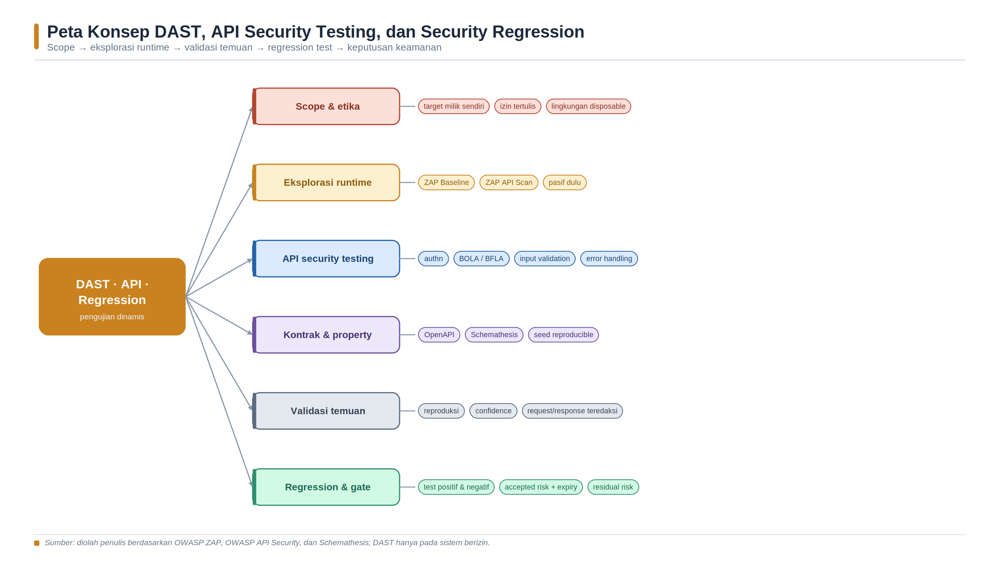
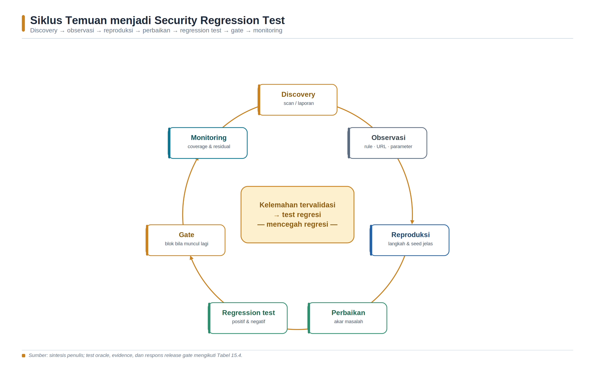

<a id="bab-15"></a>

# Bab 15 — DAST, API Security Testing, dan Security Regression

Bab ini membahas Dynamic Application Security Testing (DAST), pengujian keamanan API, dan security regression sebagai satu rangkaian pembelajaran. Mahasiswa mengamati aplikasi yang sedang berjalan, menentukan scope, membangun coverage, menguji perilaku HTTP dan kontrol akses, memvalidasi alert, memperbaiki akar masalah, lalu mengubah temuan terverifikasi menjadi test yang dapat dijalankan ulang. Seluruh aktivitas aktif hanya dilakukan terhadap target lokal yang sengaja disediakan untuk praktikum atau sistem yang memiliki izin tertulis.

## Tujuan Pembelajaran dan Kompetensi Utama

- Membedakan passive scan, active scan, authenticated scan, API schema testing, property-based testing, dan security regression test.

- Menjelaskan hubungan scope, endpoint coverage, role coverage, data coverage, state, test oracle, serta confidence temuan.

- Menggunakan OWASP WSTG, ASVS, dan API Security Top 10 sebagai acuan pengujian tanpa menganggapnya sebagai checklist yang otomatis lengkap.

- Menjalankan ZAP Baseline dan ZAP API Scan secara aman pada jaringan Docker lokal serta menyimpan evidence yang dapat direproduksi.

- Menguji autentikasi, object-level authorization, function-level authorization, property exposure, input validation, dan error handling.

- Menggunakan OpenAPI dan Schemathesis untuk contract serta property-based testing dengan seed yang dapat direproduksi.

- Mengubah kelemahan yang telah divalidasi menjadi regression test positif dan negatif serta release gate berbasis risiko.

## Peta Konsep Bab



*Gambar 16. Peta konsep DAST, API security testing, dan security regression.*

> Sumber: sintesis penulis berdasarkan OWASP WSTG [116], ASVS [117], API Security Top 10 [118], dan ZAP [119-124].

## Konsep Inti dan Landasan Teori

### DAST dan Posisi Pengujian Dinamis

DAST menguji aplikasi dalam keadaan berjalan dari antarmuka yang dapat dijangkau penguji. Berbeda dari SAST yang menganalisis representasi source atau binary, DAST mengamati perilaku nyata yang muncul dari kombinasi kode, framework, reverse proxy, middleware, konfigurasi, dependency, data, dan runtime. Kelebihan utamanya adalah kemampuan melihat respons aktual, header, status code, redirect, cookie, error, serta efek kontrol keamanan pada sistem terintegrasi. Keterbatasannya adalah visibilitas internal rendah: scanner mengetahui request dan response, tetapi belum tentu mengetahui cabang kode, query, atau kontrol yang tidak pernah tercapai.

OWASP Web Security Testing Guide menyediakan kerangka pengujian aplikasi web dan web service, sedangkan OWASP ASVS menyediakan requirement verifikasi teknis yang dapat digunakan untuk menentukan harapan kontrol [116-117]. Keduanya memiliki fungsi berbeda. WSTG membantu menyusun bagaimana pengujian dilakukan; ASVS membantu menyatakan kontrol apa yang harus dipenuhi. Penguji tetap harus menyesuaikan scope, arsitektur, threat model, data classification, dan risiko bisnis. Menjalankan seluruh rule scanner tidak menjamin seluruh requirement telah diuji.

NIST SP 800-115 menekankan perencanaan, pelaksanaan, analisis temuan, dan strategi mitigasi dalam technical security testing [128]. Sebelum scan, tim perlu menetapkan authorization, target, waktu, sumber request, rate, data uji, stop condition, penanggung jawab, dan prosedur pemulihan. Pengujian aktif dapat mengubah data, memicu notifikasi, membebani service, atau memengaruhi pengguna. Karena itu, target produksi tidak boleh diasumsikan aman untuk active scan hanya karena alat disebut automated.

| Pendekatan | Aktivitas utama | Kekuatan | Batas penting |
| --- | --- | --- | --- |
| Passive scan | Menganalisis traffic tanpa payload serangan tambahan. | Cepat dan relatif aman untuk baseline. | Hanya melihat traffic yang benar-benar lewat. |
| Active scan | Mengirim payload untuk memicu perilaku rentan. | Menemukan sebagian kelemahan runtime. | Dapat mengubah data atau membebani target. |
| API schema scan | Mengimpor OpenAPI/SOAP/GraphQL lalu menguji operasi. | Coverage endpoint lebih terstruktur. | Schema usang menghasilkan blind spot. |
| Authenticated scan | Menjelajah sebagai user/role tertentu. | Melihat area yang tidak publik. | Login berhasil belum membuktikan state tetap valid. |
| Property-based test | Menghasilkan banyak input dari kontrak dan properti. | Menemukan edge case yang tidak dirancang manual. | Oracle dan constraint harus benar. |
| Regression test | Menjalankan ulang kondisi kelemahan yang pernah ditemukan. | Cepat, deterministik, dekat dengan root cause. | Tidak menggantikan eksplorasi temuan baru. |

*Tabel 15.1. Perbandingan pendekatan pengujian dinamis.*

### Passive Scan, Active Scan, dan Batas Keselamatan

ZAP Baseline menjalankan spider untuk waktu terbatas, menunggu passive scan selesai, lalu menghasilkan laporan; skrip tersebut tidak melakukan serangan aktif [119]. Passive scanner menilai pesan HTTP yang sudah dikunjungi, misalnya header keamanan, cookie, cache control, atau informasi yang terpapar. Apabila spider tidak mencapai endpoint administratif, API tersembunyi, alur JavaScript, atau fungsi setelah login, passive scan juga tidak menilainya. Oleh sebab itu, zero alert pada baseline harus dibaca sebagai hasil pada traffic yang tercakup, bukan bukti ketiadaan vulnerability.

Active scan mengirim payload yang sengaja dirancang untuk menguji perilaku target. Dokumentasi ZAP memperingatkan bahwa active scanner menyerang aplikasi dan hanya boleh digunakan pada target yang memiliki izin [122]. Intensitas perlu dibatasi melalui scan policy, input vector, jumlah thread, durasi rule, durasi scan, dan scope. Stop condition harus tersedia jika error rate, latency, CPU, atau efek data melebihi ambang. Pada laboratorium, target dipisahkan dalam network Docker lokal dan port dipublikasikan hanya ke loopback host.

ZAP Automation Framework memungkinkan environment, context, spider, passive scan, active scan, test, report, dan exit status dinyatakan sebagai YAML [121]. Pendekatan deklaratif meningkatkan reproduksibilitas, tetapi konfigurasi tetap harus ditinjau. Exit code memberi sinyal bahwa plan memiliki error atau warning; exitStatus job dapat memetakan risk level ke nilai keluar [121]. Gate yang langsung memblokir semua warning sering menghasilkan noise. Gate yang mengabaikan seluruh warning juga lemah. Tim memerlukan baseline, risk acceptance, expiry, dan aturan untuk finding baru atau finding yang meningkat.

### HTTP, Test Oracle, dan Evidence

HTTP adalah protokol request/response stateless dengan semantics method, status code, field, dan content yang didefinisikan dalam RFC 9110 [126]. Test keamanan tidak boleh hanya memeriksa bahwa respons bukan 500. Sebuah operasi GET diharapkan aman dan idempotent secara semantics, tetapi aplikasi masih dapat menulis audit log atau memperbarui cache. Status 200 dapat tetap salah jika user menerima data milik orang lain; status 403 dapat salah jika body membocorkan detail sensitif. Test oracle adalah aturan yang menentukan hasil benar atau salah dengan mempertimbangkan status, header, schema, body, side effect, identity, role, dan state.

Evidence yang baik menghubungkan hasil dengan target immutable sejauh mungkin: versi aplikasi, image digest, commit, konfigurasi, waktu, account/role sintetis, endpoint, method, request yang telah diredaksi, response relevan, rule ID, versi scanner/add-on, serta exit code. Credential, token, cookie, personal data, dan secret tidak boleh disimpan mentah. Request/response lengkap hanya disimpan bila dibutuhkan dan diakses terbatas. Screenshot tanpa request, state, dan versi alat sulit direproduksi.

| Dimensi coverage | Pertanyaan pengujian | Evidence yang layak |
| --- | --- | --- |
| Endpoint dan method | Apakah seluruh operasi terdokumentasi dan endpoint aktual tercakup? | Daftar OpenAPI, sites tree, access log, method matrix. |
| Identity dan role | Apakah anonymous, user A, user B, operator, dan admin diuji? | Account sintetis, role matrix, auth statistics. |
| Object dan tenant | Apakah object milik sendiri, orang lain, dan tenant lain diuji? | Object ID sintetis serta expected allow/deny. |
| Input dan content type | Apakah boundary, null, tipe salah, ukuran, encoding, dan media type diuji? | Generated cases, seed, request summary. |
| State dan sequence | Apakah create-read-update-delete serta urutan tidak sah diuji? | State transition dan cleanup log. |
| Error dan limit | Apakah error aman, rate limit, timeout, dan resource cap diuji? | Status, latency, retry, resource metrics. |
| Client/runtime | Apakah JavaScript, proxy, cookie, CORS, dan TLS relevan tercakup? | Browser/AJAX spider log dan konfigurasi. |

*Tabel 15.2. Dimensi coverage DAST dan API security testing.*

### API sebagai Attack Surface Terstruktur

OpenAPI Specification menyediakan deskripsi machine-readable mengenai endpoint, operation, parameter, request body, response, dan security scheme [125]. ZAP API Scan dapat mengimpor OpenAPI, SOAP, atau GraphQL dan menjalankan active scan yang disesuaikan untuk API [120]. Schema membantu discovery, tetapi bukan sumber kebenaran tunggal. Endpoint lama, versi bayangan, method tidak terdokumentasi, atau route yang diaktifkan konfigurasi dapat tidak tercantum. Sebaliknya, schema dapat memuat operation yang belum tersedia. Bandingkan kontrak dengan routing, gateway inventory, telemetry, dan traffic terotorisasi.

OWASP API Security Top 10 2023 menyoroti Broken Object Level Authorization, Broken Authentication, Broken Object Property Level Authorization, Unrestricted Resource Consumption, Broken Function Level Authorization, Unrestricted Access to Sensitive Business Flows, SSRF, Security Misconfiguration, Improper Inventory Management, dan Unsafe Consumption of APIs [118]. Daftar ini merupakan awareness document, bukan test plan lengkap. Risiko business logic, race condition, multi-tenant isolation, privacy, dan domain-specific abuse memerlukan skenario tambahan.

BOLA terjadi ketika user yang sah dapat memanipulasi object identifier dan mengakses object yang tidak diizinkan. BFLA terjadi ketika user dapat memanggil fungsi atau level privilege yang tidak diizinkan. Keduanya sering tidak ditemukan oleh generic active scanner karena scanner tidak memahami kepemilikan object dan matriks role. Pengujian memerlukan setidaknya dua identity, data yang kepemilikannya diketahui, dan oracle yang membedakan allow serta deny [129]. Random ID yang menghasilkan 404 tidak membuktikan authorization benar; penguji harus menggunakan object nyata milik identity lain dalam lingkungan uji.

| Kategori API 2023 | Fokus test yang mudah dipahami | Contoh oracle |
| --- | --- | --- |
| API1 BOLA | Ganti object ID antara user A dan B. | Object user lain ditolak tanpa kebocoran data. |
| API2 Authentication | Token hilang, rusak, kedaluwarsa, atau salah audience. | Request ditolak konsisten; session tidak tetap aktif. |
| API3 Property Authorization | Tambah field privileged atau periksa field sensitif response. | Field tidak boleh ditulis/dibaca oleh role tersebut. |
| API4 Resource Consumption | Ukuran, pagination, concurrency, dan timeout terkontrol. | Limit diterapkan tanpa mengganggu service. |
| API5 Function Authorization | User biasa memanggil endpoint admin/operator. | Fungsi ditolak server-side. |
| API6 Sensitive Flow | Ulangi transaksi bisnis melebihi aturan. | Rate/business rule mencegah abuse. |
| API7 SSRF | Gunakan tujuan sintetis yang dikendalikan lab. | Server menolak destination yang tidak diizinkan. |
| API8 Misconfiguration | Method, CORS, debug, header, error, dan TLS. | Konfigurasi sesuai baseline. |
| API9 Inventory | Bandingkan route, versi, dokumentasi, gateway, dan log. | Endpoint tidak terkelola diidentifikasi. |
| API10 Unsafe Consumption | Simulasikan upstream lambat, salah schema, atau tidak tepercaya. | Validasi, timeout, dan trust boundary bekerja. |

*Tabel 15.3. Pemetaan ringkas OWASP API Security Top 10 2023 ke test oracle.*

### Autentikasi, Otorisasi, dan State

Authenticated scan bukan sekadar memasukkan username dan password. Scanner perlu mengetahui login request, session management, indikator logged-in/logged-out, logout, token refresh, anti-CSRF, redirect, dan role. ZAP Authentication Helper dapat membantu mendeteksi serta menyiapkan authentication handling, sementara authentication statistics dapat digunakan untuk memeriksa apakah state berjalan sesuai harapan [123]. Jika session kedaluwarsa di tengah scan, hasil dapat terlihat bersih karena seluruh request diam-diam kembali ke login page.

Otorisasi diuji sebagai matriks subject-action-object-context. Subject adalah identity atau role; action adalah method atau fungsi; object adalah resource; context mencakup tenant, waktu, status transaksi, dan ownership. Test positif memastikan akses yang sah tetap bekerja. Test negatif memastikan akses yang tidak sah ditolak. Hanya negative test dapat menghasilkan sistem yang aman tetapi tidak dapat digunakan; hanya positive test dapat melewatkan privilege escalation. Keduanya harus dipasangkan.

### Property-Based, Stateful, dan Contract Testing

Schemathesis menghasilkan case dari OpenAPI atau GraphQL dan memeriksa properti seperti status-code conformance, response schema, dan server error [127]. Property-based testing mengeksplorasi banyak kombinasi input serta dapat mengecilkan failure menjadi contoh minimal. Seed perlu disimpan untuk reproduksi. Namun, schema yang salah menghasilkan test yang salah. Jika kontrak menyatakan field sensitif boleh dikembalikan, conformance test dapat lulus meskipun desain tidak aman. Karena itu, contract test harus dilengkapi requirement keamanan dan abuse case.

Stateful testing merangkai operation dengan data nyata dari response sebelumnya, misalnya create lalu read, update, dan delete [127]. Pendekatan ini lebih sesuai untuk API dibanding menguji setiap endpoint dengan ID acak. Sequence juga perlu mencakup transisi yang tidak sah, seperti update setelah delete, approve tanpa role, atau replay transaksi. Cleanup harus dipastikan agar data uji tidak menumpuk. Pada pipeline, case yang nondeterministic dipisahkan dari flaky infrastructure dan vulnerability yang dapat direproduksi.

### Security Regression dan Kebijakan Gate

Security regression test adalah test otomatis yang memastikan weakness yang telah diperbaiki tidak muncul kembali. Test sebaiknya ditempatkan sedekat mungkin dengan akar masalah: unit test untuk fungsi authorization, integration test untuk middleware dan database policy, API test untuk role-object behavior, serta DAST untuk konfigurasi dan perilaku runtime. Pemindaian ulang scanner berguna, tetapi rule, add-on, crawling, dan database dapat berubah. Test khusus yang sederhana sering lebih stabil untuk mencegah regresi yang sudah dikenal.

Baseline bukan daftar finding yang selamanya diterima. Baseline menyimpan keadaan yang telah ditinjau pada versi tertentu. Finding baru, severity meningkat, endpoint baru tanpa test, atau exception kedaluwarsa dapat memblokir rilis. Alert filter ZAP dapat mengubah risk level berdasarkan context [124], tetapi filter harus memiliki alasan, scope, owner, dan expiry. Menurunkan seluruh alert agar pipeline hijau merupakan kegagalan tata kelola. Gate yang baik memisahkan tool error, coverage failure, confirmed vulnerability, accepted risk, dan informational observation.

| Objek keputusan | Oracle minimum | Evidence | Respons |
| --- | --- | --- | --- |
| Coverage | Endpoint/role wajib dikunjungi dan auth tetap valid. | Sites tree, access log, auth statistics. | Fail bila coverage minimum tidak tercapai. |
| Scanner health | Plan selesai; report dapat diparsing; add-on/version tercatat. | Exit code, log, report checksum. | Fail sebagai tool error, bukan vulnerability. |
| Finding baru | Rule, URL, parameter, confidence, dan reproduksi jelas. | Request/response teredaksi dan langkah uji. | Triage lalu fix, hold, atau exception. |
| Regression | Test positive dan negative menghasilkan status yang diharapkan. | Test output dan commit/image digest. | Blok bila kelemahan muncul kembali. |
| Accepted risk | Scope, alasan, kontrol, owner, dan expiry sah. | Risk register dan approval. | Izinkan sementara; tinjau saat expiry. |
| Residual risk | Batas coverage dan risiko tersisa dinyatakan. | Analisis dan rekomendasi. | Monitor atau tambah pengujian. |

*Tabel 15.4. Test oracle, evidence, dan respons release gate.*

## Siklus Temuan dan Umpan Balik



*Gambar 17. Siklus temuan menjadi security regression test.*

> Sumber: sintesis penulis berdasarkan NIST SP 800-115 [128], OWASP WSTG [116], dan OWASP Authorization Testing [129].

### Prasyarat dan Etika Praktikum

- Gunakan target lokal yang sengaja dibuat untuk Bab 15. Jangan mengganti TARGET dengan domain publik atau alamat organisasi tanpa izin tertulis.

- Docker Engine, Docker Compose, curl, jq, pytest, dan Python tersedia. Image ZAP serta tool lain sebaiknya dipin ke versi/digest yang telah diverifikasi.

- Gunakan identity dan data sintetis. Jangan menyimpan token, cookie, credential, atau personal data asli dalam report dan screenshot.

- Active scan dapat mengubah data dan menambah beban. Batasi scope, network, rate, durasi, serta sediakan cleanup dan stop condition.

- Seluruh report harus mencatat target version/image digest, tool version, command, waktu, exit code, serta keterbatasan coverage.

## Arsitektur Laboratorium dan Prasyarat Lingkungan

Lingkungan praktikum dijalankan pada host Linux atau mesin virtual dengan Docker Engine dan Docker Compose. Gunakan network dan storage khusus laboratorium, catat versi tool, batasi port ke interface yang diperlukan, serta pastikan cleanup dapat dilakukan tanpa menghapus data di luar workspace praktikum.

## Langkah Praktikum Eksploratif

### Langkah 1 - Menyiapkan Workspace dan Network Laboratorium

```bash
mkdir -p ~/devsecops-lab/ch15/{app,reports,evidence}
cd ~/devsecops-lab/ch15
docker network inspect ch15-lab >/dev/null 2>&1 || docker network create ch15-lab
date -u +%FT%TZ | tee evidence/started-at.txt
docker version > evidence/docker-version.txt
```

### Langkah 2 - Membuat API Lokal yang Sengaja Lemah

```yaml
cat > app/requirements.txt <<'EOF'
Flask==3.1.1
gunicorn==23.0.0
EOF

cat > app/app.py <<'PY'
from flask import Flask, jsonify, request
app = Flask(__name__)
ITEMS = {1: {"id": 1, "owner": "1", "value": "alpha"},
         2: {"id": 2, "owner": "2", "value": "beta"}}

@app.get("/health")
def health():
    return jsonify(status="ok", chapter=15)

@app.get("/api/items/<int:item_id>")
def get_item(item_id):
    user = request.headers.get("X-Lab-User")
    if not user:
        return jsonify(error="authentication required"), 401
    item = ITEMS.get(item_id)
    if not item:
        return jsonify(error="not found"), 404
    # Sengaja lemah untuk latihan: ownership belum diverifikasi.
    return jsonify(item)
PY

cat > app/Dockerfile <<'EOF'
FROM python:3.13-slim
WORKDIR /app
COPY requirements.txt .
RUN pip install --no-cache-dir -r requirements.txt
COPY app.py .
USER 65532:65532
CMD ["gunicorn", "--bind=0.0.0.0:8080", "app:app"]
EOF

cat > compose.yaml <<'YAML'
services:
  app:
    build: ./app
    read_only: true
    tmpfs: [/tmp]
    cap_drop: [ALL]
    security_opt: [no-new-privileges:true]
    ports: ["127.0.0.1:18080:8080"]
    networks: [lab]
networks:
  lab:
    external: true
    name: ch15-lab
YAML

docker compose up -d --build
curl -fsS http://127.0.0.1:18080/health | tee evidence/health.json
```

> **Batas keselamatan: **Kode di atas sengaja mengandung kelemahan object-level authorization untuk target lokal. Jangan mempublikasikan service, menambahkan data nyata, atau menggunakannya sebagai contoh implementasi produksi.

### Langkah 3 - Membuat OpenAPI dan Baseline Test

```yaml
cat > openapi.yaml <<'YAML'
openapi: 3.0.3
info: {title: Chapter 15 Lab API, version: 1.0.0}
servers: [{url: http://app:8080}]
paths:
  /health:
    get:
      responses:
        '200': {description: Healthy}
  /api/items/{item_id}:
    get:
      parameters:
        - in: path
          name: item_id
          required: true
          schema: {type: integer, minimum: 1, maximum: 2}
        - in: header
          name: X-Lab-User
          required: true
          schema: {type: string, enum: ['1', '2']}
      responses:
        '200': {description: Item returned}
        '401': {description: Authentication required}
        '403': {description: Forbidden}
        '404': {description: Not found}
YAML

cat > app/test_security.py <<'PY'
import os, requests
BASE = os.getenv("BASE_URL", "http://127.0.0.1:18080")

def test_anonymous_is_denied():
    assert requests.get(f"{BASE}/api/items/1", timeout=3).status_code == 401

def test_owner_is_allowed():
    r = requests.get(f"{BASE}/api/items/1", headers={"X-Lab-User":"1"}, timeout=3)
    assert r.status_code == 200 and r.json()["owner"] == "1"

def test_other_owner_is_denied():
    r = requests.get(f"{BASE}/api/items/1", headers={"X-Lab-User":"2"}, timeout=3)
    assert r.status_code == 403
PY

python -m pytest -q app/test_security.py \
  | tee evidence/regression-before-fix.txt || true
```

Test ketiga diharapkan gagal pada versi sengaja lemah. Failure ini adalah baseline kelemahan yang dapat direproduksi: user 2 menerima object milik user 1. Penggunaan || true hanya untuk mempertahankan alur praktikum pertama; exit code asli harus direkam dan tidak boleh dipakai pada gate final. Test pertama dan kedua memastikan perbaikan tidak memblokir seluruh akses.

### Langkah 4 - Menjalankan ZAP Baseline Scan

```bash
mkdir -p reports
set +e
docker run --rm --network ch15-lab \
  -v "$PWD/reports:/zap/wrk:rw" zaproxy/zap-stable \
  zap-baseline.py -t http://app:8080 \
  -J zap-baseline.json -r zap-baseline.html
ZAP_BASELINE_EXIT=$?
set -e
printf '%s\n' "$ZAP_BASELINE_EXIT" | tee evidence/zap-baseline-exit.txt
test -s reports/zap-baseline.json
sha256sum reports/zap-baseline.* | tee evidence/zap-baseline-sha256.txt
```

Baseline melakukan spider dan passive scan, bukan active attack [119]. Interpretasikan exit code bersama report. Periksa URL yang benar-benar dikunjungi, bukan hanya jumlah alert. Karena endpoint item memerlukan header dan tidak memiliki link HTML, spider biasa mungkin tidak mencakupnya. Inilah alasan OpenAPI import dan test khusus authorization diperlukan.

### Langkah 5 - Menjalankan ZAP API Scan secara Terbatas

```bash
set +e
docker run --rm --network ch15-lab \
  -v "$PWD:/zap/wrk:rw" zaproxy/zap-stable \
  zap-api-scan.py -t /zap/wrk/openapi.yaml -f openapi \
  -J reports/zap-api.json -r reports/zap-api.html
ZAP_API_EXIT=$?
set -e
printf '%s\n' "$ZAP_API_EXIT" | tee evidence/zap-api-exit.txt
test -s reports/zap-api.json
jq '[.. | objects | select(has("riskcode"))] | length' \
  reports/zap-api.json | tee evidence/zap-alert-count.txt
```

ZAP API Scan mengimpor operasi dari schema dan menjalankan active scan yang disesuaikan untuk API [120]. Hanya jalankan terhadap service app pada network ch15-lab. Jika format JSON berbeda menurut versi ZAP, inspeksi struktur dengan jq keys dan dokumentasikan query yang digunakan. Jangan mengubah report asli untuk membuat hasil tampak bersih.

### Langkah 6 - Menjalankan Property-Based API Test

```bash
python -m venv .venv
. .venv/bin/activate
python -m pip install --upgrade pip
python -m pip install schemathesis pytest requests

set +e
st run openapi.yaml \
  --url http://127.0.0.1:18080 \
  --seed 1501 \
  --checks all \
  > evidence/schemathesis.txt 2>&1
SCHEMATHESIS_EXIT=$?
set -e
printf '%s\n' "$SCHEMATHESIS_EXIT" | tee evidence/schemathesis-exit.txt
deactivate
```

CLI Schemathesis dapat berubah antarrilis; simpan version output dan sesuaikan option berdasarkan dokumentasi versi yang dipakai. Seed membantu reproduksi, tetapi state eksternal, timing, dan versi dependency tetap dapat memengaruhi hasil. Contract test mungkin tidak menemukan BOLA karena schema tidak menyatakan ownership. Karena itu, test authorization khusus tetap wajib.

### Langkah 7 - Memperbaiki Akar Masalah BOLA

```bash
$CODEX_EDITOR app/app.py
# Ganti bagian setelah pengecekan item dengan kontrol berikut:
# if item["owner"] != user:
#     return jsonify(error="forbidden"), 403
# return jsonify(item)

docker compose up -d --build
python -m pytest -q app/test_security.py \
  | tee evidence/regression-after-fix.txt

curl -sS -o evidence/user2-object1.json -w '%{http_code}\n' \
  -H 'X-Lab-User: 2' http://127.0.0.1:18080/api/items/1 \
  | tee evidence/user2-object1-status.txt

test "$(cat evidence/user2-object1-status.txt)" = "403"
```

Variabel CODEX_EDITOR hanyalah placeholder untuk editor lokal seperti nano, vim, atau code; jangan mengeksekusi nama tersebut bila tidak didefinisikan. Perbaikan dilakukan server-side pada setiap object access. Menyembunyikan tombol di antarmuka atau menggunakan object ID acak bukan kontrol authorization. Setelah rebuild, catat image ID/digest dan pastikan positive test owner tetap lulus.

### Langkah 8 - Menambahkan Regression Gate dan Evidence

```bash
docker image inspect ch15-app \
  --format '{{.Id}} {{json .RepoDigests}}' \
  | tee evidence/application-image.txt || true

python -m pytest -q app/test_security.py
PYTEST_EXIT=$?
test "$PYTEST_EXIT" -eq 0

jq -e '.status == "ok"' evidence/health.json
test -s reports/zap-baseline.json
test -s reports/zap-api.json

find evidence reports -type f -maxdepth 2 -print0 \
  | sort -z | xargs -0 sha256sum > evidence/SHA256SUMS.txt
date -u +%FT%TZ | tee evidence/completed-at.txt
```

Gate final tidak menggunakan || true pada regression test. Untuk organisasi, tetapkan policy terpisah bagi tool failure, coverage failure, finding baru, dan accepted risk. Report lama sebelum perbaikan tetap disimpan sebagai bukti perubahan. Rerun ZAP dan Schemathesis setelah fix untuk menilai regresi lain; jangan menghapus evidence yang menunjukkan kondisi sebelum perbaikan.

### Langkah 9 - Cleanup Laboratorium

```bash
docker compose down --remove-orphans
docker network rm ch15-lab 2>/dev/null || true
find reports evidence -type f -maxdepth 2 -print
# Hapus token/cookie bila ada sebelum laporan dikumpulkan.
```

## Verifikasi dan Skenario Pengujian

| ID | Pengujian | Kondisi PASS | Evidence |
| --- | --- | --- | --- |
| TEST-15-01 | Scope isolation | Target hanya app pada ch15-lab dan port host loopback. | Compose, network inspect, target log. |
| TEST-15-02 | Baseline health | ZAP selesai, report valid, dan URL coverage ditinjau. | Exit code, JSON/HTML, sites/access log. |
| TEST-15-03 | API contract | OpenAPI dapat diimpor; operation dan response diperiksa. | Schema version, ZAP API/Schemathesis output. |
| TEST-15-04 | Anonymous deny | Tanpa X-Lab-User menghasilkan 401. | pytest output dan response. |
| TEST-15-05 | Owner allow | User 1 dapat membaca object 1 dengan body yang benar. | Positive regression test. |
| TEST-15-06 | Cross-owner deny | User 2 tidak dapat membaca object 1; hasil 403. | Negative regression test. |
| TEST-15-07 | Reproducibility | Tool version, seed, target version, waktu, dan command tercatat. | Version log, seed, image ID/digest. |
| TEST-15-08 | Report integrity | Report asli tersedia dan checksum evidence konsisten. | Report serta SHA256SUMS. |
| TEST-15-09 | Gate behavior | Failure test/tool/coverage tidak disamarkan sebagai PASS. | Exit code dan release decision. |

*Tabel 15.5. Skenario pengujian dan evidence Bab 15.*

## Analisis Hasil

Analisis pertama membandingkan coverage Baseline dan API Scan. Baseline mungkin hanya melihat /health karena spider tidak mengetahui endpoint yang tidak terhubung. API Scan mengimpor /api/items/{item_id} dari OpenAPI sehingga attack surface lebih terlihat. Perbedaan ini bukan bukti bahwa API Scan selalu lebih baik; schema yang usang atau tidak lengkap juga menciptakan blind spot. Laporan harus menyebut endpoint, method, role, dan state yang benar-benar diuji.

Analisis kedua memisahkan authentication dari authorization. Request tanpa X-Lab-User ditolak 401 sehingga mekanisme identitas sintetis bekerja pada level dasar. Namun, versi sengaja lemah tetap mengembalikan object user 1 kepada user 2. Artinya, autentikasi berhasil tetapi object-level authorization gagal. Scanner umum dapat tidak menandai perilaku ini karena tidak memahami ownership. Test lintas dua identity memberikan oracle yang lebih kuat.

Analisis ketiga menilai positive dan negative regression. Setelah fix, owner harus tetap menerima 200 dan non-owner menerima 403. Jika keduanya 403, sistem mungkin aman dari kebocoran tetapi fungsi yang sah rusak. Jika keduanya 200, authorization tidak bekerja. Status saja belum cukup; body perlu dipastikan tidak memuat field object. Pada sistem nyata, audit log dan side effect juga perlu diperiksa agar denied request tidak tetap mengubah state.

Analisis keempat menilai alert ZAP. Alert harus direproduksi berdasarkan URL, method, parameter, rule ID, confidence, serta request/response teredaksi. Header warning dapat benar tetapi berdampak berbeda menurut apakah endpoint dilayani melalui HTTP lokal atau HTTPS production. Temuan tidak boleh ditutup hanya karena “development only”; scope deployment dan kontrol gateway perlu dibuktikan. False positive memiliki alasan dan evidence, bukan sekadar label.

Analisis kelima menilai property-based test. Failure yang sama dengan seed 1501 meningkatkan reproducibility, tetapi hasil tetap dipengaruhi versi schema, server, dependency, dan database state. Schemathesis menguji properti yang dapat diturunkan dari kontrak; ia tidak mengetahui kebijakan ownership kecuali oracle tambahan disediakan. Jumlah case besar bukan pengganti kualitas requirement. Case minimal hasil shrinking lebih berguna untuk debugging dibanding daftar input acak tanpa konteks.

Analisis keenam membahas gate. Exit code scanner dapat merepresentasikan warning, error, atau alert sesuai konfigurasi. Pipeline perlu membedakan scanner tidak dapat mencapai target, autentikasi gagal, coverage kurang, dan vulnerability terkonfirmasi. Semuanya dapat memblokir rilis, tetapi akar masalah dan owner berbeda. Accepted risk harus memiliki expiry; saat endpoint, schema, role, atau threat model berubah, exception ditinjau ulang.

Analisis ketujuh menyatakan residual risk. Praktikum hanya menguji satu contoh BOLA, beberapa properti kontrak, dan konfigurasi yang terlihat oleh ZAP. Ia belum membuktikan keamanan business flow, concurrency, token cryptography, multi-tenant isolation, SSRF, file upload, WebSocket, atau upstream dependency. Kesimpulan yang bertanggung jawab adalah “kontrol yang diuji lulus pada versi dan scope ini”, bukan “API aman”.

| Dimensi review | Indikator kuat | Indikator lemah |
| --- | --- | --- |
| Authorization | Target, waktu, scope, rate, stop condition, dan owner jelas. | Active scan diarahkan ke target tanpa bukti izin. |
| Coverage | Endpoint, method, role, object, input, state, dan sequence dipetakan. | Hanya jumlah request atau alert. |
| Oracle | Status, body, header, side effect, identity, dan ownership dinilai. | Hanya memeriksa bukan 500. |
| Authentication | Login/session diuji dan statistik menunjukkan state valid. | Scan sebenarnya anonymous akibat session kedaluwarsa. |
| Finding | Dapat direproduksi; dampak, confidence, dan evidence jelas. | Output scanner disalin sebagai fakta final. |
| Regression | Positive dan negative test terikat root cause dan gate. | Hanya scan ulang tanpa test khusus. |
| Evidence | Target version, tool/add-on, seed, waktu, exit code, checksum tercatat. | Screenshot tanpa konfigurasi atau request. |
| Risk decision | Owner, policy, exception, expiry, dan residual risk dinyatakan. | Warning diabaikan agar pipeline hijau. |

*Tabel 15.6. Rubrik analisis DAST, API security testing, dan regression.*

## Troubleshooting dan Analisis Hasil

| Gejala | Penyebab yang mungkin | Tindakan korektif |
| --- | --- | --- |
| ZAP tidak mencapai app | Network berbeda, target memakai localhost, atau service belum ready. | Gunakan ch15-lab dan http://app:8080; periksa compose ps/log/health. |
| Report tidak dapat ditulis | Permission volume atau path /zap/wrk salah. | Periksa ownership/directory; gunakan mount rw; jangan jalankan container privileged. |
| Baseline zero alert | Spider hanya mencapai sedikit URL atau passive queue belum selesai. | Periksa sites tree/access log; impor schema; tunggu passive scan. |
| API Scan tidak menemukan server | servers URL salah atau schema tidak tersedia di container. | Gunakan URL app pada network; periksa path mount dan validitas OpenAPI. |
| Scan menjadi anonymous | Login gagal, token expired, indikator auth salah, atau redirect ke login. | Uji auth manual; periksa auth statistics, cookie/token, dan logged-in pattern. |
| Banyak false positive | Context, technology, rule, atau response custom tidak dipahami. | Reproduksi; sesuaikan policy/filter dengan scope, alasan, owner, dan expiry. |
| Active scan lambat | Scope/input vector/rule/thread terlalu luas atau target lambat. | Batasi duration, policy, endpoint, rate; pantau resource dan stop condition. |
| Schemathesis tidak stabil | Seed, state, timing, schema, atau versi tool berubah. | Pin versi; simpan seed; reset data; pisahkan flaky infrastructure. |
| Test BOLA tetap gagal | Ownership check tidak server-side atau image lama masih berjalan. | Periksa kode, rebuild tanpa cache bila perlu, inspect image, ulangi test dua identity. |
| Semua request 403 | Header identity tidak dikirim atau positive path ikut diblokir. | Periksa request; pasangkan owner-allow dan cross-owner-deny test. |
| Gate selalu hijau | Exit code ditelan \|\| true, filter terlalu luas, atau file kosong dianggap report. | Hapus bypass pada gate final; test file/report; tambahkan intentional negative test. |

*Tabel 15.7. Troubleshooting praktikum Bab 15.*

## Kesimpulan

DAST memberikan observasi terhadap perilaku aplikasi yang berjalan, tetapi nilai hasilnya bergantung pada scope, coverage, state autentikasi, test oracle, dan validasi. Passive scan relatif aman dan cepat; active scan memberi stimulus yang lebih agresif tetapi memerlukan izin dan pengendalian. OpenAPI membantu discovery, sedangkan property-based testing memperluas input. Tidak satu pun otomatis memahami ownership dan aturan bisnis.

Kompetensi utama mahasiswa adalah menghubungkan alert dengan evidence dan root cause. Pada praktikum, kelemahan BOLA hanya dapat dibuktikan melalui dua identity dan object yang kepemilikannya diketahui. Perbaikan dinyatakan berhasil ketika owner tetap diizinkan, non-owner ditolak, dan test berjalan pada gate. Hasil akhir harus menyatakan kontrol yang diuji, versi target, coverage, keterbatasan, serta residual risk secara jujur.

## Evaluasi dan Latihan Mandiri

- Mengapa zero alert pada ZAP Baseline tidak membuktikan bahwa aplikasi bebas vulnerability?

- Apa perbedaan passive scan, active scan, API schema scan, dan regression test?

- Mengapa OpenAPI meningkatkan coverage tetapi tetap dapat menghasilkan blind spot?

- Bagaimana membedakan BOLA dari BFLA dalam skenario pengujian?

- Mengapa authentication berhasil belum membuktikan authorization benar?

- Apa fungsi positive test dan negative test, serta mengapa keduanya harus dipasangkan?

- Bagaimana test oracle menilai status, body, header, identity, dan side effect?

- Mengapa seed property-based test perlu disimpan dan mengapa seed saja belum cukup?

- Apa perbedaan tool failure, coverage failure, confirmed vulnerability, dan accepted risk?

- Kapan alert filter dapat dibenarkan dan evidence apa yang harus menyertainya?

## Format Laporan Praktikum

Laporan Bab 15 menggunakan bahasa formal akademis dan maksimum 14 halaman di luar lampiran evidence. Data harus sintetis atau telah diotorisasi. Laporan minimum memuat:

- Tujuan, authorization, target, scope, threat/abuse case, batas network, rate, stop condition, dan penanggung jawab.

- Versi aplikasi/image, OpenAPI, tool/add-on, command, waktu, seed, identity/role sintetis, dan konfigurasi scan.

- Matriks endpoint-method-role-object-state serta bukti coverage Baseline, API Scan, dan property-based test.

- Temuan sebelum perbaikan, langkah reproduksi aman, request/response teredaksi, dampak, confidence, dan root cause.

- Perbaikan BOLA, positive dan negative regression test, serta perbandingan hasil sebelum-sesudah.

- Release gate, exit code, policy, exception bila ada, owner, expiry, checksum evidence, dan cleanup.

- Analisis keterbatasan, residual risk, troubleshooting, kesimpulan, dan rekomendasi pengujian lanjutan.
