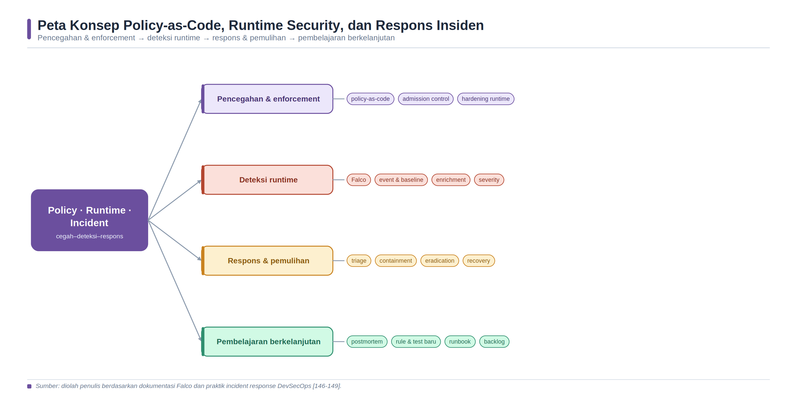
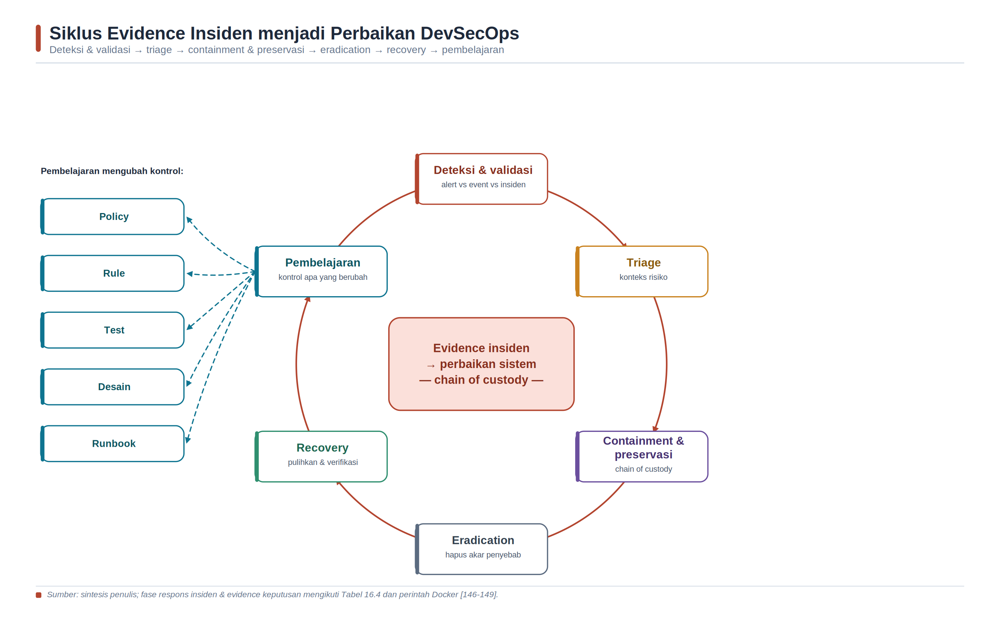

<a id="bab-16"></a>

# Bab 16 — Policy-as-Code, Runtime Security, dan Respons Insiden

Bab ini menutup siklus teknis DevSecOps melalui tiga kemampuan yang saling melengkapi: mencegah konfigurasi berisiko dengan policy-as-code, mengamati perilaku aktual melalui runtime security, dan mengelola insiden secara terukur sampai pembelajarannya kembali menjadi perbaikan desain serta pipeline. Mahasiswa tidak hanya menjalankan alat, tetapi juga belajar menyatakan kebijakan, membuktikan bahwa kebijakan bekerja, membedakan alert dari insiden, menjaga evidence, dan menjelaskan residual risk secara bertanggung jawab.

> **Batas etis dan keselamatan. **Seluruh praktikum dilakukan pada aset lokal atau lingkungan yang memiliki izin tertulis. Praktikum Falco menggunakan akses kernel dan Docker socket; jalankan hanya pada VM Linux disposable yang tidak memuat data sensitif dan bukan host bersama atau produksi.

## Tujuan Pembelajaran dan Kompetensi Utama

- Menjelaskan hubungan prevent, enforce, detect, respond, recover, dan learn sebagai defense-in-depth.

- Menerjemahkan requirement keamanan menjadi kebijakan Rego yang dapat ditinjau, diuji, dan dijalankan oleh Conftest.

- Membangun positive test dan intentional negative test untuk membuktikan efektivitas policy gate.

- Menjelaskan sumber event runtime, cara kerja rule Falco, baseline, enrichment, severity, dan false positive.

- Membedakan alert, event keamanan, insiden, dan bukti serta menentukan tindakan berdasarkan konteks risiko.

- Melaksanakan triage, containment, preservasi evidence, eradication, recovery, dan lessons learned pada container lab.

- Menghubungkan temuan runtime dengan threat model, regression test, policy, runbook, dan backlog engineering.

## Peta Konsep Bab



*Gambar 18. Peta konsep policy-as-code, runtime security, dan respons insiden.*

> Sumber: sintesis penulis berdasarkan OPA [130-131], Conftest [132], Falco [133-136], NIST [141-143], dan CNCF [145].

## Konsep Inti dan Landasan Teori

### Menutup Loop DevSecOps

Bab-bab sebelumnya membangun requirement, threat model, secure coding, analisis dependency, image assurance, deployment, dan pengujian aplikasi. Seluruh kontrol tersebut menurunkan peluang kegagalan, tetapi tidak dapat menghilangkan ketidakpastian. Konfigurasi dapat berubah setelah build, credential dapat disalahgunakan, perilaku baru dapat muncul karena integrasi, dan asumsi desain dapat berbeda dari kondisi runtime. Karena itu, jaminan keamanan memerlukan loop tertutup: keputusan sebelum deployment, observasi ketika sistem berjalan, respons ketika risiko terwujud, dan pembelajaran yang mengubah sistem.

Policy-as-code menjawab pertanyaan “apakah keadaan yang diminta boleh diterima?”, runtime security menjawab “apa yang benar-benar terjadi?”, sedangkan respons insiden menjawab “bagaimana membatasi dampak, memulihkan layanan, dan mencegah pengulangan?”. Ketiga kemampuan tersebut tidak saling menggantikan. Kebijakan yang kuat tanpa telemetry dapat melewatkan bypass; deteksi tanpa hardening menciptakan terlalu banyak alert; respons tanpa evidence menghasilkan keputusan spekulatif; postmortem tanpa perubahan kontrol hanya mendokumentasikan pengulangan.

| Lapisan | Pertanyaan utama | Contoh kontrol | Evidence minimum |
| --- | --- | --- | --- |
| Prevent | Apakah attack surface telah diperkecil? | Non-root, cap_drop, seccomp, AppArmor, read-only. | Compose efektif dan docker inspect. |
| Enforce | Apakah konfigurasi yang melanggar dapat ditolak? | Conftest pada pull request dan release gate. | Input, policy version, output, exit code. |
| Detect | Apakah deviasi runtime dapat diamati? | Falco rule, log, metric, event Docker. | Event, timestamp, workload, rule, konteks. |
| Respond | Apakah dampak dapat dibatasi secara aman? | Triage, isolation, credential rotation, evidence. | Timeline, tindakan, pelaksana, approval. |
| Recover | Apakah layanan pulih dari artefak tepercaya? | Redeploy by digest, healthcheck, monitoring. | Digest, verification, SLO, regression result. |
| Learn | Apakah temuan mengubah sistem? | Postmortem, threat model, test, policy, runbook. | Backlog, owner, due date, closure evidence. |

*Tabel 16.1. Lapisan kontrol dan evidence pada loop DevSecOps.*

### Policy-as-Code sebagai Sistem Keputusan

Policy-as-code adalah praktik menyatakan aturan organisasi dalam bentuk yang dapat dikelola seperti perangkat lunak: disimpan dalam version control, ditinjau, diuji, dipaketkan, dirilis, diamati, dan dipensiunkan. OPA dirancang untuk mengevaluasi policy terhadap data terstruktur, sedangkan Rego merupakan bahasa deklaratif untuk menyatakan keputusan atas input seperti request API, konfigurasi infrastructure-as-code, dan dokumen JSON atau YAML [130-131]. Deklaratif berarti penulis policy menjelaskan keadaan yang diizinkan atau dilanggar, bukan urutan langkah imperatif untuk mencapainya.

Sistem keputusan dapat dipahami melalui tiga unsur. Pertama, input adalah fakta yang dinilai, misalnya services pada Compose. Kedua, policy adalah aturan yang berversi, misalnya larangan privileged. Ketiga, decision adalah hasil seperti deny, warn, atau allow beserta alasan. Pemisahan ini membuat aturan dapat digunakan ulang dan diuji tanpa menjalankan workload. Namun keputusan hanya sebaik input-nya. Jika pipeline menilai file yang berbeda dari konfigurasi efektif, parser keliru, atau field tidak dikenal menghasilkan nilai undefined, hasil PASS dapat menyesatkan. Karena itu, policy test, schema, strict checking, dan pengujian terhadap konfigurasi hasil render penting.

Conftest membantu menguji data terstruktur menggunakan Rego dan secara default mencari rule deny, violation, serta warn pada namespace main [132]. Failure perlu mengembalikan pesan yang dapat ditindaklanjuti: service mana, aturan apa, alasan risiko, dan cara memperbaiki. Pesan “policy failed” saja mendorong developer mencari jalan pintas. Sebaliknya, policy terlalu detail dapat menjadi coupling terhadap satu struktur file. Rule yang sehat memusatkan requirement stabil, sedangkan parameter lingkungan disimpan sebagai data atau metadata yang ditinjau.

| Tahap policy | Aktivitas | Kriteria mutu | Risiko bila diabaikan |
| --- | --- | --- | --- |
| Define | Hubungkan requirement, threat, aset, owner, dan severity. | Bahasa jelas; scope dan rationale tercatat. | Rule tidak relevan atau terlalu luas. |
| Author | Tulis Rego, pesan, metadata, dan input contract. | Dapat dibaca; hasil deterministik; least privilege. | Undefined input atau keputusan ambigu. |
| Test | Unit test allow/deny, boundary, missing field, dan mutation. | Intentional negative test benar-benar gagal. | Gate hijau karena rule tidak pernah aktif. |
| Observe | Jalankan audit/warn dan ukur dampak. | Coverage serta false positive diketahui. | Enforcement mengganggu delivery. |
| Enforce | Blokir pelanggaran berisiko dengan exception terkontrol. | Exit code tidak ditelan; owner dan SLA jelas. | Bypass permanen atau shadow policy. |
| Evolve | Tinjau temuan, perubahan platform, dan expiry. | Versi, changelog, deprecation, regression. | Policy usang tetap dianggap jaminan. |

*Tabel 16.2. Siklus hidup policy-as-code.*

### Enforcement, Exception, dan Fail-Safe

Policy dapat diterapkan pada workstation, pre-commit, pull request, build, registry, deployment, atau admission. Semakin awal pelanggaran ditemukan, semakin murah koreksinya; semakin dekat ke titik eksekusi, semakin representatif input-nya. Praktik yang kuat menggunakan beberapa titik secara proporsional: feedback cepat di pull request dan enforcement atas konfigurasi efektif sebelum release. Policy tidak boleh hanya hadir sebagai laporan yang tidak dibaca, tetapi enforcement juga tidak boleh diaktifkan tanpa memahami dampak operasional.

Rollout lazim dimulai dari visibility, kemudian warning, lalu blocking untuk rule dengan signal-to-noise yang memadai. Exception bukan penghapusan aturan. Exception minimum memuat scope sempit, alasan, risk owner, kompensating control, tanggal kedaluwarsa, dan approval. Expiry harus menyebabkan review ulang atau kegagalan, bukan otomatis memperpanjang risiko. Emergency override perlu dicatat, dibatasi waktunya, dan diikuti retrospective. Policy engine sendiri merupakan bagian dari trusted computing base; image, konfigurasi, dan policy bundle harus dipin, diverifikasi, dan akses perubahannya dibatasi.

> **Prinsip penting. **PASS berarti input yang diuji tidak memicu policy pada versi dan konfigurasi tersebut. PASS bukan bukti bahwa seluruh keamanan container telah diverifikasi.

### Runtime Security dan Telemetry

Runtime security mengamati peristiwa ketika host dan container berjalan, lalu membandingkannya dengan aturan atau baseline. Falco mengonsumsi stream event dan mengevaluasinya terhadap rule; rule memiliki condition, output, priority, dan secara opsional exception serta tag [133-135]. Untuk sumber system call, event diperoleh melalui driver kernel atau modern eBPF. Field seperti process, user, container, file, network, dan event type dapat dipakai untuk membangun konteks. Alert dapat dikirim ke standard output, file, syslog, atau endpoint lain, tetapi pengiriman alert bukan respons insiden otomatis.

Rule yang baik berawal dari hipotesis deteksi. Contoh: “service web yang pada desain tidak memerlukan shell tidak seharusnya mengeksekusi sh setelah startup.” Dari hipotesis tersebut ditentukan sumber event, condition, konteks pengecualian, output, severity, dan prosedur validasi. MITRE ATT&CK Containers membantu memetakan teknik adversary seperti deploy container atau escape to host, tetapi matriks tersebut bukan daftar aturan yang wajib diaktifkan secara buta [144]. Coverage harus dikaitkan dengan threat model dan arsitektur nyata.

Baseline membedakan perilaku yang diharapkan dari deviasi. Baseline bukan allowlist permanen; perubahan sah tetap perlu ditinjau. Condition terlalu umum menghasilkan noise, sedangkan condition terlalu sempit mudah melewatkan serangan. Enrichment dengan image digest, environment, service owner, deployment, identity, dan change window meningkatkan kualitas triage. Priority menunjukkan tingkat kepentingan event menurut rule, bukan kebenaran atau urutan eksekusi. Alert berpriority tinggi masih memerlukan validasi; alert rendah dapat penting bila berkorelasi dengan event lain.

| Sumber/objek | Contoh observasi | Nilai deteksi | Batas interpretasi |
| --- | --- | --- | --- |
| Kernel/system call | execve, open, mount, connect. | Melihat aktivitas proses tingkat rendah. | Volume tinggi; butuh driver dan konteks. |
| Process dan user | Shell, parent, command line, UID. | Mendeteksi eksekusi tidak lazim. | Admin sah dapat menyerupai serangan. |
| File system | Write ke binary/config atau file sensitif. | Menemukan persistence atau tampering. | Read-only volume tidak mencakup semua path. |
| Network | Tujuan, port, protocol, koneksi baru. | Menemukan egress atau service tidak lazim. | Enkripsi membatasi isi; DNS/NAT mengubah konteks. |
| Container metadata | Name, image, digest, label, namespace. | Mengaitkan event dengan workload. | Metadata dapat hilang bila enrichment gagal. |
| Docker event/log | Create, start, exec, die, health status. | Membangun timeline lifecycle. | Event lokal terbatas dan bukan audit log lengkap. |

*Tabel 16.3. Telemetry runtime dan batas interpretasinya.*

### Hardening dan Deteksi sebagai Defense-in-Depth

Deteksi runtime tidak boleh dipakai untuk membenarkan container yang longgar. Docker menyediakan pemisahan namespace, cgroup, Linux capabilities, seccomp, AppArmor, user namespace, dan rootless mode pada platform yang mendukungnya [137-140]. Default seccomp memblokir sejumlah system call berisiko sambil menjaga kompatibilitas [138]. AppArmor menerapkan mandatory access control melalui profile [139]. Menjatuhkan capabilities, menjalankan process non-root, read-only root filesystem, tmpfs terbatas, pids limit, no-new-privileges, network segmentation, serta mount minimal memperkecil peluang dan dampak penyalahgunaan.

Flag --privileged harus diperlakukan sebagai pengecualian berisiko sangat tinggi karena mengaktifkan seluruh capabilities, menonaktifkan beberapa proteksi default, memberi akses device, dan membuat container mampu melakukan tindakan yang mendekati host [137]. Alat observasi kernel terkadang memerlukan hak istimewa. Ini merupakan trade-off operasional: sensor mendapat akses untuk mengamati sistem, sehingga sensor dan host lab harus diisolasi, image dipin serta diverifikasi, mount dibuat read-only bila memungkinkan, dan hak dipersempit sesuai dokumentasi. Menyalin konfigurasi sensor laboratorium ke production tanpa review dapat menambah attack surface.

### Dari Alert ke Insiden

Event adalah catatan bahwa sesuatu terjadi. Alert adalah event atau korelasi yang memenuhi rule. Insiden adalah kejadian yang benar-benar atau berpotensi membahayakan confidentiality, integrity, availability, atau tujuan organisasi dan memerlukan koordinasi respons. Finding adalah hasil analisis yang menyatakan kelemahan atau pelanggaran. Keempat istilah tidak boleh dipertukarkan. Triage memeriksa validitas, dampak, scope, aset, identity, perubahan sah, dan confidence sebelum eskalasi. Namun kebutuhan validasi tidak boleh menjadi alasan untuk menunda containment ketika dampak berkembang cepat.

NIST SP 800-61 Revision 3 mengintegrasikan incident response ke cyber risk management berbasis NIST CSF 2.0, bukan menempatkannya sebagai aktivitas terpisah setelah kejadian [141-143]. Fungsi GOVERN, IDENTIFY, dan PROTECT membangun persiapan; DETECT, RESPOND, serta RECOVER menangani dan memulihkan; pembelajaran memberi masukan kembali ke seluruh fungsi. Dengan demikian, kesiapan respons mencakup inventory, role, komunikasi, logging, backup, akses darurat, latihan, dan dependency eksternal sebelum alert pertama muncul.

| Fase kerja | Pertanyaan keputusan | Aksi teknis terpilih | Evidence dan owner |
| --- | --- | --- | --- |
| Prepare/Govern | Siapa berwenang dan apa prioritas bisnis? | Inventory, runbook, logging, access, exercise. | RACI, aset, contact, policy, risk owner. |
| Detect/Validate | Apakah sinyal benar dan relevan? | Korelasi rule, log, metric, change record. | Alert mentah, waktu, workload, analyst. |
| Triage/Scope | Aset, identity, data, dan tenant mana terdampak? | Timeline, pivot IOC, klasifikasi severity. | Incident ticket, hypothesis, confidence. |
| Contain/Preserve | Bagaimana membatasi dampak tanpa merusak bukti? | Isolasi network, revoke token, snapshot log. | Tindakan, approval, checksum, custodian. |
| Eradicate | Apa root cause dan persistence? | Patch/rebuild, rotate secret, hapus artefak. | Commit, scan, rotation record, validation. |
| Recover | Apakah layanan dan trust telah pulih? | Deploy digest tepercaya, health/SLO monitor. | Verification, test, monitoring, service owner. |
| Learn | Kontrol apa yang harus berubah? | Postmortem, test, policy, rule, architecture. | Backlog, owner, due date, closure evidence. |

*Tabel 16.4. Fase respons insiden dan evidence keputusan.*

### Evidence, Volatilitas, dan Chain of Custody

Container bersifat mudah diganti, tetapi ephemerality bukan alasan mengabaikan forensik. Sebagian evidence volatil berada pada process, memory, network connection, filesystem layer, log buffer, dan event host. Sebagian lain berada pada registry, CI/CD, IAM, control plane, image digest, SBOM, signature, dan source repository. Tim harus menetapkan urutan pengumpulan berdasarkan volatilitas, nilai, keselamatan, dan otorisasi. Masuk ke container dengan docker exec setelah insiden dapat mengubah state dan timeline; gunakan perintah read-only dari host sejauh mungkin dan dokumentasikan setiap tindakan.

Chain of custody menunjukkan siapa mengumpulkan, mengakses, memindahkan, atau menganalisis evidence, kapan, dengan alat apa, dan checksum berapa. Checksum mendeteksi perubahan bit, tetapi tidak sendirian membuktikan asal, kelengkapan, atau kebenaran evidence. Waktu host dan service perlu tersinkronisasi serta dicatat dalam UTC. Secret, token, dan data pribadi harus diredaksi atau disimpan dengan kontrol akses serta retention yang sesuai. Perintah docker inspect, logs, top, stats, diff, image inspect, dan events membantu triage, tetapi output Docker bukan pengganti sistem audit host atau platform yang dirancang untuk retention panjang [146-149].



*Gambar 19. Siklus evidence insiden menjadi perbaikan DevSecOps.*

> Sumber: sintesis penulis berdasarkan NIST SP 800-61r3 [141], NIST CSF 2.0 [142-143], CISA [150], dan CNCF [145].

### Detection Engineering dan Pembelajaran

Detection engineering memperlakukan rule seperti produk: memiliki tujuan, data source, version, owner, test fixture, expected event, false-positive control, runbook, severity, dan review berkala. Rule harus diuji pada event positif yang memang perlu memicu dan event negatif yang mewakili aktivitas sah. Alert volume, precision, coverage, mean time to acknowledge, mean time to contain, dan persentase insiden yang menghasilkan regression control lebih bermakna daripada jumlah rule. Metrik dapat disalahgunakan; waktu respons yang sangat singkat tidak bernilai bila tim menutup alert tanpa validasi.

Postmortem yang sehat berfokus pada kondisi sistem dan keputusan, bukan mencari individu untuk disalahkan. Analisis mencakup timeline, contributing factors, kontrol yang bekerja, kontrol yang gagal, detection gap, decision latency, dampak, dan residual risk. Setiap tindakan korektif memerlukan owner, prioritas, due date, dan closure evidence. Perubahan ideal tidak hanya menambal symptom, tetapi juga menambahkan test, policy, rule, observability, dokumentasi, atau perubahan arsitektur yang mencegah kelas kegagalan serupa.

## Arsitektur Laboratorium dan Prasyarat Lingkungan

Laboratorium menggunakan VM Linux disposable dengan Docker Engine. Conftest mengevaluasi konfigurasi Compose sebelum deployment, sedangkan Falco mengamati event runtime pada host yang sama. Folder evidence dipisahkan dari workload dan seluruh pengujian aktif hanya dilakukan pada container lokal yang sengaja disediakan.

## Langkah Praktikum Eksploratif

### Praktikum 16A - Menyiapkan Policy Lab

Praktikum menggunakan Conftest 0.69.0 yang dipin agar hasil dapat direproduksi. Verifikasi kembali signature/digest image sesuai kebijakan laboratorium sebelum digunakan. Dua Compose file disiapkan: satu sengaja tidak aman untuk negative test dan satu memenuhi baseline sederhana. Baseline ini adalah contoh pembelajaran, bukan standar universal untuk seluruh workload.

```yaml
cd ~/devsecops-lab
mkdir -p ch16/policy ch16/falco ch16/evidence
cd ch16

cat > compose.insecure.yaml <<'YAML'
services:
  app:
    image: alpine:3.23.4
    command: ["sleep", "600"]
    privileged: true
    read_only: false
    ports:
      - "8080:8080"
YAML

cat > compose.hardened.yaml <<'YAML'
services:
  app:
    image: alpine:3.23.4
    command: ["sleep", "600"]
    user: "65534:65534"
    read_only: true
    cap_drop: ["ALL"]
    security_opt:
      - no-new-privileges:true
    pids_limit: 64
    tmpfs:
      - /tmp:rw,noexec,nosuid,size=16m
    ports:
      - "127.0.0.1:8080:8080"
YAML

docker compose -f compose.insecure.yaml config > effective.insecure.yaml
docker compose -f compose.hardened.yaml config > effective.hardened.yaml
```

Periksa effective.*.yaml karena hasil merge, default, interpolasi variable, dan override dapat berbeda dari file sumber. Policy gate sebaiknya menilai konfigurasi sedekat mungkin dengan yang benar-benar akan dieksekusi.

### Praktikum 16B - Menulis dan Menguji Rego

```rego
cat > policy/compose.rego <<'REGO'
package main
import rego.v1

deny contains msg if {
  some name, svc in input.services
  svc.privileged == true
  msg := sprintf("service %s: privileged dilarang", [name])
}

deny contains msg if {
  some name, svc in input.services
  svc.read_only != true
  msg := sprintf("service %s: root filesystem wajib read_only", [name])
}

deny contains msg if {
  some name, svc in input.services
  not "ALL" in svc.cap_drop
  msg := sprintf("service %s: cap_drop ALL wajib", [name])
}

deny contains msg if {
  some name, svc in input.services
  not "no-new-privileges:true" in svc.security_opt
  msg := sprintf("service %s: no-new-privileges wajib", [name])
}

bad_port(port) if {
  is_string(port)
  not startswith(port, "127.0.0.1:")
}

bad_port(port) if {
  is_object(port)
  object.get(port, "host_ip", "") != "127.0.0.1"
}

deny contains msg if {
  some name, svc in input.services
  some port in svc.ports
  bad_port(port)
  msg := sprintf("service %s: port lab wajib bind ke loopback", [name])
}
REGO

cat > policy/compose_test.rego <<'REGO'
package main
import rego.v1

test_hardened_allowed if {
  count(deny) == 0 with input as {
    "services": {"app": {
      "read_only": true,
      "cap_drop": ["ALL"],
      "security_opt": ["no-new-privileges:true"],
      "ports": ["127.0.0.1:8080:8080"]
    }}
  }
}

test_privileged_denied if {
  count(deny) > 0 with input as {
    "services": {"app": {
      "privileged": true,
      "read_only": false,
      "cap_drop": [],
      "security_opt": [],
      "ports": ["8080:8080"]
    }}
  }
}
REGO
CONFTEST_IMAGE=openpolicyagent/conftest:v0.69.0

docker run --rm -v "$PWD:/project" -w /project   "$CONFTEST_IMAGE" verify --policy policy

docker run --rm -v "$PWD:/project" -w /project   "$CONFTEST_IMAGE" test effective.hardened.yaml --policy policy

set +e
docker run --rm -v "$PWD:/project" -w /project   "$CONFTEST_IMAGE" test effective.insecure.yaml --policy policy
INSECURE_RC=$?
set -e
test "$INSECURE_RC" -ne 0
printf 'Intentional negative test menghasilkan rc=%s (PASS)
' "$INSECURE_RC"
```

> **Expected result. **conftest verify dan konfigurasi hardened harus PASS. Konfigurasi insecure harus FAIL dengan pesan privileged, read_only, cap_drop, no-new-privileges, dan port. Jika negative test menghasilkan kode 0, gate tidak boleh dianggap efektif.

| Kasus uji | Stimulus | Oracle | Evidence |
| --- | --- | --- | --- |
| Unit allow | Input hardened lengkap. | count(deny) = 0. | Output conftest verify dan versi policy. |
| Unit deny | privileged, writable, capability/option kosong. | count(deny) > 0. | Nama test serta status PASS. |
| Integration positive | effective.hardened.yaml. | Exit code 0; tidak ada failure. | Command, output, checksum input/policy. |
| Integration negative | effective.insecure.yaml. | Exit code non-zero; pesan spesifik. | Output failure dan INSECURE_RC. |
| Mutation | Hapus satu field hardened. | Rule terkait harus memblokir. | Diff input dan failure yang muncul. |
| Exception | Scope berizin dengan expiry sintetis. | Hanya objek yang disetujui dikecualikan. | Owner, alasan, expiry, approval. |

*Tabel 16.5. Matriks pengujian policy-as-code.*

### Praktikum 16C - Runtime Detection dengan Falco

> **Prasyarat keamanan. **Gunakan VM Linux disposable. Sensor memperoleh kemampuan kernel dan membaca Docker socket; keduanya merupakan akses sensitif. Jangan menjalankan prosedur ini pada Docker Desktop, host kerja bersama, server kampus, atau production tanpa desain, approval, dan hardening khusus.

Dokumentasi Falco menyediakan modern eBPF dan merekomendasikan mode least privileged dibanding --privileged [136]. Contoh berikut meminimalkan capability dibanding mode penuh, tetapi SYS_ADMIN dan Docker socket tetap berisiko tinggi. Terminal 1 menjalankan sensor; Terminal 2 memicu event yang telah diotorisasi.

```bash
cat > falco/ch16_rules.yaml <<'YAML'
- rule: Ch16 Shell Spawned in Lab Container
  desc: Mendeteksi shell yang sengaja dijalankan pada container lab Bab 16
  condition: >
    container and spawned_process and
    proc.name in (bash, sh) and
    container.name = ch16-runtime-test
  output: >
    CH16 shell | user=%user.name proc=%proc.name
    cmd=%proc.cmdline container=%container.name image=%container.image.repository
  priority: NOTICE
  tags: [ch16, container, process]
YAML

# Terminal 1 - hanya pada VM Linux disposable
docker pull falcosecurity/falco:0.44.1
docker run --rm -it --name ch16-falco   --cap-drop all   --cap-add sys_admin   --cap-add sys_resource   --cap-add sys_ptrace   -v /sys/kernel/tracing:/sys/kernel/tracing:ro   -v /var/run/docker.sock:/host/var/run/docker.sock   -v /proc:/host/proc:ro   -v /etc:/host/etc:ro   -v "$PWD/falco/ch16_rules.yaml:/etc/falco/rules.d/ch16_rules.yaml:ro"   falcosecurity/falco:0.44.1
# Terminal 2 - stimulus terotorisasi
docker run -d --name ch16-runtime-test alpine:3.23.4 sleep 600
docker exec ch16-runtime-test sh -c 'id; touch /tmp/ch16-probe'

# Kontrol negatif: proses sleep normal tidak seharusnya memicu rule shell.
docker top ch16-runtime-test

# Catat event Falco, rule, waktu, container, process, dan command.
# Jangan menganggap satu alert sebagai bukti kompromi tanpa validasi.
```

Jika rule memicu pada shell yang diharapkan, detection path terbukti bekerja untuk stimulus tersebut. Hasil itu belum membuktikan coverage seluruh teknik. Uji kontrol negatif diperlukan untuk melihat noise. Selanjutnya, ubah satu field condition secara sengaja dan amati apakah rule gagal mendeteksi; mutation sederhana membantu mahasiswa memahami hubungan rule dan blind spot.

### Praktikum 16D - Triage, Evidence, dan Containment

Anggap alert shell sebagai insiden simulasi. Catat waktu mulai dan lakukan pengumpulan dari host tanpa masuk lagi ke container. Perintah berikut mengumpulkan metadata terbatas; kebijakan organisasi dapat memerlukan sumber tambahan dan alat forensik khusus.

```bash
INCIDENT_ID="CH16-$(date -u +%Y%m%dT%H%M%SZ)"
EVIDENCE_DIR="$PWD/evidence/$INCIDENT_ID"
mkdir -p "$EVIDENCE_DIR"

date -u +%FT%TZ > "$EVIDENCE_DIR/collection-start-utc.txt"
docker inspect ch16-runtime-test > "$EVIDENCE_DIR/container-inspect.json"
docker logs --timestamps ch16-runtime-test > "$EVIDENCE_DIR/container.log" 2>&1
docker top ch16-runtime-test -eo pid,ppid,user,lstart,args   > "$EVIDENCE_DIR/container-top.txt"
docker stats --no-stream ch16-runtime-test   > "$EVIDENCE_DIR/container-stats.txt"
docker diff ch16-runtime-test > "$EVIDENCE_DIR/container-diff.txt"

IMAGE_ID=$(docker inspect -f '{{.Image}}' ch16-runtime-test)
docker image inspect "$IMAGE_ID" > "$EVIDENCE_DIR/image-inspect.json"
EVENT_UNTIL=$(date -u +%FT%TZ)
docker events --since 20m --until "$EVENT_UNTIL"   --filter container=ch16-runtime-test   > "$EVIDENCE_DIR/docker-events.txt"

find "$EVIDENCE_DIR" -type f ! -name MANIFEST.sha256 -print0   | sort -z | xargs -0 sha256sum > "$EVIDENCE_DIR/MANIFEST.sha256"
sha256sum -c "$EVIDENCE_DIR/MANIFEST.sha256"
```

Sebelum containment, dokumentasikan alasan, dampak yang diperkirakan, pelaksana, dan approval simulasi. Isolasi network dapat menghentikan komunikasi tetapi juga mengubah state dan mengganggu pengumpulan bukti jarak jauh. Pada insiden nyata, urutan tindakan ditentukan incident commander berdasarkan keselamatan, dampak bisnis, dan kebutuhan forensik.

```bash
docker inspect -f '{{json .NetworkSettings.Networks}}' ch16-runtime-test   > "$EVIDENCE_DIR/networks-before-containment.txt"

docker network disconnect bridge ch16-runtime-test
date -u +%FT%TZ > "$EVIDENCE_DIR/containment-utc.txt"

# Verifikasi bahwa container tidak lagi memiliki network default.
docker inspect -f '{{json .NetworkSettings.Networks}}' ch16-runtime-test   > "$EVIDENCE_DIR/networks-after-containment.txt"

docker stop ch16-runtime-test
docker rm ch16-runtime-test
```

### Praktikum 16E - Eradication, Recovery, dan Regression

Pada sistem nyata, eradication mencakup root-cause correction, rebuild artefak, rotasi seluruh credential terdampak, pencarian persistence, dan review blast radius. Praktikum memulihkan workload dari image yang dipin dengan kontrol runtime lebih ketat. Image contoh tetap perlu diverifikasi sesuai Bab 14.

```bash
docker run -d --name ch16-runtime-clean   --network none   --read-only   --tmpfs /tmp:rw,noexec,nosuid,size=16m   --user 65534:65534   --cap-drop ALL   --security-opt no-new-privileges:true   --pids-limit 64   alpine:3.23.4 sleep 600

test "$(docker inspect -f '{{.State.Running}}' ch16-runtime-clean)" = true
test "$(docker inspect -f '{{.HostConfig.ReadonlyRootfs}}' ch16-runtime-clean)" = true
docker inspect -f '{{json .HostConfig.CapDrop}}' ch16-runtime-clean
docker inspect -f '{{json .HostConfig.SecurityOpt}}' ch16-runtime-clean

# Simulasikan bahwa temuan menjadi regression control.
docker compose -f compose.hardened.yaml config > effective.recovery.yaml
docker run --rm -v "$PWD:/project" -w /project   openpolicyagent/conftest:v0.69.0   test effective.recovery.yaml --policy policy

docker rm -f ch16-runtime-clean
docker rm -f ch16-falco 2>/dev/null || true
```

## Verifikasi dan Skenario Pengujian

| ID | Pengujian | Kondisi PASS | Evidence |
| --- | --- | --- | --- |
| T16-01 | Syntax/unit policy. | Seluruh unit test Rego PASS. | Versi Conftest, output verify, checksum policy. |
| T16-02 | Positive policy. | Compose hardened exit code 0. | Konfigurasi efektif dan output. |
| T16-03 | Intentional negative policy. | Compose insecure exit code non-zero dan pesan spesifik. | Output failure serta return code. |
| T16-04 | Runtime positive event. | Rule shell memicu pada container target. | Event Falco dengan waktu dan metadata. |
| T16-05 | Runtime negative control. | Aktivitas normal tidak memicu rule shell. | Observation window dan event count. |
| T16-06 | Evidence integrity. | Seluruh checksum MANIFEST valid. | Manifest dan hasil sha256sum -c. |
| T16-07 | Containment. | Network terputus dan tindakan tercatat. | Before/after network serta UTC. |
| T16-08 | Recovery. | Workload bersih running, hardened, policy PASS. | Inspect, digest, health dan policy output. |
| T16-09 | Feedback. | Ada test/policy/rule/runbook action dengan owner. | Backlog dan closure criteria. |

*Tabel 16.6. Pengujian end-to-end Bab 16.*

## Analisis Hasil

1. Analisis policy decision. Jelaskan requirement yang diterjemahkan, struktur input, rule yang terpicu, dan mengapa hasil positive serta negative berbeda. Pastikan kesimpulan tidak melampaui scope policy.

1. Analisis efektivitas gate. Buktikan bahwa exit code failure dipertahankan oleh pipeline dan intentional negative test gagal. Gate yang selalu hijau merupakan kegagalan kontrol, bukan keberhasilan delivery.

1. Analisis hardening. Hubungkan privileged, read-only, capabilities, no-new-privileges, pids limit, port binding, dan network dengan threat yang dikurangi. Nyatakan kontrol host yang tidak diuji.

1. Analisis runtime detection. Jelaskan hipotesis, event source, condition, output, priority, positive event, negative control, dan kemungkinan false positive/false negative.

1. Analisis alert versus insiden. Tentukan bukti apa yang menguatkan atau melemahkan dugaan, siapa yang memutuskan severity, dan kapan containment harus dilakukan sebelum seluruh fakta tersedia.

1. Analisis evidence. Nilai volatilitas, kelengkapan, sinkronisasi waktu, redaksi, checksum, akses, retention, dan tindakan yang berpotensi mengubah state.

1. Analisis containment dan recovery. Jelaskan trade-off isolasi terhadap availability serta forensik, root cause yang perlu dihapus, credential yang perlu dirotasi, dan cara membangun kembali trust.

1. Analisis feedback loop. Tunjukkan bagaimana insiden simulasi menghasilkan perubahan threat model, policy, detection rule, regression test, runbook, atau desain dengan owner dan due date.

| Dimensi analisis | Indikator kuat | Indikator lemah |
| --- | --- | --- |
| Policy intent | Requirement, scope, rationale, input contract, dan owner jelas. | Rule disalin tanpa hubungan risiko. |
| Test quality | Allow, deny, missing field, mutation, dan exit code diuji. | Hanya menjalankan policy pada file baik. |
| Detection | Hipotesis, source, condition, context, positive/negative test. | Alert dianggap otomatis sebagai insiden. |
| Evidence | Timestamp UTC, digest, redaksi, checksum, custody, limitation. | Screenshot terminal tanpa identitas artefak. |
| Response | Keputusan dan trade-off terdokumentasi; owner jelas. | Langsung menghapus container tanpa preservasi. |
| Recovery | Root cause dikoreksi, secret dirotasi, trust diverifikasi. | Hanya restart workload yang sama. |
| Learning | Temuan menjadi kontrol yang diuji dan ditutup dengan evidence. | Postmortem berakhir tanpa backlog. |

*Tabel 16.7. Rubrik analisis policy, runtime, dan respons insiden.*

## Troubleshooting dan Analisis Hasil

| Gejala | Penyebab yang mungkin | Tindakan korektif |
| --- | --- | --- |
| Conftest tidak membaca policy | Path mount, working directory, namespace, atau extension salah. | Periksa pwd/mount; gunakan --policy; pastikan package main. |
| File insecure PASS | Field effective berubah, rule undefined, atau exit code ditelan. | Uji docker compose config; conftest verify; simpan return code. |
| File hardened FAIL | Default/merge menghasilkan field berbeda atau rule terlalu absolut. | Periksa konfigurasi efektif; perbaiki rule atau desain, bukan bypass. |
| Unit test PASS palsu | Hanya menguji input allow atau test tidak pernah dieksekusi. | Tambahkan deny, missing field, mutation; periksa jumlah test. |
| Falco gagal start | Kernel/eBPF/tracefs/capability/AppArmor tidak kompatibel. | Ikuti compatibility dan setup resmi; gunakan VM Linux yang didukung. |
| Metadata container kosong | Docker socket/enrichment path salah. | Periksa mount dan log Falco; jangan perluas akses di host sensitif. |
| Rule tidak memicu | Nama container, process, macro, source, atau rule load salah. | Periksa output start; sederhanakan condition sementara; validasi field. |
| Alert terlalu bising | Condition terlalu umum atau baseline tidak tersedia. | Observasi; tambah konteks/exception sempit; uji kontrol negatif. |
| Evidence checksum gagal | File berubah setelah manifest atau transfer tidak utuh. | Bekukan evidence; ulangi koleksi secara tercatat; buat manifest baru. |
| Containment gagal | Nama network berbeda atau container sudah berhenti. | Inspect Networks; dokumentasikan state; gunakan tindakan yang disetujui. |
| Recovery masih berisiko | Image/secret/root cause lama dipakai ulang. | Rebuild, verify digest/signature, rotate secret, ulangi test dan monitor. |

*Tabel 16.8. Troubleshooting praktikum Bab 16.*

## Kesimpulan

Policy-as-code mengubah requirement menjadi keputusan yang dapat ditinjau, diuji, dan ditegakkan. Nilainya tidak berasal dari Rego semata, tetapi dari input contract, unit test, intentional negative test, rollout, exception ber-expiry, serta evidence exit code. Runtime security menambah observasi atas perilaku aktual, tetapi rule harus dibangun dari hipotesis, diperkaya konteks, dan diuji terhadap positive event maupun aktivitas sah.

Respons insiden mengubah sinyal menjadi keputusan terkoordinasi: validasi, scope, containment, preservasi evidence, eradication, recovery, dan pembelajaran. Keberhasilan bukan hanya container kembali running. Trust harus dibangun ulang dari artefak terverifikasi, credential yang aman, health serta security regression, dan kontrol baru yang mencegah pengulangan. Dengan demikian, Bab 16 melengkapi DevSecOps sebagai sistem sosio-teknis yang belajar dari runtime.

## Evaluasi dan Latihan Mandiri

- Mengapa policy PASS tidak membuktikan seluruh keamanan container?

- Apa perbedaan input, policy, decision, enforcement point, dan evidence?

- Mengapa intentional negative test wajib pada policy gate?

- Bagaimana exception yang sehat dibedakan dari bypass permanen?

- Apa perbedaan event, alert, finding, dan insiden?

- Mengapa priority Falco tidak sama dengan kepastian bahwa serangan terjadi?

- Bagaimana hardening dan runtime detection saling melengkapi?

- Mengapa docker exec dapat mengubah nilai forensik container?

- Apa yang dibuktikan checksum dan apa yang tidak dibuktikannya?

- Bagaimana postmortem menghasilkan perubahan yang dapat diverifikasi?

## Format Laporan Praktikum

Laporan Bab 16 ditulis dalam bahasa formal akademis dan maksimum 14 halaman di luar lampiran evidence. Laporan minimum memuat:

- Tujuan, authorization, batas laboratorium, arsitektur, aset, threat hypothesis, dan risk owner.

- Versi/image digest alat, host/kernel relevan, input efektif, policy, rule, command, dan timestamp UTC.

- Hasil unit, positive, intentional negative, mutation, runtime positive, dan negative control.

- Triage alert, severity, scope, confidence, timeline, keputusan containment, dan approval simulasi.

- Evidence teredaksi, manifest checksum, chain of custody, keterbatasan, dan potensi perubahan state.

- Eradication/recovery, verifikasi trust, regression result, cleanup, dan residual risk.

- Postmortem singkat serta backlog policy/rule/test/desain/runbook dengan owner dan due date.
