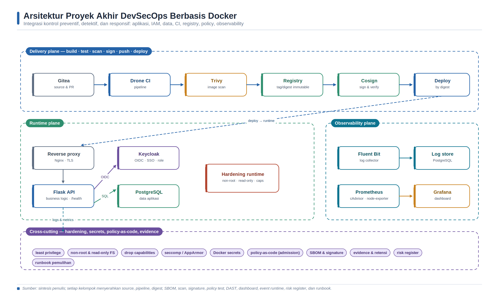

<a id="bab-17"></a>

# Bab 17 — Studi Kasus Terpadu: Platform Web Terkontainerisasi yang Aman dan Teramati

## Tujuan Pembelajaran dan Kompetensi Utama

- Mengintegrasikan kontrol keamanan dari source, build, image, deployment, identity, observability, dan runtime.
- Menyusun security gate end-to-end dengan kriteria PASS/FAIL dan evidence yang dapat ditelusuri.
- Menerapkan prinsip least privilege, artefak immutable, policy-as-code, dan respons insiden pada platform terpadu.
- Menganalisis residual risk serta mengomunikasikan keputusan rilis secara akademis dan profesional.

Bab ini menyatukan seluruh materi menjadi satu rancangan platform web sederhana. Tujuannya bukan membuat sistem produksi penuh, tetapi menunjukkan keterhubungan antar komponen: aplikasi, database, logging, metrics, identity provider, registry, dan pipeline.

| Lapisan | Komponen | Fungsi |
| --- | --- | --- |
| Edge | Nginx reverse proxy | Routing HTTP/HTTPS ke aplikasi internal |
| Application | Flask API | Business logic dan endpoint health |
| Data | PostgreSQL | Penyimpanan data aplikasi |
| Identity | Keycloak | Login OIDC, SSO, role |
| Logging | Fluent Bit + PostgreSQL | Pengumpulan dan pencarian log |
| Metrics | Prometheus + Grafana | Monitoring resource dan dashboard |
| Security | Trivy + hardening runtime | Scanning dan pembatasan privilege |
| Delivery | Gitea + Drone CI + Registry | Build-test-scan-push-deploy |

Proyek akhir mengintegrasikan kontrol preventif, detektif, dan responsif. Setiap kelompok wajib menyerahkan source, pipeline, image digest, SBOM, laporan scan, hasil verifikasi signature, policy test, DAST report, dashboard, event runtime, risk register, dan runbook pemulihan.



*Gambar 20. Arsitektur proyek akhir DevSecOps berbasis Docker.*

> Sumber: diolah penulis dari arsitektur buku serta NIST/OWASP/SLSA [14,16,19].

## Konsep Inti dan Landasan Teori

Proyek terpadu DevSecOps merupakan pengujian konsistensi antarkontrol. Keamanan tidak muncul karena setiap alat menghasilkan status hijau secara terpisah, melainkan karena requirement, identitas artefak, konfigurasi deployment, hasil pengujian, telemetry, dan keputusan risiko dapat dihubungkan. Prinsip defense-in-depth digunakan untuk memastikan kegagalan satu kontrol tidak langsung meniadakan seluruh jaminan. Least privilege membatasi blast radius, artefak immutable menjaga keterlacakan, observability menyediakan visibility, sedangkan policy dan incident learning menutup feedback loop.

### Integrasi Kontrol sebagai Sistem Assurance

Capstone DevSecOps menggabungkan requirement, source code, dependency, build, image, deployment, identity, observability, runtime, dan respons insiden. Tantangan utamanya bukan menyalakan semua alat, melainkan memastikan keluaran satu tahap menjadi input yang dapat dipercaya pada tahap berikutnya. NIST SSDF menempatkan persiapan organisasi, perlindungan perangkat lunak, produksi perangkat lunak aman, dan respons kerentanan sebagai praktik yang saling berhubungan [14]. OWASP DevSecOps Guideline dan model kematangan juga menekankan integrasi proses, manusia, dan teknologi, bukan otomasi tanpa ownership [16-18].

Sistem assurance memerlukan claim dan evidence. Claim dapat berbunyi bahwa image produksi berasal dari source yang direview. Evidence pendukung meliputi commit, identitas pipeline, provenance build, digest image, signature, hasil policy, dan manifest deployment. Jika salah satu tautan hilang, organisasi hanya mengetahui bahwa suatu image telah dipindai, bukan bahwa image itulah yang berasal dari commit dan kemudian dideploy. Identitas artefak berbasis digest karena itu menjadi benang merah utama.

### Trust Boundary dan Defense-in-Depth

Platform terpadu memiliki beberapa trust boundary: developer ke repository; repository ke runner; runner ke registry; control plane ke host; reverse proxy ke aplikasi; aplikasi ke database dan identity provider; serta collector ke backend observability. Setiap boundary memerlukan autentikasi, otorisasi, proteksi transport, minimisasi data, dan audit yang proporsional. Network segmentation mengurangi jalur komunikasi, tetapi service pada network yang sama tetap harus memverifikasi identitas dan input.

Defense-in-depth membagi kontrol menjadi preventif, detektif, responsif, dan korektif. Branch protection, code review, secret scanning, policy-as-code, signature verification, least privilege, dan network restriction bersifat preventif. Log, metric, alert, vulnerability monitoring, serta Falco bersifat detektif. Isolasi workload, pencabutan credential, dan penahanan rilis bersifat responsif. Patch, restore, post-incident review, dan pembaruan policy bersifat korektif. Satu alat dapat mendukung lebih dari satu kategori, tetapi tidak menggantikan seluruh lapisan.

### Security Gate dan Keputusan Risiko

Security gate adalah keputusan berbasis kriteria, bukan sekadar langkah pipeline. Setiap gate harus menyatakan input, versi tool, policy, threshold, kondisi PASS/FAIL, owner, evidence, dan mekanisme exception. Gate awal yang cepat—lint, unit test, SAST, dan secret scan—memberikan umpan balik murah. Gate dependency, SBOM, image scan, provenance, signature, IaC policy, DAST, dan runtime verification menambah kedalaman sesuai lifecycle. NIST SP 800-204D membahas integrasi keamanan supply chain dalam pipeline CI/CD dan perlindungan komponen, pipeline, serta artefak [114].

Threshold absolut seperti “nol temuan” sering tidak realistis dan dapat mendorong penyembunyian risiko. Keputusan perlu mempertimbangkan severity, exploitability, exposure, data, compensating control, dan SLA remediasi. Exception harus memiliki alasan, approver, owner, tanggal kedaluwarsa, dan rencana tindak lanjut. Temuan yang diabaikan tanpa rekam keputusan bukan exception, melainkan hilangnya akuntabilitas.

### Supply Chain, SBOM, dan Provenance

Software supply chain mencakup source, dependency, toolchain, runner, base image, registry, dan mekanisme distribusi. SBOM mencatat komponen, tetapi tidak membuktikan proses build atau keamanan komponen. Provenance menjelaskan subjek artefak, material, builder, dan proses yang menghasilkan artefak. Signature mengikat artefak dengan identitas penanda tangan. SLSA menyediakan persyaratan bertingkat untuk meningkatkan integritas build dan provenance [19,108]. Ketiganya saling melengkapi.

Pipeline harus menghindari pembangunan ulang saat promosi antarenvironment. Artefak dibangun satu kali, diverifikasi, lalu dipromosikan dengan digest yang sama. Jika staging dan produksi membangun ulang tag yang sama, dependency atau base image dapat berubah sehingga hasil test tidak lagi berlaku. Registry access, retention, immutable tag policy, dan signature verification perlu ditetapkan agar promosi tidak dapat mengganti content secara diam-diam.

### Identity, Secret, dan Least Privilege

Identitas manusia, service account, runner, dan workload harus terpisah. Token jangka panjang dengan scope luas meningkatkan blast radius. OIDC workload identity atau credential berumur pendek lebih mudah dibatasi dan diaudit. Secret tidak disimpan pada repository, image, log, atau artefak pipeline. Lifecycle secret mencakup penerbitan, distribusi, penggunaan, rotasi, pencabutan, dan respons kebocoran.

Least privilege diterapkan pada repository, pipeline, registry, host, container, database, Keycloak, dan observability. Runner yang dapat push image tidak otomatis memerlukan akses produksi. Aplikasi tidak memerlukan akun database admin. Collector log hanya memerlukan write pada tujuan tertentu. Pemisahan tugas mencegah satu identitas melakukan perubahan source, menyetujui, membangun, dan mendeploy tanpa kontrol tambahan.

### Observability dan Runtime Assurance

Pre-deployment gate bekerja pada representasi dan artefak; runtime menunjukkan perilaku aktual. Metric memantau availability, latency, error, dan saturation. Log menyediakan event terstruktur dan audit. Falco atau mekanisme runtime lain mendeteksi perilaku seperti shell interaktif, perubahan file sensitif, atau eskalasi privilege. Alert harus berorientasi pada tindakan dan memiliki runbook. Telemetry juga harus dilindungi karena dapat membawa data sensitif atau mengungkap arsitektur.

Health check yang PASS hanya membuktikan kondisi yang diperiksa. Endpoint dapat merespons 200 ketika otorisasi rusak, image tidak ditandatangani, atau log tidak terkirim. Acceptance test harus memisahkan fungsi, keamanan, supply chain, observability, dan recoverability. Negative test diperlukan untuk memastikan policy benar-benar menolak kondisi yang dilarang.

### Resiliensi, Respons Insiden, dan Pembelajaran

Platform aman tetap diasumsikan dapat mengalami insiden. NIST SP 800-61 Rev. 3 menghubungkan respons insiden dengan manajemen risiko dan fungsi govern, identify, protect, detect, respond, serta recover [141-142]. Capstone harus menyiapkan kontak, severity, evidence preservation, containment, eradication, recovery, dan post-incident review. Backup tanpa restore test dan rollback tanpa exercise tidak memberikan assurance yang memadai.

Skenario insiden laboratorium dapat berupa credential yang sengaja ditandai bocor, image dengan vulnerability yang diketahui, perubahan konfigurasi privileged, atau akses endpoint tanpa role. Tim mengumpulkan timeline, mengidentifikasi scope, menahan promosi, merotasi secret, memulihkan service, dan memperbarui kontrol. Fokus penilaian bukan kecepatan semata, melainkan kualitas keputusan, keterlacakan evidence, dan kemampuan mencegah pengulangan.

### Kriteria Keberhasilan Terpadu

Proyek dinyatakan berhasil apabila deployment dapat direproduksi, artefak dapat ditelusuri ke source, gate mempunyai bukti, akses mengikuti least privilege, service memenuhi fungsi, telemetry mendukung diagnosis, dan recovery telah diuji. Residual risk tetap harus dinyatakan. Daftar alat yang panjang tidak meningkatkan kematangan bila konfigurasi tidak dikelola, temuan tidak ditindaklanjuti, atau ownership tidak jelas. Hasil capstone yang akademis memperlihatkan hubungan antara teori, eksperimen, evidence, analisis, keterbatasan, dan rekomendasi perbaikan.

## Arsitektur Laboratorium dan Prasyarat Lingkungan

Arsitektur capstone terdiri atas reverse proxy, aplikasi API, PostgreSQL, identity provider, centralized logging, monitoring, registry, dan pipeline CI/CD. Seluruh komponen ditempatkan pada network yang dibatasi sesuai fungsi; artefak dirujuk dengan digest, sementara gate dan evidence menghubungkan source hingga runtime.

## Langkah Praktikum Eksploratif

1. Plan: perbarui threat model, aset, trust boundary, requirement, dan risk acceptance.

1. Code: lakukan review, unit/security regression test, SAST, dan secret scan.

1. Build: gunakan Dockerfile hardened, base image terkontrol, dan BuildKit secret.

1. Assure: hasilkan SBOM, scan dependensi/image, serta simpan report berdasarkan commit dan digest.

1. Release: push ke registry, sign image, hasilkan/arsipkan provenance, dan verifikasi identitas.

1. Deploy: jalankan policy-as-code, healthcheck, rollback check, dan least-privilege configuration.

1. Operate: pantau metric, log, dan runtime event; jalankan satu simulasi insiden terkontrol.

1. Learn: susun analisis residual risk, postmortem mini, dan daftar perbaikan berikutnya.

### Matriks Security Gate Proyek Akhir

| Gate | Minimum PASS | Evidence | Pemilik |
| --- | --- | --- | --- |
| Source | Review selesai; tidak ada secret valid | PR/review + gitleaks report | Developer/Reviewer |
| Code | Unit test lulus; SAST ERROR = 0 | JUnit + Semgrep JSON/SARIF | Developer |
| Dependency | SBOM valid; temuan ditriage | CycloneDX + Trivy report | AppSec |
| Image | Non-root; scan sesuai threshold | Dockerfile + image report | Platform |
| Release | Digest dan signature terverifikasi | Cosign output + provenance | Release engineer |
| Deploy | Policy dan healthcheck lulus | Conftest + deployment log | Operations |
| Runtime | Alert dan runbook diuji | Falco/log/metric + incident record | SecOps |

> Sumber: kebijakan baseline penulis; sesuaikan risk appetite institusi.

### Blueprint Compose Tingkat Tinggi

```yaml
# File ini hanya blueprint ringkas; implementasi nyata dipecah menjadi beberapa compose file.
services:
  proxy:       # Nginx, port 80/443
  app:         # Flask API, OIDC client
  db:          # PostgreSQL aplikasi
  keycloak:    # Identity provider
  keycloak-db: # PostgreSQL Keycloak
  fluent-bit:  # Log collector
  log-db:      # PostgreSQL log storage
  prometheus:  # Metrics scraper
  grafana:     # Dashboard
  registry:    # Private registry
networks:
  public:
  app-net:
  db-net:
  observability:
volumes:
  app-db-data:
  keycloak-db-data:
  grafana-data:
  prometheus-data:
  registry-data:
```

## Verifikasi dan Skenario Pengujian

[ ] Aplikasi dapat diakses melalui reverse proxy, bukan langsung dari port backend.

[ ] Login melalui Keycloak berhasil dan role digunakan untuk membatasi endpoint admin.

[ ] Data aplikasi tersimpan di PostgreSQL volume persisten dan backup pernah diuji.

[ ] Log aplikasi terkumpul di storage terpusat dan dapat dicari berdasarkan keyword.

[ ] Dashboard Grafana menampilkan metrics host/container dan minimal satu panel log.

[ ] Pipeline CI/CD menjalankan test dan Trivy scan sebelum push image ke registry.

[ ] Dokumentasi deployment memuat perintah start, stop, backup, restore, dan cleanup.

### Rubrik Penilaian Proyek Akhir

| Aspek | Bobot | Indikator nilai tinggi |
| --- | --- | --- |
| Fungsionalitas | 25% | Semua service berjalan, endpoint utama dapat diuji, healthcheck jelas |
| Reproducibility | 20% | Compose dan script dapat dijalankan ulang di mesin lain tanpa langkah tersembunyi |
| Security | 20% | Non-root, secret tidak hardcoded, scan image, network tertutup, least privilege |
| Observability | 15% | Metrics dan logs mudah dibaca, dashboard relevan, troubleshooting terdokumentasi |
| CI/CD | 10% | Pipeline otomatis, gagal pada test/scan, image tagged dengan commit |
| Laporan dan demo | 10% | Analisis tajam, screenshot cukup, mampu menjawab pertanyaan teknis |

## Troubleshooting dan Analisis Hasil

| Gejala | Penyebab yang mungkin | Tindakan korektif |
| --- | --- | --- |
| Gate berbeda antara lokal dan pipeline | Versi tool, input efektif, atau konfigurasi tidak sama | Pin versi; simpan konfigurasi efektif dan identitas artefak. |
| Service sehat tetapi security gate gagal | Healthcheck hanya memeriksa availability | Tinjau policy, scan, identity, signature, dan evidence secara terpisah. |
| Evidence tidak dapat ditelusuri | Commit, digest, waktu, atau owner tidak dicatat | Gunakan manifest evidence dan metadata yang konsisten. |
| Deployment gagal dipulihkan | Rollback, backup, atau credential rotation belum diuji | Lakukan recovery exercise dan dokumentasikan hasilnya. |

## Evaluasi dan Latihan Mandiri

1. Bagaimana membuktikan bahwa artefak yang diuji sama dengan artefak yang dideploy?
2. Kontrol mana yang bersifat preventif, detektif, responsif, dan korektif pada arsitektur capstone?
3. Mengapa healthcheck yang berhasil belum cukup untuk menyatakan release aman?
4. Bagaimana exception diterapkan tanpa menghilangkan akuntabilitas dan tanggal kedaluwarsa?
5. Residual risk apa yang masih tersisa setelah seluruh gate dinyatakan PASS?

---

# Daftar Pustaka dan Rujukan Teknis

1. Ferryas PENS. docker-intro. GitHub repository. https://github.com/ferryas-pens/docker-intro. Diakses 6 Juli 2026.
2. Docker Inc. Docker Documentation: Get Started, Docker Engine, Dockerfile Reference, Compose, Networking, Storage, and Volumes. https://docs.docker.com/. Diakses 6 Juli 2026.
3. Open Container Initiative. OCI Runtime Specification. https://opencontainers.org/. Diakses 6 Juli 2026.
4. PostgreSQL Global Development Group. PostgreSQL Documentation. https://www.postgresql.org/docs/. Diakses 6 Juli 2026.
5. Fluent Bit. Official Documentation. https://docs.fluentbit.io/. Diakses 6 Juli 2026.
6. Prometheus Authors. Prometheus Documentation. https://prometheus.io/docs/. Diakses 6 Juli 2026.
7. Grafana Labs. Grafana Documentation. https://grafana.com/docs/grafana/latest/. Diakses 6 Juli 2026.
8. OWASP Cheat Sheet Series. Docker Security Cheat Sheet. https://cheatsheetseries.owasp.org/cheatsheets/Docker_Security_Cheat_Sheet.html. Diakses 6 Juli 2026.
9. Aqua Security. Trivy Documentation. https://trivy.dev/docs/. Diakses 6 Juli 2026.
10. Keycloak. Keycloak Documentation. https://www.keycloak.org/documentation. Diakses 6 Juli 2026.
11. Gitea. Installation with Docker. https://docs.gitea.com/installation/install-with-docker. Diakses 6 Juli 2026.
12. Drone CI. Docker Pipeline Documentation. https://docs.drone.io/yaml/docker/. Diakses 6 Juli 2026.
13. Perpustakaan Nasional RI. Layanan ISBN dan petunjuk teknis pengajuan ISBN. https://isbn.perpusnas.go.id/ dan https://jdih.perpusnas.go.id/. Diakses 6 Juli 2026.
14. NIST. Secure Software Development Framework (SSDF) Version 1.1, SP 800-218. https://csrc.nist.gov/pubs/sp/800/218/final. Diakses 13 Agustus 2026.
15. NIST. Secure Software Development Framework Version 1.2, Initial Public Draft / SP 800-218 Rev. 1. https://csrc.nist.gov/pubs/sp/800/218/r1/ipd. Diakses 13 Agustus 2026.
16. OWASP Foundation. OWASP DevSecOps Guideline v0.2. https://owasp.org/www-project-devsecops-guideline/latest/. Diakses 13 Agustus 2026.
17. OWASP Foundation. DevSecOps Maturity Model. https://owasp.org/www-project-devsecops-maturity-model/. Diakses 13 Agustus 2026.
18. OWASP Foundation. Software Assurance Maturity Model (SAMM). https://owaspsamm.org/. Diakses 13 Agustus 2026.
19. SLSA. Supply-chain Levels for Software Artifacts, Specification v1.2. https://slsa.dev/spec/v1.2/. Diakses 13 Agustus 2026.
20. Sigstore. Cosign Documentation: Signing and Verifying Artifacts. https://docs.sigstore.dev/cosign/. Diakses 13 Agustus 2026.
21. CycloneDX. CycloneDX Specification and Documentation. https://cyclonedx.org/docs/. Diakses 13 Agustus 2026.
22. SPDX. Software Package Data Exchange Specification. https://spdx.dev/. Diakses 13 Agustus 2026.
23. Aqua Security. Trivy Documentation. https://trivy.dev/docs/. Diakses 13 Agustus 2026.
24. Anchore. Syft Documentation. https://github.com/anchore/syft. Diakses 13 Agustus 2026.
25. Semgrep. Semgrep Documentation. https://semgrep.dev/docs/. Diakses 13 Agustus 2026.
26. Gitleaks. Gitleaks Documentation and Repository. https://github.com/gitleaks/gitleaks. Diakses 13 Agustus 2026.
27. OWASP ZAP. ZAP Docker and Baseline Scan Documentation. https://www.zaproxy.org/docs/docker/baseline-scan/. Diakses 13 Agustus 2026.
28. Open Policy Agent. OPA Documentation and CI/CD Guidance. https://openpolicyagent.org/docs/cicd. Diakses 13 Agustus 2026.
29. Falco Project. Falco Documentation. https://falco.org/docs/. Diakses 13 Agustus 2026.
30. Docker Inc. Build Secrets and Build Variables. https://docs.docker.com/build/building/secrets/. Diakses 13 Agustus 2026.
31. Docker Inc. Rootless Mode. https://docs.docker.com/engine/security/rootless/. Diakses 13 Agustus 2026.
32. ByteByteGo. DevOps and CI/CD Visual Guides. https://bytebytego.com/guides/devops-cicd/. Diakses 13 Agustus 2026.
33. ByteByteGo. How to Design a Secure System. https://bytebytego.com/guides/how-do-we-design-a-secure-system/. Diakses 13 Agustus 2026.
34. OpenSSF. OpenSSF Scorecard. https://scorecard.dev/. Diakses 13 Agustus 2026.
35. Wahyudi, Bisyron, dan Sonny Polyanto. DevOps Introduction: Digital Transformation. Materi pelatihan, Agustus 2022, 51 halaman.
36. Docker Inc. What is Docker? Docker Documentation. https://docs.docker.com/get-started/docker-overview/. Diakses 13 Agustus 2026.
37. Linux Kernel Documentation. Namespaces. https://docs.kernel.org/admin-guide/namespaces/index.html. Diakses 13 Agustus 2026.
38. Linux Kernel Documentation. Control Group v2. https://docs.kernel.org/admin-guide/cgroup-v2.html. Diakses 13 Agustus 2026.
39. Open Container Initiative. OCI Overview: Runtime, Image, and Distribution Specifications. https://opencontainers.org/. Diakses 13 Agustus 2026.
40. Open Container Initiative. OpenContainers Image Specification. https://specs.opencontainers.org/image-spec/. Diakses 13 Agustus 2026.
41. ByteByteGo. How Does Docker Work? https://bytebytego.com/guides/how-does-docker-work/. Diakses 13 Agustus 2026.
42. Docker Inc. Storage Drivers: Images, Layers, Copy-on-Write, and Volumes. https://docs.docker.com/engine/storage/drivers/. Diakses 13 Agustus 2026.
43. Docker Inc. Networking Overview. https://docs.docker.com/engine/network/. Diakses 13 Agustus 2026.
44. Docker Inc. Docker Engine Security. https://docs.docker.com/engine/security/. Diakses 13 Agustus 2026.
45. Docker Inc. Building Best Practices. https://docs.docker.com/build/building/best-practices/. Diakses 13 Agustus 2026.
46. Docker Inc. Rootless Mode. https://docs.docker.com/engine/security/rootless/. Diakses 13 Agustus 2026.
47. Docker Inc. Networking Overview. https://docs.docker.com/engine/network/. Diakses 13 Agustus 2026.
48. Docker Inc. Bridge Network Driver. https://docs.docker.com/engine/network/drivers/bridge/. Diakses 13 Agustus 2026.
49. Docker Inc. Port Publishing and Mapping. https://docs.docker.com/engine/network/port-publishing/. Diakses 13 Agustus 2026.
50. Docker Inc. Storage Overview. https://docs.docker.com/engine/storage/. Diakses 13 Agustus 2026.
51. Docker Inc. Volumes. https://docs.docker.com/engine/storage/volumes/. Diakses 13 Agustus 2026.
52. Docker Inc. Bind Mounts. https://docs.docker.com/engine/storage/bind-mounts/. Diakses 13 Agustus 2026.
53. Docker Inc. tmpfs Mounts. https://docs.docker.com/engine/storage/tmpfs/. Diakses 13 Agustus 2026.
54. ByteByteGo. Top 8 Must-Know Docker Concepts. https://bytebytego.com/guides/top-8-must-know-docker-concepts/. Diakses 13 Agustus 2026.
55. Docker Inc. Compose File Reference and Compose Specification. https://docs.docker.com/reference/compose-file/. Diakses 13 Agustus 2026.
56. Docker Inc. Networking in Compose. https://docs.docker.com/compose/how-tos/networking/. Diakses 13 Agustus 2026.
57. Docker Inc. Control Startup and Shutdown Order in Compose. https://docs.docker.com/compose/how-tos/startup-order/. Diakses 13 Agustus 2026.
58. Docker Inc. Environment Variables in Compose: Best Practices. https://docs.docker.com/compose/how-tos/environment-variables/best-practices/. Diakses 13 Agustus 2026.
59. Docker Inc. Manage Secrets Securely in Docker Compose. https://docs.docker.com/compose/how-tos/use-secrets/. Diakses 13 Agustus 2026.
60. OWASP Foundation. CI/CD Security Cheat Sheet. https://cheatsheetseries.owasp.org/cheatsheets/CI_CD_Security_Cheat_Sheet.html. Diakses 14 Agustus 2026.
61. OWASP Foundation. OWASP Top 10 CI/CD Security Risks. https://owasp.org/www-project-top-10-ci-cd-security-risks/. Diakses 14 Agustus 2026.
62. Gitea. Protected Branches. https://docs.gitea.com/usage/access-control/protected-branches. Diakses 14 Agustus 2026.
63. Gitea. API Usage and Access Token Permissions. https://docs.gitea.com/development/api-usage. Diakses 14 Agustus 2026.
64. Drone CI. Pipeline Configuration. https://docs.drone.io/pipeline/configuration/. Diakses 14 Agustus 2026.
65. Drone CI. Secret Extension. https://docs.drone.io/extensions/secret/. Diakses 14 Agustus 2026.
66. Drone CI. Pipeline Signatures. https://docs.drone.io/signature/. Diakses 14 Agustus 2026.
67. Docker Inc. Build Attestations. https://docs.docker.com/build/metadata/attestations/. Diakses 14 Agustus 2026.
68. Docker Inc. SBOM Attestations. https://docs.docker.com/build/metadata/attestations/sbom/. Diakses 14 Agustus 2026.
69. Docker Inc. Docker Engine Security and Daemon Attack Surface. https://docs.docker.com/engine/security/. Diakses 14 Agustus 2026.
70. Sigstore. Cosign Signing and Verifying Container Images. https://docs.sigstore.dev/cosign/. Diakses 14 Agustus 2026.
71. Aqua Security. Trivy Configuration: Exit Code, Severity Filtering, Image and Misconfiguration Scanning. https://trivy.dev/docs/latest/. Diakses 14 Agustus 2026.
72. OWASP Foundation. Threat Modeling. https://owasp.org/www-community/Threat_Modeling. Diakses 14 Agustus 2026.
73. OWASP Foundation. Threat Modeling Cheat Sheet. https://cheatsheetseries.owasp.org/cheatsheets/Threat_Modeling_Cheat_Sheet.html. Diakses 14 Agustus 2026.
74. NIST. SP 800-154, Guide to Data-Centric System Threat Modeling, Initial Public Draft. https://csrc.nist.gov/pubs/sp/800/154/ipd. Diakses 14 Agustus 2026.
75. NIST. SP 800-30 Rev. 1, Guide for Conducting Risk Assessments. https://csrc.nist.gov/pubs/sp/800/30/r1/final. Diakses 14 Agustus 2026.
76. OWASP Foundation. Attack Surface Analysis Cheat Sheet. https://cheatsheetseries.owasp.org/cheatsheets/Attack_Surface_Analysis_Cheat_Sheet.html. Diakses 14 Agustus 2026.
77. Microsoft. Create a Threat Model Using Data-Flow Diagram Elements. https://learn.microsoft.com/en-us/training/modules/tm-create-a-threat-model-using-foundational-data-flow-diagram-elements/. Diakses 14 Agustus 2026.
78. Microsoft. Threat Modeling Tool and STRIDE Threat Categories. https://learn.microsoft.com/en-us/azure/security/develop/threat-modeling-tool. Diakses 14 Agustus 2026.
79. OWASP Foundation. Application Security Verification Standard (ASVS). https://owasp.org/www-project-application-security-verification-standard/. Diakses 14 Agustus 2026.
80. NIST. Secure Software Development Framework (SSDF) Version 1.1, SP 800-218. https://csrc.nist.gov/pubs/sp/800/218/final. Diakses 14 Agustus 2026.
81. OWASP Foundation. Secure Coding Practices Quick Reference Guide. https://owasp.org/www-project-secure-coding-practices-quick-reference-guide/. Diakses 14 Agustus 2026.
82. OWASP Foundation. Secure Code Review Cheat Sheet. https://cheatsheetseries.owasp.org/cheatsheets/Secure_Code_Review_Cheat_Sheet.html. Diakses 14 Agustus 2026.
83. OWASP Foundation. Input Validation Cheat Sheet. https://cheatsheetseries.owasp.org/cheatsheets/Input_Validation_Cheat_Sheet.html. Diakses 14 Agustus 2026.
84. OWASP Foundation. Application Security Verification Standard. https://owasp.org/www-project-application-security-verification-standard/. Diakses 14 Agustus 2026.
85. MITRE. CWE-89: Improper Neutralization of Special Elements used in an SQL Command. https://cwe.mitre.org/data/definitions/89.html. Diakses 14 Agustus 2026.
86. MITRE. CWE-79: Improper Neutralization of Input During Web Page Generation. https://cwe.mitre.org/data/definitions/79.html. Diakses 14 Agustus 2026.
87. Semgrep. Semgrep Code Overview. https://docs.semgrep.dev/semgrep-code/overview. Diakses 14 Agustus 2026.
88. Semgrep. Writing and Testing Rules. https://docs.semgrep.dev/writing-rules/overview dan https://docs.semgrep.dev/writing-rules/testing-rules. Diakses 14 Agustus 2026.
89. Gitleaks. Find Secrets with Gitleaks. https://github.com/gitleaks/gitleaks. Diakses 14 Agustus 2026.
90. OWASP Foundation. Secrets Management Cheat Sheet. https://cheatsheetseries.owasp.org/cheatsheets/Secrets_Management_Cheat_Sheet.html. Diakses 14 Agustus 2026.
91. Cybersecurity and Infrastructure Security Agency. 2025 Minimum Elements for a Software Bill of Materials. https://www.cisa.gov/resources-tools/resources/2025-minimum-elements-software-bill-materials-sbom. Diakses 14 Agustus 2026.
92. OWASP CycloneDX. CycloneDX Bill of Materials Standard dan Specification Overview. https://cyclonedx.org/. Diakses 14 Agustus 2026.
93. OWASP CycloneDX. Vulnerability Exploitability eXchange (VEX). https://cyclonedx.org/capabilities/vex/. Diakses 14 Agustus 2026.
94. SPDX Project, Linux Foundation. SPDX Specification dan Overview. https://spdx.dev/use/specifications/. Diakses 14 Agustus 2026.
95. OWASP Foundation. OWASP Dependency-Check. https://owasp.org/www-project-dependency-check/. Diakses 14 Agustus 2026.
96. OWASP Foundation. OWASP Dependency-Track. https://owasp.org/www-project-dependency-track/. Diakses 14 Agustus 2026.
97. Open Source Vulnerabilities. OSV Schema and Database. https://osv.dev/. Diakses 14 Agustus 2026.
98. Package URL Project. Package-URL Specification. https://github.com/package-url/purl-spec. Diakses 14 Agustus 2026.
99. Anchore. Syft: SBOM Generator for Container Images and Filesystems. https://github.com/anchore/syft. Diakses 14 Agustus 2026.
100. Aqua Security. Trivy SBOM Scanning Documentation. https://trivy.dev/docs/latest/target/sbom/. Diakses 14 Agustus 2026.
101. Cybersecurity and Infrastructure Security Agency. Known Exploited Vulnerabilities Catalog. https://www.cisa.gov/known-exploited-vulnerabilities-catalog. Diakses 14 Agustus 2026.
102. Forum of Incident Response and Security Teams. Exploit Prediction Scoring System. https://www.first.org/epss/. Diakses 14 Agustus 2026.
103. SPDX Project. SPDX License List. https://spdx.org/licenses/. Diakses 14 Agustus 2026.
104. Docker, Inc. Build Secrets. https://docs.docker.com/build/building/secrets/. Diakses 14 Agustus 2026.
105. Docker, Inc. Multi-stage Builds dan Building Best Practices. https://docs.docker.com/build/building/multi-stage/; https://docs.docker.com/build/building/best-practices/. Diakses 14 Agustus 2026.
106. Docker, Inc. Build Attestations dan SLSA Provenance Attestations. https://docs.docker.com/build/metadata/attestations/; https://docs.docker.com/build/metadata/attestations/slsa-provenance/. Diakses 14 Agustus 2026.
107. Docker, Inc. SBOM Attestations dan Docker Buildx Build Reference. https://docs.docker.com/build/metadata/attestations/sbom/; https://docs.docker.com/reference/cli/docker/buildx/build/. Diakses 14 Agustus 2026.
108. SLSA Community. SLSA Specification v1.2: Build Track Requirements and Provenance. https://slsa.dev/spec/v1.2/. Diakses 14 Agustus 2026.
109. Sigstore. Cosign Signing with Containers dan Signing Overview. https://docs.sigstore.dev/cosign/signing/signing_with_containers/; https://docs.sigstore.dev/cosign/signing/overview/. Diakses 14 Agustus 2026.
110. Sigstore. Cosign Verify. https://docs.sigstore.dev/cosign/verifying/verify/. Diakses 14 Agustus 2026.
111. Open Container Initiative. OCI Image Format Specification dan Descriptor. https://github.com/opencontainers/image-spec; https://github.com/opencontainers/image-spec/blob/main/descriptor.md. Diakses 14 Agustus 2026.
112. in-toto Project. in-toto Statement v1. https://in-toto.io/Statement/v1. Diakses 14 Agustus 2026.
113. Aqua Security. Trivy Container Image dan Terminology Documentation. https://trivy.dev/docs/latest/guide/target/container_image/; https://trivy.dev/docs/latest/references/terminology/. Diakses 14 Agustus 2026.
114. National Institute of Standards and Technology. NIST SP 800-204D: Strategies for the Integration of Software Supply Chain Security in DevSecOps CI/CD Pipelines. https://doi.org/10.6028/NIST.SP.800-204D. Diakses 14 Agustus 2026.
115. Sigstore. Policy Controller Overview. https://docs.sigstore.dev/policy-controller/overview/. Diakses 14 Agustus 2026.
116. OWASP Foundation. Web Security Testing Guide v4.2 (current stable). https://owasp.org/www-project-web-security-testing-guide/v42/. Diakses 14 Agustus 2026.
117. OWASP Foundation. Application Security Verification Standard 5.0.0. https://owasp.org/www-project-application-security-verification-standard/. Diakses 14 Agustus 2026.
118. OWASP Foundation. OWASP API Security Top 10 - 2023. https://owasp.org/API-Security/editions/2023/en/0x11-t10/. Diakses 14 Agustus 2026.
119. ZAP Development Team. ZAP Baseline Scan. https://www.zaproxy.org/docs/docker/baseline-scan/. Diakses 14 Agustus 2026.
120. ZAP Development Team. ZAP API Scan. https://www.zaproxy.org/docs/docker/api-scan/. Diakses 14 Agustus 2026.
121. ZAP Development Team. ZAP Automation Framework dan exitStatus Job. https://www.zaproxy.org/docs/desktop/addons/automation-framework/; https://www.zaproxy.org/docs/desktop/addons/automation-framework/job-exitstatus/. Diakses 14 Agustus 2026.
122. ZAP Development Team. Automation Framework activeScan Job dan activeScan-config Job. https://www.zaproxy.org/docs/desktop/addons/automation-framework/job-ascan/; https://www.zaproxy.org/docs/desktop/addons/automation-framework/job-ascanconfig/. Diakses 14 Agustus 2026.
123. ZAP Development Team. Authentication Helper dan Automation Framework Authentication. https://www.zaproxy.org/docs/desktop/addons/authentication-helper/; https://www.zaproxy.org/docs/desktop/addons/automation-framework/authentication/. Diakses 14 Agustus 2026.
124. ZAP Development Team. Alert Filters. https://www.zaproxy.org/docs/desktop/addons/alert-filters/. Diakses 14 Agustus 2026.
125. OpenAPI Initiative. OpenAPI Specification. https://github.com/OAI/OpenAPI-Specification. Diakses 14 Agustus 2026.
126. IETF. RFC 9110: HTTP Semantics. https://www.rfc-editor.org/rfc/rfc9110. Diakses 14 Agustus 2026.
127. Schemathesis Project. Schemathesis Documentation: Property-based and Stateful API Testing. https://schemathesis.readthedocs.io/. Diakses 14 Agustus 2026.
128. National Institute of Standards and Technology. NIST SP 800-115: Technical Guide to Information Security Testing and Assessment. https://doi.org/10.6028/NIST.SP.800-115. Diakses 14 Agustus 2026.
129. OWASP Foundation. Authorization Testing Automation Cheat Sheet dan API Broken Object Level Authorization Test. https://cheatsheetseries.owasp.org/cheatsheets/Authorization_Testing_Automation_Cheat_Sheet.html; https://owasp.org/www-project-web-security-testing-guide/latest/4-Web_Application_Security_Testing/12-API_Testing/02-API_Broken_Object_Level_Authorization. Diakses 14 Agustus 2026.
130. Open Policy Agent. OPA Documentation: Overview. https://www.openpolicyagent.org/docs. Diakses 14 Agustus 2026.
131. Open Policy Agent. Policy Language (Rego), Strict Mode, Schema, dan Policy Testing. https://www.openpolicyagent.org/docs/policy-language; https://www.openpolicyagent.org/docs/policy-testing. Diakses 14 Agustus 2026.
132. Open Policy Agent. Conftest Documentation: Evaluating and Verifying Policies. https://www.conftest.dev/. Diakses 14 Agustus 2026.
133. The Falco Project. Falco Documentation: Runtime Security, Rules, dan Alerts. https://falco.org/docs/. Diakses 14 Agustus 2026.
134. The Falco Project. Falco Rules: Basic Elements, Conditions, Outputs, dan Custom Ruleset. https://falco.org/docs/concepts/rules/. Diakses 14 Agustus 2026.
135. The Falco Project. Supported Fields dan Rules Examples. https://falco.org/docs/reference/rules/supported-fields/; https://falco.org/docs/reference/rules/examples/. Diakses 14 Agustus 2026.
136. The Falco Project. Deploy Falco as a Container dan Kernel Event Sources. https://falco.org/docs/setup/container/; https://falco.org/docs/concepts/event-sources/kernel/. Diakses 14 Agustus 2026.
137. Docker, Inc. Docker Engine Security dan docker container run Security Options. https://docs.docker.com/engine/security/; https://docs.docker.com/reference/cli/docker/container/run/. Diakses 14 Agustus 2026.
138. Docker, Inc. Seccomp Security Profiles for Docker. https://docs.docker.com/engine/security/seccomp/. Diakses 14 Agustus 2026.
139. Docker, Inc. AppArmor Security Profiles for Docker. https://docs.docker.com/engine/security/apparmor/. Diakses 14 Agustus 2026.
140. Docker, Inc. Rootless Mode, User Namespace, dan Compose Service Reference. https://docs.docker.com/engine/security/rootless/; https://docs.docker.com/engine/security/userns-remap/; https://docs.docker.com/reference/compose-file/services/. Diakses 14 Agustus 2026.
141. National Institute of Standards and Technology. NIST SP 800-61 Rev. 3: Incident Response Recommendations and Considerations for Cybersecurity Risk Management. https://doi.org/10.6028/NIST.SP.800-61r3. April 2025.
142. National Institute of Standards and Technology. The NIST Cybersecurity Framework (CSF) 2.0. https://doi.org/10.6028/NIST.CSWP.29. Februari 2024.
143. National Institute of Standards and Technology. NIST SP 800-190: Application Container Security Guide. https://doi.org/10.6028/NIST.SP.800-190. September 2017.
144. MITRE. MITRE ATT&CK Enterprise Matrix - Containers. https://attack.mitre.org/matrices/enterprise/containers/. Diakses 14 Agustus 2026.
145. Cloud Native Computing Foundation TAG Security. Cloud Native Security Whitepaper v2. https://tag-security.cncf.io/community/resources/security-whitepaper/v2/cloud-native-security-whitepaper/. Diakses 14 Agustus 2026.
146. Docker, Inc. docker inspect. https://docs.docker.com/reference/cli/docker/inspect/. Diakses 14 Agustus 2026.
147. Docker, Inc. docker container logs. https://docs.docker.com/reference/cli/docker/container/logs/. Diakses 14 Agustus 2026.
148. Docker, Inc. docker system events. https://docs.docker.com/reference/cli/docker/system/events/. Diakses 14 Agustus 2026.
149. Docker, Inc. Docker Container Command Reference: diff, top, stats, pause, dan network operations. https://docs.docker.com/reference/cli/docker/container/. Diakses 14 Agustus 2026.
150. Cybersecurity and Infrastructure Security Agency. Federal Government Cybersecurity Incident and Vulnerability Response Playbooks. https://www.cisa.gov/resources-tools/resources/federal-government-cybersecurity-incident-and-vulnerability-response-playbooks. Diakses 14 Agustus 2026.
