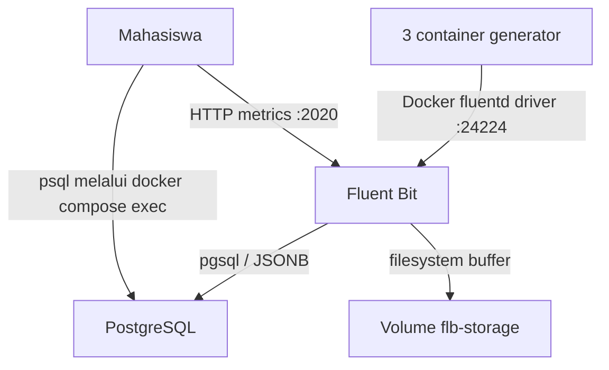

# Cheatsheet Bab 6 — Centralized Logging dengan Fluent Bit dan PostgreSQL

 Praktikum dirancang untuk Bash pada Linux atau WSL 2 di Windows.

> **Koreksi terhadap Bab 6.** Plugin keluaran PostgreSQL Fluent Bit menyimpan record pada kolom `tag`, `time`, dan `data`. Konfigurasi ini tidak memakai `Schema` maupun `Timestamp_Key`. Schema `logs` dipilih melalui `search_path` akun PostgreSQL. Pendekatan tersebut selaras dengan dokumentasi plugin PostgreSQL Fluent Bit 4.2.

| Kotak | Nama file | Fungsi |
|---:|---|---|
| 1 | `.env.example` | Template variabel dan credential sintetis laboratorium |
| 2 | `.gitignore` | Mencegah secret dan artefak lokal masuk repository |
| 3 | `compose.yaml` | Mendefinisikan PostgreSQL, Fluent Bit, dan tiga log generator |
| 4 | `init/01-init-logging.sh` | Membuat role, schema, tabel, indeks, view, dan privilege |
| 5 | `fluent-bit/fluent-bit.conf` | Mengatur input Forward, buffering, monitoring, dan output PostgreSQL |
| 6 | `queries/analysis.sql` | Menyediakan query analisis dan verifikasi log |
| 7 | `scripts/generate-logs.sh` | Membuat ulang tiga generator agar menghasilkan event uji |
| 8 | `scripts/test-buffering.sh` | Menguji antrean saat PostgreSQL tidak tersedia sementara |

## Arsitektur Ringkas



Docker Engine—bukan container generator—menjalankan logging driver. Karena itu, `fluentd-address` menunjuk port collector yang dipublikasikan pada host (`127.0.0.1:24224`), bukan nama service Compose. PostgreSQL tidak dipublikasikan ke host; Fluent Bit mengaksesnya melalui jaringan internal `logging-net`.

## Kotak Perintah A — Menyiapkan Direktori Bab 6

```bash
mkdir -p ~/docker-lab/bab-6/{init,fluent-bit,queries,scripts}
cd ~/docker-lab/bab-6
```

Struktur yang akan dibuat:

```text
bab-6/
├── .env.example
├── .env
├── .gitignore
├── compose.yaml
├── fluent-bit/
│   └── fluent-bit.conf
├── init/
│   └── 01-init-logging.sh
├── queries/
│   └── analysis.sql
└── scripts/
    ├── generate-logs.sh
    └── test-buffering.sh
```

## Kotak Script 1 — File `.env.example`

> **Nama file:** `.env.example`  
> **Lokasi:** `~/docker-lab/bab-6/.env.example`  
> **Buka editor:** `nano .env.example`  
> **Tujuan:** memusatkan parameter lab tanpa menaruh credential aktif pada `compose.yaml`.

```dotenv
POSTGRES_DB=labdb
POSTGRES_USER=labadmin
POSTGRES_PASSWORD=labadminpass123
FLUENTBIT_DB_USER=fluentbit_user
FLUENTBIT_DB_PASSWORD=fluentbitpass123
```

Aktifkan konfigurasi lokal:

```bash
cp .env.example .env
chmod 600 .env
```

Nilai tersebut hanya untuk laptop laboratorium. File `.env` bukan secret manager dan tidak boleh digunakan sebagai pola penyimpanan secret di lingkungan produksi.

## Kotak Script 2 — File `.gitignore`

> **Nama file:** `.gitignore`  
> **Lokasi:** `~/docker-lab/bab-6/.gitignore`  
> **Buka editor:** `nano .gitignore`

```gitignore
.env
*.log
reports/
```

Volume PostgreSQL dan buffer Fluent Bit dikelola Docker sehingga tidak perlu dimasukkan ke repository.

## Kotak Script 3 — File `compose.yaml`

> **Nama file:** `compose.yaml`  
> **Lokasi:** `~/docker-lab/bab-6/compose.yaml`  
> **Buka editor:** `nano compose.yaml`  
> **Petunjuk:** gunakan spasi, bukan tab. Semua nilai `logging.options` sengaja ditulis sebagai string.

```yaml
services:
  postgres-db:
    image: postgres:16-alpine
    environment:
      POSTGRES_DB: ${POSTGRES_DB}
      POSTGRES_USER: ${POSTGRES_USER}
      POSTGRES_PASSWORD: ${POSTGRES_PASSWORD}
      FLUENTBIT_DB_USER: ${FLUENTBIT_DB_USER}
      FLUENTBIT_DB_PASSWORD: ${FLUENTBIT_DB_PASSWORD}
    volumes:
      - pg-data:/var/lib/postgresql/data
      - ./init:/docker-entrypoint-initdb.d:ro
    networks:
      - logging-net
    healthcheck:
      test:
        - CMD-SHELL
        - "pg_isready -U $${POSTGRES_USER} -d $${POSTGRES_DB}"
      interval: 5s
      timeout: 5s
      retries: 12
      start_period: 10s
    restart: unless-stopped

  fluent-bit:
    image: fluent/fluent-bit:4.2.8
    environment:
      POSTGRES_DB: ${POSTGRES_DB}
      FLUENTBIT_DB_USER: ${FLUENTBIT_DB_USER}
      FLUENTBIT_DB_PASSWORD: ${FLUENTBIT_DB_PASSWORD}
    volumes:
      - ./fluent-bit/fluent-bit.conf:/fluent-bit/etc/fluent-bit.conf:ro
      - flb-storage:/var/log/flb-storage
    ports:
      - "127.0.0.1:24224:24224"
      - "127.0.0.1:2020:2020"
    networks:
      - logging-net
    depends_on:
      postgres-db:
        condition: service_healthy
    security_opt:
      - no-new-privileges:true
    restart: unless-stopped

  generator-auth:
    image: alpine:3.20
    command:
      - /bin/sh
      - -c
      - |
        i=1
        while [ "$$i" -le 20 ]; do
          printf '{"service":"auth","severity":"INFO","event":"login_test","sequence":%s}\n' "$$i"
          i=$$((i + 1))
          sleep 1
        done
    logging:
      driver: fluentd
      options:
        fluentd-address: "127.0.0.1:24224"
        fluentd-async: "true"
        tag: "docker.{{.Name}}"
    depends_on:
      - fluent-bit

  generator-api:
    image: alpine:3.20
    command:
      - /bin/sh
      - -c
      - |
        i=1
        while [ "$$i" -le 20 ]; do
          printf '{"service":"api","severity":"WARN","event":"latency_test","duration_ms":%s}\n' "$$((i * 10))"
          i=$$((i + 1))
          sleep 1
        done
    logging:
      driver: fluentd
      options:
        fluentd-address: "127.0.0.1:24224"
        fluentd-async: "true"
        tag: "docker.{{.Name}}"
    depends_on:
      - fluent-bit

  generator-worker:
    image: alpine:3.20
    command:
      - /bin/sh
      - -c
      - |
        i=1
        while [ "$$i" -le 20 ]; do
          printf '{"service":"worker","severity":"ERROR","event":"retry_test","attempt":%s}\n' "$$i"
          i=$$((i + 1))
          sleep 1
        done
    logging:
      driver: fluentd
      options:
        fluentd-address: "127.0.0.1:24224"
        fluentd-async: "true"
        tag: "docker.{{.Name}}"
    depends_on:
      - fluent-bit

volumes:
  pg-data:
  flb-storage:

networks:
  logging-net:
    driver: bridge
```

`fluentd-async: "true"` membuat Docker mencoba tersambung di latar belakang sehingga kegagalan collector tidak langsung menggagalkan startup container. Buffer driver Docker tetap terbatas dan berbeda dari buffer filesystem Fluent Bit; keduanya tidak menjamin kehilangan data mustahil terjadi.

## Kotak Script 4 — File `init/01-init-logging.sh`

> **Nama file:** `01-init-logging.sh`  
> **Lokasi:** `~/docker-lab/bab-6/init/01-init-logging.sh`  
> **Buka editor:** `nano init/01-init-logging.sh`  
> **Tujuan:** membuat objek database dengan nama dan tipe kolom yang sesuai kontrak plugin PostgreSQL Fluent Bit.

```bash
#!/usr/bin/env bash
set -Eeuo pipefail

: "${POSTGRES_USER:?POSTGRES_USER belum diatur}"
: "${POSTGRES_DB:?POSTGRES_DB belum diatur}"
: "${FLUENTBIT_DB_USER:?FLUENTBIT_DB_USER belum diatur}"
: "${FLUENTBIT_DB_PASSWORD:?FLUENTBIT_DB_PASSWORD belum diatur}"

psql \
  --set=ON_ERROR_STOP=1 \
  --username "$POSTGRES_USER" \
  --dbname "$POSTGRES_DB" \
  --set=fb_user="$FLUENTBIT_DB_USER" \
  --set=fb_password="$FLUENTBIT_DB_PASSWORD" <<'SQL'
SELECT format(
    'CREATE ROLE %I LOGIN PASSWORD %L',
    :'fb_user',
    :'fb_password'
)
WHERE NOT EXISTS (
    SELECT 1 FROM pg_roles WHERE rolname = :'fb_user'
)
\gexec

CREATE SCHEMA IF NOT EXISTS logs;

CREATE TABLE IF NOT EXISTS logs.fluentbit (
    tag  TEXT NOT NULL,
    time TIMESTAMP WITHOUT TIME ZONE NOT NULL,
    data JSONB NOT NULL
);

CREATE INDEX IF NOT EXISTS idx_fluentbit_time
    ON logs.fluentbit (time DESC);

CREATE INDEX IF NOT EXISTS idx_fluentbit_tag
    ON logs.fluentbit (tag);

CREATE INDEX IF NOT EXISTS idx_fluentbit_data_gin
    ON logs.fluentbit USING GIN (data);

CREATE OR REPLACE VIEW logs.recent_logs AS
SELECT
    time,
    tag,
    replace(data ->> 'container_name', '/', '') AS container_name,
    data ->> 'source' AS source,
    left(data ->> 'log', 200) AS log_preview
FROM logs.fluentbit
ORDER BY time DESC
LIMIT 100;

SELECT format(
    'ALTER ROLE %I IN DATABASE %I SET search_path TO logs, public',
    :'fb_user',
    current_database()
)
\gexec

SELECT format('GRANT USAGE, CREATE ON SCHEMA logs TO %I', :'fb_user')
\gexec

SELECT format(
    'GRANT SELECT, INSERT ON TABLE logs.fluentbit TO %I',
    :'fb_user'
)
\gexec

SELECT format('GRANT SELECT ON TABLE logs.recent_logs TO %I', :'fb_user')
\gexec
SQL
```

Hak `CREATE` pada schema diperlukan karena plugin PostgreSQL dapat melakukan bootstrap tabel. Untuk produksi, proses bootstrap sebaiknya dipisahkan dari akun ingest; setelah schema stabil, evaluasi pencabutan hak DDL dan uji kembali kompatibilitas plugin.

## Kotak Script 5 — File `fluent-bit/fluent-bit.conf`

> **Nama file:** `fluent-bit.conf`  
> **Lokasi:** `~/docker-lab/bab-6/fluent-bit/fluent-bit.conf`  
> **Buka editor:** `nano fluent-bit/fluent-bit.conf`  
> **Tujuan:** menerima protokol Forward, menahan backlog pada volume, serta meneruskan record ke PostgreSQL dan `stdout`.

```ini
[SERVICE]
    Flush                     1
    Daemon                    Off
    Log_Level                 info
    storage.path              /var/log/flb-storage
    storage.sync              normal
    storage.checksum          on
    storage.backlog.mem_limit 10M
    HTTP_Server               On
    HTTP_Listen               0.0.0.0
    HTTP_Port                 2020

[INPUT]
    Name          forward
    Listen        0.0.0.0
    Port          24224
    Mem_Buf_Limit 10M
    storage.type  filesystem

[OUTPUT]
    Name                     pgsql
    Match                    *
    Host                     postgres-db
    Port                     5432
    User                     ${FLUENTBIT_DB_USER}
    Password                 ${FLUENTBIT_DB_PASSWORD}
    Database                 ${POSTGRES_DB}
    Table                    fluentbit
    storage.total_limit_size 256M

[OUTPUT]
    Name   stdout
    Match  *
    Format json_lines
```

Keluaran `stdout` merupakan jalur observasi tambahan untuk praktikum. Pada sistem sibuk, keluaran ini dapat menambah volume log internal dan sebaiknya disesuaikan dengan kebutuhan.

## Kotak Script 6 — File `queries/analysis.sql`

> **Nama file:** `analysis.sql`  
> **Lokasi:** `~/docker-lab/bab-6/queries/analysis.sql`  
> **Buka editor:** `nano queries/analysis.sql`

```sql
\pset pager off
\timing on

-- 1. Jumlah event dan rentang waktu.
SELECT
    count(*) AS total_event,
    min(time) AS event_pertama,
    max(time) AS event_terakhir
FROM logs.fluentbit;

-- 2. Distribusi berdasarkan tag Docker.
SELECT
    tag,
    count(*) AS total
FROM logs.fluentbit
GROUP BY tag
ORDER BY total DESC, tag;

-- 3. Metadata terstruktur dari Docker logging driver.
SELECT
    time,
    tag,
    replace(data ->> 'container_name', '/', '') AS container_name,
    data ->> 'source' AS source,
    left(data ->> 'log', 160) AS log_preview
FROM logs.fluentbit
ORDER BY time DESC
LIMIT 15;

-- 4. Pencarian severity pada JSON yang masih berada di field log.
SELECT
    time,
    tag,
    data ->> 'log' AS log_message
FROM logs.fluentbit
WHERE data ->> 'log' ILIKE '%"severity":"ERROR"%'
ORDER BY time DESC;

-- 5. Ringkasan per menit untuk mengamati laju ingest.
SELECT
    date_trunc('minute', time) AS minute_bucket,
    count(*) AS total
FROM logs.fluentbit
GROUP BY minute_bucket
ORDER BY minute_bucket DESC
LIMIT 10;

-- Contoh retensi; tinjau dahulu sebelum menghapus data.
-- DELETE FROM logs.fluentbit
-- WHERE time < CURRENT_TIMESTAMP - INTERVAL '7 days';
```

Pesan aplikasi berbentuk JSON masih disimpan sebagai string pada `data.log`, sedangkan metadata Docker berada pada objek `data`. Praktikum lanjutan dapat menambahkan parser Fluent Bit agar isi `data.log` diangkat menjadi field terstruktur tersendiri.

## Kotak Script 7 — File `scripts/generate-logs.sh`

> **Nama file:** `generate-logs.sh`  
> **Lokasi:** `~/docker-lab/bab-6/scripts/generate-logs.sh`  
> **Buka editor:** `nano scripts/generate-logs.sh`

```bash
#!/usr/bin/env bash
set -Eeuo pipefail

cd "$(dirname "$0")/.."

if [[ ! -f .env ]]; then
    echo "[FAIL] File .env tidak ditemukan." >&2
    exit 1
fi

docker compose up -d postgres-db fluent-bit

for attempt in {1..30}; do
    if curl -fsS http://127.0.0.1:2020/api/v1/health >/dev/null; then
        break
    fi

    if [[ "$attempt" -eq 30 ]]; then
        echo "[FAIL] Endpoint kesehatan Fluent Bit belum siap." >&2
        exit 1
    fi
    sleep 2
done

docker compose up -d --force-recreate \
    generator-auth \
    generator-api \
    generator-worker

echo "[PASS] Tiga generator telah dijalankan. Tunggu sekitar 25 detik."
echo "[INFO] Pantau dengan: docker compose ps"
```

## Kotak Script 8 — File `scripts/test-buffering.sh`

> **Nama file:** `test-buffering.sh`  
> **Lokasi:** `~/docker-lab/bab-6/scripts/test-buffering.sh`  
> **Buka editor:** `nano scripts/test-buffering.sh`  
> **Tujuan:** membuktikan bahwa Fluent Bit menahan event ketika PostgreSQL dihentikan sementara, lalu mengirimkannya setelah backend pulih.

```bash
#!/usr/bin/env bash
set -Eeuo pipefail

cd "$(dirname "$0")/.."

if [[ ! -f .env ]]; then
    echo "[FAIL] File .env tidak ditemukan." >&2
    exit 1
fi

set -a
source .env
set +a

count_rows() {
    docker compose exec -T postgres-db \
        psql \
        --username "$POSTGRES_USER" \
        --dbname "$POSTGRES_DB" \
        --tuples-only \
        --no-align \
        --command 'SELECT count(*) FROM logs.fluentbit;'
}

before="$(count_rows)"
echo "[INFO] Jumlah awal: $before"

docker compose stop postgres-db

docker compose up -d --force-recreate \
    generator-auth \
    generator-api \
    generator-worker

echo "[INFO] PostgreSQL berhenti; generator berjalan selama 25 detik."
sleep 25

docker compose start postgres-db

for attempt in {1..30}; do
    if docker compose exec -T postgres-db \
        pg_isready -U "$POSTGRES_USER" -d "$POSTGRES_DB" >/dev/null 2>&1; then
        break
    fi

    if [[ "$attempt" -eq 30 ]]; then
        echo "[FAIL] PostgreSQL tidak kembali sehat." >&2
        exit 1
    fi
    sleep 2
done

for attempt in {1..60}; do
    after="$(count_rows)"
    if (( after > before )); then
        echo "[PASS] Jumlah sesudah pemulihan: $after"
        echo "[INFO] Kenaikan record: $((after - before))"
        exit 0
    fi
    sleep 2
done

echo "[FAIL] Tidak ada record baru setelah PostgreSQL pulih." >&2
echo "[INFO] Periksa: docker compose logs --tail 200 fluent-bit" >&2
exit 1
```

Pengujian ini membuktikan pemulihan pada skala lab, bukan jaminan *exactly-once*. Retry dapat menghasilkan duplikasi, sedangkan buffer penuh, disk gagal, atau proses dihentikan secara paksa tetap dapat menyebabkan kehilangan event.

## Kotak Perintah B — Memberi Izin Eksekusi dan Memvalidasi Berkas

```bash
chmod +x init/01-init-logging.sh
chmod +x scripts/generate-logs.sh scripts/test-buffering.sh

bash -n init/01-init-logging.sh
bash -n scripts/generate-logs.sh
bash -n scripts/test-buffering.sh
docker compose config --quiet
```

Validasi konfigurasi Fluent Bit tanpa menjalankan seluruh stack:

```bash
docker compose run --rm --no-deps fluent-bit \
  --dry-run \
  --config=/fluent-bit/etc/fluent-bit.conf
```

Jika versi image tidak mengenali `--dry-run`, validasi dilakukan dengan menjalankan service dan memeriksa log startup:

```bash
docker compose up -d postgres-db fluent-bit
docker compose logs --tail 100 fluent-bit
```

## Kotak Perintah C — Menjalankan Pipeline dan Menghasilkan Log

```bash
./scripts/generate-logs.sh
sleep 25
docker compose ps --all
```

Status `Exited (0)` pada ketiga generator setelah sekitar 20 detik merupakan hasil normal karena proses generator telah selesai. Service PostgreSQL dan Fluent Bit harus tetap `Up`.

## Kotak Perintah D — Memeriksa Monitoring Fluent Bit

```bash
curl -fsS http://127.0.0.1:2020/api/v1/health
curl -fsS http://127.0.0.1:2020/api/v1/metrics
```

Endpoint monitoring hanya diikat ke `127.0.0.1`. Jangan membuka endpoint internal ini ke jaringan publik tanpa autentikasi, pembatasan jaringan, dan kebijakan akses yang sesuai.

## Kotak Perintah E — Memverifikasi Record PostgreSQL

```bash
set -a
source .env
set +a

docker compose exec -T postgres-db \
  psql \
  --username "$POSTGRES_USER" \
  --dbname "$POSTGRES_DB" \
  --file /dev/stdin \
  < queries/analysis.sql
```

Pemeriksaan ringkas terhadap view:

```bash
docker compose exec -T postgres-db \
  psql \
  --username "$POSTGRES_USER" \
  --dbname "$POSTGRES_DB" \
  --command 'TABLE logs.recent_logs;'
```

Contoh evidence yang diharapkan—jumlah aktual dapat berbeda akibat waktu startup dan retry:

```text
           tag            | total
--------------------------+-------
 docker.bab-6-generator-* |    20

 container_name           | source | log_preview
--------------------------+--------+------------------------------------------
 bab-6-generator-worker-1 | stdout | {"service":"worker","severity":...
```

## Kotak Perintah F — Menguji Buffering dan Pemulihan

Pastikan pipeline normal telah menghasilkan record, kemudian jalankan:

```bash
./scripts/test-buffering.sh
```

Selama PostgreSQL berhenti, perhatikan retry Fluent Bit dan kondisi buffer:

```bash
docker compose logs --tail 200 fluent-bit
docker compose volume ls
```

Kriteria utama bukan bahwa tidak ada pesan galat, melainkan bahwa kegagalan output terlihat, service collector tetap berjalan, dan jumlah record bertambah setelah PostgreSQL pulih.

## Tabel Verifikasi PASS/FAIL

| No. | Skenario | Evidence yang sahih | PASS | FAIL |
|---:|---|---|---|---|
| 1 | Validasi Compose | `docker compose config --quiet` mengembalikan kode 0 | Konfigurasi valid | Galat YAML/interpolasi |
| 2 | Kesehatan backend | `docker compose ps` menampilkan PostgreSQL sehat | `healthy` | `unhealthy`/restart loop |
| 3 | Kesehatan collector | `/api/v1/health` merespons sukses | HTTP 2xx | Timeout/connection refused |
| 4 | Tiga sumber log | Query `GROUP BY tag` menampilkan tiga tag generator | ≥3 tag | <3 tag |
| 5 | Struktur record | Query menampilkan `container_name`, `source`, dan `log` | Field terisi | Field kosong/tidak ada |
| 6 | Penyimpanan JSONB | `pg_typeof(data)` bernilai `jsonb` | `jsonb` | Tipe lain/query gagal |
| 7 | Pemulihan output | `test-buffering.sh` menunjukkan jumlah bertambah | `[PASS]` | Tidak ada kenaikan |
| 8 | Pembatasan jaringan | PostgreSQL tidak memiliki published port | Hanya internal network | Port 5432 terbuka ke semua interface |

Verifikasi tipe data dapat dilakukan dengan:

```bash
docker compose exec -T postgres-db \
  psql \
  --username "$POSTGRES_USER" \
  --dbname "$POSTGRES_DB" \
  --command 'SELECT pg_typeof(data), count(*) FROM logs.fluentbit GROUP BY pg_typeof(data);'
```

## Troubleshooting dan Analisis Hasil

| Gejala | Diagnosis yang mungkin | Pemeriksaan | Tindakan korektif |
|---|---|---|---|
| Port `24224` atau `2020` sudah digunakan | Lab lain masih aktif | `docker ps`; `ss -lntp` | Hentikan stack lama atau ubah published port dan `fluentd-address` secara konsisten |
| Generator gagal dibuat | Collector belum dapat dijangkau dan async tidak aktif | `docker compose config`; log Docker daemon | Pastikan `fluentd-async` bernilai string `"true"` dan port 24224 dipublikasikan |
| Fluent Bit menampilkan `unknown configuration property` | Opsi tidak didukung versi image | `docker compose logs fluent-bit`; periksa versi | Gunakan konfigurasi pada cheatsheet dan image 4.2.8; jangan memakai `Schema` atau `Timestamp_Key` dari draf lama |
| Fluent Bit tidak mengenali plugin `pgsql` | Image tidak memuat plugin PostgreSQL | `docker compose run --rm --no-deps fluent-bit --help` | Gunakan image resmi yang menyertakan plugin atau build image dengan `out_pgsql` |
| Galat `relation fluentbit does not exist` | `search_path` role tidak aktif atau volume lama berisi konfigurasi berbeda | `SHOW search_path`; `\dt logs.*` | Periksa role dan schema; untuk reset lab baru gunakan cleanup volume hanya setelah memastikan data tidak diperlukan |
| Galat permission pada schema/table | Hak bootstrap atau ingest belum diberikan | `\dn+ logs`; `\dp logs.fluentbit` | Jalankan ulang dari volume kosong atau perbaiki GRANT sebagai admin |
| Tabel tetap kosong | Alamat collector salah, generator belum jalan, atau output PostgreSQL retry | `docker compose ps -a`; log Fluent Bit; query metric | Jalankan generator ulang dan telusuri alur Docker Engine → port 24224 → Fluent Bit → PostgreSQL |
| Event masuk setelah jeda panjang | Backend lambat atau backlog sedang dikosongkan | Metric output dan penggunaan volume | Tunggu flush, ukur throughput, dan sesuaikan kapasitas buffer berdasarkan beban terukur |
| Ada record ganda | Karakteristik at-least-once saat retry | Cari event/sequence yang sama | Tambahkan event ID dan strategi deduplikasi bila kebutuhan bisnis tidak menerima duplikasi |
| Init script tidak berjalan setelah diedit | PostgreSQL hanya menjalankan init saat data directory kosong | `docker volume inspect`; log startup pertama | Gunakan migrasi SQL untuk data penting; reset volume hanya untuk lab yang boleh dihapus |

### Catatan Windows dan Linux

- Pada Windows, jalankan seluruh perintah Bash melalui distribusi WSL 2 dan aktifkan integrasi Docker Desktop untuk distribusi tersebut.
- Simpan direktori lab di filesystem WSL, misalnya `~/docker-lab`, agar performa bind mount lebih konsisten daripada direktori `/mnt/c/...`.
- Pada Linux, pastikan akun dapat mengakses Docker daemon sesuai kebijakan institusi. Keanggotaan grup `docker` pada praktiknya memberi hak setara root dan harus diperlakukan sebagai keputusan keamanan.
- Apabila Docker Engine berada pada host jarak jauh, `127.0.0.1:24224` merujuk host daemon jarak jauh. Sesuaikan alamat collector dengan topologi nyata dan lindungi trafik Forward menggunakan jaringan tepercaya atau TLS.

## Kotak Perintah G — Cleanup

Menghentikan container tanpa menghapus data:

```bash
docker compose down --remove-orphans
```

Menghapus seluruh container dan volume lab—termasuk tabel log serta backlog Fluent Bit:

```bash
docker compose down --volumes --remove-orphans
```

Perintah kedua bersifat destruktif terhadap data praktikum. Gunakan hanya setelah evidence yang diperlukan telah disimpan.

## Latihan Mandiri

1. Tambahkan field `request_id` pada generator dan susun query untuk menelusuri satu transaksi lintas service.
2. Modifikasi pipeline agar isi JSON pada `data.log` diparse menjadi field terstruktur. Tulis pengujian negatif untuk log yang bukan JSON valid.
3. Sisipkan nilai canary yang menyerupai token sintetis, lalu rancang filter redaction dan buktikan nilai tersebut tidak mencapai PostgreSQL.
4. Bandingkan jumlah event yang dihasilkan, diterima input Fluent Bit, dan tersimpan di PostgreSQL. Jelaskan setiap selisih berdasarkan evidence.
5. Rancang kebijakan retensi tujuh hari yang dapat dijalankan terjadwal tanpa mengunci tabel secara berlebihan.
6. Jelaskan mengapa PostgreSQL sesuai untuk laboratorium ini, tetapi belum tentu tepat untuk telemetry berukuran sangat besar.

## Rujukan Utama

1. [Fluent Bit — PostgreSQL output](https://docs.fluentbit.io/manual/data-pipeline/outputs/postgresql).
2. [Fluent Bit — Buffering](https://docs.fluentbit.io/manual/data-pipeline/buffering).
3. [Fluent Bit — Monitoring](https://docs.fluentbit.io/manual/administration/monitoring).
4. [Docker Docs — Fluentd logging driver](https://docs.docker.com/engine/logging/drivers/fluentd/).
5. [Docker Docs — Configure logging drivers](https://docs.docker.com/engine/logging/configure/).

Dokumentasi produk dapat berubah. Untuk kelas terjadwal, dosen sebaiknya menguji image yang dipakai, mencatat `docker version` dan `docker compose version`, serta mempertimbangkan pin image berdasarkan digest setelah konfigurasi dinyatakan stabil.
