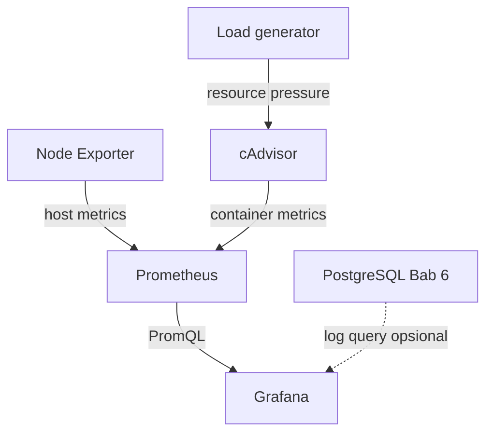

# Cheatsheet Bab 7 — Monitoring Resource dengan Prometheus, cAdvisor, Node Exporter, dan Grafana

Seluruh contoh terminal menggunakan Bash pada Linux atau WSL 2 di Windows.

> **Batas interpretasi.** Pada Linux, Node Exporter dan cAdvisor dapat mengamati resource host Linux dan container Docker. Pada Docker Desktop Windows/WSL 2, keduanya terutama mengamati mesin virtual Linux tempat Docker Engine berjalan, bukan seluruh resource native Windows. Perbedaan ini wajib dicatat dalam laporan.

| Kotak | Nama file | Fungsi |
|---:|---|---|
| 1 | `.env.example` | Template akun Grafana dan integrasi opsional Bab 6 |
| 2 | `.gitignore` | Mencegah credential dan evidence lokal masuk repository |
| 3 | `compose.yaml` | Menjalankan Prometheus, Grafana, Node Exporter, cAdvisor, dan generator beban |
| 4 | `prometheus/prometheus.yml` | Mendefinisikan interval, target scrape, dan rule files |
| 5 | `prometheus/rules/recording-rules.yml` | Membuat time series turunan untuk dashboard |
| 6 | `prometheus/rules/alert-rules.yml` | Mendefinisikan alert target dan resource |
| 7 | `prometheus/tests/rules.test.yml` | Unit test untuk alert `TargetDown` |
| 8 | `grafana/provisioning/datasources/datasources.yml` | Provisioning Prometheus dan PostgreSQL Bab 6 |
| 9 | `grafana/provisioning/dashboards/provider.yml` | Provisioning direktori dashboard |
| 10 | `grafana/dashboards/bab-7-overview.json` | Dashboard resource yang dapat direproduksi |
| 11 | `scripts/verify-stack.sh` | Verifikasi endpoint, target, rule, dan query PromQL |
| 12 | `scripts/connect-bab6.sh` | Integrasi opsional log PostgreSQL Bab 6 dengan role read-only |

## Arsitektur Ringkas



Endpoint exporter tidak dipublikasikan ke host. Prometheus mengaksesnya melalui jaringan internal Compose. Hanya antarmuka Prometheus (`127.0.0.1:9090`) dan Grafana (`127.0.0.1:3000`) yang dapat diakses dari laptop.

## Kotak Perintah A — Menyiapkan Direktori Bab 7

```bash
mkdir -p ~/docker-lab/bab-7/{prometheus/rules,prometheus/tests,grafana/provisioning/datasources,grafana/provisioning/dashboards,grafana/dashboards,scripts,reports}
cd ~/docker-lab/bab-7
```

Struktur akhir:

```text
bab-7/
├── .env.example
├── .env
├── .gitignore
├── compose.yaml
├── prometheus/
│   ├── prometheus.yml
│   ├── rules/
│   │   ├── recording-rules.yml
│   │   └── alert-rules.yml
│   └── tests/
│       └── rules.test.yml
├── grafana/
│   ├── provisioning/
│   │   ├── datasources/datasources.yml
│   │   └── dashboards/provider.yml
│   └── dashboards/
│       └── bab-7-overview.json
├── scripts/
│   ├── verify-stack.sh
│   └── connect-bab6.sh
└── reports/
```

## Kotak Script 1 — File `.env.example`

> **Nama file:** `.env.example`  
> **Lokasi:** `~/docker-lab/bab-7/.env.example`  
> **Buka editor:** `nano .env.example`

```dotenv
GRAFANA_ADMIN_USER=admin
GRAFANA_ADMIN_PASSWORD=grafanaadmin123
GRAFANA_DB_USER=grafana_reader
GRAFANA_DB_PASSWORD=grafanareaderpass123
POSTGRES_DB=labdb
```

Aktifkan konfigurasi lokal:

```bash
cp .env.example .env
chmod 600 .env
```

Credential tersebut bersifat sintetis. Pada lingkungan produksi, gunakan secret manager, TLS, rotasi credential, dan kontrol akses berdasarkan peran.

## Kotak Script 2 — File `.gitignore`

> **Nama file:** `.gitignore`  
> **Lokasi:** `~/docker-lab/bab-7/.gitignore`  
> **Buka editor:** `nano .gitignore`

```gitignore
.env
reports/*
!reports/.gitkeep
*.log
```

## Kotak Script 3 — File `compose.yaml`

> **Nama file:** `compose.yaml`  
> **Lokasi:** `~/docker-lab/bab-7/compose.yaml`  
> **Buka editor:** `nano compose.yaml`  
> **Petunjuk:** image dipin ke release stabil yang diverifikasi pada 22 Agustus 2026. Pin digest tetap disarankan sebelum pelaksanaan kelas.

```yaml
services:
  prometheus:
    image: prom/prometheus:v3.14.0
    command:
      - --config.file=/etc/prometheus/prometheus.yml
      - --storage.tsdb.path=/prometheus
      - --storage.tsdb.retention.time=7d
      - --web.console.libraries=/usr/share/prometheus/console_libraries
      - --web.console.templates=/usr/share/prometheus/consoles
    ports:
      - "127.0.0.1:9090:9090"
    volumes:
      - ./prometheus:/etc/prometheus:ro
      - prom-data:/prometheus
    networks:
      - monitoring-net
    security_opt:
      - no-new-privileges:true
    restart: unless-stopped

  grafana:
    image: grafana/grafana:13.1.4
    environment:
      GF_SECURITY_ADMIN_USER: ${GRAFANA_ADMIN_USER}
      GF_SECURITY_ADMIN_PASSWORD: ${GRAFANA_ADMIN_PASSWORD}
      GF_USERS_ALLOW_SIGN_UP: "false"
      GF_AUTH_ANONYMOUS_ENABLED: "false"
      GRAFANA_DB_USER: ${GRAFANA_DB_USER}
      GRAFANA_DB_PASSWORD: ${GRAFANA_DB_PASSWORD}
      POSTGRES_DB: ${POSTGRES_DB}
    ports:
      - "127.0.0.1:3000:3000"
    volumes:
      - grafana-data:/var/lib/grafana
      - ./grafana/provisioning:/etc/grafana/provisioning:ro
      - ./grafana/dashboards:/var/lib/grafana/dashboards:ro
    networks:
      - monitoring-net
    depends_on:
      - prometheus
    security_opt:
      - no-new-privileges:true
    restart: unless-stopped

  node-exporter:
    image: prom/node-exporter:v1.12.1
    command:
      - --path.rootfs=/host
      - --collector.filesystem.mount-points-exclude=^/(dev|proc|sys|var/lib/docker/.+|var/lib/containers/storage/.+)($|/)
    pid: host
    volumes:
      - /:/host:ro,rslave
    networks:
      - monitoring-net
    read_only: true
    security_opt:
      - no-new-privileges:true
    restart: unless-stopped

  cadvisor:
    image: ghcr.io/google/cadvisor:v0.60.5
    privileged: true
    volumes:
      - /:/rootfs:ro
      - /var/run:/var/run:ro
      - /sys:/sys:ro
      - /var/lib/docker:/var/lib/docker:ro
    networks:
      - monitoring-net
    restart: unless-stopped

  load-generator:
    image: alpine:3.20
    command:
      - /bin/sh
      - -c
      - while :; do :; done
    cpus: 0.50
    mem_limit: 64m
    profiles:
      - load
    networks:
      - monitoring-net
    read_only: true
    security_opt:
      - no-new-privileges:true

volumes:
  prom-data:
  grafana-data:

networks:
  monitoring-net:
    name: bab7-monitoring-net
    driver: bridge
```

`privileged: true` pada cAdvisor merupakan pengecualian berisiko karena collector membaca metadata host dan runtime container. Konfigurasi ini hanya untuk laptop lab terisolasi. Pada lingkungan produksi, gunakan integrasi monitoring yang sesuai platform dan kurangi privilege berdasarkan hasil pengujian nyata.

## Kotak Script 4 — File `prometheus/prometheus.yml`

> **Nama file:** `prometheus.yml`  
> **Lokasi:** `~/docker-lab/bab-7/prometheus/prometheus.yml`  
> **Buka editor:** `nano prometheus/prometheus.yml`

```yaml
global:
  scrape_interval: 15s
  scrape_timeout: 10s
  evaluation_interval: 15s
  external_labels:
    environment: lab
    chapter: "7"

rule_files:
  - /etc/prometheus/rules/recording-rules.yml
  - /etc/prometheus/rules/alert-rules.yml

scrape_configs:
  - job_name: prometheus
    static_configs:
      - targets:
          - prometheus:9090

  - job_name: node-exporter
    static_configs:
      - targets:
          - node-exporter:9100

  - job_name: cadvisor
    static_configs:
      - targets:
          - cadvisor:8080
```

Timeout dibuat lebih pendek daripada interval scrape. Nilai 15 detik sesuai untuk observasi laboratorium, tetapi bukan angka universal untuk lingkungan produksi karena resolusi yang lebih rapat meningkatkan trafik, CPU, dan kebutuhan storage.

## Kotak Script 5 — File `prometheus/rules/recording-rules.yml`

> **Nama file:** `recording-rules.yml`  
> **Lokasi:** `~/docker-lab/bab-7/prometheus/rules/recording-rules.yml`  
> **Buka editor:** `nano prometheus/rules/recording-rules.yml`

```yaml
groups:
  - name: bab7-resource-recording
    interval: 15s
    rules:
      - record: instance:node_cpu_utilisation:ratio_rate5m
        expr: |
          1 - avg by (instance) (
            rate(node_cpu_seconds_total{mode="idle"}[5m])
          )

      - record: instance:node_memory_utilisation:ratio
        expr: |
          1 - (
            node_memory_MemAvailable_bytes
            /
            node_memory_MemTotal_bytes
          )

      - record: instance:node_filesystem_avail:ratio
        expr: |
          node_filesystem_avail_bytes{
            fstype!~"tmpfs|overlay|squashfs|nsfs"
          }
          /
          node_filesystem_size_bytes{
            fstype!~"tmpfs|overlay|squashfs|nsfs"
          }

      - record: container:cpu_usage_cores:rate1m
        expr: |
          sum by (name) (
            rate(container_cpu_usage_seconds_total{name!=""}[1m])
          )

      - record: container:memory_working_set_bytes:sum
        expr: |
          sum by (name) (
            container_memory_working_set_bytes{name!=""}
          )
```

Recording rule mengurangi pengulangan query dashboard. Nama rule menyatakan agregasi, rasio, dan jendela waktu agar semantiknya tidak ambigu.

## Kotak Script 6 — File `prometheus/rules/alert-rules.yml`

> **Nama file:** `alert-rules.yml`  
> **Lokasi:** `~/docker-lab/bab-7/prometheus/rules/alert-rules.yml`  
> **Buka editor:** `nano prometheus/rules/alert-rules.yml`

```yaml
groups:
  - name: bab7-resource-alerts
    interval: 15s
    rules:
      - alert: TargetDown
        expr: up == 0
        for: 1m
        labels:
          severity: warning
          category: availability
        annotations:
          summary: "Target {{ $labels.instance }} tidak dapat discrape"
          description: "Job {{ $labels.job }} gagal discrape selama sedikitnya satu menit."

      - alert: HostHighCPU
        expr: instance:node_cpu_utilisation:ratio_rate5m > 0.90
        for: 5m
        labels:
          severity: warning
          category: saturation
        annotations:
          summary: "Utilisasi CPU host melampaui 90 persen"
          description: "Nilai saat ini adalah {{ $value | humanizePercentage }}."

      - alert: HostLowAvailableMemory
        expr: instance:node_memory_utilisation:ratio > 0.90
        for: 5m
        labels:
          severity: warning
          category: saturation
        annotations:
          summary: "Memori host yang digunakan melampaui 90 persen"
          description: "Nilai saat ini adalah {{ $value | humanizePercentage }}."

      - alert: ContainerHighCPU
        expr: container:cpu_usage_cores:rate1m > 0.30
        for: 1m
        labels:
          severity: info
          category: saturation
        annotations:
          summary: "Container {{ $labels.name }} memakai CPU tinggi"
          description: "Rata-rata satu menit adalah {{ $value }} core CPU."

      - alert: PrometheusRuleEvaluationFailure
        expr: increase(prometheus_rule_evaluation_failures_total[5m]) > 0
        for: 1m
        labels:
          severity: warning
          category: monitoring
        annotations:
          summary: "Evaluasi rule Prometheus mengalami kegagalan"
          description: "Periksa status rule, ekspresi PromQL, dan log Prometheus."
```

Threshold merupakan parameter eksperimen, bukan standar lingkungan produksi. Baseline, kapasitas host, karakter workload, dan SLO harus menentukan nilai operasional yang sebenarnya.

## Kotak Script 7 — File `prometheus/tests/rules.test.yml`

> **Nama file:** `rules.test.yml`  
> **Lokasi:** `~/docker-lab/bab-7/prometheus/tests/rules.test.yml`  
> **Buka editor:** `nano prometheus/tests/rules.test.yml`

```yaml
rule_files:
  - /etc/prometheus/rules/alert-rules.yml

evaluation_interval: 1m

tests:
  - interval: 1m
    input_series:
      - series: 'up{job="node-exporter",instance="node-exporter:9100"}'
        values: '1 0 0 0'

    alert_rule_test:
      - eval_time: 2m
        alertname: TargetDown
        exp_alerts:
          - exp_labels:
              job: node-exporter
              instance: node-exporter:9100
              severity: warning
              category: availability
            exp_annotations:
              summary: "Target node-exporter:9100 tidak dapat discrape"
              description: "Job node-exporter gagal discrape selama sedikitnya satu menit."
```

Unit test memeriksa logika rule secara deterministik tanpa menunggu kegagalan nyata. Runtime test tetap diperlukan karena unit test tidak membuktikan target, jaringan, atau notifikasi berfungsi.

## Kotak Script 8 — File `grafana/provisioning/datasources/datasources.yml`

> **Nama file:** `datasources.yml`  
> **Lokasi:** `~/docker-lab/bab-7/grafana/provisioning/datasources/datasources.yml`  
> **Buka editor:** `nano grafana/provisioning/datasources/datasources.yml`

```yaml
apiVersion: 1

deleteDatasources:
  - name: Prometheus Bab 7
    orgId: 1
  - name: PostgreSQL Logs Bab 6
    orgId: 1

datasources:
  - name: Prometheus Bab 7
    uid: prometheus-bab7
    type: prometheus
    access: proxy
    url: http://prometheus:9090
    isDefault: true
    editable: false
    jsonData:
      httpMethod: POST
      timeInterval: 15s

  - name: PostgreSQL Logs Bab 6
    uid: postgres-logs-bab6
    type: postgres
    access: proxy
    url: postgres-db:5432
    user: ${GRAFANA_DB_USER}
    editable: false
    secureJsonData:
      password: ${GRAFANA_DB_PASSWORD}
    jsonData:
      database: ${POSTGRES_DB}
      sslmode: disable
      postgresVersion: 1600
      timescaledb: false
```

Datasource PostgreSQL akan berstatus gagal sampai prosedur integrasi opsional Bab 6 dijalankan. `sslmode: disable` hanya dapat diterima pada jaringan lab lokal; koneksi lingkungan produksi memerlukan verifikasi TLS.

## Kotak Script 9 — File `grafana/provisioning/dashboards/provider.yml`

> **Nama file:** `provider.yml`  
> **Lokasi:** `~/docker-lab/bab-7/grafana/provisioning/dashboards/provider.yml`  
> **Buka editor:** `nano grafana/provisioning/dashboards/provider.yml`

```yaml
apiVersion: 1

providers:
  - name: DevSecOps Lab
    orgId: 1
    folder: DevSecOps Lab
    type: file
    disableDeletion: false
    allowUiUpdates: false
    updateIntervalSeconds: 30
    options:
      path: /var/lib/grafana/dashboards
      foldersFromFilesStructure: false
```

Dashboard dibuat tidak dapat diedit melalui UI agar sumber konfigurasi tetap jelas. Perubahan dilakukan pada JSON dan dikaji melalui version control.

## Kotak Script 10 — File `grafana/dashboards/bab-7-overview.json`

> **Nama file:** `bab-7-overview.json`  
> **Lokasi:** `~/docker-lab/bab-7/grafana/dashboards/bab-7-overview.json`  
> **Buka editor:** `nano grafana/dashboards/bab-7-overview.json`

```json
{
  "annotations": {
    "list": []
  },
  "editable": false,
  "graphTooltip": 1,
  "id": null,
  "links": [],
  "panels": [
    {
      "datasource": {
        "type": "prometheus",
        "uid": "prometheus-bab7"
      },
      "fieldConfig": {
        "defaults": {
          "color": {
            "mode": "thresholds"
          },
          "mappings": [],
          "thresholds": {
            "mode": "absolute",
            "steps": [
              {
                "color": "red",
                "value": null
              },
              {
                "color": "green",
                "value": 3
              }
            ]
          }
        },
        "overrides": []
      },
      "gridPos": {
        "h": 5,
        "w": 6,
        "x": 0,
        "y": 0
      },
      "id": 1,
      "options": {
        "colorMode": "value",
        "graphMode": "area",
        "justifyMode": "auto",
        "orientation": "auto",
        "reduceOptions": {
          "calcs": [
            "lastNotNull"
          ],
          "fields": "",
          "values": false
        },
        "textMode": "auto"
      },
      "targets": [
        {
          "expr": "sum(up)",
          "legendFormat": "target up",
          "refId": "A"
        }
      ],
      "title": "Jumlah Target Up",
      "type": "stat"
    },
    {
      "datasource": {
        "type": "prometheus",
        "uid": "prometheus-bab7"
      },
      "fieldConfig": {
        "defaults": {
          "max": 100,
          "min": 0,
          "unit": "percent"
        },
        "overrides": []
      },
      "gridPos": {
        "h": 8,
        "w": 9,
        "x": 6,
        "y": 0
      },
      "id": 2,
      "options": {
        "legend": {
          "displayMode": "list",
          "placement": "bottom",
          "showLegend": true
        },
        "tooltip": {
          "mode": "multi",
          "sort": "desc"
        }
      },
      "targets": [
        {
          "expr": "instance:node_cpu_utilisation:ratio_rate5m * 100",
          "legendFormat": "{{instance}}",
          "refId": "A"
        }
      ],
      "title": "Utilisasi CPU Host",
      "type": "timeseries"
    },
    {
      "datasource": {
        "type": "prometheus",
        "uid": "prometheus-bab7"
      },
      "fieldConfig": {
        "defaults": {
          "max": 100,
          "min": 0,
          "unit": "percent"
        },
        "overrides": []
      },
      "gridPos": {
        "h": 8,
        "w": 9,
        "x": 15,
        "y": 0
      },
      "id": 3,
      "options": {
        "legend": {
          "displayMode": "list",
          "placement": "bottom",
          "showLegend": true
        },
        "tooltip": {
          "mode": "multi",
          "sort": "desc"
        }
      },
      "targets": [
        {
          "expr": "instance:node_memory_utilisation:ratio * 100",
          "legendFormat": "{{instance}}",
          "refId": "A"
        }
      ],
      "title": "Utilisasi Memori Host",
      "type": "timeseries"
    },
    {
      "datasource": {
        "type": "prometheus",
        "uid": "prometheus-bab7"
      },
      "fieldConfig": {
        "defaults": {
          "min": 0,
          "unit": "cores"
        },
        "overrides": []
      },
      "gridPos": {
        "h": 9,
        "w": 12,
        "x": 0,
        "y": 8
      },
      "id": 4,
      "options": {
        "legend": {
          "displayMode": "table",
          "placement": "bottom",
          "showLegend": true
        },
        "tooltip": {
          "mode": "multi",
          "sort": "desc"
        }
      },
      "targets": [
        {
          "expr": "topk(5, container:cpu_usage_cores:rate1m)",
          "legendFormat": "{{name}}",
          "refId": "A"
        }
      ],
      "title": "Top 5 CPU Container",
      "type": "timeseries"
    },
    {
      "datasource": {
        "type": "prometheus",
        "uid": "prometheus-bab7"
      },
      "fieldConfig": {
        "defaults": {
          "min": 0,
          "unit": "bytes"
        },
        "overrides": []
      },
      "gridPos": {
        "h": 9,
        "w": 12,
        "x": 12,
        "y": 8
      },
      "id": 5,
      "options": {
        "legend": {
          "displayMode": "table",
          "placement": "bottom",
          "showLegend": true
        },
        "tooltip": {
          "mode": "multi",
          "sort": "desc"
        }
      },
      "targets": [
        {
          "expr": "topk(5, container:memory_working_set_bytes:sum)",
          "legendFormat": "{{name}}",
          "refId": "A"
        }
      ],
      "title": "Top 5 Memori Container",
      "type": "timeseries"
    }
  ],
  "refresh": "15s",
  "schemaVersion": 42,
  "tags": [
    "devsecops",
    "bab-7",
    "monitoring"
  ],
  "templating": {
    "list": []
  },
  "time": {
    "from": "now-30m",
    "to": "now"
  },
  "timepicker": {},
  "timezone": "browser",
  "title": "Bab 7 — Resource Monitoring",
  "uid": "bab7-resource-monitoring",
  "version": 1
}
```

## Kotak Script 11 — File `scripts/verify-stack.sh`

> **Nama file:** `verify-stack.sh`  
> **Lokasi:** `~/docker-lab/bab-7/scripts/verify-stack.sh`  
> **Buka editor:** `nano scripts/verify-stack.sh`

```bash
#!/usr/bin/env bash
set -Eeuo pipefail

cd "$(dirname "$0")/.."

wait_http() {
    local name="$1"
    local url="$2"

    for attempt in {1..30}; do
        if curl -fsS "$url" >/dev/null; then
            echo "[PASS] $name siap: $url"
            return 0
        fi
        sleep 2
    done

    echo "[FAIL] $name tidak siap: $url" >&2
    return 1
}

wait_http "Prometheus" "http://127.0.0.1:9090/-/ready"
wait_http "Grafana" "http://127.0.0.1:3000/api/health"

targets="$(curl -fsS http://127.0.0.1:9090/api/v1/targets)"
up_count="$(grep -o '"health":"up"' <<<"$targets" | wc -l | tr -d ' ' || true)"
down_count="$(grep -o '"health":"down"' <<<"$targets" | wc -l | tr -d ' ' || true)"

if (( up_count >= 3 && down_count == 0 )); then
    echo "[PASS] Sedikitnya tiga target berstatus up."
else
    echo "[FAIL] Target up=$up_count, down=$down_count." >&2
    exit 1
fi

for expression in \
    'up' \
    'instance:node_cpu_utilisation:ratio_rate5m' \
    'instance:node_memory_utilisation:ratio' \
    'container_memory_working_set_bytes'; do
    response="$(
        curl -fsS --get \
            --data-urlencode "query=$expression" \
            http://127.0.0.1:9090/api/v1/query
    )"

    if [[ "$response" == *'"status":"success"'* ]]; then
        echo "[PASS] PromQL valid: $expression"
    else
        echo "[FAIL] PromQL gagal: $expression" >&2
        exit 1
    fi
done

docker compose exec -T prometheus \
    promtool check config /etc/prometheus/prometheus.yml

docker compose exec -T prometheus \
    promtool check rules \
    /etc/prometheus/rules/recording-rules.yml \
    /etc/prometheus/rules/alert-rules.yml

echo "[PASS] Verifikasi dasar stack selesai."
```

Status sukses query belum membuktikan result vector berisi data. Karena itu, mahasiswa tetap harus memeriksa nilai dan label melalui Prometheus atau Grafana.

## Kotak Script 12 — File `scripts/connect-bab6.sh`

> **Nama file:** `connect-bab6.sh`  
> **Lokasi:** `~/docker-lab/bab-7/scripts/connect-bab6.sh`  
> **Buka editor:** `nano scripts/connect-bab6.sh`  
> **Tujuan:** menghubungkan Grafana ke PostgreSQL Bab 6 tanpa memberi akun administrator kepada dashboard.

```bash
#!/usr/bin/env bash
set -Eeuo pipefail

cd "$(dirname "$0")/.."

bab6_dir="${BAB6_DIR:-../bab-6}"

if [[ ! -f .env || ! -f "$bab6_dir/.env" ]]; then
    echo "[FAIL] File .env Bab 7 atau Bab 6 tidak ditemukan." >&2
    exit 1
fi

set -a
source .env
set +a

reader_user="$GRAFANA_DB_USER"
reader_password="$GRAFANA_DB_PASSWORD"

set -a
source "$bab6_dir/.env"
set +a

db_container="$(
    docker compose --project-directory "$bab6_dir" ps -q postgres-db
)"

if [[ -z "$db_container" ]]; then
    echo "[FAIL] Container PostgreSQL Bab 6 tidak berjalan." >&2
    exit 1
fi

if ! docker network inspect bab7-monitoring-net >/dev/null 2>&1; then
    echo "[FAIL] Network Bab 7 belum tersedia. Jalankan stack Bab 7 dahulu." >&2
    exit 1
fi

if ! docker inspect "$db_container" \
    --format '{{json .NetworkSettings.Networks}}' \
    | grep -q 'bab7-monitoring-net'; then
    docker network connect \
        --alias postgres-db \
        bab7-monitoring-net \
        "$db_container"
fi

docker compose --project-directory "$bab6_dir" exec -T postgres-db \
    psql \
    --set=ON_ERROR_STOP=1 \
    --username "$POSTGRES_USER" \
    --dbname "$POSTGRES_DB" \
    --set=reader_user="$reader_user" \
    --set=reader_password="$reader_password" <<'SQL'
SELECT format(
    'CREATE ROLE %I LOGIN PASSWORD %L',
    :'reader_user',
    :'reader_password'
)
WHERE NOT EXISTS (
    SELECT 1 FROM pg_roles WHERE rolname = :'reader_user'
)
\gexec

SELECT format(
    'ALTER ROLE %I PASSWORD %L',
    :'reader_user',
    :'reader_password'
)
\gexec

SELECT format(
    'GRANT CONNECT ON DATABASE %I TO %I',
    current_database(),
    :'reader_user'
)
\gexec

SELECT format('GRANT USAGE ON SCHEMA logs TO %I', :'reader_user')
\gexec

SELECT format(
    'GRANT SELECT ON ALL TABLES IN SCHEMA logs TO %I',
    :'reader_user'
)
\gexec

SELECT format(
    'ALTER DEFAULT PRIVILEGES IN SCHEMA logs GRANT SELECT ON TABLES TO %I',
    :'reader_user'
)
\gexec
SQL

docker compose restart grafana
echo "[PASS] PostgreSQL Bab 6 terhubung dengan role read-only."
```

Script menggunakan network tambahan dan role baca khusus. Hal ini lebih aman daripada memublikasikan port PostgreSQL atau memberikan credential admin kepada Grafana, tetapi trafik database pada lab ini masih tanpa TLS.

## Kotak Perintah B — Memberi Izin dan Memvalidasi Konfigurasi

```bash
chmod +x scripts/verify-stack.sh scripts/connect-bab6.sh

bash -n scripts/verify-stack.sh
bash -n scripts/connect-bab6.sh
docker compose config --quiet
```

Validasi JSON dashboard:

```bash
python3 -m json.tool \
  grafana/dashboards/bab-7-overview.json \
  >/dev/null
```

Validasi konfigurasi dan rule Prometheus sebelum stack dinyalakan:

```bash
docker compose run --rm --no-deps \
  --entrypoint /bin/promtool \
  prometheus \
  check config /etc/prometheus/prometheus.yml

docker compose run --rm --no-deps \
  --entrypoint /bin/promtool \
  prometheus \
  test rules /etc/prometheus/tests/rules.test.yml
```

## Kotak Perintah C — Menjalankan Stack Monitoring

```bash
docker compose pull
docker compose up -d
docker compose ps
./scripts/verify-stack.sh
```

Antarmuka lokal:

- Prometheus: `http://127.0.0.1:9090`
- Grafana: `http://127.0.0.1:3000`
- Dashboard Grafana: folder **DevSecOps Lab**, dashboard **Bab 7 — Resource Monitoring**

Masuk ke Grafana menggunakan nilai `GRAFANA_ADMIN_USER` dan `GRAFANA_ADMIN_PASSWORD` dari `.env`.

## Kotak Perintah D — Query PromQL Dasar

Jalankan melalui menu **Prometheus → Graph** atau Grafana Explore:

```promql
up
```

```promql
instance:node_cpu_utilisation:ratio_rate5m * 100
```

```promql
instance:node_memory_utilisation:ratio * 100
```

```promql
topk(5, container:cpu_usage_cores:rate1m)
```

```promql
topk(5, container:memory_working_set_bytes:sum)
```

`rate()` digunakan pada counter CPU karena nilai counter mentah terus bertambah. Untuk dashboard dan alert yang relatif stabil, `rate()` lebih tepat daripada `irate()`, yang hanya menggunakan dua sampel terakhir dan lebih sensitif terhadap lonjakan.

## Kotak Perintah E — Menguji Beban Container

Jalankan generator dengan batas setengah core CPU:

```bash
docker compose --profile load up -d load-generator
```

Amati query berikut selama sedikitnya dua menit:

```promql
container:cpu_usage_cores:rate1m{name=~".*load-generator.*"}
```

```promql
ALERTS{alertname="ContainerHighCPU"}
```

Hentikan generator setelah evidence diperoleh:

```bash
docker compose --profile load stop load-generator
docker compose --profile load rm -f load-generator
```

## Kotak Perintah F — Negative Test Target Down

```bash
docker compose stop node-exporter
```

Setelah sedikitnya 75 detik, periksa:

```promql
up{job="node-exporter"}
```

```promql
ALERTS{alertname="TargetDown",alertstate="firing"}
```

Pulihkan target:

```bash
docker compose start node-exporter
```

Dalam satu atau dua interval scrape, `up` harus kembali menjadi `1`. Alert akan kembali nonaktif setelah kondisi tidak lagi terpenuhi.

## Kotak Perintah G — Integrasi Opsional Log Bab 6

Pastikan Bab 6 dan Bab 7 berjalan, lalu jalankan dari direktori Bab 7:

```bash
./scripts/connect-bab6.sh
```

Pada Grafana Explore, pilih datasource **PostgreSQL Logs Bab 6** dan gunakan query:

```sql
SELECT
    time AS "time",
    tag,
    replace(data ->> 'container_name', '/', '') AS container_name,
    data ->> 'source' AS source,
    data ->> 'log' AS log_message
FROM logs.fluentbit
WHERE $__timeFilter(time)
ORDER BY time DESC
LIMIT 200;
```

Macro `$__timeFilter(time)` membuat query mengikuti rentang waktu Grafana. Untuk data besar, query harus tetap didukung indeks waktu dan pembatasan baris.

## Tabel Verifikasi PASS/FAIL

| No. | Skenario | Evidence yang sahih | PASS | FAIL |
|---:|---|---|---|---|
| 1 | Validasi Compose | `docker compose config --quiet` | Exit code 0 | Galat YAML atau interpolasi |
| 2 | Unit test rule | Output `promtool test rules` | `SUCCESS` | Test gagal atau rule tidak termuat |
| 3 | Kesiapan Prometheus | `/-/ready` | HTTP 200 | Timeout atau non-2xx |
| 4 | Kesiapan Grafana | `/api/health` | HTTP 200 dan database `ok` | Service belum sehat |
| 5 | Target scrape | Halaman Targets atau API | 3 target `UP` | Salah satu target `DOWN` |
| 6 | Host metrics | Query CPU dan memori | Result vector berisi nilai | Query sukses tetapi result kosong |
| 7 | Container metrics | Query cAdvisor | Nama container dan nilai muncul | cAdvisor kosong/tidak dapat membaca runtime |
| 8 | Dashboard | Dashboard terprovisi | Lima panel berisi data sesuai unit | Panel `No data` atau unit salah |
| 9 | Load test | Query CPU load generator | Pemakaian naik secara terukur | Tidak ada perubahan/limit tidak berlaku |
| 10 | Negative test | `TargetDown` | Pending lalu firing | Alert tidak berubah state |
| 11 | Recovery | `up{job="node-exporter"}` | Kembali `1` | Tetap `0`/series hilang |
| 12 | Integrasi Bab 6 | Query Grafana PostgreSQL | Log tampil dengan role read-only | Koneksi atau privilege gagal |

## Troubleshooting dan Analisis Hasil

| Gejala | Diagnosis yang mungkin | Pemeriksaan | Tindakan korektif |
|---|---|---|---|
| cAdvisor gagal pada Windows/WSL 2 | Mount atau kapabilitas Linux VM berbeda | `docker compose logs cadvisor` | Catat keterbatasan platform; uji di host Linux bila pengamatan host penuh diperlukan |
| Galat mount propagation `rslave` | Docker Desktop tidak mendukung opsi yang sama | Log startup Node Exporter | Ubah sementara `/:/host:ro,rslave` menjadi `/:/host:ro` dan dokumentasikan dampaknya |
| Target `DOWN` | DNS, service, port, atau exporter gagal | Prometheus Targets; `docker compose logs` | Uji endpoint dari jaringan internal dan periksa nama target |
| Query sukses tetapi kosong | Metric/label tidak tersedia atau jendela `rate` belum cukup | Cari nama metric tanpa filter; tunggu beberapa scrape | Sesuaikan selector berdasarkan label aktual, jangan mengganti nilai kosong menjadi nol tanpa alasan |
| CPU host tampak kecil saat load tinggi | Beban 0,5 core dibandingkan banyak core host | Bandingkan CPU container dan CPU host | Jelaskan denominator; jangan menyamakan core usage dengan persentase seluruh host |
| Grafana menampilkan `No data` | UID datasource, rule, atau rentang waktu salah | Grafana Explore; log Grafana; Prometheus Rules | Verifikasi datasource `prometheus-bab7`, rule sehat, dan rentang waktu dashboard |
| Alert tidak firing | Kondisi belum melewati threshold selama durasi `for` | Query ekspresi alert; menu Alerts | Tunggu durasi penuh dan pastikan evaluation interval berjalan |
| PostgreSQL datasource gagal | Bab 6 belum terhubung, role salah, atau database tidak berjalan | Log Grafana; `docker network inspect`; `\du`/`\dp` | Jalankan `connect-bab6.sh`, verifikasi alias jaringan dan GRANT |
| Panel container memiliki cardinality tinggi | Label container berubah setiap recreate | Hitung series per label | Gunakan label service stabil dan batasi label yang dipertahankan |
| Penggunaan disk Prometheus tumbuh | Retensi dan jumlah series terlalu besar | Status TSDB; cardinality; volume | Kurangi cardinality, sesuaikan interval dan retensi berdasarkan kapasitas |

## Catatan Keamanan

- Endpoint metric dapat mengungkap hostname, mount point, versi, nama service, dan pola beban. Jangan memublikasasikan exporter langsung ke jaringan publik.
- Akun anonim Grafana dinonaktifkan, tetapi password lab tetap harus diganti bila lingkungan dapat diakses pihak lain.
- cAdvisor yang privileged memiliki visibilitas luas terhadap host. Hindari menjalankannya pada laptop yang menangani data sensitif tanpa persetujuan dan isolasi yang memadai.
- `up = 1` hanya membuktikan scrape berhasil; nilai tersebut tidak membuktikan fungsi bisnis sehat.
- Tidak adanya series berbeda dari nilai nol. Alert dan dashboard harus memperlakukan missing data secara eksplisit.

## Kotak Perintah H — Cleanup

Menghentikan stack sambil mempertahankan data Prometheus dan Grafana:

```bash
docker compose --profile load down --remove-orphans
```

Menghapus stack beserta seluruh time series dan konfigurasi lokal Grafana yang tersimpan dalam volume:

```bash
docker compose --profile load down --volumes --remove-orphans
```

Perintah kedua bersifat destruktif terhadap evidence. Ekspor data atau dashboard yang diperlukan sebelum menghapus volume.

## Latihan Mandiri

1. Hitung estimasi penggunaan CPU host tanpa recording rule, lalu bandingkan hasil dan biaya query dengan recording rule.
2. Ubah interval scrape menjadi 5 detik dan 30 detik. Ukur dampak terhadap jumlah sampel serta kemampuan melihat spike singkat.
3. Buat alert filesystem tersisa di bawah 10 persen dan unit test menggunakan `promtool`.
4. Identifikasi label cAdvisor dengan cardinality tertinggi. Jelaskan label mana yang layak dipertahankan atau dipindahkan ke log.
5. Tambahkan panel network receive/transmit menggunakan `rate(node_network_receive_bytes_total[5m])` dan `rate(node_network_transmit_bytes_total[5m])`.
6. Hubungkan kenaikan CPU container dengan log Bab 6 pada rentang waktu yang sama dan jelaskan apakah korelasi tersebut cukup untuk menyatakan sebab-akibat.
7. Rancang SLI dan SLO sederhana untuk service aplikasi; jelaskan mengapa CPU tidak dapat menjadi pengganti langsung untuk availability pengguna.

## Rujukan Utama

1. [Prometheus — Configuration](https://prometheus.io/docs/prometheus/latest/configuration/configuration/).
2. [Prometheus — Query functions](https://prometheus.io/docs/prometheus/latest/querying/functions/).
3. [Prometheus — Recording rules](https://prometheus.io/docs/prometheus/latest/configuration/recording_rules/).
4. [Prometheus — Alerting rules](https://prometheus.io/docs/prometheus/latest/configuration/alerting_rules/).
5. [Grafana — Provisioning](https://grafana.com/docs/grafana/latest/administration/provisioning/).
6. [Grafana — Data sources](https://grafana.com/docs/grafana/latest/datasources/).
7. [Prometheus Node Exporter releases](https://github.com/prometheus/node_exporter/releases).
8. [Google cAdvisor releases](https://github.com/google/cadvisor/releases).

Versi perangkat lunak berubah dari waktu ke waktu. Sebelum praktikum kelas, verifikasi tag image, catat `docker version` dan `docker compose version`, jalankan unit test rule, serta simpan digest image yang telah dinyatakan kompatibel.
