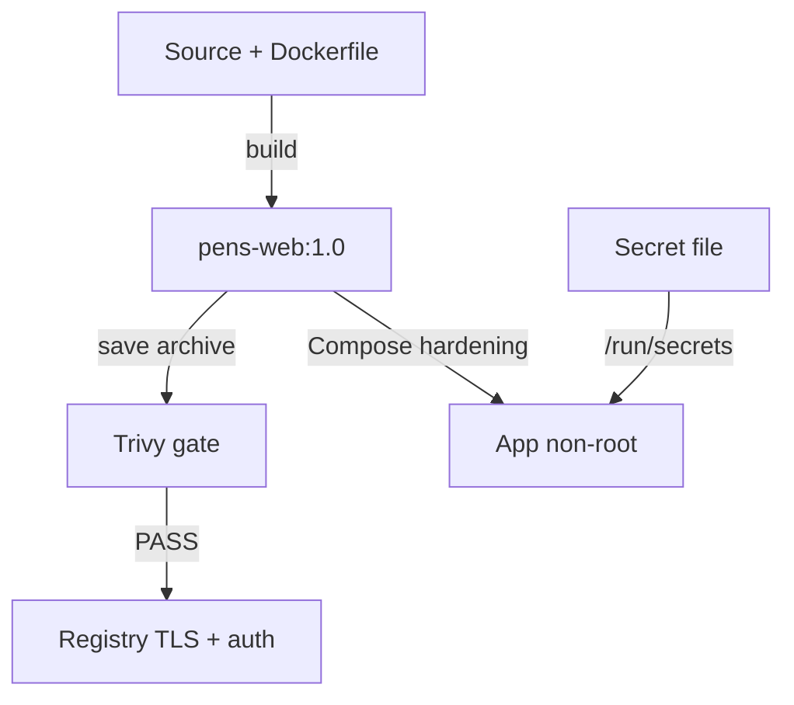

# Cheatsheet Bab 8 — Hardening Container, Secrets, Trivy, dan Private Registry

Cheatsheet ini mengikuti pola Bab 3–7. Setiap berkas yang perlu dibuat ditempatkan dalam **Kotak Script**. Perintah setup, validasi, pemindaian, pengujian negatif, distribusi image, dan cleanup ditempatkan dalam **Kotak Perintah** tersendiri.

> **Perbaikan keamanan terhadap draf awal.** Registry tidak dijalankan menggunakan HTTP anonim. Lab ini menggunakan TLS, autentikasi `htpasswd` bcrypt, dan port loopback. Trivy memindai arsip image sehingga container scanner tidak memerlukan mount `/var/run/docker.sock`.

| Kotak | Nama file | Fungsi |
|---:|---|---|
| 1 | `.env.example` | Template identitas dan credential sintetis registry |
| 2 | `.gitignore` | Mencegah secret, private key, dan laporan lokal masuk Git |
| 3 | `.dockerignore` | Mengecilkan build context dan mencegah data sensitif masuk image |
| 4 | `app/requirements.txt` | Dependency Python yang dipin |
| 5 | `app/app.py` | Aplikasi Flask untuk pengujian hardening dan secret mount |
| 6 | `app/Dockerfile` | Multi-stage build dan user non-root |
| 7 | `secrets/app_secret.txt.example` | Contoh format secret tanpa nilai aktif |
| 8 | `compose.yaml` | Hardening runtime aplikasi dan registry TLS |
| 9 | `scripts/generate-registry-assets.sh` | Membuat sertifikat serta akun registry bcrypt |
| 10 | `scripts/scan-image.sh` | Scan image, konfigurasi, secret, SBOM, dan security gate |
| 11 | `scripts/push-registry.sh` | Push hanya setelah gate lulus dan verifikasi registry |
| 12 | `scripts/verify-hardening.sh` | Negative test terhadap identity, filesystem, capability, secret, dan registry |

## Arsitektur Ringkas



Image hanya dipromosikan ke registry apabila security gate menyatakan `PASS`. Hasil scan lengkap tetap harus ditriase karena severity scanner tidak otomatis sama dengan risiko aktual aplikasi.

## Kotak Perintah A — Menyiapkan Direktori Bab 8

```bash
mkdir -p ~/docker-lab/bab-8/{app,secrets,registry/certs,registry/auth,scripts,reports}
cd ~/docker-lab/bab-8
touch reports/.gitkeep
```

Struktur akhir:

```text
bab-8/
├── .env.example
├── .env
├── .gitignore
├── .dockerignore
├── compose.yaml
├── app/
│   ├── app.py
│   ├── Dockerfile
│   └── requirements.txt
├── secrets/
│   ├── app_secret.txt.example
│   └── app_secret.txt
├── registry/
│   ├── auth/htpasswd
│   └── certs/
│       ├── domain.crt
│       └── domain.key
├── scripts/
│   ├── generate-registry-assets.sh
│   ├── scan-image.sh
│   ├── push-registry.sh
│   └── verify-hardening.sh
└── reports/
```

## Kotak Script 1 — File `.env.example`

> **Nama file:** `.env.example`  
> **Lokasi:** `~/docker-lab/bab-8/.env.example`  
> **Buka editor:** `nano .env.example`

```dotenv
APP_IMAGE=pens-web:1.0
REGISTRY_HOST=localhost:5000
REGISTRY_USER=labpublisher
REGISTRY_PASSWORD=registrypass123
```

Aktifkan konfigurasi lokal:

```bash
cp .env.example .env
chmod 600 .env
```

Credential tersebut hanya untuk laptop lab. `.env` bukan secret manager dan nilainya tidak boleh digunakan pada lingkungan nyata.

## Kotak Script 2 — File `.gitignore`

> **Nama file:** `.gitignore`  
> **Lokasi:** `~/docker-lab/bab-8/.gitignore`  
> **Buka editor:** `nano .gitignore`

```gitignore
.env
secrets/*.txt
!secrets/*.txt.example
registry/auth/*
registry/certs/*
reports/*
!reports/.gitkeep
*.tar
*.log
```

Private key TLS, password hash, secret aktif, arsip image, dan laporan scanner dapat memuat informasi sensitif sehingga tidak dimasukkan ke repository.

## Kotak Script 3 — File `.dockerignore`

> **Nama file:** `.dockerignore`  
> **Lokasi:** `~/docker-lab/bab-8/.dockerignore`  
> **Buka editor:** `nano .dockerignore`

```dockerignore
.git
.gitignore
.env
secrets/
registry/
reports/
scripts/
compose.yaml
**/__pycache__/
**/*.py[cod]
**/*.log
**/*.tar
```

Karena build context pada Compose menggunakan root Bab 8, Dockerfile akan menyalin berkas aplikasi secara eksplisit dari `app/`. `.dockerignore` menjadi lapisan pencegahan tambahan agar secret tidak ikut terkirim ke builder.

## Kotak Script 4 — File `app/requirements.txt`

> **Nama file:** `requirements.txt`  
> **Lokasi:** `~/docker-lab/bab-8/app/requirements.txt`  
> **Buka editor:** `nano app/requirements.txt`

```text
Flask==3.1.3
gunicorn==26.1.0
```

Versi dipin agar build lebih dapat direproduksi. Untuk pipeline produksi, gunakan lock file beserta hash paket dan proses pembaruan dependency terjadwal.

## Kotak Script 5 — File `app/app.py`

> **Nama file:** `app.py`  
> **Lokasi:** `~/docker-lab/bab-8/app/app.py`  
> **Buka editor:** `nano app/app.py`

```python
import os
from pathlib import Path

from flask import Flask, jsonify


app = Flask(__name__)
SECRET_PATH = Path("/run/secrets/app_secret")


@app.get("/")
def index():
    return jsonify(
        service="pens-web",
        status="running",
        uid=os.getuid(),
        gid=os.getgid(),
        secret_mounted=SECRET_PATH.is_file(),
    )


@app.get("/health")
def health():
    if not SECRET_PATH.is_file():
        return jsonify(status="degraded", reason="secret_missing"), 503
    return jsonify(status="ok"), 200
```

Aplikasi hanya mengonfirmasi keberadaan secret dan tidak mengembalikan nilainya. Logging secret, hash secret, atau sebagian token tetap dapat memperluas informasi yang tersedia bagi penyerang.

## Kotak Script 6 — File `app/Dockerfile`

> **Nama file:** `Dockerfile`  
> **Lokasi:** `~/docker-lab/bab-8/app/Dockerfile`  
> **Buka editor:** `nano app/Dockerfile`

```dockerfile
# syntax=docker/dockerfile:1

FROM python:3.11.16-slim AS builder

ENV PIP_DISABLE_PIP_VERSION_CHECK=1 \
    PIP_NO_CACHE_DIR=1

WORKDIR /build

COPY app/requirements.txt ./requirements.txt

RUN python -m venv /opt/venv \
    && /opt/venv/bin/pip install --no-cache-dir --requirement requirements.txt


FROM python:3.11.16-slim AS runtime

ARG APP_UID=10001
ARG APP_GID=10001

ENV PATH="/opt/venv/bin:${PATH}" \
    PYTHONDONTWRITEBYTECODE=1 \
    PYTHONUNBUFFERED=1

RUN groupadd --gid "${APP_GID}" appgroup \
    && useradd \
        --uid "${APP_UID}" \
        --gid "${APP_GID}" \
        --no-create-home \
        --shell /usr/sbin/nologin \
        appuser

WORKDIR /app

COPY --from=builder /opt/venv /opt/venv
COPY --chown=10001:10001 app/app.py ./app.py

USER 10001:10001

EXPOSE 8080

HEALTHCHECK --interval=10s --timeout=3s --start-period=5s --retries=3 \
    CMD ["python", "-c", "import urllib.request; urllib.request.urlopen('http://127.0.0.1:8080/health', timeout=2)"]

CMD ["gunicorn", "--bind=0.0.0.0:8080", "--workers=2", "--threads=2", "--worker-tmp-dir=/tmp", "--access-logfile=-", "--error-logfile=-", "app:app"]
```

Multi-stage build memisahkan tahap pemasangan dependency dari runtime. User numerik mengurangi ambiguitas pemetaan akun, tetapi base image dan dependency tetap harus dipindai serta diperbarui.

## Kotak Script 7 — File `secrets/app_secret.txt.example`

> **Nama file:** `app_secret.txt.example`  
> **Lokasi:** `~/docker-lab/bab-8/secrets/app_secret.txt.example`  
> **Buka editor:** `nano secrets/app_secret.txt.example`

```text
GANTI_DENGAN_NILAI_ACAK_KHUSUS_LAB
```

Jangan menyalin nilai contoh sebagai secret aktif. Buat nilai acak:

```bash
openssl rand -hex 32 > secrets/app_secret.txt
chmod 600 secrets/app_secret.txt
```

## Kotak Script 8 — File `compose.yaml`

> **Nama file:** `compose.yaml`  
> **Lokasi:** `~/docker-lab/bab-8/compose.yaml`  
> **Buka editor:** `nano compose.yaml`  
> **Petunjuk:** gunakan spasi, bukan tab.

```yaml
services:
  app:
    build:
      context: .
      dockerfile: app/Dockerfile
    image: ${APP_IMAGE}
    user: "10001:10001"
    init: true
    read_only: true
    tmpfs:
      - /tmp:rw,noexec,nosuid,size=64m,mode=1777
    cap_drop:
      - ALL
    security_opt:
      - no-new-privileges:true
    pids_limit: 100
    cpus: 0.50
    mem_limit: 256m
    memswap_limit: 256m
    secrets:
      - app_secret
    ports:
      - "127.0.0.1:8088:8080"
    networks:
      - app-net
    healthcheck:
      test:
        - CMD
        - python
        - -c
        - "import urllib.request; urllib.request.urlopen('http://127.0.0.1:8080/health', timeout=2)"
      interval: 10s
      timeout: 3s
      retries: 3
      start_period: 5s
    restart: unless-stopped

  registry:
    image: registry:3.1.1
    environment:
      REGISTRY_HTTP_ADDR: 0.0.0.0:5000
      REGISTRY_HTTP_TLS_CERTIFICATE: /certs/domain.crt
      REGISTRY_HTTP_TLS_KEY: /certs/domain.key
      REGISTRY_AUTH: htpasswd
      REGISTRY_AUTH_HTPASSWD_REALM: DevSecOps Registry
      REGISTRY_AUTH_HTPASSWD_PATH: /auth/htpasswd
      REGISTRY_STORAGE_DELETE_ENABLED: "false"
      OTEL_TRACES_EXPORTER: none
    read_only: true
    tmpfs:
      - /tmp:rw,noexec,nosuid,size=32m
    cap_drop:
      - ALL
    security_opt:
      - no-new-privileges:true
    ports:
      - "127.0.0.1:5000:5000"
    volumes:
      - registry-data:/var/lib/registry
      - ./registry/certs:/certs:ro
      - ./registry/auth:/auth:ro
    networks:
      - registry-net
    restart: unless-stopped

  trivy:
    image: aquasec/trivy:0.74.0
    profiles:
      - tools
    read_only: true
    tmpfs:
      - /tmp:rw,noexec,nosuid,size=64m
    volumes:
      - .:/workspace:ro
      - trivy-cache:/root/.cache
    security_opt:
      - no-new-privileges:true

secrets:
  app_secret:
    file: ./secrets/app_secret.txt

volumes:
  registry-data:
  trivy-cache:

networks:
  app-net:
    internal: true
  registry-net:
    internal: true
```

`cap_drop: ALL`, filesystem read-only, `no-new-privileges`, batas PID, CPU, memory, dan swap memperkecil blast radius. Kontrol tersebut harus diuji terhadap fungsi aplikasi; hardening yang membuat fungsi sah gagal bukan konfigurasi yang selesai.

## Kotak Script 9 — File `scripts/generate-registry-assets.sh`

> **Nama file:** `generate-registry-assets.sh`  
> **Lokasi:** `~/docker-lab/bab-8/scripts/generate-registry-assets.sh`  
> **Buka editor:** `nano scripts/generate-registry-assets.sh`  
> **Tujuan:** membuat sertifikat self-signed dengan SAN `localhost` dan akun registry menggunakan bcrypt.

```bash
#!/usr/bin/env bash
set -Eeuo pipefail

cd "$(dirname "$0")/.."

if [[ ! -f .env ]]; then
    echo "[FAIL] File .env tidak ditemukan." >&2
    exit 1
fi

set -a
source .env
set +a

: "${REGISTRY_USER:?REGISTRY_USER belum diatur}"
: "${REGISTRY_PASSWORD:?REGISTRY_PASSWORD belum diatur}"

command -v openssl >/dev/null || {
    echo "[FAIL] OpenSSL tidak tersedia." >&2
    exit 1
}

mkdir -p registry/certs registry/auth
umask 077

if [[ -e registry/certs/domain.key || -e registry/auth/htpasswd ]]; then
    echo "[FAIL] Aset registry sudah ada; rotasi harus dilakukan secara sadar." >&2
    exit 1
fi

openssl req \
    -newkey rsa:3072 \
    -nodes \
    -sha256 \
    -x509 \
    -days 365 \
    -keyout registry/certs/domain.key \
    -out registry/certs/domain.crt \
    -subj "/CN=localhost/O=DevSecOps Lab" \
    -addext "subjectAltName=DNS:localhost,IP:127.0.0.1" \
    -addext "extendedKeyUsage=serverAuth"

printf '%s\n' "$REGISTRY_PASSWORD" \
    | docker run --rm -i \
        --entrypoint htpasswd \
        httpd:2.4-alpine \
        -Bni "$REGISTRY_USER" \
    > registry/auth/htpasswd

chmod 600 registry/certs/domain.key registry/auth/htpasswd
chmod 644 registry/certs/domain.crt

echo "[PASS] Sertifikat dan htpasswd berhasil dibuat."
echo "[INFO] Sertifikat berlaku 365 hari untuk localhost."
```

Sertifikat self-signed hanya untuk pembelajaran. Produksi harus memakai nama DNS nyata, CA yang dipercaya, prosedur rotasi, dan perlindungan private key yang sesuai.

## Kotak Script 10 — File `scripts/scan-image.sh`

> **Nama file:** `scan-image.sh`  
> **Lokasi:** `~/docker-lab/bab-8/scripts/scan-image.sh`  
> **Buka editor:** `nano scripts/scan-image.sh`  
> **Tujuan:** menghasilkan laporan lengkap, SBOM CycloneDX, scan konfigurasi, serta gate untuk temuan HIGH/CRITICAL yang sudah memiliki perbaikan.

```bash
#!/usr/bin/env bash
set -Eeuo pipefail

cd "$(dirname "$0")/.."

if [[ ! -f .env ]]; then
    echo "[FAIL] File .env tidak ditemukan." >&2
    exit 1
fi

set -a
source .env
set +a

: "${APP_IMAGE:?APP_IMAGE belum diatur}"

mkdir -p reports
archive_name="pens-web-1.0.tar"

docker image inspect "$APP_IMAGE" >/dev/null
docker image save --output "reports/$archive_name" "$APP_IMAGE"

run_trivy() {
    docker compose --profile tools run --rm --no-deps trivy "$@"
}

run_trivy image \
    --input "/workspace/reports/$archive_name" \
    --scanners vuln,secret \
    --image-config-scanners misconfig,secret \
    --format json \
    > reports/trivy-image.json

run_trivy image \
    --input "/workspace/reports/$archive_name" \
    --format cyclonedx \
    > reports/pens-web-1.0.cdx.json

run_trivy config \
    --severity MEDIUM,HIGH,CRITICAL \
    /workspace/app \
    > reports/trivy-config.txt

run_trivy config \
    --severity MEDIUM,HIGH,CRITICAL \
    /workspace/compose.yaml \
    >> reports/trivy-config.txt

run_trivy fs \
    --scanners secret \
    /workspace/app \
    > reports/trivy-secret.txt

set +e
run_trivy image \
    --input "/workspace/reports/$archive_name" \
    --scanners vuln \
    --severity HIGH,CRITICAL \
    --ignore-unfixed \
    --exit-code 1 \
    > reports/trivy-gate.txt
gate_status=$?
set -e

if [[ "$gate_status" -eq 0 ]]; then
    printf 'PASS\n' > reports/gate-status.txt
    echo "[PASS] Security gate lulus."
else
    printf 'BLOCKED\n' > reports/gate-status.txt
    echo "[BLOCKED] Temuan HIGH/CRITICAL yang dapat diperbaiki terdeteksi." >&2
    echo "[INFO] Tinjau reports/trivy-gate.txt dan perbarui image." >&2
    exit 1
fi

docker image inspect "$APP_IMAGE" \
    --format '{{json .RepoDigests}}' \
    > reports/local-image-digests.json

sha256sum \
    reports/trivy-image.json \
    reports/pens-web-1.0.cdx.json \
    reports/trivy-config.txt \
    reports/trivy-secret.txt \
    reports/trivy-gate.txt \
    > reports/SHA256SUMS

echo "[PASS] Laporan, SBOM, dan checksum berhasil dibuat."
```

`--ignore-unfixed` hanya digunakan pada keputusan gate agar lab tidak berhenti pada temuan yang belum mempunyai perbaikan. Temuan tanpa perbaikan tetap tercatat pada `trivy-image.json` dan tetap membutuhkan triage, mitigasi, atau penerimaan risiko yang terdokumentasi.

## Kotak Script 11 — File `scripts/push-registry.sh`

> **Nama file:** `push-registry.sh`  
> **Lokasi:** `~/docker-lab/bab-8/scripts/push-registry.sh`  
> **Buka editor:** `nano scripts/push-registry.sh`

```bash
#!/usr/bin/env bash
set -Eeuo pipefail

cd "$(dirname "$0")/.."

if [[ ! -f .env ]]; then
    echo "[FAIL] File .env tidak ditemukan." >&2
    exit 1
fi

set -a
source .env
set +a

: "${APP_IMAGE:?APP_IMAGE belum diatur}"
: "${REGISTRY_HOST:?REGISTRY_HOST belum diatur}"
: "${REGISTRY_USER:?REGISTRY_USER belum diatur}"
: "${REGISTRY_PASSWORD:?REGISTRY_PASSWORD belum diatur}"

if [[ ! -f reports/gate-status.txt ]] \
    || [[ "$(< reports/gate-status.txt)" != "PASS" ]]; then
    echo "[BLOCKED] Image belum lulus security gate." >&2
    exit 1
fi

printf '%s\n' "$REGISTRY_PASSWORD" \
    | docker login "$REGISTRY_HOST" \
        --username "$REGISTRY_USER" \
        --password-stdin

remote_image="$REGISTRY_HOST/pens-web:1.0"

docker tag "$APP_IMAGE" "$remote_image"
docker push "$remote_image"
docker pull "$remote_image"

curl --fail --silent --show-error \
    --cacert registry/certs/domain.crt \
    --user "$REGISTRY_USER:$REGISTRY_PASSWORD" \
    "https://$REGISTRY_HOST/v2/_catalog" \
    | tee reports/registry-catalog.json

curl --fail --silent --show-error \
    --cacert registry/certs/domain.crt \
    --user "$REGISTRY_USER:$REGISTRY_PASSWORD" \
    "https://$REGISTRY_HOST/v2/pens-web/tags/list" \
    | tee reports/registry-tags.json

docker image inspect "$remote_image" \
    --format '{{json .RepoDigests}}' \
    | tee reports/registry-digests.json

docker logout "$REGISTRY_HOST"
echo "[PASS] Push, pull, katalog, tag, dan digest telah diverifikasi."
```

## Kotak Script 12 — File `scripts/verify-hardening.sh`

> **Nama file:** `verify-hardening.sh`  
> **Lokasi:** `~/docker-lab/bab-8/scripts/verify-hardening.sh`  
> **Buka editor:** `nano scripts/verify-hardening.sh`

```bash
#!/usr/bin/env bash
set -Eeuo pipefail

cd "$(dirname "$0")/.."

pass_count=0

pass() {
    echo "[PASS] $1"
    pass_count=$((pass_count + 1))
}

fail() {
    echo "[FAIL] $1" >&2
    exit 1
}

uid="$(docker compose exec -T app id -u)"
[[ "$uid" == "10001" ]] \
    && pass "Proses aplikasi berjalan sebagai UID 10001." \
    || fail "UID aplikasi adalah $uid."

if docker compose exec -T app sh -c 'touch /unauthorized-write' 2>/dev/null; then
    fail "Filesystem root masih dapat ditulis."
else
    pass "Penulisan ke filesystem root ditolak."
fi

docker compose exec -T app sh -c 'touch /tmp/allowed-write && rm /tmp/allowed-write' \
    && pass "tmpfs /tmp dapat digunakan aplikasi." \
    || fail "tmpfs /tmp tidak dapat digunakan."

cap_eff="$(
    docker compose exec -T app sh -c \
        "awk '/CapEff/ {print \$2}' /proc/1/status"
)"
[[ "$cap_eff" == "0000000000000000" ]] \
    && pass "Seluruh Linux capability efektif telah dihapus." \
    || fail "Capability efektif masih tersedia: $cap_eff"

no_new_privs="$(
    docker compose exec -T app sh -c \
        "awk '/NoNewPrivs/ {print \$2}' /proc/1/status"
)"
[[ "$no_new_privs" == "1" ]] \
    && pass "NoNewPrivs aktif." \
    || fail "NoNewPrivs tidak aktif."

docker compose exec -T app test -r /run/secrets/app_secret \
    && pass "Secret tersedia sebagai file read-only." \
    || fail "Secret tidak dapat dibaca aplikasi."

if docker compose exec -T app env | grep -q '^APP_SECRET='; then
    fail "Secret ditemukan sebagai environment variable."
else
    pass "Secret tidak diekspos sebagai APP_SECRET."
fi

docker compose exec -T app test ! -S /var/run/docker.sock \
    && pass "Docker socket tidak tersedia di container aplikasi." \
    || fail "Docker socket terpasang ke container aplikasi."

container_id="$(docker compose ps -q app)"
read -r memory nano_cpus pids readonly_root <<<"$(
    docker inspect "$container_id" \
        --format '{{.HostConfig.Memory}} {{.HostConfig.NanoCpus}} {{.HostConfig.PidsLimit}} {{.HostConfig.ReadonlyRootfs}}'
)"

if (( memory > 0 && nano_cpus > 0 && pids > 0 )) \
    && [[ "$readonly_root" == "true" ]]; then
    pass "Limit memory, CPU, PID, dan read-only rootfs aktif."
else
    fail "Runtime limit tidak lengkap."
fi

app_ready="false"
for attempt in {1..30}; do
    if curl --fail --silent --show-error \
        http://127.0.0.1:8088/health >/dev/null 2>&1; then
        app_ready="true"
        break
    fi
    sleep 2
done

[[ "$app_ready" == "true" ]] \
    && pass "Health endpoint aplikasi merespons sukses." \
    || fail "Health endpoint aplikasi gagal."

unauth_code=""
for attempt in {1..30}; do
    unauth_code="$(
        curl --silent \
            --output /dev/null \
            --write-out '%{http_code}' \
            --cacert registry/certs/domain.crt \
            https://localhost:5000/v2/ \
            || true
    )"
    [[ "$unauth_code" == "401" ]] && break
    sleep 2
done
[[ "$unauth_code" == "401" ]] \
    && pass "Registry menolak akses anonim dengan HTTP 401." \
    || fail "Registry memberi status anonim $unauth_code."

echo "[PASS] Total kontrol terverifikasi: $pass_count"
```

## Kotak Perintah B — Izin Eksekusi dan Validasi Statis

```bash
chmod +x scripts/*.sh

bash -n scripts/generate-registry-assets.sh
bash -n scripts/scan-image.sh
bash -n scripts/push-registry.sh
bash -n scripts/verify-hardening.sh

python3 -m py_compile app/app.py
docker compose config --quiet
```

Validasi struktur Dockerfile dan Compose dengan Trivy dilakukan kembali setelah image dibangun karena database pemeriksaan Trivy dapat berubah.

## Kotak Perintah C — Membuat Secret, Sertifikat, dan Akun Registry

```bash
openssl rand -hex 32 > secrets/app_secret.txt
chmod 600 secrets/app_secret.txt
./scripts/generate-registry-assets.sh
```

Periksa SAN dan masa berlaku sertifikat:

```bash
openssl x509 \
  -in registry/certs/domain.crt \
  -noout \
  -subject \
  -issuer \
  -dates \
  -ext subjectAltName
```

## Kotak Perintah D — Memercayai CA Registry pada Docker Engine

Pada Docker Engine native Linux:

```bash
sudo mkdir -p /etc/docker/certs.d/localhost:5000
sudo cp registry/certs/domain.crt \
  /etc/docker/certs.d/localhost:5000/ca.crt
sudo systemctl restart docker
```

Pada Docker Engine rootless Linux:

```bash
mkdir -p ~/.config/docker/certs.d/localhost:5000
cp registry/certs/domain.crt \
  ~/.config/docker/certs.d/localhost:5000/ca.crt
systemctl --user restart docker
```

Pada Docker Desktop dengan Linux containers:

```bash
mkdir -p ~/.docker/certs.d/localhost:5000
cp registry/certs/domain.crt \
  ~/.docker/certs.d/localhost:5000/ca.crt
```

Setelah penyalinan pada Docker Desktop, restart aplikasi Docker Desktop. Restart daemon menghentikan atau memengaruhi container lain; simpan pekerjaan lab aktif terlebih dahulu.

## Kotak Perintah E — Build dan Menjalankan Runtime yang Diperkeras

```bash
docker compose build --pull app
docker compose up -d app registry
docker compose ps
```

Verifikasi response aplikasi:

```bash
curl --fail --silent --show-error \
  http://127.0.0.1:8088/ \
  | python3 -m json.tool
```

Output harus menunjukkan `uid` dan `gid` bernilai `10001`, serta `secret_mounted` bernilai `true`.

## Kotak Perintah F — Menjalankan Negative Test Hardening

```bash
./scripts/verify-hardening.sh
```

Periksa konfigurasi runtime efektif sebagai evidence tambahan:

```bash
docker inspect "$(docker compose ps -q app)" \
  --format '{{json .HostConfig}}' \
  > reports/app-hostconfig.json

docker image inspect pens-web:1.0 \
  --format '{{json .Config}}' \
  > reports/app-image-config.json
```

## Kotak Perintah G — Trivy, SBOM, dan Security Gate

```bash
./scripts/scan-image.sh
```

Periksa status gate dan checksum:

```bash
cat reports/gate-status.txt
sha256sum --check reports/SHA256SUMS
```

Jika gate berstatus `BLOCKED`, jangan mengubah status secara manual. Perbarui base image atau dependency, bangun ulang image, dokumentasikan triage, lalu ulangi pemindaian.

## Kotak Perintah H — Menguji dan Mengisi Private Registry

Sebelum login, buktikan bahwa endpoint anonim ditolak:

```bash
curl --silent \
  --output /dev/null \
  --write-out 'HTTP %{http_code}\n' \
  --cacert registry/certs/domain.crt \
  https://localhost:5000/v2/
```

Hasil yang diharapkan adalah `HTTP 401`. Setelah gate lulus:

```bash
./scripts/push-registry.sh
```

Registry API tetap memakai path `/v2/` karena Distribution Registry 3 mempertahankan kompatibilitas Docker Registry HTTP API V2.

## Kotak Perintah I — Membuktikan Secret Tidak Masuk Image

Cari nama dan nilai contoh secret pada history serta filesystem image:

```bash
docker history --no-trunc pens-web:1.0 \
  | tee reports/docker-history.txt

docker run --rm \
  --entrypoint sh \
  pens-web:1.0 \
  -c 'test ! -e /run/secrets/app_secret && test ! -d /secrets'
```

PASS membuktikan file runtime secret tidak ada pada image. Hal ini belum membuktikan seluruh riwayat build bebas secret; laporan secret scanner dan audit build context tetap diperlukan.

## Tabel Verifikasi PASS/FAIL

| No. | Kontrol | Evidence yang sahih | PASS | FAIL |
|---:|---|---|---|---|
| 1 | User non-root | `id -u` dan response aplikasi | UID `10001` | UID `0`/tidak sesuai |
| 2 | Read-only rootfs | Negative test `touch /unauthorized-write` | Ditolak | Berhasil menulis |
| 3 | Writable path terkontrol | File sementara pada `/tmp` | Berhasil dan dapat dihapus | Aplikasi tidak dapat memakai `/tmp` |
| 4 | Capability | `CapEff` pada `/proc/1/status` | Seluruh bit nol | Masih ada capability |
| 5 | Privilege escalation | `NoNewPrivs` | Nilai `1` | Nilai `0` |
| 6 | Secret injection | `/run/secrets/app_secret` | File tersedia; tidak ada `APP_SECRET` | Secret hilang atau berada di env |
| 7 | Docker socket | Pemeriksaan socket | Tidak tersedia | Socket terpasang |
| 8 | Resource limit | `docker inspect` | Memory, CPU, PID, swap terbatas | Salah satu tidak dibatasi |
| 9 | Healthcheck | `docker compose ps` dan `/health` | `healthy`, HTTP 200 | `unhealthy`/non-200 |
| 10 | Scan lengkap | Laporan JSON, konfigurasi, secret, dan SBOM | Artefak ada dan checksum valid | Laporan hilang/tidak konsisten |
| 11 | Security gate | `gate-status.txt` | `PASS` | `BLOCKED` |
| 12 | TLS registry | `curl --cacert` | Validasi sertifikat berhasil | `x509`/hostname mismatch |
| 13 | Authentication | Request `/v2/` anonim | HTTP 401 | HTTP 200 anonim |
| 14 | Distribusi | Push, pull, katalog, dan digest | Seluruhnya berhasil | Push/pull/query gagal |

## Troubleshooting dan Analisis Hasil

| Gejala | Diagnosis yang mungkin | Pemeriksaan | Tindakan korektif |
|---|---|---|---|
| Build gagal saat memasang dependency | Tag base image, jaringan, atau versi paket tidak tersedia | Log BuildKit; PyPI; tag image | Verifikasi versi resmi, jaringan, dan bangun ulang tanpa memasukkan secret |
| Aplikasi `unhealthy` | Secret belum dibuat atau `/tmp` tidak dapat ditulis | `docker compose logs app`; inspect health | Buat secret, verifikasi tmpfs, dan uji endpoint dari dalam container |
| `permission denied` pada aplikasi | User non-root membutuhkan direktori tulis yang belum disediakan | Log aplikasi; `id`; mount efektif | Tambahkan tmpfs/volume pada jalur paling sempit; jangan mengubah container menjadi root |
| Trivy tidak menemukan image | Image belum dibangun atau nama berbeda | `docker image ls`; `.env` | Bangun image dan verifikasi `APP_IMAGE` |
| Gate berubah tanpa perubahan image | Database vulnerability Trivy diperbarui | Simpan versi Trivy, waktu, digest, dan laporan | Lakukan triage ulang; image yang sama dapat memperoleh temuan baru |
| Trivy kehabisan waktu saat pertama kali | Database scanner sedang diunduh | Log Trivy; konektivitas registry database | Ulangi setelah cache tersedia; jangan memakai database usang tanpa mencatatnya |
| Registry gagal startup | `htpasswd` bukan bcrypt, berkas tidak terbaca, atau TLS salah | `docker compose logs registry` | Buat ulang aset secara sadar dan periksa permission serta path mount |
| Docker login gagal `x509` | CA belum dipasang pada trust store daemon atau SAN salah | `openssl x509`; log daemon | Salin CA ke direktori platform yang benar lalu restart Docker |
| Registry memberi HTTP 200 tanpa login | Autentikasi tidak termuat | Log registry; environment efektif; file htpasswd | Hentikan registry dan perbaiki `REGISTRY_AUTH*`; jangan lanjutkan push |
| Push ditolak script | Gate belum `PASS` | `reports/gate-status.txt`; laporan gate | Perbarui image atau dependency; jangan mengedit status manual |
| Memory limit tampak tidak bekerja | Perbedaan dukungan cgroup/WSL 2 | `docker info`; inspect; metric Bab 7 | Catat platform dan uji pada host Linux bila validasi kernel penuh diperlukan |
| Docker Bench menghasilkan banyak temuan | Benchmark memeriksa host, bukan hanya aplikasi | Tinjau scope dan evidence setiap kontrol | Triage per kontrol; jangan menyamakan seluruh warning dengan exploit yang terkonfirmasi |

## Catatan Keamanan Windows dan Linux

- Pada Windows, jalankan perintah Bash melalui WSL 2. Docker Desktop menjalankan Linux containers di mesin virtual; bukti limit resource harus ditafsirkan terhadap VM tersebut.
- Lokasi trust store Docker berbeda antara Engine native, Engine rootless, dan Docker Desktop. Menyalin CA hanya ke browser tidak otomatis membuat Docker daemon mempercayainya.
- Keanggotaan grup `docker`, akses Docker Desktop, atau akses ke Docker socket memberi kemampuan administratif yang kuat. Praktikum harus memakai laptop lab atau akun yang sesuai kebijakan institusi.
- Default seccomp Docker sengaja tidak dinonaktifkan. Kustomisasi profil hanya dilakukan setelah kebutuhan syscall diukur dan diuji.

## Kotak Perintah J — Cleanup

Menghentikan service tanpa menghapus registry:

```bash
docker compose --profile tools down --remove-orphans
```

Menghapus container, network, registry, dan cache Trivy:

```bash
docker compose --profile tools down --volumes --remove-orphans
```

Perintah kedua menghapus artefak pada volume registry. Laporan di direktori `reports/` tetap berada pada host, tetapi dapat memuat informasi keamanan dan harus dilindungi.

Apabila sertifikat lab tidak lagi digunakan, hapus CA dari trust store Docker sesuai platform dan restart Docker secara terencana.

## Latihan Mandiri

1. Tambahkan negative test yang mencoba membuat lebih dari 100 proses dan analisis perilaku `pids_limit` tanpa membuat host tidak stabil.
2. Bandingkan hasil Trivy ketika `--ignore-unfixed` dipakai dan tidak dipakai. Jelaskan risiko menerima temuan tanpa perbaikan.
3. Buat dependency lock dengan hash dan ukur perubahan reproduktibilitas build.
4. Catat digest base image dan image aplikasi. Jelaskan perbedaan jaminan tag dengan digest.
5. Rancang prosedur rotasi password registry dan sertifikat tanpa kehilangan image yang tersimpan.
6. Tambahkan akun registry kedua dan jelaskan mengapa autentikasi basic bawaan belum menyediakan otorisasi repository yang granular.
7. Jalankan Docker Bench for Security dari sumber resmi yang telah diverifikasi. Pisahkan temuan host, daemon, image, dan runtime.
8. Susun dokumen exception untuk satu CVE yang belum dapat diperbaiki: cantumkan owner, alasan, mitigasi, masa berlaku, dan bukti persetujuan.

## Rujukan Utama

1. [NIST SP 800-190 — Application Container Security Guide](https://csrc.nist.gov/pubs/sp/800/190/final).
2. [Docker — Building best practices](https://docs.docker.com/build/building/best-practices/).
3. [Docker — Resource constraints](https://docs.docker.com/engine/containers/resource_constraints/).
4. [Docker — Seccomp profiles](https://docs.docker.com/engine/security/seccomp/).
5. [Docker — Manage secrets in Compose](https://docs.docker.com/compose/how-tos/use-secrets/).
6. [Docker — Verify registry certificates](https://docs.docker.com/engine/security/certificates/).
7. [CNCF Distribution — Deploy a registry](https://distribution.github.io/distribution/about/deploying/).
8. [CNCF Distribution — Registry configuration](https://distribution.github.io/distribution/about/configuration/).
9. [Trivy — Container image scanning](https://trivy.dev/docs/latest/guide/target/container_image/).
10. [Trivy — Exit code and scanners](https://trivy.dev/docs/latest/guide/configuration/others/).
11. [OWASP Docker Security Cheat Sheet](https://cheatsheetseries.owasp.org/cheatsheets/Docker_Security_Cheat_Sheet.html).

Versi scanner, database vulnerability, base image, dan dependency berubah dari waktu ke waktu. Sebelum kelas dimulai, verifikasi tag, simpan digest image, dan jalankan seluruh negative test pada platform yang akan digunakan mahasiswa.
