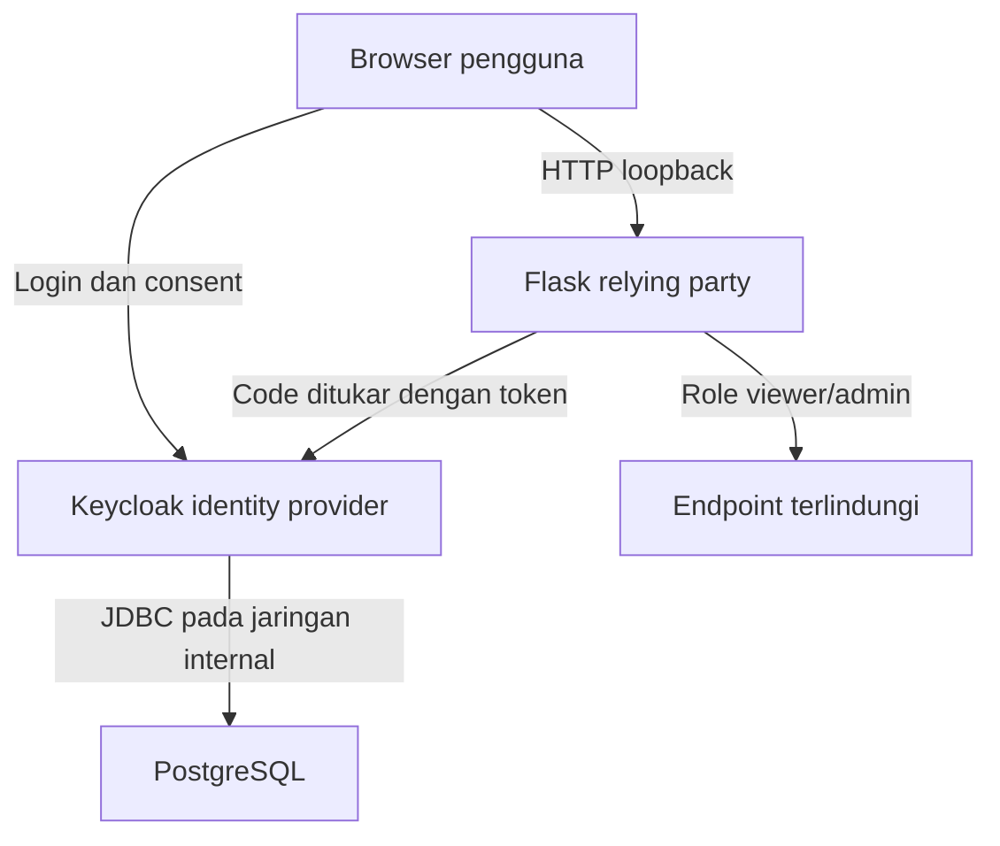

# Cheatsheet Bab 9 — IAM, OIDC, PKCE, dan RBAC dengan Keycloak

Aktivitas laboratorium membangun Keycloak dan PostgreSQL sebagai layanan IAM, kemudian menghubungkannya dengan aplikasi Flask melalui OpenID Connect Authorization Code Flow dan PKCE S256.

> **Batas penggunaan.** Konfigurasi ini dirancang untuk laboratorium lokal pada satu laptop. Keycloak dijalankan dengan `start-dev` dan HTTP hanya pada antarmuka loopback. Mode tersebut tidak boleh dipindahkan langsung ke produksi. Deployment produksi memerlukan mode `start`, TLS, hostname publik yang tervalidasi, secret manager, backup, high availability, monitoring, dan prosedur upgrade.

## Hasil Belajar

Setelah menyelesaikan praktikum, mahasiswa mampu:

1. menjelaskan perbedaan autentikasi, otorisasi, OAuth 2.0, dan OpenID Connect;
2. menjalankan Keycloak 26.7.2 dengan PostgreSQL 17.11 dalam Docker Compose;
3. mengelola realm, confidential client, pengguna, realm role, dan scope mapping sebagai kode;
4. menerapkan Authorization Code Flow dengan PKCE S256 pada aplikasi Flask;
5. membuktikan penerapan RBAC melalui pengujian positif dan negatif;
6. mengumpulkan evidence yang tidak membocorkan password, client secret, atau token utuh.

## Arsitektur Ringkas



Trust boundary laboratorium terdiri atas browser, relying party, identity provider, dan database. Browser hanya mengakses port `5000` dan `8080` melalui `127.0.0.1`; port manajemen `9000` juga dibatasi ke loopback untuk pengujian readiness. PostgreSQL tidak dipublikasikan ke host. Nama `keycloak.localhost` digunakan sebagai issuer yang konsisten: browser memperlakukannya sebagai nama loopback, sedangkan Docker DNS memetakannya ke service Keycloak melalui network alias.

| Komponen | Alamat | Fungsi keamanan |
| --- | --- | --- |
| Flask | `http://localhost:5000` | OIDC relying party dan enforcement RBAC |
| Keycloak | `http://keycloak.localhost:8080` | Autentikasi, sesi SSO, penerbit token, dan role |
| Management | `http://localhost:9000/health/ready` | Readiness lokal; jangan dipublikasikan pada produksi |
| PostgreSQL | `db:5432` pada `iam-net` | Penyimpanan state Keycloak tanpa port host |
| Realm | `devsecops-lab` | Batas administrasi identitas laboratorium |

## Versi yang Digunakan

Versi berikut dipin agar hasil praktikum dapat direproduksi. Versi ini diverifikasi pada 22 Agustus 2026; lakukan verifikasi ulang sebelum semester berikutnya.

| Komponen | Versi/tag | Catatan |
| --- | --- | --- |
| Keycloak | `26.7.2` | Rilis server yang ditampilkan pada halaman unduhan resmi saat verifikasi |
| PostgreSQL | `17.11-alpine3.24` | Tag image resmi PostgreSQL |
| Python | `3.11.16-slim` | Base image aplikasi |
| Flask | `3.1.3` | Framework aplikasi |
| Authlib | `1.7.2` | OIDC/OAuth client dan validasi ID Token |
| Gunicorn | `26.1.0` | WSGI server aplikasi |

## Kotak Perintah A — Menyiapkan Direktori Bab 9

Jalankan perintah berikut dari terminal Bash, Git Bash, WSL, atau terminal Linux. PowerShell juga dapat digunakan untuk perintah Docker, tetapi script `.sh` pada bab ini lebih mudah dijalankan melalui Git Bash atau WSL.

```bash
$ mkdir -p ~/docker-lab/bab-09/{app,realm,scripts,reports}
$ cd ~/docker-lab/bab-09
$ pwd
```

Struktur akhir yang diharapkan:

```text
bab-09/
├── .dockerignore
├── .env.example
├── .gitignore
├── compose.yaml
├── app/
│   ├── Dockerfile
│   ├── app.py
│   └── requirements.txt
├── realm/
│   └── devsecops-lab-realm.json
├── reports/
└── scripts/
    ├── collect-evidence.sh
    ├── generate-env.sh
    ├── negative-tests.sh
    └── validate-lab.sh
```

## Kotak Script 1 — File `.env.example`

File contoh ini mendokumentasikan variabel yang diperlukan. Nilainya bukan kredensial operasional dan tidak digunakan langsung oleh Compose.

```dotenv
POSTGRES_DB=keycloak
POSTGRES_USER=keycloak
POSTGRES_PASSWORD=GANTI_DENGAN_NILAI_ACAK

KC_BOOTSTRAP_ADMIN_USERNAME=kcadmin
KC_BOOTSTRAP_ADMIN_PASSWORD=GANTI_DENGAN_NILAI_ACAK

FLASK_CLIENT_ID=flask-app
FLASK_CLIENT_SECRET=GANTI_DENGAN_NILAI_ACAK
FLASK_SESSION_SECRET=GANTI_DENGAN_NILAI_ACAK

MAHASISWA_PASSWORD=GANTI_DENGAN_NILAI_ACAK
ADMINLAB_PASSWORD=GANTI_DENGAN_NILAI_ACAK
```

## Kotak Script 2 — File `.gitignore`

```gitignore
.env
reports/*
!reports/.gitkeep
__pycache__/
*.py[cod]
.pytest_cache/
```

Buat placeholder agar direktori laporan tetap dapat dilacak tanpa memasukkan evidence sensitif.

```bash
$ touch reports/.gitkeep
```

## Kotak Script 3 — File `.dockerignore`

```dockerignore
.env
.git
.gitignore
reports
realm
scripts
__pycache__
*.pyc
*.pyo
```

## Kotak Script 4 — File `realm/devsecops-lab-realm.json`

Realm diimpor sebagai kode. Placeholder `${...}` diselesaikan Keycloak dari environment container pada saat import. Client hanya mengaktifkan Standard Flow, mewajibkan PKCE S256, menolak Direct Access Grant, dan menggunakan redirect URI eksak.

```json
{
  "realm": "devsecops-lab",
  "displayName": "Laboratorium DevSecOps",
  "enabled": true,
  "registrationAllowed": false,
  "resetPasswordAllowed": false,
  "rememberMe": false,
  "verifyEmail": false,
  "bruteForceProtected": true,
  "accessTokenLifespan": 300,
  "ssoSessionIdleTimeout": 900,
  "ssoSessionMaxLifespan": 28800,
  "roles": {
    "realm": [
      {
        "name": "viewer",
        "description": "Membaca resource yang telah diautentikasi"
      },
      {
        "name": "admin",
        "description": "Mengakses endpoint administrasi aplikasi lab"
      }
    ]
  },
  "clients": [
    {
      "clientId": "${FLASK_CLIENT_ID}",
      "name": "Flask DevSecOps Lab",
      "enabled": true,
      "protocol": "openid-connect",
      "publicClient": false,
      "secret": "${FLASK_CLIENT_SECRET}",
      "clientAuthenticatorType": "client-secret",
      "standardFlowEnabled": true,
      "implicitFlowEnabled": false,
      "directAccessGrantsEnabled": false,
      "serviceAccountsEnabled": false,
      "fullScopeAllowed": false,
      "rootUrl": "http://localhost:5000",
      "baseUrl": "http://localhost:5000/",
      "redirectUris": [
        "http://localhost:5000/callback"
      ],
      "webOrigins": [
        "http://localhost:5000"
      ],
      "attributes": {
        "pkce.code.challenge.method": "S256",
        "post.logout.redirect.uris": "http://localhost:5000/logged-out"
      },
      "defaultClientScopes": [
        "web-origins",
        "acr",
        "roles",
        "profile",
        "basic",
        "email"
      ]
    }
  ],
  "scopeMappings": [
    {
      "client": "${FLASK_CLIENT_ID}",
      "roles": [
        "viewer",
        "admin"
      ]
    }
  ],
  "users": [
    {
      "username": "mahasiswa1",
      "enabled": true,
      "emailVerified": true,
      "firstName": "Mahasiswa",
      "lastName": "Viewer",
      "email": "mahasiswa1@example.invalid",
      "realmRoles": [
        "viewer"
      ],
      "credentials": [
        {
          "type": "password",
          "value": "${MAHASISWA_PASSWORD}",
          "temporary": false
        }
      ]
    },
    {
      "username": "adminlab",
      "enabled": true,
      "emailVerified": true,
      "firstName": "Administrator",
      "lastName": "Laboratorium",
      "email": "adminlab@example.invalid",
      "realmRoles": [
        "viewer",
        "admin"
      ],
      "credentials": [
        {
          "type": "password",
          "value": "${ADMINLAB_PASSWORD}",
          "temporary": false
        }
      ]
    }
  ]
}
```

> Akun `adminlab` hanya memiliki role `admin` pada aplikasi laboratorium. Akun ini berbeda dari administrator server Keycloak `kcadmin`. Pemisahan tersebut mencegah kekeliruan antara kewenangan aplikasi dan kewenangan administrasi identity provider.

## Kotak Script 5 — File `app/requirements.txt`

```text
Flask==3.1.3
Authlib==1.7.2
gunicorn==26.1.0
```

## Kotak Script 6 — File `app/app.py`

Aplikasi mempercayai metadata OIDC, signature, issuer, audience, expiration, `state`, dan `nonce` melalui integrasi Authlib. Aplikasi hanya menyimpan profil minimum dan role dalam cookie sesi; access token, refresh token, dan ID Token tidak ditampilkan atau ditulis ke log.

```python
import os
from functools import wraps
from authlib.integrations.base_client.errors import OAuthError
from authlib.integrations.flask_client import OAuth
from flask import Flask, jsonify, redirect, render_template_string, session, url_for


ISSUER = os.getenv(
    "OIDC_ISSUER",
    "http://keycloak.localhost:8080/realms/devsecops-lab",
).rstrip("/")
CLIENT_ID = os.environ["OIDC_CLIENT_ID"]

app = Flask(__name__)
app.secret_key = os.environ["FLASK_SESSION_SECRET"]
app.config.update(
    SESSION_COOKIE_NAME="devsecops_lab_session",
    SESSION_COOKIE_HTTPONLY=True,
    SESSION_COOKIE_SAMESITE="Lax",
    SESSION_COOKIE_SECURE=False,
    PERMANENT_SESSION_LIFETIME=900,
)

oauth = OAuth(app)
oauth.register(
    name="keycloak",
    client_id=CLIENT_ID,
    client_secret=os.environ["OIDC_CLIENT_SECRET"],
    server_metadata_url=f"{ISSUER}/.well-known/openid-configuration",
    client_kwargs={
        "scope": "openid profile email roles",
        "code_challenge_method": "S256",
        "token_endpoint_auth_method": "client_secret_basic",
    },
)


def current_user():
    return session.get("user")


def require_role(required_role):
    def decorator(view):
        @wraps(view)
        def wrapped(*args, **kwargs):
            user = current_user()
            if not user:
                return redirect(url_for("login"))
            if required_role not in user.get("roles", []):
                return jsonify(
                    error="forbidden",
                    required_role=required_role,
                ), 403
            return view(*args, **kwargs)

        return wrapped

    return decorator


@app.get("/")
def home():
    return render_template_string(
        """
        <!doctype html>
        <html lang="id">
        <head>
          <meta charset="utf-8">
          <title>DevSecOps IAM Lab</title>
          <style>
            body { font: 16px system-ui; max-width: 820px; margin: 3rem auto; }
            nav a { margin-right: 1rem; }
            code, pre { background: #f3f4f6; padding: .2rem .4rem; }
            pre { padding: 1rem; overflow: auto; }
          </style>
        </head>
        <body>
          <h1>Laboratorium IAM dan RBAC</h1>
          <nav>
            <a href="{{ url_for('login') }}">Login</a>
            <a href="{{ url_for('viewer') }}">Viewer</a>
            <a href="{{ url_for('admin') }}">Admin</a>
            <a href="{{ url_for('local_logout') }}">Logout lokal</a>
            <a href="{{ url_for('sso_logout') }}">Logout SSO</a>
          </nav>
          
            <h2>Identitas tervalidasi</h2>
            <pre>{{ user | tojson(indent=2) }}</pre>
          
            <p>Belum terdapat sesi lokal. Gunakan tautan <strong>Login</strong>.</p>
          
        </body>
        </html>
        """,
        user=current_user(),
    )


@app.get("/login")
def login():
    redirect_uri = url_for("callback", _external=True)
    return oauth.keycloak.authorize_redirect(redirect_uri)


@app.get("/callback")
def callback():
    token = oauth.keycloak.authorize_access_token()
    claims = token.get("userinfo", {})
    roles = claims.get("realm_access", {}).get("roles", [])
    session.clear()
    session["user"] = {
        "sub": claims.get("sub"),
        "preferred_username": claims.get("preferred_username"),
        "email": claims.get("email"),
        "roles": sorted(set(roles)),
    }
    return redirect(url_for("home"))


@app.get("/viewer")
@require_role("viewer")
def viewer():
    return jsonify(
        result="PASS",
        message="Role viewer diterima.",
        user=current_user()["preferred_username"],
    )


@app.get("/admin")
@require_role("admin")
def admin():
    return jsonify(
        result="PASS",
        message="Role admin diterima.",
        user=current_user()["preferred_username"],
    )


@app.get("/logout")
def local_logout():
    session.clear()
    return redirect(url_for("home"))


@app.get("/logout-sso")
def sso_logout():
    session.clear()
    return oauth.keycloak.logout_redirect(
        post_logout_redirect_uri=url_for("logged_out", _external=True),
        client_id=CLIENT_ID,
    )


@app.get("/logged-out")
def logged_out():
    oauth.keycloak.validate_logout_response()
    session.clear()
    return redirect(url_for("home"))


@app.get("/healthz")
def healthz():
    return jsonify(status="UP")


@app.errorhandler(OAuthError)
def oauth_error(error):
    app.logger.warning("OIDC request rejected: %s", error.error)
    return jsonify(error="oidc_request_rejected"), 400
```

`SESSION_COOKIE_SECURE=False` digunakan karena lab berjalan melalui HTTP loopback. Pada lingkungan HTTPS, nilai ini wajib diubah menjadi `True`. Jangan menambahkan token ke objek `session` karena Flask menyimpan session default di cookie yang berada pada browser.

## Kotak Script 7 — File `app/Dockerfile`

```dockerfile
# syntax=docker/dockerfile:1
FROM python:3.11.16-slim AS builder

ENV PIP_DISABLE_PIP_VERSION_CHECK=1 \
    PIP_NO_CACHE_DIR=1 \
    PYTHONDONTWRITEBYTECODE=1

WORKDIR /build
RUN python -m venv /opt/venv
ENV PATH="/opt/venv/bin:${PATH}"

COPY requirements.txt .
RUN pip install --no-cache-dir --requirement requirements.txt

FROM python:3.11.16-slim AS runtime

ENV PATH="/opt/venv/bin:${PATH}" \
    PYTHONDONTWRITEBYTECODE=1 \
    PYTHONUNBUFFERED=1

RUN groupadd --gid 10001 appgroup \
    && useradd --uid 10001 --gid appgroup --no-create-home --shell /usr/sbin/nologin appuser

WORKDIR /app
COPY --from=builder /opt/venv /opt/venv
COPY --chown=10001:10001 app.py .

USER 10001:10001
EXPOSE 5000

HEALTHCHECK --interval=10s --timeout=3s --start-period=10s --retries=5 \
  CMD ["python", "-c", "import urllib.request; urllib.request.urlopen('http://127.0.0.1:5000/healthz', timeout=2)"]

CMD ["gunicorn", "--bind=0.0.0.0:5000", "--workers=2", "--threads=2", "--timeout=30", "app:app"]
```

## Kotak Script 8 — File `compose.yaml`

```yaml
name: devsecops-bab09

services:
  db:
    image: postgres:17.11-alpine3.24
    restart: unless-stopped
    environment:
      POSTGRES_DB: ${POSTGRES_DB:?POSTGRES_DB wajib diisi}
      POSTGRES_USER: ${POSTGRES_USER:?POSTGRES_USER wajib diisi}
      POSTGRES_PASSWORD: ${POSTGRES_PASSWORD:?POSTGRES_PASSWORD wajib diisi}
    volumes:
      - keycloak-db-data:/var/lib/postgresql/data
    healthcheck:
      test: ["CMD-SHELL", "pg_isready -U $${POSTGRES_USER} -d $${POSTGRES_DB}"]
      interval: 5s
      timeout: 3s
      retries: 20
    networks:
      - iam-net
    security_opt:
      - no-new-privileges:true
    cap_drop:
      - ALL
    cap_add:
      - CHOWN
      - DAC_OVERRIDE
      - FOWNER
      - SETGID
      - SETUID
    pids_limit: 200
    mem_limit: 512m

  keycloak:
    image: quay.io/keycloak/keycloak:26.7.2
    restart: unless-stopped
    command:
      - start-dev
      - --import-realm
    environment:
      KC_DB: postgres
      KC_DB_URL: jdbc:postgresql://db:5432/${POSTGRES_DB}
      KC_DB_USERNAME: ${POSTGRES_USER}
      KC_DB_PASSWORD: ${POSTGRES_PASSWORD}
      KC_BOOTSTRAP_ADMIN_USERNAME: ${KC_BOOTSTRAP_ADMIN_USERNAME}
      KC_BOOTSTRAP_ADMIN_PASSWORD: ${KC_BOOTSTRAP_ADMIN_PASSWORD}
      KC_HOSTNAME: http://keycloak.localhost:8080
      KC_HEALTH_ENABLED: "true"
      KC_METRICS_ENABLED: "true"
      FLASK_CLIENT_ID: ${FLASK_CLIENT_ID}
      FLASK_CLIENT_SECRET: ${FLASK_CLIENT_SECRET}
      MAHASISWA_PASSWORD: ${MAHASISWA_PASSWORD}
      ADMINLAB_PASSWORD: ${ADMINLAB_PASSWORD}
    volumes:
      - ./realm/devsecops-lab-realm.json:/opt/keycloak/data/import/devsecops-lab-realm.json:ro
    ports:
      - "127.0.0.1:8080:8080"
      - "127.0.0.1:9000:9000"
    depends_on:
      db:
        condition: service_healthy
    networks:
      iam-net:
        aliases:
          - keycloak.localhost
    security_opt:
      - no-new-privileges:true
    pids_limit: 400
    mem_limit: 1024m

  app:
    build:
      context: ./app
    image: devsecops-bab09-flask:1.0
    restart: unless-stopped
    environment:
      FLASK_SESSION_SECRET: ${FLASK_SESSION_SECRET}
      OIDC_CLIENT_ID: ${FLASK_CLIENT_ID}
      OIDC_CLIENT_SECRET: ${FLASK_CLIENT_SECRET}
      OIDC_ISSUER: http://keycloak.localhost:8080/realms/devsecops-lab
    ports:
      - "127.0.0.1:5000:5000"
    depends_on:
      - keycloak
    networks:
      - iam-net
    read_only: true
    tmpfs:
      - /tmp:rw,noexec,nosuid,size=32m
    security_opt:
      - no-new-privileges:true
    cap_drop:
      - ALL
    pids_limit: 100
    mem_limit: 256m

networks:
  iam-net:
    internal: true

volumes:
  keycloak-db-data:
```

`cap_add` pada PostgreSQL merupakan pengecualian terukur karena entrypoint image perlu menyiapkan ownership direktori data dan berpindah ke user database. Keycloak tidak diberi `cap_drop: ALL` dalam lab ini karena kompatibilitas runtime harus diuji per versi. Aplikasi Flask, yang merupakan kode buatan praktikan, dijalankan non-root dengan seluruh capability dihapus dan root filesystem read-only.

## Kotak Script 9 — File `scripts/generate-env.sh`

Script membuat `.env` dengan mode file ketat dan nilai acak berbentuk heksadesimal. Script menolak menimpa file yang sudah ada agar rotasi tidak terjadi tanpa sengaja ketika realm telah tersimpan pada database.

```bash
#!/usr/bin/env bash
set -Eeuo pipefail

cd "$(dirname "${BASH_SOURCE[0]}")/.."
umask 077

if [[ -e .env ]]; then
  echo "ERROR: .env sudah ada; file tidak ditimpa." >&2
  exit 1
fi

command -v openssl >/dev/null 2>&1 || {
  echo "ERROR: openssl tidak ditemukan." >&2
  exit 1
}

random_hex() {
  openssl rand -hex 24
}

cat > .env <<EOF
POSTGRES_DB=keycloak
POSTGRES_USER=keycloak
POSTGRES_PASSWORD=$(random_hex)

KC_BOOTSTRAP_ADMIN_USERNAME=kcadmin
KC_BOOTSTRAP_ADMIN_PASSWORD=$(random_hex)

FLASK_CLIENT_ID=flask-app
FLASK_CLIENT_SECRET=$(random_hex)
FLASK_SESSION_SECRET=$(random_hex)

MAHASISWA_PASSWORD=$(random_hex)
ADMINLAB_PASSWORD=$(random_hex)
EOF

chmod 600 .env 2>/dev/null || true
echo "PASS: .env dibuat. Simpan kredensial di password manager; jangan commit file ini."
```

## Kotak Script 10 — File `scripts/validate-lab.sh`

Validasi statis dilakukan sebelum image dibangun. Script memeriksa JSON, kontrol client OIDC, role, placeholder secret, redirect URI eksak, Dockerfile non-root, dan sintaks Compose.

```bash
#!/usr/bin/env bash
set -Eeuo pipefail

cd "$(dirname "${BASH_SOURCE[0]}")/.."

python3 - <<'PY'
import json
from pathlib import Path

realm_path = Path("realm/devsecops-lab-realm.json")
realm = json.loads(realm_path.read_text(encoding="utf-8"))

assert realm["realm"] == "devsecops-lab"
assert realm["bruteForceProtected"] is True

clients = realm["clients"]
assert len(clients) == 1
client = clients[0]
assert client["publicClient"] is False
assert client["standardFlowEnabled"] is True
assert client["implicitFlowEnabled"] is False
assert client["directAccessGrantsEnabled"] is False
assert client["serviceAccountsEnabled"] is False
assert client["fullScopeAllowed"] is False
assert client["redirectUris"] == ["http://localhost:5000/callback"]
assert all("*" not in uri for uri in client["redirectUris"])
assert client["attributes"]["pkce.code.challenge.method"] == "S256"
assert client["secret"] == "${FLASK_CLIENT_SECRET}"

roles = {item["name"] for item in realm["roles"]["realm"]}
assert roles == {"viewer", "admin"}
users = {item["username"]: set(item["realmRoles"]) for item in realm["users"]}
assert users["mahasiswa1"] == {"viewer"}
assert users["adminlab"] == {"viewer", "admin"}

print("PASS: JSON realm dan kebijakan OIDC/RBAC valid.")
PY

python3 -m py_compile app/app.py

grep -q '^USER 10001:10001$' app/Dockerfile
grep -q 'read_only: true' compose.yaml
grep -q 'cap_drop:' compose.yaml

if [[ -f .env ]]; then
  docker compose config --quiet
else
  echo "INFO: .env belum ada; jalankan scripts/generate-env.sh sebelum validasi Compose."
fi

echo "PASS: validasi statis selesai."
```

## Kotak Script 11 — File `scripts/negative-tests.sh`

Pengujian negatif membuktikan bahwa kontrol menolak akses tanpa sesi, redirect URI tak terdaftar, permintaan Authorization Code tanpa PKCE, dan Resource Owner Password Grant. Password pengguna nyata tidak digunakan pada pengujian Direct Grant.

```bash
#!/usr/bin/env bash
set -Eeuo pipefail

cd "$(dirname "${BASH_SOURCE[0]}")/.."
mkdir -p reports

set -a
# shellcheck disable=SC1091
source .env
set +a

failures=0

expect_status() {
  local name="$1"
  local expected="$2"
  local url="$3"
  local actual
  actual="$(curl --silent --output /dev/null --write-out '%{http_code}' "$url")"
  if [[ "$actual" == "$expected" ]]; then
    printf 'PASS: %s menghasilkan HTTP %s\n' "$name" "$actual"
  else
    printf 'FAIL: %s menghasilkan HTTP %s; diharapkan %s\n' "$name" "$actual" "$expected" >&2
    failures=$((failures + 1))
  fi
}

expect_status "viewer tanpa sesi" "302" "http://localhost:5000/viewer"
expect_status "admin tanpa sesi" "302" "http://localhost:5000/admin"

bad_redirect_status="$(curl --silent --output reports/invalid-redirect.html \
  --write-out '%{http_code}' \
  --get 'http://keycloak.localhost:8080/realms/devsecops-lab/protocol/openid-connect/auth' \
  --data-urlencode "client_id=${FLASK_CLIENT_ID}" \
  --data-urlencode 'response_type=code' \
  --data-urlencode 'scope=openid' \
  --data-urlencode 'redirect_uri=http://attacker.invalid/callback' \
  --data-urlencode 'code_challenge=AAAAAAAAAAAAAAAAAAAAAAAAAAAAAAAAAAAAAAAAAAA' \
  --data-urlencode 'code_challenge_method=S256')"

if [[ "$bad_redirect_status" == "400" ]]; then
  echo "PASS: redirect URI tidak terdaftar ditolak dengan HTTP 400."
else
  echo "FAIL: redirect URI tidak sah menghasilkan HTTP ${bad_redirect_status}." >&2
  failures=$((failures + 1))
fi

missing_pkce_status="$(curl --silent --output reports/missing-pkce.html \
  --write-out '%{http_code}' \
  --get 'http://keycloak.localhost:8080/realms/devsecops-lab/protocol/openid-connect/auth' \
  --data-urlencode "client_id=${FLASK_CLIENT_ID}" \
  --data-urlencode 'response_type=code' \
  --data-urlencode 'scope=openid' \
  --data-urlencode 'redirect_uri=http://localhost:5000/callback')"

if [[ "$missing_pkce_status" == "400" ]]; then
  echo "PASS: permintaan tanpa PKCE ditolak dengan HTTP 400."
else
  echo "FAIL: permintaan tanpa PKCE menghasilkan HTTP ${missing_pkce_status}." >&2
  failures=$((failures + 1))
fi

direct_grant_status="$(curl --silent --output reports/direct-grant.json \
  --write-out '%{http_code}' \
  --request POST \
  --user "${FLASK_CLIENT_ID}:${FLASK_CLIENT_SECRET}" \
  --data-urlencode 'grant_type=password' \
  --data-urlencode 'username=nonexistent-user' \
  --data-urlencode 'password=not-a-real-password' \
  'http://keycloak.localhost:8080/realms/devsecops-lab/protocol/openid-connect/token')"

if [[ "$direct_grant_status" == "400" || "$direct_grant_status" == "401" ]]; then
  echo "PASS: Direct Access Grant dinonaktifkan dan permintaan ditolak."
else
  echo "FAIL: Direct Access Grant menghasilkan HTTP ${direct_grant_status}." >&2
  failures=$((failures + 1))
fi

printf 'Jumlah kegagalan: %d\n' "$failures"
exit "$failures"
```

> Perintah `curl --user` dapat membuat client secret terlihat sesaat pada daftar proses sistem. Jalankan hanya pada laptop laboratorium pengguna tunggal. Pada pipeline bersama, gunakan file konfigurasi sementara dengan permission ketat atau secret-aware test runner.

## Kotak Script 12 — File `scripts/collect-evidence.sh`

Script mengumpulkan evidence teknis tanpa mengekspor `.env`, cookie browser, atau token. Tetap tinjau seluruh berkas sebelum membagikannya.

```bash
#!/usr/bin/env bash
set -Eeuo pipefail

cd "$(dirname "${BASH_SOURCE[0]}")/.."
mkdir -p reports

docker compose ps > reports/compose-ps.txt
docker compose images > reports/compose-images.txt
docker compose config --no-interpolate > reports/compose-no-interpolate.yaml
docker compose logs --no-color --tail 200 > reports/service-logs.txt

set -a
# shellcheck disable=SC1091
source .env
set +a

curl --fail --silent --show-error \
  http://localhost:9000/health/ready \
  > reports/keycloak-readiness.json

curl --fail --silent --show-error \
  http://keycloak.localhost:8080/realms/devsecops-lab/.well-known/openid-configuration \
  > reports/openid-configuration.json

curl --fail --silent --show-error \
  http://localhost:5000/healthz \
  > reports/app-health.json

sha256sum \
  compose.yaml \
  realm/devsecops-lab-realm.json \
  app/Dockerfile \
  app/app.py \
  app/requirements.txt \
  > reports/source-sha256.txt

if grep -R --fixed-strings --quiet "${FLASK_CLIENT_SECRET:-VALUE_NOT_SET}" reports; then
  echo "FAIL: client secret terdeteksi dalam reports." >&2
  exit 1
fi

echo "PASS: evidence tersimpan pada reports/. Tinjau ulang sebelum dibagikan."
```

## Kotak Perintah B — Memberikan Izin Eksekusi dan Membuat `.env`

```bash
$ chmod +x scripts/*.sh
$ ./scripts/generate-env.sh
$ ls -l .env
$ sed -n 's/^\([^=]*\)=.*/\1=<REDACTED>/p' .env
```

Simpan password `MAHASISWA_PASSWORD` dan `ADMINLAB_PASSWORD` ke password manager lokal. Jangan menyalinnya ke laporan. Perintah terakhir hanya menampilkan nama variabel dan harus mempertahankan nilai sebagai `<REDACTED>`.

## Kotak Perintah C — Validasi Statis

```bash
$ ./scripts/validate-lab.sh
$ docker compose config --services
$ docker compose config --images
```

Keluaran minimum yang diharapkan:

```text
PASS: JSON realm dan kebijakan OIDC/RBAC valid.
PASS: validasi statis selesai.
db
keycloak
app
postgres:17.11-alpine3.24
quay.io/keycloak/keycloak:26.7.2
devsecops-bab09-flask:1.0
```

## Kotak Perintah D — Build dan Menjalankan Laboratorium

```bash
$ docker compose pull
$ docker compose build --pull app
$ docker compose up -d
$ docker compose ps
$ docker compose logs --tail 100 keycloak
```

Tunggu sampai endpoint readiness dan aplikasi memberikan respons sukses.

```bash
$ until curl --fail --silent http://localhost:9000/health/ready >/dev/null; do sleep 3; done
$ curl --fail http://localhost:5000/healthz
$ curl --fail http://keycloak.localhost:8080/realms/devsecops-lab/.well-known/openid-configuration | python3 -m json.tool | sed -n '1,30p'
```

Keluaran health yang sahih:

```json
{"status":"UP"}
```

## Kotak Perintah E — Menguji Login dan RBAC

1. Buka `http://localhost:5000`.
2. Pilih **Login** dan autentikasikan `mahasiswa1` menggunakan password yang tersimpan pada `.env`.
3. Pastikan halaman utama hanya menampilkan claim minimum yang telah disanitasi.
4. Buka endpoint **Viewer**; hasil harus HTTP 200.
5. Buka endpoint **Admin**; hasil harus HTTP 403 karena `mahasiswa1` tidak memiliki role `admin`.
6. Jalankan **Logout SSO**, kemudian login sebagai `adminlab`.
7. Ulangi akses Viewer dan Admin; keduanya harus HTTP 200.

Respons viewer yang diharapkan:

```json
{
  "message": "Role viewer diterima.",
  "result": "PASS",
  "user": "mahasiswa1"
}
```

Respons negatif admin untuk `mahasiswa1`:

```json
{
  "error": "forbidden",
  "required_role": "admin"
}
```

Pengujian ini membedakan authentication success dari authorization success. `mahasiswa1` adalah identitas valid, tetapi konteks role-nya tidak memenuhi kebijakan endpoint `/admin`; respons 403 merupakan hasil yang benar.

## Kotak Perintah F — Menjalankan Negative Test Otomatis

Keluar dari sesi browser sebelum pengujian agar cookie tidak memengaruhi observasi.

```bash
$ ./scripts/negative-tests.sh | tee reports/negative-tests.txt
```

Keluaran minimum:

```text
PASS: viewer tanpa sesi menghasilkan HTTP 302
PASS: admin tanpa sesi menghasilkan HTTP 302
PASS: redirect URI tidak terdaftar ditolak dengan HTTP 400.
PASS: permintaan tanpa PKCE ditolak dengan HTTP 400.
PASS: Direct Access Grant dinonaktifkan dan permintaan ditolak.
Jumlah kegagalan: 0
```

## Kotak Perintah G — Memeriksa Hardening dan Persistensi

```bash
$ docker compose exec app id
$ docker inspect devsecops-bab09-app-1 --format 'ReadOnly={{.HostConfig.ReadonlyRootfs}} CapDrop={{json .HostConfig.CapDrop}} Pids={{.HostConfig.PidsLimit}} Memory={{.HostConfig.Memory}}'
$ docker compose exec app sh -c 'touch /should-fail'
$ docker compose exec app sh -c 'touch /tmp/allowed && test -f /tmp/allowed'
$ docker compose exec db psql -U keycloak -d keycloak -c 'SELECT COUNT(*) AS realm_count FROM realm;'
$ docker compose restart keycloak
$ curl --fail http://keycloak.localhost:8080/realms/devsecops-lab/.well-known/openid-configuration >/dev/null
```

Interpretasi:

- `id` pada app harus menunjukkan UID/GID `10001`.
- `ReadOnly=true`, `CapDrop=["ALL"]`, PID `100`, dan memory `268435456` membuktikan batas runtime aplikasi.
- Penulisan `/should-fail` harus gagal; penulisan `/tmp/allowed` harus berhasil.
- Realm tetap tersedia setelah restart karena state tersimpan pada volume PostgreSQL.

Nama container yang dibuat Compose dapat berbeda. Jika `devsecops-bab09-app-1` tidak ditemukan, peroleh nama aktual dengan `docker compose ps --format json` atau gunakan `docker compose ps`.

## Kotak Perintah H — Mengumpulkan Evidence

```bash
$ ./scripts/collect-evidence.sh
$ find reports -maxdepth 1 -type f -printf '%f\n' 2>/dev/null | sort
$ sha256sum reports/* > reports-manifest-sha256.txt
```

Pada PowerShell, pengganti perintah `find` adalah:

```powershell
PS> Get-ChildItem .\reports -File | Select-Object -ExpandProperty Name
PS> Get-FileHash .\reports\* -Algorithm SHA256
```

## Tabel Verifikasi PASS/FAIL

| ID | Kontrol atau skenario | Evidence yang absah | PASS | FAIL |
| --- | --- | --- | --- | --- |
| IAM-01 | PostgreSQL tidak memiliki port host | `docker compose config` dan `docker compose ps` | Tidak ada mapping `5432` | Port database dipublikasikan |
| IAM-02 | Keycloak dan app hanya pada loopback | Konfigurasi port efektif | Host IP `127.0.0.1` | Binding `0.0.0.0` atau seluruh interface |
| IAM-03 | Realm dapat direproduksi | JSON valid dan log import | Realm `devsecops-lab` tersedia | Import gagal atau realm tidak tersedia |
| IAM-04 | Redirect URI eksak | JSON realm dan negative test | URI penyerang ditolak HTTP 400 | Redirect tidak sah diterima |
| IAM-05 | PKCE S256 diwajibkan | Atribut client dan negative test | Permintaan tanpa challenge ditolak | Login dapat dimulai tanpa PKCE |
| IAM-06 | Direct Access Grant dimatikan | JSON client dan respons token endpoint | HTTP 400/401 | Password grant menghasilkan token |
| IAM-07 | State/nonce diverifikasi | Authlib OIDC flow dan callback rusak | Callback tidak sah ditolak | Callback acak membuat sesi |
| IAM-08 | Viewer berhak membaca | Login `mahasiswa1`, endpoint `/viewer` | HTTP 200 | HTTP 401/403/500 |
| IAM-09 | Viewer tidak menjadi admin | Login `mahasiswa1`, endpoint `/admin` | HTTP 403 | HTTP 200 |
| IAM-10 | Admin aplikasi memperoleh akses minimum | Login `adminlab`, dua endpoint | Viewer dan Admin HTTP 200 | Akses yang seharusnya diizinkan gagal |
| IAM-11 | Token tidak menjadi evidence | Pemeriksaan report dan log | Tidak ada token/secret utuh | Token atau secret tercetak |
| IAM-12 | Aplikasi diperkeras | `id` dan `docker inspect` | Non-root, read-only, cap drop, limit aktif | Salah satu kontrol tidak aktif |
| IAM-13 | State persisten | Restart Keycloak dan query database | Realm tetap tersedia | Realm hilang setelah restart |
| IAM-14 | Logout dipahami secara tepat | Uji logout lokal dan SSO | Perbedaan perilaku dapat dijelaskan | Logout lokal dianggap mencabut token/SSO |

## Troubleshooting dan Analisis Hasil

| Gejala | Penyebab yang mungkin | Diagnosis | Tindakan korektif |
| --- | --- | --- | --- |
| `keycloak.localhost` tidak dapat diakses | Resolver atau browser tidak menangani subdomain `.localhost` | `curl -v http://keycloak.localhost:8080` | Tambahkan `127.0.0.1 keycloak.localhost` ke hosts file; jangan mengganti issuer hanya pada satu komponen |
| Keycloak berulang kali restart | Database belum siap, kredensial berbeda dari volume lama, atau memory kurang | `docker compose logs db keycloak` | Pastikan DB healthy; bila data lab boleh dihapus, lakukan cleanup dengan `-v`, lalu buat ulang `.env` |
| Realm tidak berubah setelah JSON diedit | Import startup melewati realm yang sudah ada | Periksa log import dan Admin Console | Hapus volume hanya jika data lab boleh hilang, atau gunakan Admin API/migrasi terkontrol |
| `invalid_redirect_uri` pada login yang benar | Redirect aplikasi berbeda dari URI terdaftar | Periksa parameter `redirect_uri` pada URL browser | Gunakan tepat `http://localhost:5000/callback`; jangan menambahkan wildcard |
| Callback menghasilkan `mismatching_state` | Cookie hilang, login diulang pada tab lain, host berubah, atau callback direplay | Periksa host awal dan cookie tanpa mencetak token | Mulai flow baru pada host yang sama; jangan mematikan pemeriksaan state |
| Callback gagal memvalidasi issuer | Browser dan container memakai issuer berbeda | Periksa field `issuer` pada discovery | Pertahankan `keycloak.localhost` pada `KC_HOSTNAME` dan `OIDC_ISSUER` |
| Role tidak muncul pada aplikasi | Scope `roles` atau scope mapping tidak aktif | Periksa claim tersanitasi dan JSON realm | Pastikan default scope `roles` dan `scopeMappings` berisi role aplikasi |
| `/admin` memberi 200 kepada `mahasiswa1` | Role assignment salah atau decorator tidak diterapkan | Periksa profil dan kode endpoint | Hapus role admin dari user viewer; pastikan `@require_role("admin")` aktif |
| Keycloak readiness 404 | Health belum aktif atau port manajemen salah | Periksa `KC_HEALTH_ENABLED` dan log | Gunakan image/konfigurasi terpin dan port 9000; rebuild bila build option berubah |
| Aplikasi `unhealthy` saat awal start | Keycloak belum siap, tetapi app sudah hidup | `docker compose ps` dan log kedua service | Tunggu readiness; tambahkan retry pada integrasi produksi, jangan hanya mengandalkan startup order |
| Login otomatis terjadi setelah logout lokal | Sesi aplikasi terhapus, tetapi sesi SSO Keycloak masih aktif | Bandingkan `/logout` dengan `/logout-sso` | Gunakan RP-Initiated Logout bila tujuan pengguna adalah mengakhiri sesi SSO |
| `Permission denied` saat PostgreSQL start | Capability atau ownership volume tidak memadai | Baca log entrypoint database | Pertahankan capability minimum yang diperlukan image; jangan memberi `privileged: true` |

### Analisis Keamanan

1. **PKCE tidak menggantikan validasi redirect URI.** PKCE mengikat authorization code pada pembuat request, sedangkan redirect URI membatasi lokasi pengiriman respons. Keduanya menangani risiko berbeda dan harus diterapkan bersama.
2. **JWT yang dapat didekode belum tentu valid.** Keputusan akses hanya boleh memakai claim dari token yang signature, issuer, audience, waktu berlaku, algoritma, state, dan nonce-nya telah diverifikasi.
3. **RBAC harus ditegakkan di resource server.** Keycloak menerbitkan role, tetapi endpoint Flask tetap wajib memeriksa role pada setiap request. Menyembunyikan menu Admin pada antarmuka tidak merupakan kontrol otorisasi.
4. **Logout memiliki beberapa lapisan.** Menghapus cookie aplikasi tidak otomatis menghapus sesi SSO atau mencabut access token yang telah diterbitkan. Token lokal umumnya tetap valid sampai expiry apabila tidak ada introspection atau mekanisme revocation tambahan.
5. **Realm import bukan pengganti backup.** JSON realm mendukung reproducibility konfigurasi, sedangkan database menyimpan state yang lebih luas. Produksi memerlukan backup terenkripsi dan uji restore versi-kompatibel.
6. **`start-dev` sengaja tidak aman untuk produksi.** Kemudahan HTTP dan startup dinamis sesuai untuk eksplorasi lokal, tetapi tidak memenuhi kontrol produksi.

## Catatan Windows dan Linux

| Lingkungan | Catatan |
| --- | --- |
| Windows + Docker Desktop | Jalankan script melalui Git Bash atau WSL. Pastikan drive tempat proyek berada dapat diakses Docker Desktop. |
| Windows PowerShell | Perintah Docker dapat dijalankan langsung, tetapi script Bash memerlukan Git Bash/WSL. Gunakan `Get-Content .env` dengan hati-hati agar secret tidak terekam. |
| Linux native | User harus menjadi anggota grup yang berhak mengakses Docker socket; keanggotaan grup `docker` setara dengan hak istimewa tinggi. |
| Semua platform | Bila `keycloak.localhost` tidak resolve, tambahkan mapping hosts secara administratif: `127.0.0.1 keycloak.localhost`. |

Lokasi hosts file:

- Linux: `/etc/hosts`
- Windows: `C:\Windows\System32\drivers\etc\hosts`

Perubahan hosts file memerlukan hak administrator. Pastikan hanya nama `keycloak.localhost` yang ditambahkan, bukan wildcard.

## Kotak Perintah I — Cleanup

Cleanup biasa mempertahankan volume database:

```bash
$ docker compose down --remove-orphans
```

Cleanup penuh berikut menghapus container, network, volume database, realm yang telah diimpor, dan image aplikasi lokal. Jalankan hanya apabila evidence sudah disimpan dan data laboratorium tidak lagi diperlukan.

```bash
$ docker compose down --volumes --remove-orphans
$ docker image rm devsecops-bab09-flask:1.0
```

File `.env` mengandung kredensial. Hapus melalui mekanisme aman yang tersedia pada sistem setelah laporan selesai, atau simpan terenkripsi bila laboratorium akan dilanjutkan.

## Latihan Mandiri

1. Tambahkan role `auditor` yang hanya dapat mengakses endpoint `/audit`. Buktikan matriks allow/deny untuk ketiga akun.
2. Ubah access token lifespan menjadi 60 detik. Jelaskan perbedaan antara expiration access token, sesi Flask, dan sesi SSO Keycloak.
3. Tambahkan user ke group `kelas-a`, petakan role melalui group, lalu bandingkan kemudahan audit dengan direct role assignment.
4. Lakukan callback dengan nilai `state` acak. Catat status HTTP tanpa merekam token atau cookie.
5. Ubah satu karakter pada ID Token di lingkungan pengujian terpisah dan jelaskan mengapa signature validation harus gagal. Jangan memasukkan token asli ke laporan.
6. Rancang migrasi dari HTTP `start-dev` menuju deployment produksi dengan reverse proxy TLS, secret manager, backup, metrics, dan minimal dua instance.
7. Jelaskan risiko penggunaan wildcard redirect URI, `fullScopeAllowed`, Direct Access Grant, dan client secret bersama.
8. Buat access review sederhana yang menampilkan user, group, direct role, inherited role, owner, waktu tinjau, serta keputusan retain/revoke.

## Rujukan Utama

1. Keycloak, *Running Keycloak in a Container*: https://www.keycloak.org/server/containers
2. Keycloak, *Downloads*: https://www.keycloak.org/downloads
3. Keycloak, *Importing and Exporting Realms*: https://www.keycloak.org/server/importExport
4. Keycloak, *Tracking Instance Status with Health Checks*: https://www.keycloak.org/observability/health
5. Keycloak, *Securing Applications and Services with OpenID Connect*: https://www.keycloak.org/securing-apps/oidc-layers
6. Keycloak, *Server Administration Guide*: https://www.keycloak.org/docs/latest/server_admin/
7. OpenID Foundation, *OpenID Connect Core 1.0 incorporating errata set 2*: https://openid.net/specs/openid-connect-core-1_0.html
8. IETF, *RFC 9700 — Best Current Practice for OAuth 2.0 Security*: https://www.rfc-editor.org/rfc/rfc9700
9. IETF, *RFC 7636 — Proof Key for Code Exchange*: https://www.rfc-editor.org/rfc/rfc7636
10. IETF, *RFC 6761 — Special-Use Domain Names*: https://www.rfc-editor.org/rfc/rfc6761
11. Authlib, *Web OAuth Clients*: https://docs.authlib.org/en/stable/oauth2/client/web/index.html
12. PostgreSQL Official Image: https://hub.docker.com/_/postgres
13. Flask on PyPI: https://pypi.org/project/Flask/
14. Authlib on PyPI: https://pypi.org/project/Authlib/
15. Gunicorn on PyPI: https://pypi.org/project/gunicorn/

> **Prinsip evidence:** hasil yang dianggap PASS harus menunjukkan bukan hanya keberhasilan login, tetapi juga penolakan konsisten terhadap identitas, alur, redirect, dan role yang tidak memenuhi kebijakan. Token, cookie sesi, password, dan client secret bukan evidence yang boleh dimasukkan ke laporan.
