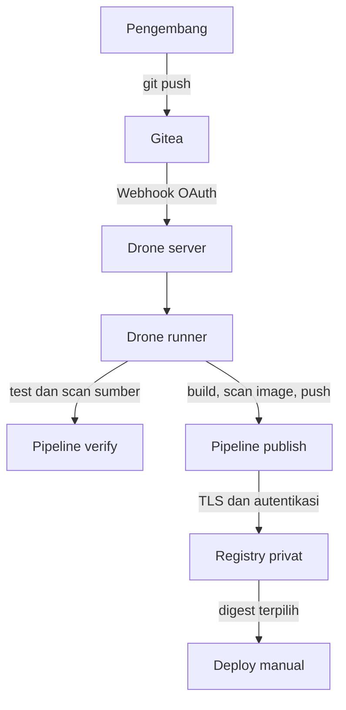

# Cheatsheet Bab 10 — CI/CD Aman dengan Gitea, Drone, Trivy, dan Registry Privat

Aktivitas laboratorium memperagakan *continuous integration* dan *continuous delivery*: kode diuji, dipindai, dibangun, dipindai kembali sebagai image, lalu dipublikasikan dengan identitas commit yang tidak ambigu. Deployment dilakukan melalui promosi manual yang dapat diaudit.

> **Batas penggunaan dan risiko utama.** Dokumentasi resmi Drone menyarankan agar Drone dan Gitea tidak ditempatkan pada mesin atau berkas Compose yang sama. Bab ini sengaja membuat pengecualian untuk laboratorium satu laptop yang bersifat sementara. Drone Docker runner juga memerlukan Docker socket untuk membuat container langkah pipeline; akses tersebut secara efektif memiliki kewenangan tinggi pada host. Gunakan mesin virtual/laptop lab khusus, satu repository yang dibatasi, kapasitas runner `1`, dan jangan memindahkan topologi ini langsung ke produksi.

## Hasil Belajar

Setelah menyelesaikan praktikum, mahasiswa mampu:

1. membedakan *continuous integration*, *continuous delivery*, dan *continuous deployment*;
2. mengintegrasikan Gitea, Drone server, Drone runner, dan registry privat bertLS;
3. memisahkan pipeline verifikasi pull request dari pipeline publikasi branch utama;
4. menerapkan urutan `test → build → scan → push` dengan *security gate* sebelum distribusi image;
5. menggunakan tag commit SHA dan digest untuk menjamin ketertelusuran artefak;
6. mengelola kredensial registry sebagai secret Drone tanpa menuliskannya di repository;
7. melakukan promosi dan rollback deployment berdasarkan digest; dan
8. mengumpulkan evidence yang tidak membocorkan password, token, maupun private key.

## Arsitektur Ringkas



Pipeline `verify` berlaku bagi `push` dan `pull_request`; pipeline ini tidak menerima secret dan tidak memerlukan mode privileged. Pipeline `publish` hanya berlaku bagi `push` ke branch `main`. Build image dilakukan oleh daemon Docker-in-Docker (DinD) terisolasi yang menggunakan TLS. Image dipindai dari arsip lokal sebelum didorong ke registry. Deployment tidak dijalankan sebagai langkah Drone agar pipeline tidak diberi akses langsung ke Docker host.

| Trust boundary | Aset | Kontrol utama |
| --- | --- | --- |
| Workstation–Gitea | source code dan riwayat Git | autentikasi, branch review, commit SHA |
| Gitea–Drone | webhook dan OAuth | client secret, callback URI eksak |
| Runner–pipeline | kode yang tidak tepercaya | repository allowlist, kapasitas 1, secret dipisahkan dari PR |
| DinD–registry | image dan kredensial | TLS, CA privat, bcrypt htpasswd, `password-stdin` |
| Registry–deployment | artefak rilis | promosi berbasis SHA, resolusi digest, health check, rollback |

## Versi yang Digunakan

Versi dipin agar praktikum dapat direproduksi. Versi berikut diverifikasi pada 22 Agustus 2026; dosen perlu memeriksanya kembali sebelum semester berikutnya.

| Komponen | Versi/tag | Peran |
| --- | --- | --- |
| Gitea rootless | `1.27.2-rootless` | Git server dan OAuth provider |
| Drone server | `2.28.2` | Orkestrasi pipeline dan UI |
| Drone Docker runner | `1.8.5` | Eksekusi langkah pipeline |
| Docker CLI/DinD | `29.7.2` | Build dan push image |
| Registry Distribution | `3.1.1` | Registry OCI privat |
| Trivy | `0.74.0` | Pemindaian sumber, image, secret, dan misconfiguration |
| Python | `3.11.16-slim` | Base image aplikasi |
| Flask | `3.1.3` | Framework aplikasi contoh |
| Gunicorn | `26.1.0` | WSGI server |
| pytest | `9.1.1` | Unit test |
| Apache httpd utility | `2.4.68-alpine` | Membuat hash bcrypt untuk registry |

## Kotak Perintah A — Menyiapkan Direktori Bab 10

Jalankan perintah melalui Bash pada Linux, WSL 2, atau Git Bash. Pada Windows, Docker Desktop harus menggunakan backend WSL 2 dan integrasi distro WSL harus aktif.

```bash
$ mkdir -p ~/docker-lab/bab-10/{certs,registry-auth,reports,scripts}
$ mkdir -p ~/docker-lab/bab-10/sample-app/{ci,tests,reports}
$ cd ~/docker-lab/bab-10
$ pwd
```

Struktur akhir yang diharapkan:

```text
bab-10/
├── .env.example
├── .gitignore
├── compose.yaml
├── compose.deploy.yaml
├── certs/
├── registry-auth/
├── reports/
├── scripts/
│   ├── bootstrap-gitea.sh
│   ├── collect-evidence.sh
│   ├── deploy.sh
│   ├── generate-assets.sh
│   ├── negative-tests.sh
│   └── validate-lab.sh
└── sample-app/
    ├── .dockerignore
    ├── .drone.yml
    ├── .gitignore
    ├── Dockerfile
    ├── app.py
    ├── requirements-dev.txt
    ├── requirements.txt
    ├── ci/
    │   └── Dockerfile.dind
    └── tests/
        └── test_app.py
```

## Kotak Script 1 — File `.env.example`

Nilai `PENDING_CREATE_IN_GITEA` akan diganti otomatis oleh script bootstrap setelah OAuth application dibuat. Seluruh nilai rahasia contoh wajib diganti dengan nilai acak.

```dotenv
GITEA_ADMIN_USER=devsecops
GITEA_ADMIN_EMAIL=devsecops@example.invalid
GITEA_ADMIN_PASSWORD=GANTI_DENGAN_NILAI_ACAK
GITEA_SECRET_KEY=GANTI_DENGAN_NILAI_ACAK
GITEA_INTERNAL_TOKEN=GANTI_DENGAN_NILAI_ACAK

DRONE_GITEA_CLIENT_ID=PENDING_CREATE_IN_GITEA
DRONE_GITEA_CLIENT_SECRET=PENDING_CREATE_IN_GITEA
DRONE_RPC_SECRET=GANTI_DENGAN_NILAI_ACAK

REGISTRY_USERNAME=ci-publisher
REGISTRY_PASSWORD=GANTI_DENGAN_NILAI_ACAK
```

## Kotak Script 2 — File `.gitignore`

```gitignore
.env
.deploy.env
.deploy.env.previous
certs/*
registry-auth/*
reports/*
!reports/.gitkeep
```

Private key, password file, dan konfigurasi deployment lokal tidak boleh masuk ke repository. Public CA yang dibutuhkan DinD disalin ke repository aplikasi secara eksplisit.

## Kotak Script 3 — File `compose.yaml`

`registry.localhost`, `gitea.localhost`, dan `drone.localhost` dipakai agar nama yang digunakan browser/host konsisten dengan alias DNS pada jaringan Compose. Seluruh port yang dipublikasikan dibatasi ke loopback.

```yaml
name: devsecops-bab10

services:
  gitea:
    image: docker.gitea.com/gitea:1.27.2-rootless
    restart: unless-stopped
    environment:
      GITEA__database__DB_TYPE: sqlite3
      GITEA__server__DOMAIN: gitea.localhost
      GITEA__server__ROOT_URL: http://gitea.localhost:3000/
      GITEA__server__HTTP_PORT: "3000"
      GITEA__server__DISABLE_SSH: "true"
      GITEA__service__DISABLE_REGISTRATION: "true"
      GITEA__security__INSTALL_LOCK: "true"
      GITEA__security__SECRET_KEY: ${GITEA_SECRET_KEY:?GITEA_SECRET_KEY wajib diisi}
      GITEA__security__INTERNAL_TOKEN: ${GITEA_INTERNAL_TOKEN:?GITEA_INTERNAL_TOKEN wajib diisi}
    volumes:
      - gitea-data:/var/lib/gitea
      - gitea-config:/etc/gitea
    ports:
      - "127.0.0.1:3000:3000"
    networks:
      ci-net:
        aliases:
          - gitea.localhost
    healthcheck:
      test: ["CMD", "wget", "--spider", "--quiet", "http://127.0.0.1:3000/api/healthz"]
      interval: 5s
      timeout: 3s
      retries: 30
    security_opt:
      - no-new-privileges:true
    pids_limit: 300
    mem_limit: 768m

  registry:
    image: registry:3.1.1
    restart: unless-stopped
    environment:
      REGISTRY_HTTP_ADDR: 0.0.0.0:5000
      REGISTRY_HTTP_TLS_CERTIFICATE: /certs/registry.crt
      REGISTRY_HTTP_TLS_KEY: /certs/registry.key
      REGISTRY_AUTH: htpasswd
      REGISTRY_AUTH_HTPASSWD_REALM: DevSecOps Registry
      REGISTRY_AUTH_HTPASSWD_PATH: /auth/htpasswd
      REGISTRY_STORAGE_DELETE_ENABLED: "false"
    volumes:
      - registry-data:/var/lib/registry
      - ./certs:/certs:ro
      - ./registry-auth:/auth:ro
    ports:
      - "127.0.0.1:5000:5000"
    networks:
      ci-net:
        aliases:
          - registry.localhost
    security_opt:
      - no-new-privileges:true
    cap_drop:
      - ALL
    read_only: true
    tmpfs:
      - /tmp:rw,noexec,nosuid,size=32m
    pids_limit: 200
    mem_limit: 512m

  drone:
    image: drone/drone:2.28.2
    profiles: ["drone"]
    restart: unless-stopped
    environment:
      DRONE_GITEA_SERVER: http://gitea.localhost:3000
      DRONE_GITEA_CLIENT_ID: ${DRONE_GITEA_CLIENT_ID:?OAuth client ID wajib diisi}
      DRONE_GITEA_CLIENT_SECRET: ${DRONE_GITEA_CLIENT_SECRET:?OAuth client secret wajib diisi}
      DRONE_RPC_SECRET: ${DRONE_RPC_SECRET:?DRONE_RPC_SECRET wajib diisi}
      DRONE_SERVER_HOST: drone.localhost:8000
      DRONE_SERVER_PROTO: http
      DRONE_USER_CREATE: username:${GITEA_ADMIN_USER},admin:true
    volumes:
      - drone-data:/data
    ports:
      - "127.0.0.1:8000:80"
    networks:
      ci-net:
        aliases:
          - drone.localhost
    depends_on:
      gitea:
        condition: service_healthy
    security_opt:
      - no-new-privileges:true
    pids_limit: 300
    mem_limit: 768m

  drone-runner:
    image: drone/drone-runner-docker:1.8.5
    profiles: ["runner"]
    restart: unless-stopped
    environment:
      DRONE_RPC_PROTO: http
      DRONE_RPC_HOST: drone.localhost
      DRONE_RPC_SECRET: ${DRONE_RPC_SECRET:?DRONE_RPC_SECRET wajib diisi}
      DRONE_RUNNER_NAME: bab10-runner
      DRONE_RUNNER_CAPACITY: "1"
      DRONE_RUNNER_NETWORKS: devsecops-bab10-ci-net
      DRONE_LIMIT_REPOS: devsecops/flask-demo
      DRONE_RUNNER_PRIVILEGED_IMAGES: lab/docker-dind-ca:29.7.2
    volumes:
      - /var/run/docker.sock:/var/run/docker.sock
    networks:
      - ci-net
    depends_on:
      - drone
    pids_limit: 300
    mem_limit: 512m

networks:
  ci-net:
    name: devsecops-bab10-ci-net

volumes:
  gitea-data:
  gitea-config:
  drone-data:
  registry-data:
```

Mount `/var/run/docker.sock` hanya diberikan kepada container runner, bukan kepada langkah build. Kendati demikian, runner tetap menjadi komponen berisiko tinggi dan harus dipisahkan secara fisik atau virtual pada sistem produksi.

## Kotak Script 4 — File `sample-app/requirements.txt`

```text
Flask==3.1.3
gunicorn==26.1.0
```

## Kotak Script 5 — File `sample-app/requirements-dev.txt`

```text
-r requirements.txt
pytest==9.1.1
```

## Kotak Script 6 — File `sample-app/app.py`

```python
import os

from flask import Flask, jsonify


def create_app():
    app = Flask(__name__)

    @app.get("/")
    def index():
        return jsonify(
            service="flask-demo",
            message="Pipeline DevSecOps aktif.",
            version=os.getenv("APP_VERSION", "development"),
        )

    @app.get("/healthz")
    def healthz():
        return jsonify(status="UP")

    return app


app = create_app()
```

## Kotak Script 7 — File `sample-app/tests/test_app.py`

```python
from app import create_app


def test_healthz():
    client = create_app().test_client()
    response = client.get("/healthz")

    assert response.status_code == 200
    assert response.get_json() == {"status": "UP"}


def test_index_exposes_traceable_version(monkeypatch):
    monkeypatch.setenv("APP_VERSION", "commit-test")
    client = create_app().test_client()
    response = client.get("/")

    assert response.status_code == 200
    assert response.get_json()["version"] == "commit-test"
```

## Kotak Script 8 — File `sample-app/Dockerfile`

Build multi-stage memisahkan dependency builder dari runtime. Image akhir memakai user numerik non-root dan menerima commit SHA sebagai label OCI serta versi aplikasi.

```dockerfile
# syntax=docker/dockerfile:1
FROM python:3.11.16-slim AS builder

ENV PIP_DISABLE_PIP_VERSION_CHECK=1 \
    PIP_NO_CACHE_DIR=1

WORKDIR /build
RUN python -m venv /opt/venv
ENV PATH="/opt/venv/bin:${PATH}"

COPY requirements.txt .
RUN pip install --no-cache-dir --requirement requirements.txt

FROM python:3.11.16-slim AS runtime

ARG VCS_REF=unknown
LABEL org.opencontainers.image.source="http://gitea.localhost:3000/devsecops/flask-demo" \
      org.opencontainers.image.revision="${VCS_REF}"

ENV PATH="/opt/venv/bin:${PATH}" \
    PYTHONDONTWRITEBYTECODE=1 \
    PYTHONUNBUFFERED=1 \
    APP_VERSION="${VCS_REF}"

RUN groupadd --gid 10001 appgroup \
    && useradd --uid 10001 --gid appgroup --no-create-home --shell /usr/sbin/nologin appuser

WORKDIR /app
COPY --from=builder /opt/venv /opt/venv
COPY --chown=10001:10001 app.py .

USER 10001:10001
EXPOSE 8080

HEALTHCHECK --interval=10s --timeout=3s --start-period=10s --retries=5 \
  CMD ["python", "-c", "import urllib.request; urllib.request.urlopen('http://127.0.0.1:8080/healthz', timeout=2)"]

CMD ["gunicorn", "--bind=0.0.0.0:8080", "--workers=2", "--threads=2", "--timeout=30", "app:app"]
```

## Kotak Script 9 — File `sample-app/.dockerignore`

```dockerignore
.git
.gitignore
.drone.yml
ci
tests
reports
requirements-dev.txt
__pycache__
*.py[cod]
.pytest_cache
```

## Kotak Script 10 — File `sample-app/.gitignore`

Public CA sengaja disertakan karena bukan secret. Private CA key tetap berada di root lab yang diabaikan Git.

```gitignore
__pycache__/
*.py[cod]
.pytest_cache/
reports/*
!reports/.gitkeep
```

## Kotak Script 11 — File `sample-app/ci/Dockerfile.dind`

DinD menggunakan CA registry yang dibangun ke image lokal. Dengan demikian, registry tidak perlu ditandai `insecure` dan pipeline dapat memverifikasi identitas server TLS.

```dockerfile
FROM docker:29.7.2-dind

COPY registry-ca.crt \
  /etc/docker/certs.d/registry.localhost:5000/ca.crt
```

## Kotak Script 12 — File `sample-app/.drone.yml`

Berkas berisi dua pipeline. `verify` aman dijalankan terhadap pull request karena tidak memperoleh secret dan tidak menjalankan privileged service. `publish` hanya aktif bagi branch `main`, membangun image dalam DinD bertLS, menyimpan image menjadi arsip, menjalankan gate Trivy, membuat SBOM CycloneDX, kemudian melakukan push. Tidak ada tag `latest`.

```yaml
kind: pipeline
type: docker
name: verify

steps:
  - name: unit-test
    image: python:3.11.16-slim
    commands:
      - python -m pip install --disable-pip-version-check --no-cache-dir -r requirements-dev.txt
      - python -m pytest -q

  - name: source-security-gate
    image: aquasec/trivy:0.74.0
    commands:
      - trivy fs --scanners vuln,secret,misconfig --severity HIGH,CRITICAL --ignore-unfixed --exit-code 1 .

trigger:
  event:
    - push
    - pull_request

---
kind: pipeline
type: docker
name: publish

volumes:
  - name: docker-client-certs
    temp: {}

services:
  - name: docker
    image: lab/docker-dind-ca:29.7.2
    pull: if-not-exists
    privileged: true
    environment:
      DOCKER_TLS_CERTDIR: /certs
    volumes:
      - name: docker-client-certs
        path: /certs/client

steps:
  - name: unit-test
    image: python:3.11.16-slim
    commands:
      - python -m pip install --disable-pip-version-check --no-cache-dir -r requirements-dev.txt
      - python -m pytest -q

  - name: build-image
    image: docker:29.7.2-cli
    environment:
      DOCKER_HOST: tcp://docker:2376
      DOCKER_TLS_VERIFY: "1"
      DOCKER_CERT_PATH: /certs/client
    volumes:
      - name: docker-client-certs
        path: /certs/client
    commands:
      - until docker info >/dev/null 2>&1; do sleep 2; done
      - test "$(printf '%s' "$DRONE_COMMIT_SHA" | wc -c)" -eq 40
      - export IMAGE="registry.localhost:5000/devsecops/flask-demo:$DRONE_COMMIT_SHA"
      - docker build --pull --build-arg VCS_REF="$DRONE_COMMIT_SHA" --tag "$IMAGE" .
      - mkdir -p reports
      - docker image save --output reports/flask-demo.tar "$IMAGE"

  - name: image-security-gate
    image: aquasec/trivy:0.74.0
    depends_on:
      - build-image
    commands:
      - trivy image --input reports/flask-demo.tar --severity HIGH,CRITICAL --ignore-unfixed --format json --output reports/trivy-image.json
      - trivy image --input reports/flask-demo.tar --format cyclonedx --output reports/sbom.cdx.json
      - trivy image --input reports/flask-demo.tar --severity HIGH,CRITICAL --ignore-unfixed --exit-code 1

  - name: push-image
    image: docker:29.7.2-cli
    depends_on:
      - image-security-gate
    environment:
      DOCKER_HOST: tcp://docker:2376
      DOCKER_TLS_VERIFY: "1"
      DOCKER_CERT_PATH: /certs/client
      REGISTRY_USERNAME:
        from_secret: registry_username
      REGISTRY_PASSWORD:
        from_secret: registry_password
    volumes:
      - name: docker-client-certs
        path: /certs/client
    commands:
      - export IMAGE="registry.localhost:5000/devsecops/flask-demo:$DRONE_COMMIT_SHA"
      - printf '%s' "$REGISTRY_PASSWORD" | docker login registry.localhost:5000 --username "$REGISTRY_USERNAME" --password-stdin
      - docker push "$IMAGE"
      - docker image inspect --format '{{index .RepoDigests 0}}' "$IMAGE" | tee reports/pushed-image.txt
      - docker logout registry.localhost:5000

trigger:
  branch:
    - main
  event:
    - push
```

> **Interpretasi gate.** Pipeline kedua hanya mencapai `push-image` ketika unit test, build, dan pemindaian image berhasil. SBOM dan laporan JSON hidup di workspace build dan dapat dibaca dalam langkah berikutnya, tetapi belum dipersistenkan ke penyimpanan artefak eksternal. Pada produksi, laporan dan SBOM harus ditandatangani serta diunggah ke artifact store/OCI registry dengan kebijakan retensi.

## Kotak Script 13 — File `compose.deploy.yaml`

Deployment menerima image digest melalui variabel `DEPLOY_IMAGE`. Root filesystem aplikasi dibuat read-only, seluruh Linux capability dihapus, dan port hanya dibuka pada loopback.

```yaml
name: devsecops-bab10-deploy

services:
  app:
    image: ${DEPLOY_IMAGE:?DEPLOY_IMAGE berupa digest wajib diisi}
    restart: unless-stopped
    ports:
      - "127.0.0.1:8080:8080"
    read_only: true
    tmpfs:
      - /tmp:rw,noexec,nosuid,size=32m
    security_opt:
      - no-new-privileges:true
    cap_drop:
      - ALL
    pids_limit: 100
    mem_limit: 256m
    healthcheck:
      test: ["CMD", "python", "-c", "import urllib.request; urllib.request.urlopen('http://127.0.0.1:8080/healthz', timeout=2)"]
      interval: 5s
      timeout: 3s
      retries: 12
```

## Kotak Script 14 — File `scripts/generate-assets.sh`

Script membuat `.env`, CA lokal, sertifikat registry dengan SAN, password bcrypt, serta image DinD yang mempercayai CA tersebut. Script menolak menimpa `.env` untuk mencegah rotasi secret tanpa sengaja.

```bash
#!/usr/bin/env bash
set -Eeuo pipefail

cd "$(dirname "${BASH_SOURCE[0]}")/.."
umask 077

for command_name in docker openssl; do
  command -v "$command_name" >/dev/null 2>&1 || {
    echo "ERROR: $command_name tidak ditemukan." >&2
    exit 1
  }
done

mkdir -p certs registry-auth reports sample-app/ci sample-app/reports
touch reports/.gitkeep sample-app/reports/.gitkeep

if [[ -e .env ]]; then
  echo "ERROR: .env sudah ada dan tidak ditimpa." >&2
  exit 1
fi

random_hex() {
  openssl rand -hex 32
}

cat > .env <<EOF
GITEA_ADMIN_USER=devsecops
GITEA_ADMIN_EMAIL=devsecops@example.invalid
GITEA_ADMIN_PASSWORD=$(random_hex)
GITEA_SECRET_KEY=$(random_hex)
GITEA_INTERNAL_TOKEN=$(random_hex)

DRONE_GITEA_CLIENT_ID=PENDING_CREATE_IN_GITEA
DRONE_GITEA_CLIENT_SECRET=PENDING_CREATE_IN_GITEA
DRONE_RPC_SECRET=$(random_hex)

REGISTRY_USERNAME=ci-publisher
REGISTRY_PASSWORD=$(random_hex)
EOF
chmod 600 .env 2>/dev/null || true

openssl genrsa -out certs/ca.key 4096
openssl req -x509 -new -sha256 -days 365 \
  -key certs/ca.key \
  -subj "/CN=DevSecOps Bab 10 Lab CA" \
  -out certs/ca.crt

openssl genrsa -out certs/registry.key 4096
openssl req -new -sha256 \
  -key certs/registry.key \
  -subj "/CN=registry.localhost" \
  -out certs/registry.csr

cat > certs/registry.ext <<'EOF'
subjectAltName=DNS:registry.localhost
extendedKeyUsage=serverAuth
keyUsage=digitalSignature,keyEncipherment
EOF

openssl x509 -req -sha256 -days 365 \
  -in certs/registry.csr \
  -CA certs/ca.crt \
  -CAkey certs/ca.key \
  -CAcreateserial \
  -extfile certs/registry.ext \
  -out certs/registry.crt

set -a
# shellcheck disable=SC1091
source .env
set +a

docker run --rm --entrypoint htpasswd httpd:2.4.68-alpine \
  -Bbn "$REGISTRY_USERNAME" "$REGISTRY_PASSWORD" \
  > registry-auth/htpasswd

cp certs/ca.crt sample-app/ci/registry-ca.crt
chmod 644 certs/ca.crt certs/registry.crt sample-app/ci/registry-ca.crt
chmod 600 certs/ca.key certs/registry.key registry-auth/htpasswd

docker build \
  --file sample-app/ci/Dockerfile.dind \
  --tag lab/docker-dind-ca:29.7.2 \
  sample-app/ci

echo "PASS: secret, sertifikat, htpasswd, dan image DinD dibuat."
echo "INFO: simpan password .env di password manager; jangan tampilkan pada laporan."
```

## Kotak Script 15 — File `scripts/bootstrap-gitea.sh`

Script menjalankan Gitea dan registry, membuat administrator, repository privat, dan OAuth application Drone. Kredensial OAuth ditulis ke `.env` tanpa dicetak ke terminal.

```bash
#!/usr/bin/env bash
set -Eeuo pipefail

cd "$(dirname "${BASH_SOURCE[0]}")/.."

[[ -f .env ]] || {
  echo "ERROR: .env tidak ditemukan; jalankan generate-assets.sh." >&2
  exit 1
}

set -a
# shellcheck disable=SC1091
source .env
set +a

docker compose up -d gitea registry

until curl --fail --silent http://gitea.localhost:3000/api/healthz >/dev/null; do
  sleep 3
done

set +e
admin_output="$(docker compose exec -T gitea gitea admin user create \
  --username "$GITEA_ADMIN_USER" \
  --password "$GITEA_ADMIN_PASSWORD" \
  --email "$GITEA_ADMIN_EMAIL" \
  --admin \
  --must-change-password=false 2>&1)"
admin_status=$?
set -e

if [[ $admin_status -ne 0 ]] && ! grep -qi "already exists" <<<"$admin_output"; then
  printf '%s\n' "$admin_output" >&2
  exit "$admin_status"
fi

curl_config="$(mktemp)"
trap 'rm -f "$curl_config"' EXIT
chmod 600 "$curl_config"
cat > "$curl_config" <<EOF
user = "$GITEA_ADMIN_USER:$GITEA_ADMIN_PASSWORD"
silent
show-error
EOF

repo_status="$(curl --config "$curl_config" \
  --output /tmp/bab10-repo-response.json \
  --write-out '%{http_code}' \
  --request POST \
  --header 'Content-Type: application/json' \
  --data '{"name":"flask-demo","private":true,"auto_init":false}' \
  http://gitea.localhost:3000/api/v1/user/repos)"

if [[ "$repo_status" != "201" && "$repo_status" != "409" ]]; then
  echo "ERROR: pembuatan repository menghasilkan HTTP $repo_status." >&2
  exit 1
fi

if [[ "$DRONE_GITEA_CLIENT_ID" == "PENDING_CREATE_IN_GITEA" ]]; then
  oauth_response="$(curl --config "$curl_config" \
    --request POST \
    --header 'Content-Type: application/json' \
    --data '{"name":"drone-bab10","redirect_uris":["http://drone.localhost:8000/login"],"confidential_client":true}' \
    http://gitea.localhost:3000/api/v1/user/applications/oauth2)"

  OAUTH_RESPONSE="$oauth_response" python3 - <<'PY'
import json
import os
import re
from pathlib import Path

payload = json.loads(os.environ["OAUTH_RESPONSE"])
client_id = payload["client_id"]
client_secret = payload["client_secret"]

env_path = Path(".env")
text = env_path.read_text(encoding="utf-8")
text = re.sub(
    r"^DRONE_GITEA_CLIENT_ID=.*$",
    f"DRONE_GITEA_CLIENT_ID={client_id}",
    text,
    flags=re.MULTILINE,
)
text = re.sub(
    r"^DRONE_GITEA_CLIENT_SECRET=.*$",
    f"DRONE_GITEA_CLIENT_SECRET={client_secret}",
    text,
    flags=re.MULTILINE,
)
env_path.write_text(text, encoding="utf-8")
PY
fi

rm -f /tmp/bab10-repo-response.json
echo "PASS: Gitea, repository privat, dan OAuth application siap."
echo "INFO: OAuth secret telah disimpan di .env tanpa ditampilkan."
```

## Kotak Script 16 — File `scripts/validate-lab.sh`

Validasi statis memeriksa sintaks Python dan Compose, larangan tag `latest`/registry insecure, pemisahan trigger, serta urutan gate sebelum push.

```bash
#!/usr/bin/env bash
set -Eeuo pipefail

cd "$(dirname "${BASH_SOURCE[0]}")/.."

required_files=(
  compose.yaml
  compose.deploy.yaml
  sample-app/.drone.yml
  sample-app/Dockerfile
  sample-app/app.py
  sample-app/tests/test_app.py
  sample-app/ci/Dockerfile.dind
)

for path in "${required_files[@]}"; do
  [[ -s "$path" ]] || {
    echo "FAIL: $path tidak ditemukan atau kosong." >&2
    exit 1
  }
done

python3 -m py_compile sample-app/app.py sample-app/tests/test_app.py

if grep -R --line-number --extended-regexp \
  'image:[[:space:]]*[^[:space:]]*:latest|insecure:[[:space:]]*true' \
  compose.yaml compose.deploy.yaml sample-app/.drone.yml; then
  echo "FAIL: tag latest atau insecure registry terdeteksi." >&2
  exit 1
fi

grep -q '^USER 10001:10001$' sample-app/Dockerfile
grep -q 'read_only: true' compose.deploy.yaml
grep -q 'cap_drop:' compose.deploy.yaml
grep -q 'from_secret: registry_username' sample-app/.drone.yml
grep -q 'from_secret: registry_password' sample-app/.drone.yml
grep -q 'pull_request' sample-app/.drone.yml
grep -q 'branch:' sample-app/.drone.yml

scan_line="$(grep -n 'name: image-security-gate' sample-app/.drone.yml | cut -d: -f1)"
push_line="$(grep -n 'name: push-image' sample-app/.drone.yml | cut -d: -f1)"
if (( scan_line >= push_line )); then
  echo "FAIL: langkah push berada sebelum security gate." >&2
  exit 1
fi

if [[ -f .env ]]; then
  docker compose config --quiet
else
  echo "INFO: validasi Compose penuh menunggu pembuatan .env."
fi

echo "PASS: kontrol statis dan urutan pipeline valid."
```

## Kotak Script 17 — File `scripts/deploy.sh`

Script menerima commit SHA 40 karakter, menarik image, menyelesaikannya menjadi digest immutable, kemudian melakukan deployment dan health check. Jika health check gagal, script mencoba mengembalikan `.deploy.env.previous`.

```bash
#!/usr/bin/env bash
set -Eeuo pipefail

cd "$(dirname "${BASH_SOURCE[0]}")/.."

commit_sha="${1:-}"
if [[ ! "$commit_sha" =~ ^[0-9a-f]{40}$ ]]; then
  echo "ERROR: argumen wajib berupa commit SHA heksadesimal 40 karakter." >&2
  exit 2
fi

[[ -f .env ]] || {
  echo "ERROR: .env tidak ditemukan." >&2
  exit 1
}

set -a
# shellcheck disable=SC1091
source .env
set +a

image_tag="registry.localhost:5000/devsecops/flask-demo:${commit_sha}"

printf '%s' "$REGISTRY_PASSWORD" | docker login registry.localhost:5000 \
  --username "$REGISTRY_USERNAME" --password-stdin >/dev/null

docker pull "$image_tag"
image_digest="$(docker image inspect \
  --format '{{range .RepoDigests}}{{println .}}{{end}}' \
  "$image_tag" | grep '^registry.localhost:5000/devsecops/flask-demo@sha256:' | head -n 1)"

[[ -n "$image_digest" ]] || {
  echo "ERROR: digest image tidak ditemukan." >&2
  docker logout registry.localhost:5000 >/dev/null || true
  exit 1
}

if [[ -f .deploy.env ]]; then
  cp .deploy.env .deploy.env.previous
fi

umask 077
printf 'DEPLOY_IMAGE=%s\n' "$image_digest" > .deploy.env

docker compose --env-file .deploy.env -f compose.deploy.yaml up -d

healthy=false
for _ in $(seq 1 24); do
  if curl --fail --silent http://localhost:8080/healthz >/dev/null; then
    healthy=true
    break
  fi
  sleep 3
done

if [[ "$healthy" != "true" ]]; then
  echo "FAIL: health check gagal; rollback dicoba." >&2
  if [[ -f .deploy.env.previous ]]; then
    cp .deploy.env.previous .deploy.env
    docker compose --env-file .deploy.env -f compose.deploy.yaml up -d
  fi
  docker logout registry.localhost:5000 >/dev/null || true
  exit 1
fi

docker logout registry.localhost:5000 >/dev/null
echo "PASS: deployment sehat menggunakan ${image_digest}."
```

## Kotak Script 18 — File `scripts/negative-tests.sh`

Negative test membuktikan registry menolak akses anonim/kredensial salah, deployment menolak tag yang tidak sah, dan konfigurasi tidak mengandung pola berbahaya yang sudah dikenal.

```bash
#!/usr/bin/env bash
set -Eeuo pipefail

cd "$(dirname "${BASH_SOURCE[0]}")/.."

set -a
# shellcheck disable=SC1091
source .env
set +a

failures=0

expect_status() {
  local name="$1"
  local expected="$2"
  shift 2
  local actual
  actual="$(curl --silent --output /dev/null --write-out '%{http_code}' "$@")"
  if [[ "$actual" == "$expected" ]]; then
    echo "PASS: $name menghasilkan HTTP $actual."
  else
    echo "FAIL: $name menghasilkan HTTP $actual; diharapkan $expected." >&2
    failures=$((failures + 1))
  fi
}

expect_status "registry anonim" "401" \
  --cacert certs/ca.crt https://registry.localhost:5000/v2/

expect_status "registry dengan password salah" "401" \
  --cacert certs/ca.crt \
  --user "${REGISTRY_USERNAME}:password-yang-salah" \
  https://registry.localhost:5000/v2/

if ./scripts/deploy.sh latest >/dev/null 2>&1; then
  echo "FAIL: deploy menerima tag latest." >&2
  failures=$((failures + 1))
else
  echo "PASS: deploy menolak tag yang bukan commit SHA penuh."
fi

if grep -R --quiet --extended-regexp \
  'insecure:[[:space:]]*true|:[[:space:]]*latest' \
  compose.yaml compose.deploy.yaml sample-app/.drone.yml; then
  echo "FAIL: konfigurasi insecure atau latest terdeteksi." >&2
  failures=$((failures + 1))
else
  echo "PASS: tidak ada insecure registry atau tag latest."
fi

printf 'Jumlah kegagalan: %d\n' "$failures"
exit "$failures"
```

## Kotak Script 19 — File `scripts/collect-evidence.sh`

Evidence tidak menyertakan `.env`, private key, htpasswd, token Drone, atau output konfigurasi Compose yang telah menginterpolasi secret.

```bash
#!/usr/bin/env bash
set -Eeuo pipefail

cd "$(dirname "${BASH_SOURCE[0]}")/.."
mkdir -p reports

docker compose --profile drone --profile runner ps > reports/compose-ps.txt
docker compose --profile drone --profile runner images > reports/compose-images.txt
docker compose --profile drone --profile runner config --no-interpolate \
  > reports/compose-no-interpolate.yaml
docker compose --profile drone --profile runner logs --no-color --tail 200 \
  > reports/service-logs.txt

curl --fail --silent http://gitea.localhost:3000/api/healthz \
  > reports/gitea-health.json
curl --fail --silent http://drone.localhost:8000/healthz \
  > reports/drone-health.txt
curl --fail --silent --cacert certs/ca.crt \
  --user "$(sed -n 's/^REGISTRY_USERNAME=//p' .env):$(sed -n 's/^REGISTRY_PASSWORD=//p' .env)" \
  https://registry.localhost:5000/v2/_catalog \
  > reports/registry-catalog.json

if [[ -f .deploy.env ]]; then
  sed -n 's/^DEPLOY_IMAGE=/DEPLOY_IMAGE=/p' .deploy.env \
    > reports/deployed-image.txt
  curl --fail --silent http://localhost:8080/healthz \
    > reports/deployed-health.json
  curl --fail --silent http://localhost:8080/ \
    > reports/deployed-version.json
fi

sha256sum \
  compose.yaml \
  compose.deploy.yaml \
  sample-app/.drone.yml \
  sample-app/Dockerfile \
  sample-app/app.py \
  sample-app/requirements.txt \
  sample-app/requirements-dev.txt \
  > reports/source-sha256.txt

for forbidden in GITEA_ADMIN_PASSWORD DRONE_GITEA_CLIENT_SECRET DRONE_RPC_SECRET REGISTRY_PASSWORD; do
  if grep -R --fixed-strings --quiet "$forbidden=" reports; then
    echo "FAIL: nama variabel sensitif terdeteksi dalam reports." >&2
    exit 1
  fi
done

echo "PASS: evidence tersimpan pada reports/. Tinjau manual sebelum dibagikan."
```

> Penggunaan `--user` dapat membuat kredensial registry tampak sementara pada daftar proses lokal. Untuk runner bersama, gunakan credential helper atau file konfigurasi `curl` sementara dengan permission ketat. Script ini hanya untuk laptop laboratorium pengguna tunggal.

## Kotak Perintah B — Memberi Izin dan Membuat Aset Keamanan

```bash
$ chmod +x scripts/*.sh
$ ./scripts/generate-assets.sh
$ ./scripts/validate-lab.sh
$ sed -n 's/^\([^=]*\)=.*/\1=<REDACTED>/p' .env
$ openssl verify -CAfile certs/ca.crt certs/registry.crt
```

Keluaran minimum yang diharapkan:

```text
PASS: secret, sertifikat, htpasswd, dan image DinD dibuat.
PASS: kontrol statis dan urutan pipeline valid.
certs/registry.crt: OK
```

## Kotak Perintah C — Memasang Kepercayaan CA pada Host

DinD sudah mempercayai CA melalui image `lab/docker-dind-ca:29.7.2`. Docker host juga harus mempercayainya karena script deployment melakukan `docker pull`.

### Linux dengan Docker Engine

```bash
$ sudo mkdir -p /etc/docker/certs.d/registry.localhost:5000
$ sudo cp certs/ca.crt /etc/docker/certs.d/registry.localhost:5000/ca.crt
$ sudo systemctl restart docker
$ docker info >/dev/null
```

### Windows dengan Docker Desktop

1. Buka `certs/ca.crt`, lalu pilih pemasangan sertifikat untuk **Local Machine**.
2. Tempatkan sertifikat pada **Trusted Root Certification Authorities**.
3. Tutup dan mulai ulang Docker Desktop.
4. Jalankan perintah verifikasi dari WSL/Git Bash.

CA ini hanya untuk laboratorium dan harus dihapus dari trust store setelah praktikum berakhir. Jangan pernah memasang CA lab pada workstation produksi.

## Kotak Perintah D — Bootstrap Gitea, Repository, dan OAuth

```bash
$ ./scripts/bootstrap-gitea.sh
$ docker compose ps gitea registry
$ curl --cacert certs/ca.crt -I https://registry.localhost:5000/v2/
$ sed -n 's/^DRONE_GITEA_CLIENT_ID=.*/DRONE_GITEA_CLIENT_ID=<REDACTED>/p' .env
```

Respons registry tanpa autentikasi yang benar adalah `401 Unauthorized`; hasil itu membuktikan endpoint aktif sekaligus menolak klien anonim.

## Kotak Perintah E — Menjalankan Drone Server dan Menghubungkan Akun

```bash
$ docker compose --profile drone up -d drone
$ until curl --fail --silent http://drone.localhost:8000/healthz >/dev/null; do sleep 3; done
$ docker compose --profile drone ps
```

Buka `http://drone.localhost:8000`, pilih autentikasi melalui Gitea, dan login sebagai `devsecops`. Pada UI Drone:

1. aktifkan repository `devsecops/flask-demo`;
2. tandai repository sebagai **Trusted** hanya karena pipeline `publish` memerlukan DinD privileged;
3. tambahkan secret repository `registry_username` dan `registry_password` sesuai `.env`;
4. batasi secret agar tidak tersedia bagi pull request; dan
5. periksa kembali bahwa hanya administrator lab yang dapat mengubah pengaturan repository.

Setelah repository dibatasi, jalankan runner:

```bash
$ docker compose --profile drone --profile runner up -d drone-runner
$ docker compose --profile drone --profile runner logs --tail 100 drone-runner
```

Log runner harus menunjukkan koneksi RPC berhasil. Jangan menyalin RPC secret atau registry password ke laporan.

## Kotak Perintah F — Membuat Commit dan Push Pertama

```bash
$ cd ~/docker-lab/bab-10/sample-app
$ git init --initial-branch=main
$ git add .
$ git commit -m "feat: add secure CI pipeline"
$ git remote add origin http://gitea.localhost:3000/devsecops/flask-demo.git
$ git push --set-upstream origin main
```

Gunakan credential manager Git atau masukkan kredensial melalui prompt. Jangan menulis password pada remote URL. Setelah push, Drone seharusnya menjalankan `verify` dan `publish`. Status keduanya harus sukses sebelum image dianggap kandidat rilis.

## Kotak Perintah G — Memverifikasi Artefak Pipeline

Ambil commit SHA dari repository lokal dan verifikasi manifest registry:

```bash
$ cd ~/docker-lab/bab-10
$ COMMIT_SHA="$(git -C sample-app rev-parse HEAD)"
$ test "${#COMMIT_SHA}" -eq 40
$ set -a; source .env; set +a
$ curl --fail --silent --cacert certs/ca.crt \
    --user "$REGISTRY_USERNAME:$REGISTRY_PASSWORD" \
    -H 'Accept: application/vnd.oci.image.manifest.v1+json, application/vnd.docker.distribution.manifest.v2+json' \
    "https://registry.localhost:5000/v2/devsecops/flask-demo/manifests/$COMMIT_SHA" \
    | python3 -m json.tool | sed -n '1,40p'
```

Periksa log Drone dan pastikan urutan faktualnya adalah unit test berhasil, build berhasil, Trivy gate berhasil, kemudian push. Jika scan gagal, tidak boleh terdapat log push pada pipeline yang sama.

## Kotak Perintah H — Promosi Manual dan Verifikasi Deployment

```bash
$ cd ~/docker-lab/bab-10
$ COMMIT_SHA="$(git -C sample-app rev-parse HEAD)"
$ ./scripts/deploy.sh "$COMMIT_SHA"
$ docker compose --env-file .deploy.env -f compose.deploy.yaml ps
$ curl --fail http://localhost:8080/healthz
$ curl --fail http://localhost:8080/ | python3 -m json.tool
$ sed -n 's/^DEPLOY_IMAGE=/DEPLOY_IMAGE=/p' .deploy.env
```

Keluaran aplikasi harus memuat commit SHA yang sama dengan kode yang dipromosikan. `.deploy.env` harus berisi referensi `@sha256:...`, bukan tag. Dengan demikian, perubahan tag di registry tidak dapat mengubah artefak yang sedang dideploy.

## Kotak Perintah I — Menjalankan Negative Test dan Mengumpulkan Evidence

```bash
$ ./scripts/negative-tests.sh | tee reports/negative-tests.txt
$ ./scripts/collect-evidence.sh
$ find reports -maxdepth 1 -type f -printf '%f\n' | sort
```

Pada macOS/BSD atau Git Bash yang tidak mendukung `find -printf`, gunakan:

```bash
$ find reports -maxdepth 1 -type f -print
```

## Matriks Verifikasi PASS/FAIL

| ID | Skenario | PASS | FAIL | Evidence sahih |
| --- | --- | --- | --- | --- |
| CI-01 | Gitea sehat dan repository privat | `/api/healthz` sukses; repo dapat menerima push terautentikasi | health gagal atau push anonim diterima | `gitea-health.json`, pengaturan repo |
| CI-02 | OAuth Drone–Gitea | Login Drone mengarah ke callback `/login` dan akun dikenali | redirect mismatch atau client secret salah | status UI dan log teredaksi |
| CI-03 | Isolasi pull request | Pipeline `verify` berjalan tanpa registry secret/DinD | PR memperoleh secret atau privileged service | konfigurasi trigger dan pengaturan secret |
| CI-04 | Unit test | pytest selesai dengan exit code `0` | test gagal tetapi pipeline berlanjut | log langkah `unit-test` |
| CI-05 | Security gate sumber | temuan sesuai threshold menghentikan langkah | HIGH/CRITICAL diabaikan tanpa keputusan | log Trivy dan exit code |
| CI-06 | Security gate image | scan terjadi setelah build dan sebelum push | push terjadi sebelum scan | log berurutan dan `.drone.yml` |
| CI-07 | Registry privat | TLS valid; anonim dan password salah menghasilkan `401` | akses anonim diterima atau CA tidak diverifikasi | output negative test |
| CI-08 | Ketertelusuran image | tag berupa SHA 40 karakter; label revision sama | hanya memakai `latest`/tag ambigu | manifest dan inspect image |
| CI-09 | Deployment immutable | `.deploy.env` memuat `@sha256:` dan health sukses | deploy berdasarkan mutable tag atau unhealthy | `deployed-image.txt`, health JSON |
| CI-10 | Rollback | kegagalan health memicu deployment digest sebelumnya | versi gagal tetap aktif | log deploy dan nilai previous |
| CI-11 | Evidence hygiene | laporan tidak memuat secret/private key | secret muncul pada log/laporan | hasil pemeriksaan reports |

## Troubleshooting dan Analisis Hasil

| Gejala | Penyebab yang mungkin | Tindakan korektif |
| --- | --- | --- |
| Gitea gagal start | volume lama memiliki konfigurasi yang tidak kompatibel atau secret berubah | baca `docker compose logs gitea`; untuk lab baru, hapus volume hanya setelah data dinyatakan tidak diperlukan |
| OAuth `redirect_uri mismatch` | URI callback tidak persis `http://drone.localhost:8000/login` | periksa OAuth application Gitea dan `DRONE_SERVER_HOST/PROTO` |
| Runner tidak terhubung | RPC secret/server host berbeda atau network belum terpasang | bandingkan nama variabel tanpa mencetak nilainya; inspeksi network dan log runner |
| `lstat Dockerfile: no such file` | build context tidak berada pada root repository | pastikan `Dockerfile` dan `.drone.yml` berada di `sample-app/` |
| Pipeline menolak privileged | repository belum dipercaya atau image DinD tidak ada pada allowlist | aktifkan Trusted hanya untuk repo lab; periksa `DRONE_RUNNER_PRIVILEGED_IMAGES` |
| DinD tidak siap | sertifikat client belum dibuat atau service belum sehat | pastikan volume `/certs/client` sama; lihat log service `docker` pada build |
| `x509: certificate signed by unknown authority` | CA belum dipasang pada Docker host atau belum dibangun ke image DinD | ulangi instalasi CA; rebuild `lab/docker-dind-ca:29.7.2`; restart Docker Desktop/Engine |
| `unauthorized: authentication required` | secret Drone tidak sama dengan htpasswd atau tidak tersedia bagi event | perbarui secret repository; jangan aktifkan secret pada PR fork |
| Trivy gagal mengunduh DB | koneksi internet/DNS/rate limit | ulangi setelah koneksi pulih; pada produksi gunakan cache/mirror DB yang dikelola |
| Scan memblokir image | dependency/base image memiliki HIGH/CRITICAL yang belum diperbaiki | tinjau CVE, upgrade dependency/base image, dokumentasikan pengecualian berbatas waktu; jangan menonaktifkan gate secara refleks |
| Manifest tidak ditemukan | pipeline publish gagal atau SHA yang digunakan berbeda | cocokkan SHA lokal dengan log Drone dan daftar tag registry |
| Deploy gagal pull | Docker host belum percaya CA atau login registry gagal | verifikasi `docker login`, trust store CA, dan SAN `registry.localhost` |
| Health check gagal | aplikasi tidak mendengarkan port 8080 atau image salah | baca log deployment, inspeksi digest, uji container secara lokal; rollback harus dipertahankan |

### Analisis Keamanan

1. **Mengapa scan harus mendahului push?** Registry merupakan batas distribusi. Mendorong image sebelum gate lulus memperluas kemungkinan artefak rentan diambil oleh sistem lain, bahkan ketika pipeline kemudian ditandai gagal.
2. **Mengapa SHA belum cukup?** Tag SHA meningkatkan ketertelusuran, tetapi tag registry tetap dapat dipindahkan. Deployment menyelesaikan tag tersebut menjadi digest agar artefak yang dijalankan benar-benar immutable.
3. **Mengapa PR tidak menerima secret?** Kontributor pull request dapat mengubah `.drone.yml` atau kode untuk mengekfiltrasi environment. Pipeline PR harus dianggap menjalankan input tidak tepercaya.
4. **Mengapa DinD masih berisiko?** `privileged: true` memberi container kemampuan luas. TLS hanya melindungi kanal client–daemon; TLS tidak menghapus risiko privileged. Produksi sebaiknya memakai runner ephemeral terisolasi atau builder rootless yang kompatibel dengan kebijakan organisasi.
5. **Mengapa deployment manual?** Pemisahan antara publikasi dan promosi mendukung *separation of duties*. Keputusan melepas kandidat rilis dapat membutuhkan persetujuan manusia, change ticket, atau policy gate tambahan.
6. **Apa keterbatasan lab?** Gitea dan Drone masih berbagi host, SQLite bukan desain HA, CA dibuat sendiri, secret disimpan pada file lokal, dan evidence pipeline belum dipersistenkan ke artifact store. Semua batasan harus dicatat dalam laporan.

## Kotak Perintah J — Cleanup

Perintah pertama menghentikan layanan tanpa menghapus data. Gunakan penghapusan volume hanya jika seluruh data laboratorium sudah tidak diperlukan.

```bash
$ docker compose --profile drone --profile runner down
$ docker compose --env-file .deploy.env -f compose.deploy.yaml down
```

Cleanup destruktif untuk lab sementara:

```bash
$ docker compose --profile drone --profile runner down --volumes
$ docker compose --env-file .deploy.env -f compose.deploy.yaml down --volumes
$ docker image rm lab/docker-dind-ca:29.7.2 2>/dev/null || true
```

Setelah praktikum, hapus CA `DevSecOps Bab 10 Lab CA` dari trust store sistem. Pertahankan laporan yang telah ditinjau dan hapus `.env`, private key, serta htpasswd secara aman ketika tidak lagi dibutuhkan.

## Evaluasi dan Latihan Mandiri

1. Jelaskan perbedaan *continuous delivery* dan *continuous deployment* berdasarkan keputusan promosi pada lab ini.
2. Mengapa runner yang memegang Docker socket harus dianggap sebagai bagian dari trusted computing base?
3. Rancang perubahan agar pull request dari fork tidak mungkin mengakses registry secret walaupun `.drone.yml` dimodifikasi.
4. Bandingkan tag commit SHA dengan digest OCI dari aspek audit, rollback, dan resistensi terhadap perubahan tag.
5. Tambahkan integration test HTTP yang berjalan terhadap container hasil build sebelum security gate.
6. Ubah threshold Trivy menjadi kebijakan berbasis SLA: Critical tanpa fix, Critical dengan fix, dan High dengan fix. Jelaskan konsekuensinya.
7. Rancang mekanisme persistensi SBOM dan laporan Trivy ke OCI artifact store serta metode penandatanganannya.
8. Usulkan topologi produksi yang memisahkan Gitea, Drone server, runner ephemeral, registry, dan target deployment ke trust zone berbeda.
9. Simulasikan health check gagal pada kandidat baru dan buktikan rollback ke digest sebelumnya.
10. Petakan kontrol lab ini ke praktik NIST SSDF, khususnya perlindungan kode, pembangunan aman, verifikasi artefak, dan respons kerentanan.

## Format Laporan Praktikum

Laporan maksimum enam halaman, tidak termasuk lampiran machine-readable. Laporan sekurang-kurangnya memuat:

- diagram trust boundary dan aliran artefak;
- commit SHA, image digest, dan hubungan keduanya;
- evidence PASS/FAIL untuk CI-01 sampai CI-11;
- satu kegagalan nyata beserta hipotesis, observasi, tindakan korektif, dan verifikasi ulang;
- analisis risiko Docker socket dan DinD privileged;
- alasan mengapa scan ditempatkan sebelum push;
- evaluasi keterbatasan lab serta rancangan perbaikan production-like; dan
- pernyataan bahwa secret, token, password, private key, cookie, dan output `.env` tidak disertakan.

## Rujukan Primer Terverifikasi

1. Drone, [Gitea Provider](https://docs.drone.io/server/provider/gitea/) — konfigurasi OAuth dan peringatan pemisahan host.
2. Drone, [Docker Runner: Privileged Images](https://docs.drone.io/runner/docker/configuration/reference/drone-runner-privileged-images/) — risiko dan allowlist image privileged.
3. Drone, [Docker Pipeline Step Syntax](https://docs.drone.io/pipeline/docker/syntax/steps/) — trusted repository dan privileged step.
4. Drone, [Runner Networks](https://docs.drone.io/runner/docker/configuration/reference/drone-runner-networks/) — pemasangan pipeline pada named network.
5. Drone, [Promote Builds](https://docs.drone.io/promote/) — konsep promosi deployment.
6. Gitea, [Installation with Docker (rootless)](https://docs.gitea.com/installation/install-with-docker-rootless/) — image dan volume rootless.
7. Gitea, [Create OAuth2 Application API](https://docs.gitea.com/api/operations/user-create-oauth2-application/) — bootstrap OAuth application.
8. Docker, [Docker Official Image](https://hub.docker.com/_/docker) — Docker CLI/DinD dan penggunaan TLS pada DinD.
9. Docker, [Verify Repository Client with Certificates](https://docs.docker.com/engine/security/certificates/) — trust store CA registry.
10. CNCF Distribution, [Deploy a Registry Server](https://distribution.github.io/distribution/about/deploying/) — TLS dan autentikasi htpasswd bcrypt.
11. Aqua Security, [Trivy Container Image](https://trivy.dev/docs/latest/guide/target/container_image/) — pemindaian image dari registry/arsip.
12. Aqua Security, [Trivy SBOM](https://trivy.dev/docs/latest/supply-chain/sbom/) — pembuatan dan pemindaian SBOM.
13. NIST, [SP 800-218: Secure Software Development Framework](https://csrc.nist.gov/pubs/sp/800/218/final) — praktik pengembangan perangkat lunak aman.
14. OWASP, [Top 10 CI/CD Security Risks](https://owasp.org/www-project-top-10-ci-cd-security-risks/) — kategori risiko pipeline dan supply chain.

## Catatan Validitas

- **Keyakinan tinggi:** urutan test–build–scan–push, pemisahan secret PR, penggunaan TLS registry, tag SHA, digest deployment, dan larangan host socket pada langkah aplikasi mengikuti prinsip DevSecOps yang mapan serta dokumentasi primer.
- **Keyakinan tinggi:** versi image pada tabel diverifikasi pada 22 Agustus 2026, tetapi tag dapat berubah setelah tanggal tersebut.
- **Keyakinan sedang:** perilaku health endpoint dan bootstrap CLI dapat sedikit berubah pada rilis minor berikutnya; jika hasil berbeda, dokumentasi versi yang sedang digunakan menjadi sumber kebenaran utama.
- **Batas generalisasi:** keberhasilan pada satu laptop tidak membuktikan kesiapan produksi. Topologi produksi memerlukan isolasi runner, TLS publik/PKI organisasi, secret manager, database eksternal, backup, observability, artifact retention, policy-as-code, dan kontrol persetujuan.
