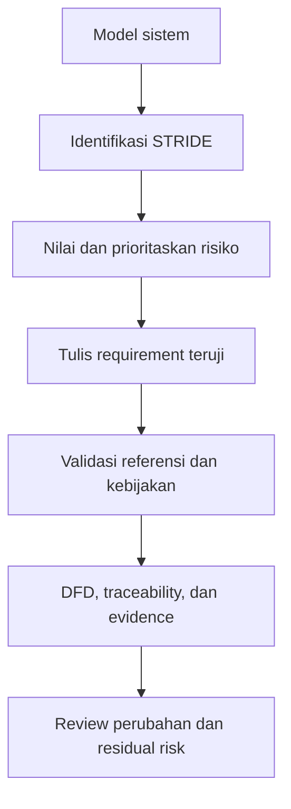

# Cheatsheet Bab 11 — Security Requirements dan Threat Modeling as Code

Cheatsheet ini mengikuti pola Bab 4–10. Setiap berkas yang harus dibuat ditempatkan dalam **Kotak Script**, sedangkan penyiapan, validasi, pengujian, pengumpulan evidence, dan cleanup ditempatkan dalam **Kotak Perintah**. Laboratorium menggunakan arsitektur Gitea–CI runner–registry–runtime dari Bab 10 sebagai objek analisis.

> **Batas penggunaan.** STRIDE adalah teknik pemicu untuk menemukan ancaman, bukan bukti bahwa seluruh ancaman telah ditemukan. Skor risiko membantu prioritas, tetapi tidak boleh menggantikan diskusi konteks bisnis, privasi, keselamatan, supply chain, dan keputusan pemilik risiko. Pengujian hanya dilakukan pada berkas lokal milik sendiri.

## Hasil Belajar

Setelah menyelesaikan praktikum, mahasiswa mampu:

1. mendefinisikan scope, aset, komponen, aliran data, entry point, dan trust boundary;
2. mengidentifikasi ancaman menggunakan enam kategori STRIDE;
3. menilai risiko secara konsisten dengan likelihood dan impact;
4. menulis security requirement yang spesifik dan dapat diuji;
5. menautkan ancaman, mitigasi, requirement, verifikasi, owner, dan evidence;
6. mencatat residual risk serta persetujuan berjangka waktu;
7. menghasilkan DFD Mermaid dan traceability matrix dari sumber yang sama; dan
8. menjadikan validasi threat model sebagai security gate CI.

## Alur Kerja Ringkas



Empat pertanyaan kerja yang digunakan adalah: apa yang sedang dibangun, apa yang dapat salah, apa yang akan dilakukan, dan apakah hasilnya sudah cukup baik. Model harus diperbarui ketika komponen, data sensitif, trust boundary, identitas, privilege, dependency, atau jalur deployment berubah.

## Konvensi Model

| Elemen | Prefix | Contoh |
| --- | --- | --- |
| Aset | `A-` | `A-CI-SECRET` |
| Zona | `Z-` | `Z-CI` |
| Komponen | `C-` | `C-RUNNER` |
| Aliran data | `F-` | `F-03` |
| Trust boundary | `TB-` | `TB-CI-REGISTRY` |
| Ancaman | `TM-` | `TM-04` |
| Requirement | `SR-` | `SR-04` |
| Acceptance criterion | `AC-` | `AC-04A` |
| Risk acceptance | `RA-` | `RA-01` |

Skala risiko laboratorium:

| Skor `likelihood × impact` | Level |
| --- | --- |
| 1–5 | Low |
| 6–11 | Medium |
| 12–19 | High |
| 20–25 | Critical |

Skala ini hanya baseline lokal. Organisasi harus menetapkan matriks dan ambang berdasarkan konteksnya sendiri.

## Kotak Perintah A — Menyiapkan Direktori Bab 11

```bash
$ mkdir -p ~/docker-lab/bab-11/{model,scripts,reports,evidence}
$ cd ~/docker-lab/bab-11
$ pwd
```

Struktur akhir:

```text
bab-11/
├── .gitignore
├── Makefile
├── requirements.txt
├── model/
│   ├── risk-acceptances.yaml
│   ├── security-requirements.yaml
│   ├── system.yaml
│   └── threats.yaml
├── scripts/
│   ├── collect-evidence.sh
│   ├── generate_traceability.py
│   ├── negative-tests.sh
│   ├── render_dfd.py
│   └── validate_model.py
├── evidence/
└── reports/
```

## Kotak Script 1 — File `.gitignore`

```bash
$ nano .gitignore
```

```gitignore
.venv/
__pycache__/
*.pyc
reports/*
evidence/*
!reports/.gitkeep
!evidence/.gitkeep
```

## Kotak Script 2 — File `requirements.txt`

```bash
$ nano requirements.txt
```

```text
PyYAML==6.0.3
```

Versi dependency diverifikasi pada 22 Agustus 2026. Sebelum semester berikutnya, periksa kembali rilis dan advisori dependency.

## Kotak Script 3 — File `model/system.yaml`

```bash
$ nano model/system.yaml
```

```yaml
metadata:
  name: DevSecOps Lab CI/CD
  version: "1.0"
  owner: platform-security
  scope: Gitea, CI runner, registry privat, dan runtime aplikasi
  out_of_scope:
    - keamanan fisik laptop laboratorium
    - serangan terhadap layanan eksternal
  review_triggers:
    - perubahan komponen atau aliran data
    - perubahan trust boundary atau privilege
    - penambahan data sensitif, identity provider, atau dependency kritis
    - insiden, temuan audit, atau perubahan risiko

assets:
  - id: A-SOURCE
    name: Source code dan workflow CI
    classification: internal
  - id: A-CI-SECRET
    name: Token OAuth dan kredensial registry
    classification: secret
  - id: A-IMAGE
    name: OCI image dan digest
    classification: internal
  - id: A-SBOM
    name: SBOM dan laporan pemindaian
    classification: internal
  - id: A-PROD-DATA
    name: Data aplikasi runtime
    classification: confidential
  - id: A-AUDIT
    name: Log audit dan evidence pipeline
    classification: internal

zones:
  - id: Z-USER
    name: Workstation pengembang
    trust: untrusted-input
  - id: Z-SCM
    name: Source control
    trust: controlled
  - id: Z-CI
    name: Build dan test
    trust: high-privilege
  - id: Z-REGISTRY
    name: Penyimpanan artefak
    trust: controlled
  - id: Z-RUNTIME
    name: Deployment
    trust: production-like

components:
  - id: C-DEVELOPER
    name: Pengembang
    type: external_entity
    zone: Z-USER
    assets: [A-SOURCE]
  - id: C-GITEA
    name: Gitea
    type: process
    zone: Z-SCM
    assets: [A-SOURCE, A-AUDIT]
  - id: C-RUNNER
    name: Drone runner
    type: process
    zone: Z-CI
    assets: [A-SOURCE, A-CI-SECRET, A-SBOM, A-AUDIT]
  - id: C-REGISTRY
    name: Registry privat
    type: data_store
    zone: Z-REGISTRY
    assets: [A-IMAGE, A-SBOM, A-AUDIT]
  - id: C-RUNTIME
    name: Runtime aplikasi
    type: process
    zone: Z-RUNTIME
    assets: [A-IMAGE, A-PROD-DATA, A-AUDIT]

trust_boundaries:
  - id: TB-USER-SCM
    from_zone: Z-USER
    to_zone: Z-SCM
    controls: [TLS, authentication, branch-review]
  - id: TB-SCM-CI
    from_zone: Z-SCM
    to_zone: Z-CI
    controls: [webhook-secret, repository-allowlist, isolated-runner]
  - id: TB-CI-REGISTRY
    from_zone: Z-CI
    to_zone: Z-REGISTRY
    controls: [TLS, registry-authentication, security-gate]
  - id: TB-REGISTRY-RUNTIME
    from_zone: Z-REGISTRY
    to_zone: Z-RUNTIME
    controls: [digest-pinning, manual-promotion, health-check]

flows:
  - id: F-01
    name: Push source dan workflow
    source: C-DEVELOPER
    destination: C-GITEA
    protocol: HTTPS
    assets: [A-SOURCE]
    boundaries: [TB-USER-SCM]
  - id: F-02
    name: Webhook dan checkout
    source: C-GITEA
    destination: C-RUNNER
    protocol: HTTPS
    assets: [A-SOURCE, A-AUDIT]
    boundaries: [TB-SCM-CI]
  - id: F-03
    name: Push image dan SBOM
    source: C-RUNNER
    destination: C-REGISTRY
    protocol: HTTPS
    assets: [A-IMAGE, A-SBOM, A-CI-SECRET]
    boundaries: [TB-CI-REGISTRY]
  - id: F-04
    name: Pull image berdasarkan digest
    source: C-REGISTRY
    destination: C-RUNTIME
    protocol: HTTPS
    assets: [A-IMAGE]
    boundaries: [TB-REGISTRY-RUNTIME]

entry_points:
  - id: EP-01
    component: C-GITEA
    interface: HTTPS UI dan Git
    authentication: required
  - id: EP-02
    component: C-RUNNER
    interface: webhook pipeline
    authentication: required
  - id: EP-03
    component: C-REGISTRY
    interface: OCI Distribution API
    authentication: required

assumptions:
  - id: AS-01
    statement: Laptop dan VM laboratorium berada di bawah kendali peserta.
    owner: lab-owner
  - id: AS-02
    statement: Pull request dianggap sebagai input tidak tepercaya.
    owner: platform-security
  - id: AS-03
    statement: Private key dan password tidak dimasukkan ke repository maupun evidence.
    owner: platform-security
```

## Kotak Script 4 — File `model/threats.yaml`

```bash
$ nano model/threats.yaml
```

```yaml
threats:
  - id: TM-01
    title: Identitas pengembang dipalsukan
    stride: Spoofing
    target: C-GITEA
    asset: A-SOURCE
    scenario: Token atau sesi pengembang dicuri lalu digunakan untuk mendorong perubahan.
    preconditions: Kredensial pengembang telah bocor.
    likelihood: 3
    impact: 5
    score: 15
    risk_level: High
    treatment: mitigate
    requirement_refs: [SR-01]
    owner: scm-owner
    status: open

  - id: TM-02
    title: Workflow pull request memanipulasi pipeline
    stride: Tampering
    target: F-02
    asset: A-CI-SECRET
    scenario: Pull request mengubah workflow untuk membaca atau mengirim secret.
    preconditions: Pipeline PR menerima secret atau konfigurasi privileged.
    likelihood: 4
    impact: 5
    score: 20
    risk_level: Critical
    treatment: mitigate
    requirement_refs: [SR-02]
    owner: ci-owner
    status: open

  - id: TM-03
    title: Deployment tidak dapat diatribusikan
    stride: Repudiation
    target: C-RUNTIME
    asset: A-AUDIT
    scenario: Operator menyangkal promosi karena evidence tidak mengaitkan actor, commit, digest, dan waktu.
    preconditions: Audit trail tidak lengkap atau dapat diubah.
    likelihood: 3
    impact: 4
    score: 12
    risk_level: High
    treatment: mitigate
    requirement_refs: [SR-03]
    owner: release-owner
    status: open

  - id: TM-04
    title: Secret muncul pada log atau image layer
    stride: Information Disclosure
    target: C-RUNNER
    asset: A-CI-SECRET
    scenario: Perintah build atau debugging menulis secret ke log, filesystem, atau layer image.
    preconditions: Secret tersedia pada job publikasi.
    likelihood: 4
    impact: 5
    score: 20
    risk_level: Critical
    treatment: mitigate
    requirement_refs: [SR-04]
    owner: platform-security
    status: open

  - id: TM-05
    title: Job menghabiskan sumber daya runner
    stride: Denial of Service
    target: C-RUNNER
    asset: A-AUDIT
    scenario: Job tanpa batas menghabiskan CPU, RAM, PID, atau ruang disk dan memblokir pipeline lain.
    preconditions: Runner tidak memiliki quota, timeout, atau cleanup.
    likelihood: 3
    impact: 3
    score: 9
    risk_level: Medium
    treatment: mitigate
    requirement_refs: [SR-05]
    owner: ci-owner
    status: open

  - id: TM-06
    title: DinD privileged meningkatkan dampak kompromi
    stride: Elevation of Privilege
    target: C-RUNNER
    asset: A-CI-SECRET
    scenario: Kode pipeline mengeksploitasi daemon DinD privileged dan mengambil alih lingkungan runner.
    preconditions: Build memakai DinD privileged pada satu VM laboratorium.
    likelihood: 3
    impact: 5
    score: 15
    risk_level: High
    treatment: accept
    requirement_refs: [SR-06]
    owner: lab-owner
    status: accepted

  - id: TM-07
    title: Tag image dipindahkan ke artefak lain
    stride: Tampering
    target: F-04
    asset: A-IMAGE
    scenario: Tag yang mutable menunjuk image berbeda setelah persetujuan rilis.
    preconditions: Deployment menggunakan tag, bukan digest.
    likelihood: 3
    impact: 5
    score: 15
    risk_level: High
    treatment: mitigate
    requirement_refs: [SR-07]
    owner: release-owner
    status: open

  - id: TM-08
    title: Registry palsu diterima client
    stride: Spoofing
    target: F-03
    asset: A-IMAGE
    scenario: Client mempercayai endpoint palsu akibat verifikasi TLS atau CA yang lemah.
    preconditions: Client menonaktifkan verifikasi TLS atau CA lab tidak dikelola.
    likelihood: 2
    impact: 5
    score: 10
    risk_level: Medium
    treatment: mitigate
    requirement_refs: [SR-08]
    owner: registry-owner
    status: open
```

## Kotak Script 5 — File `model/security-requirements.yaml`

```bash
$ nano model/security-requirements.yaml
```

```yaml
requirements:
  - id: SR-01
    threat_refs: [TM-01]
    statement: Branch utama hanya menerima perubahan melalui identitas terautentikasi dan review yang diwajibkan.
    owner: scm-owner
    priority: must
    status: planned
    acceptance_criteria:
      - id: AC-01A
        type: configuration
        procedure: Periksa branch protection dan minimum satu approval.
        expected: Push langsung ditolak dan merge tanpa approval tidak tersedia.
        evidence: evidence/SR-01-branch-protection.txt

  - id: SR-02
    threat_refs: [TM-02]
    statement: Pipeline pull request tidak menerima secret dan tidak menjalankan langkah privileged.
    owner: ci-owner
    priority: must
    status: implemented
    acceptance_criteria:
      - id: AC-02A
        type: negative-test
        procedure: Jalankan pull request yang mencoba membaca registry secret.
        expected: Secret tidak tersedia dan job publikasi tidak dipicu.
        evidence: evidence/SR-02-untrusted-pr.txt

  - id: SR-03
    threat_refs: [TM-03]
    statement: Setiap promosi mencatat actor, waktu UTC, commit SHA, image digest, hasil gate, dan keputusan rollback.
    owner: release-owner
    priority: must
    status: planned
    acceptance_criteria:
      - id: AC-03A
        type: audit
        procedure: Ambil satu record promosi dan telusuri ke pipeline serta artefak.
        expected: Seluruh field wajib tersedia dan saling konsisten.
        evidence: evidence/SR-03-promotion-record.json

  - id: SR-04
    threat_refs: [TM-04]
    statement: Secret tidak boleh tersimpan pada repository, log, image layer, SBOM, atau laporan evidence.
    owner: platform-security
    priority: must
    status: implemented
    acceptance_criteria:
      - id: AC-04A
        type: automated-scan
        procedure: Jalankan secret scan pada Git history, workspace, image, dan evidence.
        expected: Tidak ada secret terverifikasi; false positive terdokumentasi.
        evidence: evidence/SR-04-secret-scan.json

  - id: SR-05
    threat_refs: [TM-05]
    statement: Setiap job memiliki timeout dan batas sumber daya, sedangkan runner melakukan cleanup artefak sementara.
    owner: ci-owner
    priority: should
    status: planned
    acceptance_criteria:
      - id: AC-05A
        type: negative-test
        procedure: Jalankan job beban terkontrol yang melebihi timeout.
        expected: Job dihentikan tanpa menghentikan layanan Gitea dan registry.
        evidence: evidence/SR-05-resource-limit.txt

  - id: SR-06
    threat_refs: [TM-06]
    statement: DinD privileged hanya boleh berjalan pada VM lab khusus, kapasitas satu job, tanpa data produksi, dan dihapus setelah praktikum.
    owner: lab-owner
    priority: must
    status: implemented
    acceptance_criteria:
      - id: AC-06A
        type: review
        procedure: Verifikasi scope runner, kapasitas, data, dan prosedur cleanup.
        expected: Seluruh pembatasan terdokumentasi; penggunaan produksi dinyatakan terlarang.
        evidence: evidence/SR-06-runner-isolation.txt

  - id: SR-07
    threat_refs: [TM-07]
    statement: Deployment hanya menerima referensi image berbentuk digest dan melakukan health check sebelum promosi dinyatakan berhasil.
    owner: release-owner
    priority: must
    status: implemented
    acceptance_criteria:
      - id: AC-07A
        type: negative-test
        procedure: Coba deployment hanya dengan tag mutable.
        expected: Gate menolak referensi yang tidak memuat @sha256.
        evidence: evidence/SR-07-digest-gate.txt

  - id: SR-08
    threat_refs: [TM-08]
    statement: Seluruh client registry memverifikasi hostname dan rantai CA; mode insecure registry dilarang.
    owner: registry-owner
    priority: must
    status: implemented
    acceptance_criteria:
      - id: AC-08A
        type: negative-test
        procedure: Hubungkan client ke registry dengan sertifikat atau hostname yang tidak cocok.
        expected: TLS handshake atau login gagal.
        evidence: evidence/SR-08-tls-negative.txt
```

## Kotak Script 6 — File `model/risk-acceptances.yaml`

```bash
$ nano model/risk-acceptances.yaml
```

```yaml
acceptances:
  - id: RA-01
    threat_ref: TM-06
    scope: VM laboratorium Bab 10 dan 11 tanpa data produksi
    rationale: DinD privileged diperlukan untuk demonstrasi build; dampaknya dibatasi dengan VM khusus dan cleanup.
    compensating_controls:
      - runner hanya menerima repository praktikum
      - kapasitas runner dibatasi satu job
      - secret produksi dan data institusi tidak tersedia
      - VM dihentikan atau dihapus setelah praktikum
    owner: lab-owner
    approver: course-owner
    approved_on: 2026-08-22
    expires_on: 2027-12-31
    review_trigger: Perubahan scope, runner, privilege, data, atau penggunaan di luar laboratorium.
```

Risk acceptance bukan cara menghapus temuan. Record wajib memiliki scope sempit, alasan, kontrol kompensasi, pemilik, approver, tanggal kedaluwarsa, dan pemicu review.

## Kotak Script 7 — File `scripts/validate_model.py`

```bash
$ nano scripts/validate_model.py
```

```python
#!/usr/bin/env python3
import argparse
import json
import sys
from datetime import date
from pathlib import Path

import yaml

STRIDE = {
    "Spoofing",
    "Tampering",
    "Repudiation",
    "Information Disclosure",
    "Denial of Service",
    "Elevation of Privilege",
}
RISK_LEVELS = {"Low", "Medium", "High", "Critical"}
TREATMENTS = {"mitigate", "accept", "avoid", "transfer"}


def load_yaml(path):
    with Path(path).open(encoding="utf-8") as handle:
        return yaml.safe_load(handle) or {}


def duplicates(values):
    seen, repeated = set(), set()
    for value in values:
        if value in seen:
            repeated.add(value)
        seen.add(value)
    return sorted(repeated)


def expected_level(score):
    if score >= 20:
        return "Critical"
    if score >= 12:
        return "High"
    if score >= 6:
        return "Medium"
    return "Low"


def require_fields(item, fields, label, errors):
    for field in fields:
        if field not in item or item[field] in (None, "", []):
            errors.append(f"{label}: field wajib '{field}' tidak tersedia")


def main():
    parser = argparse.ArgumentParser(description="Validasi threat model Bab 11")
    parser.add_argument("--system", default="model/system.yaml")
    parser.add_argument("--threats", default="model/threats.yaml")
    parser.add_argument("--requirements", default="model/security-requirements.yaml")
    parser.add_argument("--acceptances", default="model/risk-acceptances.yaml")
    parser.add_argument("--report", default="reports/validation.json")
    args = parser.parse_args()

    errors, warnings = [], []
    try:
        system = load_yaml(args.system)
        threats_doc = load_yaml(args.threats)
        requirements_doc = load_yaml(args.requirements)
        acceptances_doc = load_yaml(args.acceptances)
    except (OSError, yaml.YAMLError) as exc:
        print(f"FAIL: tidak dapat membaca model: {exc}", file=sys.stderr)
        return 2

    assets = system.get("assets", [])
    zones = system.get("zones", [])
    components = system.get("components", [])
    boundaries = system.get("trust_boundaries", [])
    flows = system.get("flows", [])
    entries = system.get("entry_points", [])
    assumptions = system.get("assumptions", [])
    threats = threats_doc.get("threats", [])
    requirements = requirements_doc.get("requirements", [])
    acceptances = acceptances_doc.get("acceptances", [])

    collections = {
        "asset": assets,
        "zone": zones,
        "component": components,
        "boundary": boundaries,
        "flow": flows,
        "entry point": entries,
        "assumption": assumptions,
        "threat": threats,
        "requirement": requirements,
        "acceptance": acceptances,
    }
    for label, items in collections.items():
        if not isinstance(items, list) or not items:
            errors.append(f"koleksi {label} wajib berupa list yang tidak kosong")
            continue
        ids = [item.get("id") for item in items if isinstance(item, dict)]
        for duplicate in duplicates(ids):
            errors.append(f"ID {label} duplikat: {duplicate}")

    asset_ids = {item.get("id") for item in assets}
    zone_ids = {item.get("id") for item in zones}
    component_ids = {item.get("id") for item in components}
    boundary_ids = {item.get("id") for item in boundaries}
    flow_ids = {item.get("id") for item in flows}
    threat_ids = {item.get("id") for item in threats}
    requirement_ids = {item.get("id") for item in requirements}

    metadata = system.get("metadata", {})
    require_fields(metadata, ["name", "version", "owner", "scope", "review_triggers"], "metadata", errors)

    for component in components:
        label = component.get("id", "component tanpa ID")
        require_fields(component, ["id", "name", "type", "zone", "assets"], label, errors)
        if component.get("zone") not in zone_ids:
            errors.append(f"{label}: zone tidak dikenal {component.get('zone')}")
        for asset in component.get("assets", []):
            if asset not in asset_ids:
                errors.append(f"{label}: asset tidak dikenal {asset}")

    for boundary in boundaries:
        label = boundary.get("id", "boundary tanpa ID")
        require_fields(boundary, ["id", "from_zone", "to_zone", "controls"], label, errors)
        for field in ("from_zone", "to_zone"):
            if boundary.get(field) not in zone_ids:
                errors.append(f"{label}: {field} tidak dikenal {boundary.get(field)}")

    for flow in flows:
        label = flow.get("id", "flow tanpa ID")
        require_fields(flow, ["id", "name", "source", "destination", "protocol", "assets", "boundaries"], label, errors)
        for field in ("source", "destination"):
            if flow.get(field) not in component_ids:
                errors.append(f"{label}: {field} tidak dikenal {flow.get(field)}")
        for asset in flow.get("assets", []):
            if asset not in asset_ids:
                errors.append(f"{label}: asset tidak dikenal {asset}")
        for boundary in flow.get("boundaries", []):
            if boundary not in boundary_ids:
                errors.append(f"{label}: trust boundary tidak dikenal {boundary}")

    for entry in entries:
        label = entry.get("id", "entry point tanpa ID")
        require_fields(entry, ["id", "component", "interface", "authentication"], label, errors)
        if entry.get("component") not in component_ids:
            errors.append(f"{label}: component tidak dikenal {entry.get('component')}")

    covered_stride = set()
    targets = component_ids | flow_ids
    for threat in threats:
        label = threat.get("id", "threat tanpa ID")
        require_fields(
            threat,
            ["id", "title", "stride", "target", "asset", "scenario", "preconditions",
             "likelihood", "impact", "score", "risk_level", "treatment",
             "requirement_refs", "owner", "status"],
            label,
            errors,
        )
        stride = threat.get("stride")
        if stride not in STRIDE:
            errors.append(f"{label}: kategori STRIDE tidak valid {stride}")
        else:
            covered_stride.add(stride)
        if threat.get("target") not in targets:
            errors.append(f"{label}: target tidak dikenal {threat.get('target')}")
        if threat.get("asset") not in asset_ids:
            errors.append(f"{label}: asset tidak dikenal {threat.get('asset')}")
        likelihood, impact = threat.get("likelihood"), threat.get("impact")
        if not isinstance(likelihood, int) or likelihood not in range(1, 6):
            errors.append(f"{label}: likelihood harus integer 1..5")
        if not isinstance(impact, int) or impact not in range(1, 6):
            errors.append(f"{label}: impact harus integer 1..5")
        if isinstance(likelihood, int) and isinstance(impact, int):
            score = likelihood * impact
            if threat.get("score") != score:
                errors.append(f"{label}: score harus {score}, bukan {threat.get('score')}")
            expected = expected_level(score)
            if threat.get("risk_level") != expected:
                errors.append(f"{label}: risk_level harus {expected}")
        if threat.get("risk_level") not in RISK_LEVELS:
            errors.append(f"{label}: risk_level tidak valid")
        if threat.get("treatment") not in TREATMENTS:
            errors.append(f"{label}: treatment tidak valid")
        for requirement in threat.get("requirement_refs", []):
            if requirement not in requirement_ids:
                errors.append(f"{label}: requirement tidak dikenal {requirement}")

    missing_stride = sorted(STRIDE - covered_stride)
    if missing_stride:
        errors.append("kategori STRIDE belum tercakup: " + ", ".join(missing_stride))

    criterion_ids = []
    referenced_threats = set()
    for requirement in requirements:
        label = requirement.get("id", "requirement tanpa ID")
        require_fields(
            requirement,
            ["id", "threat_refs", "statement", "owner", "priority", "status", "acceptance_criteria"],
            label,
            errors,
        )
        for threat_ref in requirement.get("threat_refs", []):
            referenced_threats.add(threat_ref)
            if threat_ref not in threat_ids:
                errors.append(f"{label}: threat tidak dikenal {threat_ref}")
        for criterion in requirement.get("acceptance_criteria", []):
            require_fields(criterion, ["id", "type", "procedure", "expected", "evidence"], f"{label}/criterion", errors)
            criterion_ids.append(criterion.get("id"))
            evidence = str(criterion.get("evidence", ""))
            if evidence and not evidence.startswith("evidence/"):
                errors.append(f"{label}: evidence harus berada di evidence/")

    for duplicate in duplicates(criterion_ids):
        errors.append(f"acceptance criterion duplikat: {duplicate}")
    for orphan in sorted(threat_ids - referenced_threats):
        errors.append(f"threat tidak dirujuk requirement: {orphan}")

    acceptance_by_threat = {}
    today = date.today()
    for acceptance in acceptances:
        label = acceptance.get("id", "acceptance tanpa ID")
        require_fields(
            acceptance,
            ["id", "threat_ref", "scope", "rationale", "compensating_controls", "owner",
             "approver", "approved_on", "expires_on", "review_trigger"],
            label,
            errors,
        )
        threat_ref = acceptance.get("threat_ref")
        if threat_ref not in threat_ids:
            errors.append(f"{label}: threat tidak dikenal {threat_ref}")
        acceptance_by_threat[threat_ref] = acceptance
        try:
            expiry = date.fromisoformat(str(acceptance.get("expires_on")))
            if expiry < today:
                errors.append(f"{label}: risk acceptance kedaluwarsa pada {expiry}")
        except ValueError:
            errors.append(f"{label}: expires_on wajib berformat YYYY-MM-DD")

    for threat in threats:
        if threat.get("treatment") == "accept" and threat.get("id") not in acceptance_by_threat:
            errors.append(f"{threat.get('id')}: treatment accept tanpa risk acceptance")

    report = {
        "status": "PASS" if not errors else "FAIL",
        "summary": {
            "assets": len(assets),
            "components": len(components),
            "flows": len(flows),
            "trust_boundaries": len(boundaries),
            "threats": len(threats),
            "requirements": len(requirements),
            "acceptance_criteria": len(criterion_ids),
            "risk_acceptances": len(acceptances),
        },
        "errors": errors,
        "warnings": warnings,
    }
    report_path = Path(args.report)
    report_path.parent.mkdir(parents=True, exist_ok=True)
    report_path.write_text(json.dumps(report, indent=2, ensure_ascii=False) + "\n", encoding="utf-8")

    print(json.dumps(report, indent=2, ensure_ascii=False))
    return 0 if not errors else 1


if __name__ == "__main__":
    raise SystemExit(main())
```

## Kotak Script 8 — File `scripts/render_dfd.py`

```bash
$ nano scripts/render_dfd.py
```

```python
#!/usr/bin/env python3
from pathlib import Path

import yaml


def safe_label(value):
    return str(value).replace('"', "'").replace("\n", " ")


system = yaml.safe_load(Path("model/system.yaml").read_text(encoding="utf-8"))
components = {item["id"]: item for item in system["components"]}
zones = {item["id"]: item for item in system["zones"]}

lines = ["# Data-Flow Diagram Bab 11", "", "```mermaid", "flowchart LR"]
for zone_id, zone in zones.items():
    lines.append(f'    subgraph {zone_id}["{safe_label(zone["name"])}"]')
    for component in system["components"]:
        if component["zone"] == zone_id:
            shape_left, shape_right = ("[(", ")]" ) if component["type"] == "data_store" else ("[", "]")
            lines.append(
                f'        {component["id"]}{shape_left}"{safe_label(component["name"])}"{shape_right}'
            )
    lines.append("    end")

for flow in system["flows"]:
    assets = ", ".join(flow["assets"])
    label = safe_label(f'{flow["id"]}: {flow["protocol"]}; {assets}')
    lines.append(f'    {flow["source"]} -->|"{label}"| {flow["destination"]}')

lines.extend(["```", "", "## Trust Boundaries", ""])
lines.append("| ID | Dari | Ke | Kontrol |")
lines.append("| --- | --- | --- | --- |")
for boundary in system["trust_boundaries"]:
    controls = ", ".join(boundary["controls"])
    lines.append(
        f'| {boundary["id"]} | {boundary["from_zone"]} | {boundary["to_zone"]} | {controls} |'
    )

output = Path("reports/DFD.md")
output.parent.mkdir(parents=True, exist_ok=True)
output.write_text("\n".join(lines) + "\n", encoding="utf-8")
print(f"PASS: DFD ditulis ke {output}")
```

## Kotak Script 9 — File `scripts/generate_traceability.py`

```bash
$ nano scripts/generate_traceability.py
```

```python
#!/usr/bin/env python3
from pathlib import Path

import yaml


def load(path):
    return yaml.safe_load(Path(path).read_text(encoding="utf-8"))


threats = load("model/threats.yaml")["threats"]
requirements = load("model/security-requirements.yaml")["requirements"]
acceptances = load("model/risk-acceptances.yaml")["acceptances"]
requirement_by_id = {item["id"]: item for item in requirements}
acceptance_by_threat = {item["threat_ref"]: item for item in acceptances}

lines = [
    "# Traceability Matrix Bab 11",
    "",
    "| Threat | STRIDE | Risiko | Treatment | Requirement | Owner | Acceptance |",
    "| --- | --- | --- | --- | --- | --- | --- |",
]
for threat in threats:
    requirement_ids = threat["requirement_refs"]
    owners = sorted({requirement_by_id[item]["owner"] for item in requirement_ids})
    acceptance = acceptance_by_threat.get(threat["id"], {})
    acceptance_text = acceptance.get("id", "-")
    lines.append(
        f'| {threat["id"]} | {threat["stride"]} | {threat["risk_level"]} '
        f'({threat["score"]}) | {threat["treatment"]} | {", ".join(requirement_ids)} '
        f'| {", ".join(owners)} | {acceptance_text} |'
    )

lines.extend([
    "",
    "## Acceptance Criteria",
    "",
    "| Requirement | Criterion | Jenis | Expected | Evidence |",
    "| --- | --- | --- | --- | --- |",
])
for requirement in requirements:
    for criterion in requirement["acceptance_criteria"]:
        lines.append(
            f'| {requirement["id"]} | {criterion["id"]} | {criterion["type"]} '
            f'| {criterion["expected"]} | `{criterion["evidence"]}` |'
        )

output = Path("reports/TRACEABILITY.md")
output.parent.mkdir(parents=True, exist_ok=True)
output.write_text("\n".join(lines) + "\n", encoding="utf-8")
print(f"PASS: traceability matrix ditulis ke {output}")
```

## Kotak Script 10 — File `scripts/negative-tests.sh`

```bash
$ nano scripts/negative-tests.sh
```

```bash
#!/usr/bin/env bash
set -Eeuo pipefail

tmp_dir="$(mktemp -d)"
trap 'rm -rf -- "$tmp_dir"' EXIT
cp -R model "$tmp_dir/model"
mkdir -p "$tmp_dir/reports"

python3 - "$tmp_dir/model/threats.yaml" <<'PY'
import sys
from pathlib import Path
import yaml

path = Path(sys.argv[1])
document = yaml.safe_load(path.read_text(encoding="utf-8"))
document["threats"][0]["score"] = 1
path.write_text(yaml.safe_dump(document, sort_keys=False, allow_unicode=True), encoding="utf-8")
PY

if python3 scripts/validate_model.py \
  --system "$tmp_dir/model/system.yaml" \
  --threats "$tmp_dir/model/threats.yaml" \
  --requirements "$tmp_dir/model/security-requirements.yaml" \
  --acceptances "$tmp_dir/model/risk-acceptances.yaml" \
  --report "$tmp_dir/reports/bad-score.json" >/dev/null 2>&1; then
  echo "FAIL: validator menerima skor risiko yang salah" >&2
  exit 1
fi

grep -q 'score harus 15' "$tmp_dir/reports/bad-score.json"
echo "PASS: skor risiko yang tidak konsisten ditolak"

cp model/threats.yaml "$tmp_dir/model/threats.yaml"
python3 - "$tmp_dir/model/security-requirements.yaml" <<'PY'
import sys
from pathlib import Path
import yaml

path = Path(sys.argv[1])
document = yaml.safe_load(path.read_text(encoding="utf-8"))
document["requirements"][0]["threat_refs"] = ["TM-999"]
path.write_text(yaml.safe_dump(document, sort_keys=False, allow_unicode=True), encoding="utf-8")
PY

if python3 scripts/validate_model.py \
  --system "$tmp_dir/model/system.yaml" \
  --threats "$tmp_dir/model/threats.yaml" \
  --requirements "$tmp_dir/model/security-requirements.yaml" \
  --acceptances "$tmp_dir/model/risk-acceptances.yaml" \
  --report "$tmp_dir/reports/bad-reference.json" >/dev/null 2>&1; then
  echo "FAIL: validator menerima referensi threat yang tidak dikenal" >&2
  exit 1
fi

grep -q 'threat tidak dikenal TM-999' "$tmp_dir/reports/bad-reference.json"
echo "PASS: referensi silang yang rusak ditolak"
```

## Kotak Script 11 — File `scripts/collect-evidence.sh`

```bash
$ nano scripts/collect-evidence.sh
```

```bash
#!/usr/bin/env bash
set -Eeuo pipefail

timestamp="$(date -u +%Y%m%dT%H%M%SZ)"
evidence_dir="evidence/$timestamp"
mkdir -p "$evidence_dir"

python3 scripts/validate_model.py \
  --report "$evidence_dir/validation.json" \
  >"$evidence_dir/validation.stdout.txt"
python3 scripts/render_dfd.py >"$evidence_dir/render.stdout.txt"
python3 scripts/generate_traceability.py >"$evidence_dir/traceability.stdout.txt"
bash scripts/negative-tests.sh >"$evidence_dir/negative-tests.txt"

cp reports/DFD.md "$evidence_dir/DFD.md"
cp reports/TRACEABILITY.md "$evidence_dir/TRACEABILITY.md"
find model scripts -type f -print0 \
  | sort -z \
  | xargs -0 sha256sum >"$evidence_dir/SHA256SUMS.txt"

{
  printf 'timestamp_utc=%s\n' "$timestamp"
  printf 'git_commit=%s\n' "$(git rev-parse HEAD 2>/dev/null || printf 'not-a-git-repository')"
  printf 'python=%s\n' "$(python3 --version 2>&1)"
  printf 'pyyaml=%s\n' "$(python3 -c 'import yaml; print(yaml.__version__)')"
} >"$evidence_dir/ENVIRONMENT.txt"

echo "PASS: evidence tersimpan di $evidence_dir"
echo "Periksa kembali agar evidence tidak memuat token, password, cookie, atau private key."
```

## Kotak Script 12 — File `Makefile`

> Baris perintah pada Makefile wajib diawali karakter **TAB**, bukan spasi.

```bash
$ nano Makefile
```

```makefile
.PHONY: setup validate render traceability negative-test evidence all clean

PYTHON := .venv/bin/python
PIP := .venv/bin/pip

setup:
	python3 -m venv .venv
	$(PIP) install --upgrade pip
	$(PIP) install -r requirements.txt
	mkdir -p reports evidence
	touch reports/.gitkeep evidence/.gitkeep
	chmod +x scripts/*.sh scripts/*.py

validate:
	$(PYTHON) scripts/validate_model.py

render: validate
	$(PYTHON) scripts/render_dfd.py

traceability: validate
	$(PYTHON) scripts/generate_traceability.py

negative-test: validate
	PATH="$(CURDIR)/.venv/bin:$$PATH" bash scripts/negative-tests.sh

evidence: all
	PATH="$(CURDIR)/.venv/bin:$$PATH" bash scripts/collect-evidence.sh

all: validate render traceability negative-test

clean:
	rm -f reports/DFD.md reports/TRACEABILITY.md reports/validation.json
```

## Kotak Perintah B — Menyiapkan Python dan Permission

```bash
$ cd ~/docker-lab/bab-11
$ make setup
```

Verifikasi dependency:

```bash
$ .venv/bin/python -c 'import yaml; print(yaml.__version__)'
```

Hasil yang diharapkan:

```text
6.0.3
```

## Kotak Perintah C — Validasi Positif

```bash
$ make validate
```

Ringkasan yang diharapkan pada JSON:

```json
{
  "status": "PASS",
  "summary": {
    "assets": 6,
    "components": 5,
    "flows": 4,
    "trust_boundaries": 4,
    "threats": 8,
    "requirements": 8,
    "acceptance_criteria": 8,
    "risk_acceptances": 1
  },
  "errors": [],
  "warnings": []
}
```

Validator memeriksa struktur wajib, ID unik, referensi silang, rumus skor, level risiko, enam kategori STRIDE, requirement yatim, acceptance criterion, lokasi evidence, dan risk acceptance yang kedaluwarsa.

## Kotak Perintah D — Menghasilkan DFD dan Traceability Matrix

```bash
$ make render traceability
$ sed -n '1,160p' reports/DFD.md
$ sed -n '1,200p' reports/TRACEABILITY.md
```

DFD bukan sumber kebenaran terpisah. Diagram dihasilkan dari `system.yaml`, sehingga perubahan komponen/aliran tidak perlu disalin manual ke dua tempat. Traceability matrix diturunkan dari threat, requirement, acceptance criterion, dan risk acceptance.

## Kotak Perintah E — Menjalankan Negative Test

```bash
$ make negative-test
```

Hasil yang diharapkan:

```text
PASS: skor risiko yang tidak konsisten ditolak
PASS: referensi silang yang rusak ditolak
```

Negative test wajib memastikan kontrol benar-benar menolak model yang salah. Sekadar melihat validasi positif tidak membuktikan gate bekerja.

## Kotak Perintah F — Menjalankan Seluruh Gate

```bash
$ make all
```

Perintah harus berhenti dengan exit code non-zero ketika salah satu validasi gagal. Pada CI Bab 10, langkah ekuivalen dapat ditambahkan pada pipeline verifikasi tanpa memasang secret:

```yaml
- name: threat-model-gate
  image: python:3.13.7-alpine
  commands:
    - pip install --no-cache-dir -r requirements.txt
    - make all PYTHON=python3
```

Pin image harus diperiksa kembali sebelum semester berikutnya. Pipeline pull request untuk gate ini tidak memerlukan registry password, signing key, atau deployment credential.

## Kotak Perintah G — Simulasi Perubahan Arsitektur

Tambahkan komponen baru hanya setelah membuat branch Git. Contoh berikut sengaja membuat flow menuju komponen yang belum didaftarkan:

```bash
$ cp model/system.yaml /tmp/system.yaml.bak
$ printf '\n  - id: F-99\n    name: Flow rusak\n    source: C-GITEA\n    destination: C-NOT-FOUND\n    protocol: HTTPS\n    assets: [A-SOURCE]\n    boundaries: [TB-SCM-CI]\n' >> model/system.yaml
$ make validate
```

Hasil harus **FAIL** dan memuat:

```text
F-99: destination tidak dikenal C-NOT-FOUND
```

Pulihkan model:

```bash
$ cp /tmp/system.yaml.bak model/system.yaml
$ make validate
```

## Kotak Perintah H — Workshop Review Silang

Gunakan checklist ini dalam review antarkelompok:

```text
[ ] Scope dan out-of-scope dinyatakan eksplisit
[ ] Semua data sensitif tercatat sebagai asset
[ ] Semua external entity, process, data store, dan entry point terpetakan
[ ] Setiap perpindahan zona mencantumkan trust boundary
[ ] Enam kategori STRIDE telah dipertimbangkan
[ ] Scenario menjelaskan attacker action dan dampak, bukan hanya nama kontrol
[ ] Likelihood, impact, score, serta risk level konsisten
[ ] Setiap threat memiliki treatment, owner, dan requirement
[ ] Setiap requirement memiliki acceptance criterion dan evidence path
[ ] Risk acceptance mempunyai approver, expiry, dan review trigger
[ ] Perubahan model dapat menggagalkan gate ketika referensi rusak
[ ] Tidak ada secret atau data pribadi pada model dan evidence
```

Reviewer harus mencoba menemukan komponen, aliran, aset, asumsi, atau trust boundary yang hilang. Lulus validator berarti konsisten secara struktural, bukan berarti model lengkap secara substantif.

## Kotak Perintah I — Mengumpulkan Evidence

```bash
$ make evidence
$ latest="$(find evidence -mindepth 1 -maxdepth 1 -type d | sort | tail -1)"
$ find "$latest" -maxdepth 1 -type f -printf '%f\n' | sort
$ sha256sum -c "$latest/SHA256SUMS.txt"
```

Evidence yang diharapkan meliputi laporan validasi, hasil negative test, DFD, traceability matrix, checksum, versi Python/PyYAML, timestamp UTC, dan commit Git bila tersedia. Jangan sertakan `.env`, token, password, cookie, private key, atau output terminal yang memuat secret.

## Matriks Verifikasi PASS/FAIL

| ID | Pengujian | PASS | FAIL | Evidence |
| --- | --- | --- | --- | --- |
| TMV-01 | Sintaks YAML | Semua berkas dapat diparsing | Parser error | `validation.stdout.txt` |
| TMV-02 | Referensi silang | Asset, component, flow, threat, dan requirement ditemukan | Referensi tidak dikenal | `validation.json` |
| TMV-03 | Skor risiko | `score = likelihood × impact` dan level sesuai | Nilai tidak konsisten | `validation.json` |
| TMV-04 | Cakupan STRIDE | Enam kategori dipertimbangkan | Minimal satu kategori hilang | `validation.json` |
| TMV-05 | Requirement | Semua threat ditautkan ke requirement teruji | Threat yatim atau criterion kosong | `TRACEABILITY.md` |
| TMV-06 | Residual risk | Treatment accept memiliki record aktif | Tidak ada approver/expiry atau kedaluwarsa | `validation.json` |
| TMV-07 | DFD | Komponen dan flow berasal dari `system.yaml` | Diagram manual tidak konsisten | `DFD.md` |
| TMV-08 | Negative test skor | Model dengan skor salah ditolak | Validator mengembalikan exit 0 | `negative-tests.txt` |
| TMV-09 | Negative test referensi | `TM-999` ditolak | Referensi rusak diterima | `negative-tests.txt` |
| TMV-10 | CI gate | Merge diblokir ketika `make all` gagal | Pipeline gagal tetapi merge tetap dapat dilakukan | pipeline run dan branch rule |
| TMV-11 | Evidence hygiene | Tidak ada secret/data pribadi | Secret atau cookie tersimpan | hasil secret scan evidence |
| TMV-12 | Review manusia | Reviewer menemukan/menolak asumsi lemah | Hanya mengandalkan validator | review record |

## Troubleshooting

| Gejala | Kemungkinan penyebab | Tindakan |
| --- | --- | --- |
| `No module named yaml` | Virtual environment belum disiapkan | jalankan `make setup`; gunakan `.venv/bin/python` |
| `mapping values are not allowed` | Indentasi atau tanda titik dua YAML salah | gunakan spasi konsisten; periksa baris yang dilaporkan parser |
| `score harus ...` | Skor tidak sama dengan likelihood × impact | perbaiki score atau nilai likelihood/impact setelah review |
| `risk_level harus ...` | Label tidak sesuai matriks lab | gunakan Low/Medium/High/Critical berdasarkan skor |
| `target tidak dikenal` | ID component/flow berubah tanpa memperbarui threat | koreksi ID atau lakukan review perubahan arsitektur |
| `threat tidak dirujuk requirement` | Ancaman belum mempunyai kontrol yang dapat diuji | tulis requirement dan acceptance criterion; jangan hapus threat hanya agar gate lulus |
| `treatment accept tanpa risk acceptance` | Risiko diterima tanpa tata kelola | tambahkan record lengkap atau ubah treatment |
| `risk acceptance kedaluwarsa` | Tanggal review telah lewat | review ulang; perbarui hanya setelah persetujuan nyata |
| DFD Mermaid gagal dirender | Label atau sintaks hasil generator rusak | periksa `reports/DFD.md`; jangan mengedit hasil tanpa memperbaiki sumber/generator |
| `make: missing separator` | Recipe Makefile memakai spasi | ganti indentasi baris perintah dengan TAB |
| Negative test justru sukses | Validator tidak mendeteksi mutasi | periksa exit code, laporan JSON, dan aturan validator |
| Model sangat panjang | Scope terlalu luas | pecah per trust boundary atau use case, lalu buat context model sebagai induk |

## Analisis Keamanan

1. **Mengapa DFD saja tidak cukup?** Diagram memperlihatkan struktur, tetapi tidak selalu mencatat klasifikasi aset, asumsi, pemilik, acceptance criterion, dan residual risk. Karena itu DFD harus terhubung ke artefak tekstual terstruktur.
2. **Mengapa STRIDE bukan checklist kepatuhan?** Enam kategori membantu eksplorasi, tetapi tidak menjamin coverage domain, privacy, safety, fraud, insider threat, maupun supply chain. Review kontekstual tetap wajib.
3. **Mengapa score tidak boleh dianggap presisi ilmiah?** Likelihood dan impact adalah penilaian ordinal yang dipengaruhi asumsi serta kualitas evidence. Nilainya berguna untuk konsistensi prioritas, bukan untuk menyatakan probabilitas absolut.
4. **Mengapa requirement harus memiliki negative test?** Requirement keamanan biasanya berbicara tentang kondisi yang harus ditolak. Positive test hanya menunjukkan fungsi normal; negative test membuktikan enforcement pada kondisi terlarang.
5. **Mengapa risk acceptance harus kedaluwarsa?** Scope dan kontrol berubah. Penerimaan tanpa expiry dapat hidup lebih lama daripada asumsi yang mendasarinya.
6. **Apa yang belum dibuktikan validator?** Kebenaran skenario, kelengkapan aset, efektivitas kontrol runtime, kualitas pemilik, validitas persetujuan, dan tidak adanya ancaman lain tetap memerlukan manusia serta evidence operasional.

## Kotak Perintah J — Cleanup

Cleanup hasil generasi yang dapat dibuat ulang:

```bash
$ make clean
```

Hapus virtual environment jika ingin mengulang instalasi dependency:

```bash
$ rm -rf -- .venv
```

Hapus evidence hanya setelah laporan dinilai dan retention policy mengizinkan:

```bash
$ find evidence -mindepth 1 -maxdepth 1 -type d -print
$ rm -rf -- evidence/YYYYMMDDTHHMMSSZ
```

Ganti placeholder dengan direktori spesifik yang telah diperiksa. Jangan menghapus seluruh direktori proyek atau evidence tanpa memastikan scope target.

## Evaluasi dan Latihan Mandiri

1. Tambahkan dependency scanner eksternal ke arsitektur dan identifikasi trust boundary baru.
2. Buat minimal dua ancaman untuk webhook antara Gitea dan runner.
3. Tambahkan klasifikasi data serta aturan agar asset `secret` tidak boleh mengalir ke zona `Z-USER`.
4. Ubah validator agar setiap threat Critical wajib memiliki minimal dua acceptance criteria berbeda.
5. Tambahkan residual likelihood, residual impact, dan alasan perubahan skor setelah mitigasi.
6. Buat negative test untuk risk acceptance yang sudah kedaluwarsa.
7. Integrasikan `make all` ke pipeline Bab 10 dan jadikan statusnya wajib sebelum merge.
8. Rancang approval flow sehingga owner threat tidak boleh sekaligus menjadi approver risk acceptance High/Critical.
9. Tambahkan privacy threat modeling untuk data pribadi pada aplikasi runtime.
10. Bandingkan STRIDE dengan attack tree atau misuse case pada satu ancaman yang sama.

## Format Laporan Praktikum

Laporan maksimum enam halaman, tidak termasuk lampiran machine-readable. Laporan sekurang-kurangnya memuat:

- scope, out-of-scope, aset kritis, dan asumsi utama;
- DFD serta penjelasan setiap trust boundary;
- delapan ancaman dan alasan nilai likelihood/impact;
- traceability threat–requirement–criterion–evidence–owner;
- hasil TMV-01 sampai TMV-12;
- satu perubahan model yang sengaja gagal dan bukti gate menolaknya;
- justifikasi serta batas waktu risk acceptance TM-06;
- minimal satu ancaman tambahan yang ditemukan reviewer;
- residual risk setelah kontrol dinyatakan PASS; dan
- pernyataan bahwa evidence tidak memuat secret, cookie, private key, atau data pribadi.

## Rujukan Primer Terverifikasi

1. OWASP, [Threat Modeling Cheat Sheet](https://cheatsheetseries.owasp.org/cheatsheets/Threat_Modeling_Cheat_Sheet.html) — dekomposisi aplikasi, identifikasi/ranking ancaman, mitigasi, serta review/validasi.
2. OWASP, [Threat Modeling Project](https://owasp.org/www-project-threat-modeling/) — empat pertanyaan inti dan pemeliharaan model sepanjang perubahan sistem.
3. OWASP, [Attack Surface Analysis Cheat Sheet](https://cheatsheetseries.owasp.org/cheatsheets/Attack_Surface_Analysis_Cheat_Sheet.html) — entry/exit point, data tidak tepercaya, dan pemicu review ketika attack surface berubah.
4. NIST, [SP 800-218: Secure Software Development Framework 1.1](https://csrc.nist.gov/pubs/sp/800/218/final) — integrasi praktik keamanan ke SDLC dan pengelolaan requirement risiko.
5. Microsoft, [Threat Modeling Tool Threats](https://learn.microsoft.com/azure/security/develop/threat-modeling-tool-threats) — definisi dan contoh kategori STRIDE.
6. PyPI, [PyYAML](https://pypi.org/project/PyYAML/) — sumber rilis dependency parser YAML.

## Catatan Validitas

- **[High confidence]** Pemisahan model sistem, threat, requirement, acceptance criterion, dan risk acceptance mengikuti praktik threat modeling yang dapat ditelusuri serta prinsip secure SDLC.
- **[High confidence]** Validator dan negative test memberikan pemeriksaan deterministik untuk struktur, referensi silang, skor, coverage STRIDE, expiry, dan keterlacakan.
- **[Medium Confidence]** Kelengkapan ancaman dan ketepatan likelihood/impact tidak dapat dibuktikan otomatis; hasil bergantung pada scope, pengetahuan domain, kualitas workshop, dan evidence operasional.
- **Batas generalisasi:** model laboratorium tidak membuktikan kesiapan produksi. Produksi memerlukan review lintas peran, pemetaan regulasi/privasi, data-flow aktual, validasi kontrol runtime, change management, serta tata kelola residual risk organisasi.
