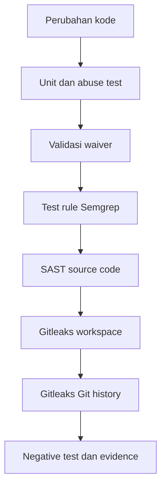

# Cheatsheet Bab 12 — Secure Coding, SAST, dan Secret Scanning

Cheatsheet ini mengikuti pola Bab 4–11. Setiap berkas yang harus dibuat ditempatkan dalam **Kotak Script**, sedangkan instalasi, validasi, pengujian, pengumpulan evidence, dan cleanup ditempatkan dalam **Kotak Perintah**. Laboratorium menggabungkan aplikasi Flask yang telah diperbaiki, unit dan abuse test, custom rule Semgrep, Gitleaks untuk workspace dan Git history, waiver ber-expiry, serta negative test yang membuktikan scanner dapat menolak contoh terlarang.

> **Batas penggunaan.** Seluruh token pada laboratorium ini bersifat sintetis dan memakai format lokal `LAB_TOKEN_...`, bukan pola kredensial penyedia layanan. Jangan pernah memasukkan API key, password, cookie, private key, access token, atau data institusi yang nyata. Jika secret nyata pernah masuk Git, menghapus file pada commit terbaru tidak cukup: credential harus segera dicabut atau dirotasi, penggunaan ditelusuri, riwayat ditangani secara terkontrol, dan insiden didokumentasikan.

## Hasil Belajar

Setelah menyelesaikan praktikum, mahasiswa mampu:

1. mengganti penggunaan `eval` dengan parsing dan operasi yang diizinkan secara eksplisit;
2. menulis unit test, abuse test, dan pemeriksaan AST untuk security requirement;
3. membuat, memvalidasi, dan menguji custom rule Semgrep;
4. menjalankan SAST sebagai gate yang menghasilkan exit code gagal ketika finding ditemukan;
5. memindai workspace dan seluruh Git history menggunakan Gitleaks;
6. membuktikan scanner melalui negative test yang terisolasi;
7. mengelola waiver dengan owner, approver, rationale, scope, dan expiry; dan
8. menghasilkan evidence JSON/JUnit tanpa membocorkan secret.

## Alur Gate Ringkas



| Gate | Fokus | Keterbatasan utama |
| --- | --- | --- |
| Unit/abuse test | perilaku yang diharapkan dan input terlarang | hanya mencakup skenario yang ditulis |
| Semgrep | pola dan aliran kode statis | false positive/negative dan tidak melihat runtime |
| Gitleaks `dir` | file pada workspace saat ini | bukan pengganti pemindaian riwayat |
| Gitleaks `git` | commit dan Git history | finding tidak membuktikan credential masih aktif |
| Waiver validator | kelengkapan tata kelola pengecualian | tidak membuktikan alasan atau approval substantif valid |

## Versi Baseline

Versi berikut diverifikasi pada 22 Agustus 2026. Periksa kembali versi, digest, dan advisori sebelum semester berikutnya.

| Komponen | Versi/tag | Fungsi |
| --- | --- | --- |
| Python | 3.13.x | runtime lokal |
| Flask | 3.1.3 | aplikasi contoh |
| pytest | 9.1.1 | unit dan abuse test |
| PyYAML | 6.0.3 | validasi waiver |
| Semgrep | `semgrep/semgrep:1.174.0` | SAST dan test custom rule |
| Gitleaks | `ghcr.io/gitleaks/gitleaks:v8.30.1` | secret scanning workspace/history |

## Kotak Perintah A — Menyiapkan Direktori Bab 12

```bash
$ mkdir -p ~/docker-lab/bab-12/{app,tests,policy/semgrep,fixtures/vulnerable,waivers,scripts,reports,evidence}
$ cd ~/docker-lab/bab-12
$ touch app/__init__.py reports/.gitkeep evidence/.gitkeep
$ pwd
```

Struktur akhir:

```text
bab-12/
├── .gitleaks.toml
├── .gitignore
├── Makefile
├── requirements.txt
├── app/
│   ├── __init__.py
│   └── app.py
├── evidence/
├── fixtures/
│   └── vulnerable/
│       └── eval_case.py
├── policy/
│   └── semgrep/
│       ├── python-security.py
│       └── python-security.yml
├── reports/
├── scripts/
│   ├── collect-evidence.sh
│   ├── negative-tests.sh
│   ├── run-gates.sh
│   └── validate_waivers.py
├── tests/
│   ├── test_app.py
│   └── test_security.py
└── waivers/
    └── waivers.yaml
```

## Kotak Script 1 — File `.gitignore`

```bash
$ nano .gitignore
```

```gitignore
.venv/
__pycache__/
*.pyc
.pytest_cache/
.env
.env.*
*.pem
*.key
reports/*
evidence/*
!reports/.gitkeep
!evidence/.gitkeep
```

`.gitignore` adalah pencegahan tambahan, bukan kontrol secret scanning. File yang sudah pernah di-commit tetap berada pada history sampai ditangani secara eksplisit.

## Kotak Script 2 — File `requirements.txt`

```bash
$ nano requirements.txt
```

```text
Flask==3.1.3
PyYAML==6.0.3
pytest==9.1.1
```

## Kotak Script 3 — File `app/app.py`

```bash
$ nano app/app.py
```

```python
import operator
import re

from flask import Flask, jsonify, request

INTEGER_PATTERN = re.compile(r"-?\d{1,12}\Z")
OPERATIONS = {
    "add": operator.add,
    "subtract": operator.sub,
    "multiply": operator.mul,
}


def parse_integer(value, field_name):
    if value is None or not INTEGER_PATTERN.fullmatch(value):
        raise ValueError(f"{field_name} harus integer maksimal 12 digit")
    return int(value)


def create_app():
    app = Flask(__name__)

    @app.get("/health")
    def health():
        return jsonify(status="ok", service="secure-calculator"), 200

    @app.get("/calculate")
    def calculate():
        operation_name = request.args.get("op", "")
        operation = OPERATIONS.get(operation_name)
        if operation is None:
            return jsonify(error="operator harus add, subtract, atau multiply"), 400

        try:
            left = parse_integer(request.args.get("a"), "a")
            right = parse_integer(request.args.get("b"), "b")
        except ValueError as exc:
            return jsonify(error=str(exc)), 400

        return jsonify(
            operation=operation_name,
            result=operation(left, right),
        ), 200

    return app


app = create_app()
```

Endpoint tidak menerima ekspresi bebas. Nama operasi dipetakan ke fungsi yang telah diizinkan dan kedua operand dibatasi format serta panjangnya.

## Kotak Script 4 — File `tests/test_app.py`

```bash
$ nano tests/test_app.py
```

```python
import pytest

from app.app import create_app


@pytest.fixture()
def client():
    app = create_app()
    app.config.update(TESTING=True)
    return app.test_client()


def test_health(client):
    response = client.get("/health")
    assert response.status_code == 200
    assert response.get_json()["status"] == "ok"


@pytest.mark.parametrize(
    ("query", "expected"),
    [
        ("?op=add&a=2&b=3", 5),
        ("?op=subtract&a=2&b=3", -1),
        ("?op=multiply&a=-4&b=3", -12),
    ],
)
def test_allowed_operations(client, query, expected):
    response = client.get("/calculate" + query)
    assert response.status_code == 200
    assert response.get_json()["result"] == expected


@pytest.mark.parametrize(
    "query",
    [
        "?op=divide&a=4&b=2",
        "?op=add&a=1%2B2&b=3",
        "?op=add&a=__import__('os')&b=1",
        "?op=add&a=9999999999999&b=1",
        "?op=add&a=1.5&b=2",
        "?op=add&a=&b=2",
    ],
)
def test_rejects_disallowed_input(client, query):
    response = client.get("/calculate" + query)
    assert response.status_code == 400
    assert "error" in response.get_json()
```

## Kotak Script 5 — File `tests/test_security.py`

```bash
$ nano tests/test_security.py
```

```python
import ast
from pathlib import Path


SOURCE_PATH = Path("app/app.py")


def test_no_eval_or_exec_call():
    tree = ast.parse(SOURCE_PATH.read_text(encoding="utf-8"))
    forbidden = []
    for node in ast.walk(tree):
        if isinstance(node, ast.Call) and isinstance(node.func, ast.Name):
            if node.func.id in {"eval", "exec"}:
                forbidden.append((node.func.id, node.lineno))
    assert not forbidden, f"SR-CODE-01 gagal: builtin berbahaya ditemukan {forbidden}"


def test_no_hardcoded_flask_secret_key():
    tree = ast.parse(SOURCE_PATH.read_text(encoding="utf-8"))
    violations = []
    for node in ast.walk(tree):
        if not isinstance(node, ast.Assign):
            continue
        for target in node.targets:
            if isinstance(target, ast.Attribute) and target.attr == "secret_key":
                if isinstance(node.value, ast.Constant) and isinstance(node.value.value, str):
                    violations.append(node.lineno)
    assert not violations, f"SR-CODE-02 gagal: secret_key literal pada baris {violations}"
```

Pemeriksaan AST lebih kuat daripada sekadar mencari substring `eval(`, tetapi tetap bukan pengganti SAST karena dapat melewatkan alias, dynamic import, data flow, atau pola bahasa lain.

## Kotak Script 6 — File `policy/semgrep/python-security.yml`

```bash
$ nano policy/semgrep/python-security.yml
```

```yaml
rules:
  - id: python-dangerous-eval
    languages: [python]
    message: Hindari eval karena input yang dapat dipengaruhi pengguna dapat menjadi eksekusi kode.
    severity: ERROR
    metadata:
      security_requirement: SR-CODE-01
      cwe: CWE-95
      confidence: HIGH
    pattern: eval(...)

  - id: python-subprocess-shell-true
    languages: [python]
    message: Hindari subprocess dengan shell=True; gunakan argument list dan shell=False.
    severity: ERROR
    metadata:
      security_requirement: SR-CODE-03
      cwe: CWE-78
      confidence: HIGH
    pattern: subprocess.$FUNC(..., shell=True, ...)

  - id: flask-hardcoded-secret-key
    languages: [python]
    message: Flask secret key tidak boleh berupa literal pada source code.
    severity: ERROR
    metadata:
      security_requirement: SR-CODE-02
      cwe: CWE-798
      confidence: MEDIUM
    pattern: $APP.secret_key = "..."
```

Rule lokal harus ditinjau seperti source code. Severity `ERROR` akan menjadi gate hanya karena perintah scan juga menggunakan `--error`.

## Kotak Script 7 — File `policy/semgrep/python-security.py`

```bash
$ nano policy/semgrep/python-security.py
```

```python
import os
import subprocess

from flask import Flask


user_input = input()

# ruleid: python-dangerous-eval
eval(user_input)

safe_number = int(user_input)

# ruleid: python-subprocess-shell-true
subprocess.run(user_input, shell=True)

# ok: python-subprocess-shell-true
subprocess.run(["printf", "%s", user_input], check=True, shell=False)

app = Flask(__name__)

# ruleid: flask-hardcoded-secret-key
app.secret_key = "lab-hardcoded-value"

# ok: flask-hardcoded-secret-key
app.secret_key = os.environ["FLASK_SECRET_KEY"]
```

File ini adalah **test fixture rule**, bukan kode aplikasi. Anotasi `ruleid` melindungi dari false negative dan anotasi `ok` melindungi dari false positive pada contoh yang diharapkan aman.

## Kotak Script 8 — File `fixtures/vulnerable/eval_case.py`

```bash
$ nano fixtures/vulnerable/eval_case.py
```

```python
# SENGAJA RENTAN: hanya target negative test pada laboratorium lokal.
expression = input("expression: ")
print(eval(expression))
```

Direktori `fixtures/vulnerable` tidak boleh dicampur dengan source produksi atau dijalankan. Gate normal memindai `app`, `tests`, dan `scripts`; fixture ini dipindai secara eksplisit hanya pada negative test.

## Kotak Script 9 — File `.gitleaks.toml`

```bash
$ nano .gitleaks.toml
```

```toml
title = "DevSecOps Bab 12 Gitleaks"
minVersion = "v8.30.1"

[extend]
useDefault = true

[[rules]]
id = "lab-synthetic-token"
description = "Token sintetis khusus negative test Bab 12"
regex = '''(?i)LAB_TOKEN_[A-Z0-9]{24}'''
keywords = ["LAB_TOKEN_"]

[[allowlists]]
description = "Hanya cache dependency dan metadata tool lokal"
paths = [
  '''(^|/)\.venv/''',
  '''(^|/)\.pytest_cache/''',
  '''(^|/)__pycache__/''',
]
```

Tidak ada allowlist untuk `app`, Git history, reports, atau evidence. Allowlist berbasis nilai secret sengaja dihindari karena dapat menyembunyikan kebocoran yang sama pada lokasi lain.

## Kotak Script 10 — File `waivers/waivers.yaml`

```bash
$ nano waivers/waivers.yaml
```

```yaml
waivers:
  - id: WV-001
    scanner: semgrep
    rule_id: python-dangerous-eval
    target: fixtures/vulnerable/eval_case.py
    scope: Fixture negative test yang tidak dikemas atau dijalankan sebagai aplikasi.
    rationale: Contoh rentan diperlukan untuk membuktikan rule dan exit code gate.
    owner: lab-owner
    approver: course-owner
    approved_on: 2026-08-22
    expires_on: 2027-12-31
    status: approved
    review_trigger: Perubahan target scan, packaging, atau penggunaan fixture di luar laboratorium.
```

Waiver tidak otomatis menonaktifkan finding. Pada lab ini, fixture dipisahkan dari target produksi dan tetap wajib terdeteksi pada negative test. Validator hanya memastikan record pengecualian lengkap, terbatas pada fixture, dan belum kedaluwarsa.

## Kotak Script 11 — File `scripts/validate_waivers.py`

```bash
$ nano scripts/validate_waivers.py
```

```python
#!/usr/bin/env python3
import json
import tomllib
from datetime import date
from pathlib import Path

import yaml


def fail(message, errors):
    errors.append(message)


semgrep_doc = yaml.safe_load(
    Path("policy/semgrep/python-security.yml").read_text(encoding="utf-8")
)
gitleaks_doc = tomllib.loads(Path(".gitleaks.toml").read_text(encoding="utf-8"))
waiver_doc = yaml.safe_load(Path("waivers/waivers.yaml").read_text(encoding="utf-8"))

rule_ids = {item["id"] for item in semgrep_doc.get("rules", [])}
rule_ids.update(item["id"] for item in gitleaks_doc.get("rules", []))
waivers = waiver_doc.get("waivers", [])
errors = []
seen_ids = set()
required = {
    "id",
    "scanner",
    "rule_id",
    "target",
    "scope",
    "rationale",
    "owner",
    "approver",
    "approved_on",
    "expires_on",
    "status",
    "review_trigger",
}

if not waivers:
    fail("waivers harus berupa list yang tidak kosong", errors)

for waiver in waivers:
    waiver_id = waiver.get("id", "waiver-tanpa-id")
    missing = sorted(field for field in required if not waiver.get(field))
    if missing:
        fail(f"{waiver_id}: field wajib kosong {', '.join(missing)}", errors)
    if waiver_id in seen_ids:
        fail(f"ID waiver duplikat: {waiver_id}", errors)
    seen_ids.add(waiver_id)

    if waiver.get("rule_id") not in rule_ids:
        fail(f"{waiver_id}: rule_id tidak dikenal {waiver.get('rule_id')}", errors)
    if waiver.get("scanner") not in {"semgrep", "gitleaks"}:
        fail(f"{waiver_id}: scanner harus semgrep atau gitleaks", errors)
    if waiver.get("status") != "approved":
        fail(f"{waiver_id}: status harus approved", errors)

    target = Path(str(waiver.get("target", "")))
    if not target.is_file():
        fail(f"{waiver_id}: target tidak ditemukan {target}", errors)
    if not str(target).startswith("fixtures/vulnerable/"):
        fail(f"{waiver_id}: waiver lab hanya diizinkan pada fixtures/vulnerable/", errors)

    try:
        expiry = date.fromisoformat(str(waiver.get("expires_on")))
        if expiry < date.today():
            fail(f"{waiver_id}: waiver kedaluwarsa pada {expiry}", errors)
    except ValueError:
        fail(f"{waiver_id}: expires_on wajib berformat YYYY-MM-DD", errors)

report = {
    "status": "PASS" if not errors else "FAIL",
    "waiver_count": len(waivers),
    "known_rule_count": len(rule_ids),
    "errors": errors,
}
Path("reports").mkdir(exist_ok=True)
Path("reports/waivers.json").write_text(
    json.dumps(report, indent=2, ensure_ascii=False) + "\n",
    encoding="utf-8",
)
print(json.dumps(report, indent=2, ensure_ascii=False))
raise SystemExit(0 if not errors else 1)
```

## Kotak Script 12 — File `scripts/run-gates.sh`

```bash
$ nano scripts/run-gates.sh
```

```bash
#!/usr/bin/env bash
set -Eeuo pipefail

SEMGREP_IMAGE="semgrep/semgrep:1.174.0"
GITLEAKS_IMAGE="ghcr.io/gitleaks/gitleaks:v8.30.1"
mode="${1:-all}"

mkdir -p reports

run_unit() {
  .venv/bin/python -m pytest -q --junitxml=reports/pytest.xml
}

run_waivers() {
  .venv/bin/python scripts/validate_waivers.py
}

run_sast() {
  docker run --rm \
    --user "$(id -u):$(id -g)" \
    --env HOME=/tmp \
    --volume "$PWD:/src" \
    --workdir /src \
    "$SEMGREP_IMAGE" \
    semgrep --validate --config policy/semgrep/python-security.yml

  docker run --rm \
    --user "$(id -u):$(id -g)" \
    --env HOME=/tmp \
    --volume "$PWD:/src" \
    --workdir /src \
    "$SEMGREP_IMAGE" \
    semgrep --test policy/semgrep

  docker run --rm \
    --user "$(id -u):$(id -g)" \
    --env HOME=/tmp \
    --volume "$PWD:/src" \
    --workdir /src \
    "$SEMGREP_IMAGE" \
    semgrep scan \
      --config policy/semgrep/python-security.yml \
      --error \
      --strict \
      --metrics off \
      --json \
      --output /src/reports/semgrep.json \
      app tests scripts
}

run_secrets() {
  git rev-parse --is-inside-work-tree >/dev/null

  docker run --rm \
    --user "$(id -u):$(id -g)" \
    --volume "$PWD:/repo" \
    --workdir /repo \
    "$GITLEAKS_IMAGE" \
    dir . \
      --config /repo/.gitleaks.toml \
      --redact \
      --report-format json \
      --report-path /repo/reports/gitleaks-dir.json \
      --exit-code 1

  docker run --rm \
    --user "$(id -u):$(id -g)" \
    --volume "$PWD:/repo" \
    --workdir /repo \
    "$GITLEAKS_IMAGE" \
    git . \
      --config /repo/.gitleaks.toml \
      --redact \
      --report-format json \
      --report-path /repo/reports/gitleaks-git.json \
      --exit-code 1
}

case "$mode" in
  unit) run_unit ;;
  waivers) run_waivers ;;
  sast) run_sast ;;
  secrets) run_secrets ;;
  all)
    run_unit
    run_waivers
    run_sast
    run_secrets
    ;;
  *)
    echo "Penggunaan: $0 {unit|waivers|sast|secrets|all}" >&2
    exit 2
    ;;
esac
```

Perintah `--error` penting karena `semgrep scan` tidak selalu gagal hanya karena finding ditemukan. Gitleaks dijalankan dua kali agar workspace saat ini dan Git history sama-sama diperiksa.

## Kotak Script 13 — File `scripts/negative-tests.sh`

```bash
$ nano scripts/negative-tests.sh
```

```bash
#!/usr/bin/env bash
set -Eeuo pipefail

SEMGREP_IMAGE="semgrep/semgrep:1.174.0"
GITLEAKS_IMAGE="ghcr.io/gitleaks/gitleaks:v8.30.1"
tmp_dir="$(mktemp -d)"
trap 'rm -rf -- "$tmp_dir"' EXIT
chmod 700 "$tmp_dir"

if docker run --rm \
  --user "$(id -u):$(id -g)" \
  --env HOME=/tmp \
  --volume "$PWD:/src:ro" \
  --volume "$tmp_dir:/out" \
  --workdir /src \
  "$SEMGREP_IMAGE" \
  semgrep scan \
    --config policy/semgrep/python-security.yml \
    --error \
    --metrics off \
    --json \
    --output /out/semgrep-negative.json \
    fixtures/vulnerable/eval_case.py; then
  echo "FAIL: Semgrep menerima fixture eval" >&2
  exit 1
fi

grep -q 'python-dangerous-eval' "$tmp_dir/semgrep-negative.json"
echo "PASS: Semgrep menolak fixture eval"

token_prefix="LAB_TOKEN_"
token_payload="ABCDEFGHIJKLMNOPQRSTUVWX"
printf '%s%s\n' "$token_prefix" "$token_payload" >"$tmp_dir/synthetic-secret.txt"

if docker run --rm \
  --user "$(id -u):$(id -g)" \
  --volume "$PWD/.gitleaks.toml:/config/.gitleaks.toml:ro" \
  --volume "$tmp_dir:/scan" \
  --workdir /scan \
  "$GITLEAKS_IMAGE" \
  dir . \
    --config /config/.gitleaks.toml \
    --redact \
    --report-format json \
    --report-path /scan/gitleaks-negative.json \
    --exit-code 1; then
  echo "FAIL: Gitleaks menerima token sintetis" >&2
  exit 1
fi

grep -q 'lab-synthetic-token' "$tmp_dir/gitleaks-negative.json"
if grep -q "$token_payload" "$tmp_dir/gitleaks-negative.json"; then
  echo "FAIL: laporan Gitleaks tidak melakukan redaction" >&2
  exit 1
fi
echo "PASS: Gitleaks menolak dan meredaksi token sintetis"
```

Token lengkap hanya dibentuk pada direktori temporer dan dihapus ketika script selesai. Nilai payload tidak menyerupai credential vendor dan tidak pernah di-commit.

## Kotak Script 14 — File `scripts/collect-evidence.sh`

```bash
$ nano scripts/collect-evidence.sh
```

```bash
#!/usr/bin/env bash
set -Eeuo pipefail

timestamp="$(date -u +%Y%m%dT%H%M%SZ)"
evidence_dir="evidence/$timestamp"
mkdir -p "$evidence_dir"

cp reports/pytest.xml "$evidence_dir/"
cp reports/waivers.json "$evidence_dir/"
cp reports/semgrep.json "$evidence_dir/"
cp reports/gitleaks-dir.json "$evidence_dir/"
cp reports/gitleaks-git.json "$evidence_dir/"

find app tests policy fixtures scripts waivers -type f -print0 \
  | sort -z \
  | xargs -0 sha256sum >"$evidence_dir/SHA256SUMS.txt"

{
  printf 'timestamp_utc=%s\n' "$timestamp"
  printf 'git_commit=%s\n' "$(git rev-parse HEAD 2>/dev/null || printf 'uncommitted')"
  printf 'python=%s\n' "$(.venv/bin/python --version 2>&1)"
  printf 'flask=%s\n' "$(.venv/bin/python -c 'from importlib.metadata import version; print(version("Flask"))')"
  printf 'pytest=%s\n' "$(.venv/bin/python -m pytest --version | head -1)"
  printf 'semgrep=%s\n' "$(docker run --rm semgrep/semgrep:1.174.0 semgrep --version | tail -1)"
  printf 'gitleaks=%s\n' "$(docker run --rm ghcr.io/gitleaks/gitleaks:v8.30.1 version | tail -1)"
} >"$evidence_dir/ENVIRONMENT.txt"

if grep -R -n -E 'LAB_TOKEN_[A-Z0-9]{24}' "$evidence_dir"; then
  echo "FAIL: token sintetis ditemukan pada evidence" >&2
  exit 1
fi

echo "PASS: evidence tersimpan di $evidence_dir"
echo "Lakukan review manual agar evidence tidak memuat credential atau data pribadi lain."
```

## Kotak Script 15 — File `Makefile`

> Baris recipe pada Makefile wajib diawali karakter **TAB**, bukan spasi.

```bash
$ nano Makefile
```

```makefile
.PHONY: setup unit waivers sast secrets gates negative-test all evidence clean

setup:
	python3 -m venv .venv
	.venv/bin/python -m pip install --upgrade pip
	.venv/bin/python -m pip install -r requirements.txt
	mkdir -p reports evidence
	touch reports/.gitkeep evidence/.gitkeep
	chmod +x scripts/*.sh scripts/*.py

unit:
	bash scripts/run-gates.sh unit

waivers:
	bash scripts/run-gates.sh waivers

sast:
	bash scripts/run-gates.sh sast

secrets:
	bash scripts/run-gates.sh secrets

gates:
	bash scripts/run-gates.sh all

negative-test:
	bash scripts/negative-tests.sh

all: gates negative-test

evidence: all
	bash scripts/collect-evidence.sh

clean:
	rm -f reports/pytest.xml reports/waivers.json reports/semgrep.json
	rm -f reports/gitleaks-dir.json reports/gitleaks-git.json
```

## Kotak Perintah B — Menyiapkan Python dan Git Repository

```bash
$ cd ~/docker-lab/bab-12
$ make setup
$ git init
$ git config user.name "DevSecOps Student"
$ git config user.email "student@example.invalid"
$ git add .
$ git commit -m "Bab 12 secure coding baseline"
```

Gunakan identitas Git laboratorium. Jangan menyalin credential atau alamat pribadi ke laporan jika tidak diperlukan.

Verifikasi versi lokal:

```bash
$ .venv/bin/python --version
$ .venv/bin/python -c 'from importlib.metadata import version; import yaml; print(version("Flask"), yaml.__version__)'
$ .venv/bin/python -m pytest --version
```

## Kotak Perintah C — Unit dan Abuse Test

```bash
$ make unit
```

Hasil yang diharapkan:

```text
12 passed
```

Jumlah test dapat ditampilkan berbeda karena parametrization, tetapi seluruh test harus PASS dan `reports/pytest.xml` harus terbentuk.

Uji endpoint secara interaktif bila diperlukan:

```bash
$ FLASK_APP=app.app .venv/bin/flask run --host 127.0.0.1 --port 5000
```

Pada terminal lain:

```bash
$ curl -s 'http://127.0.0.1:5000/health'
$ curl -s 'http://127.0.0.1:5000/calculate?op=add&a=7&b=5'
$ curl -i 'http://127.0.0.1:5000/calculate?op=add&a=__import__(%22os%22)&b=1'
```

Request terakhir harus menghasilkan HTTP 400 dan tidak mengeksekusi input.

## Kotak Perintah D — Validasi Waiver

```bash
$ make waivers
```

Ringkasan yang diharapkan:

```json
{
  "status": "PASS",
  "waiver_count": 1,
  "known_rule_count": 4,
  "errors": []
}
```

Negative test sederhana untuk expiry:

```bash
$ cp waivers/waivers.yaml /tmp/waivers.yaml.bak
$ sed -i 's/expires_on: 2027-12-31/expires_on: 2025-01-01/' waivers/waivers.yaml
$ make waivers
$ cp /tmp/waivers.yaml.bak waivers/waivers.yaml
$ make waivers
```

Eksekusi pertama setelah perubahan harus FAIL. Jangan memperpanjang expiry hanya agar pipeline lulus; waiver harus ditinjau dan disetujui kembali.

## Kotak Perintah E — Menjalankan Test Rule dan SAST

```bash
$ make sast
```

Urutan pemeriksaan:

1. konfigurasi rule divalidasi;
2. anotasi `ruleid` dan `ok` diuji;
3. `app`, `tests`, dan `scripts` dipindai;
4. finding ERROR membuat proses gagal; dan
5. hasil JSON ditulis ke `reports/semgrep.json`.

Periksa ringkasan report:

```bash
$ python3 - <<'PY'
import json
report = json.load(open('reports/semgrep.json', encoding='utf-8'))
print('findings:', len(report.get('results', [])))
print('errors:', len(report.get('errors', [])))
PY
```

Baseline aman seharusnya menghasilkan `findings: 0` dan `errors: 0`.

## Kotak Perintah F — Secret Scanning Workspace dan Git History

```bash
$ make secrets
```

Periksa kedua report:

```bash
$ python3 - <<'PY'
import json
for path in ('reports/gitleaks-dir.json', 'reports/gitleaks-git.json'):
    findings = json.load(open(path, encoding='utf-8'))
    print(path, 'findings:', len(findings))
PY
```

Kedua jumlah harus nol. Jika `git` scan menemukan secret yang sudah dihapus dari workspace, anggap secret telah terpapar: rotasi/cabut lebih dahulu, lalu lakukan investigasi dan pembersihan history sesuai prosedur organisasi.

## Kotak Perintah G — Negative Testing Scanner

```bash
$ make negative-test
```

Hasil yang diharapkan:

```text
PASS: Semgrep menolak fixture eval
PASS: Gitleaks menolak dan meredaksi token sintetis
```

Negative test harus menghasilkan exit non-zero dari scanner, memeriksa rule ID yang tepat, dan memastikan payload token tidak muncul pada report Gitleaks.

## Kotak Perintah H — Menjalankan Seluruh Gate

```bash
$ make all
```

Pipeline Bab 10 dapat menambahkan langkah tanpa secret berikut pada tahap verifikasi pull request:

```yaml
- name: secure-code-gates
  image: docker:29.7.2-cli
  commands:
    - make setup
    - make all
```

Snippet tersebut konseptual: runner harus memiliki Python, virtualenv, Make, dan akses ke Docker daemon/sidecar yang memang sudah didefinisikan pada pipeline Bab 10. Jangan menambahkan registry atau deployment secret ke pipeline pull request hanya untuk menjalankan SAST dan unit test.

## Kotak Perintah I — Mengumpulkan Evidence

```bash
$ make evidence
$ latest="$(find evidence -mindepth 1 -maxdepth 1 -type d | sort | tail -1)"
$ find "$latest" -maxdepth 1 -type f -printf '%f\n' | sort
$ sha256sum -c "$latest/SHA256SUMS.txt"
```

Evidence memuat JUnit, report waiver, Semgrep JSON, dua report Gitleaks, checksum source/policy/script, versi tool, timestamp UTC, dan commit Git. Jangan menyimpan file temporer negative test, raw credential, output `.env`, cookie, atau private key.

## Matriks Verifikasi PASS/FAIL

| ID | Pengujian | PASS | FAIL | Evidence |
| --- | --- | --- | --- | --- |
| SC-01 | Fungsi kalkulator | operasi allowlist benar | hasil salah/500 | `pytest.xml` |
| SC-02 | Abuse input | payload ekspresi, import, float, dan oversized ditolak 400 | payload diterima/dieksekusi | `pytest.xml` |
| SC-03 | Pemeriksaan AST | tidak ada call `eval`/`exec` atau literal secret key | builtin/literal ditemukan | `pytest.xml` |
| SC-04 | Validasi rule | konfigurasi Semgrep valid | rule malformed/duplikat | output pipeline |
| SC-05 | Test rule | seluruh anotasi `ruleid` dan `ok` sesuai | false negative/positive | output `semgrep --test` |
| SC-06 | SAST baseline | finding dan parser error nol | ERROR ditemukan atau target terlewat | `semgrep.json` |
| SC-07 | Workspace secrets | finding nol | token ditemukan pada file aktif | `gitleaks-dir.json` |
| SC-08 | Git history secrets | finding nol | token ditemukan pada commit lama | `gitleaks-git.json` |
| SC-09 | Waiver | scope fixture, owner, approver, dan expiry valid | waiver luas/kedaluwarsa | `waivers.json` |
| SC-10 | Negative SAST | fixture eval ditolak | scanner exit 0 atau rule ID hilang | console negative test |
| SC-11 | Negative secret | token sintetis ditolak dan dirahasiakan | token diterima/tampil pada report | console negative test |
| SC-12 | Gate exit code | kegagalan menghentikan `make all` | finding hanya menjadi warning | pipeline status |
| SC-13 | Evidence hygiene | tidak ada token/credential nyata | secret atau data pribadi masuk evidence | review dan secret scan |

## Troubleshooting

| Gejala | Kemungkinan penyebab | Tindakan |
| --- | --- | --- |
| `No module named flask/yaml` | virtual environment belum dibuat | jalankan `make setup`; gunakan binary dalam `.venv` |
| pytest gagal import `app` | perintah dijalankan bukan dari root Bab 12 | `cd ~/docker-lab/bab-12`; pastikan `app/__init__.py` ada |
| Semgrep finding tetapi exit 0 | opsi `--error` tidak digunakan | jalankan melalui `make sast`; periksa script efektif |
| Test rule tidak ditemukan | nama rule dan test tidak sama atau direktori salah | gunakan `python-security.yml` dan `python-security.py` pada direktori yang sama |
| Semgrep gagal menulis report | UID container atau permission bind mount | pastikan `reports/` dimiliki user aktif; jangan menjalankan setup sebagai root |
| Gitleaks `unknown command` | versi image atau sintaks CLI berbeda | verifikasi `... version`; gunakan tag 8.30.1 dan command `dir`/`git` |
| Gitleaks menemukan token setelah file dihapus | token masih berada pada commit lama | rotasi/cabut, investigasi, lalu bersihkan history secara terkontrol |
| Report Gitleaks memuat payload | `--redact` hilang atau versi berubah | hentikan evidence; hapus report; perbaiki command dan uji ulang |
| Waiver ditolak | rule ID tidak ada, target bukan fixture, atau expiry lewat | koreksi referensi; lakukan approval baru bila memang sah |
| Banyak false positive | rule terlalu umum atau scope salah | perbaiki rule dan test `ok`; jangan membuat allowlist repository-wide |
| Scan sangat lambat | `.venv` atau artefak besar ikut dipindai | gunakan allowlist path cache yang sempit; audit semua pengecualian |
| Windows path/mount gagal | command dijalankan di PowerShell, bukan WSL | jalankan dari distro WSL 2 yang terintegrasi dengan Docker Desktop |

## Analisis Keamanan

1. **Mengapa `eval` tidak diperbaiki dengan filter karakter?** Blacklist mudah dilewati dan tetap mempertahankan primitive eksekusi kode. Desain aman hanya menerima tipe serta operasi yang memang diperlukan.
2. **Mengapa unit test dan Semgrep keduanya diperlukan?** Unit test membuktikan perilaku yang ditulis; Semgrep mencari pola lintas source. Keduanya memiliki false negative yang berbeda.
3. **Mengapa rule Semgrep harus diuji?** Rule yang salah dapat membuat pipeline hijau tanpa coverage atau merah karena false positive. `ruleid` dan `ok` menjadikan ekspektasi rule dapat diregresi.
4. **Mengapa `dir` dan `git` sama-sama dijalankan?** Workspace scan menangkap file baru/tidak ter-commit, sedangkan history scan menemukan secret yang telah dihapus dari working tree.
5. **Mengapa redaction bukan remediasi?** Redaction hanya melindungi report. Credential yang terdeteksi tetap perlu dicabut/dirotasi dan ditelusuri penggunaannya.
6. **Mengapa waiver tidak boleh permanen?** Kode, rule, dan exposure berubah. Owner, approver, scope sempit, expiry, dan review trigger mencegah pengecualian menjadi celah permanen.
7. **Apa yang belum dibuktikan?** SAST tidak melihat seluruh konfigurasi/runtime, secret scanner tidak menjamin semua format credential tercakup, dan PASS tidak membuktikan aplikasi bebas kerentanan.

## Kotak Perintah J — Cleanup

Hapus report yang dapat dibuat ulang:

```bash
$ make clean
```

Hapus virtual environment bila ingin mengulang instalasi:

```bash
$ rm -rf -- .venv
```

Hapus satu evidence setelah retention policy mengizinkan:

```bash
$ find evidence -mindepth 1 -maxdepth 1 -type d -print
$ rm -rf -- evidence/YYYYMMDDTHHMMSSZ
```

Ganti placeholder dengan direktori spesifik yang telah diperiksa. Jangan menghapus `.git` atau seluruh workspace hanya untuk membersihkan secret; operasi rewrite history memerlukan prosedur, backup, koordinasi, rotasi credential, dan force-push terkontrol.

## Evaluasi dan Latihan Mandiri

1. Tambahkan operasi pembagian dengan penanganan pembagi nol dan test batas.
2. Buat custom rule untuk penggunaan `pickle.loads` pada data yang tidak tepercaya.
3. Tambahkan pasangan anotasi `ruleid` dan `ok` untuk rule baru.
4. Buat negative test yang memastikan rule malformed ditolak oleh `--validate`.
5. Ubah validator waiver agar risiko High/Critical memerlukan approver berbeda dari owner.
6. Simulasikan token sintetis pada commit lama, hapus dari working tree, lalu buktikan perbedaan `dir` dan `git` scan.
7. Tambahkan baseline fingerprint untuk finding lama tanpa menutupi finding baru; jelaskan risikonya.
8. Integrasikan SARIF ke code review tanpa membocorkan snippet sensitif.
9. Tambahkan pre-commit hook untuk fast feedback dan jelaskan mengapa CI tetap wajib.
10. Petakan SC-01 sampai SC-13 ke security requirements Bab 11 dan praktik NIST SSDF.

## Format Laporan Praktikum

Laporan maksimum enam halaman, tidak termasuk lampiran machine-readable. Laporan sekurang-kurangnya memuat:

- security requirement untuk parsing input, SAST, secret scanning, dan waiver;
- perbandingan implementasi rentan dan perbaikan desain tanpa mengeksekusi fixture;
- hasil SC-01 sampai SC-13 beserta evidence;
- bukti test rule `ruleid/ok` dan negative test scanner;
- analisis perbedaan Gitleaks `dir` dan `git`;
- satu finding atau false positive beserta keputusan triage;
- residual risk setelah seluruh gate PASS;
- keterbatasan scanner dan cakupan rule lokal; dan
- pernyataan bahwa tidak ada credential nyata, cookie, private key, atau data pribadi dalam laporan.

## Rujukan Primer Terverifikasi

1. Semgrep, [Test Rules](https://semgrep.dev/docs/writing-rules/testing-rules) — anotasi `ruleid`, `ok`, `--test`, dan validasi rule.
2. Semgrep, [CLI Reference](https://semgrep.dev/docs/cli-reference) — `semgrep scan`, `--error`, output JSON/SARIF, metrics, dan exit code.
3. Semgrep, [Release 1.174.0](https://github.com/semgrep/semgrep/releases/tag/v1.174.0) — baseline versi tool.
4. Gitleaks, [Repository dan Dokumentasi](https://github.com/gitleaks/gitleaks) — command `dir`/`git`, konfigurasi, redaction, report, dan penggunaan container.
5. Gitleaks, [Release 8.30.1](https://github.com/gitleaks/gitleaks/releases/tag/v8.30.1) — baseline versi tool dan checksum rilis.
6. OWASP, [Secrets Management Cheat Sheet](https://cheatsheetseries.owasp.org/cheatsheets/Secrets_Management_Cheat_Sheet.html) — lifecycle, rotasi, auditing, dan secret scanning.
7. OWASP, [Injection Prevention Cheat Sheet](https://cheatsheetseries.owasp.org/cheatsheets/Injection_Prevention_Cheat_Sheet.html) — pemisahan data dari perintah dan allowlist input.
8. NIST, [SP 800-218: Secure Software Development Framework](https://csrc.nist.gov/pubs/sp/800/218/final) — praktik implementasi serta verifikasi perangkat lunak aman.
9. PyPI, [Flask](https://pypi.org/project/Flask/), [pytest](https://pypi.org/project/pytest/), dan [PyYAML](https://pypi.org/project/PyYAML/) — sumber versi dependency Python.

## Catatan Validitas

- **[High confidence]** Pemisahan fixture, test rule, SAST gate dengan `--error`, workspace/history secret scan, redaction, dan waiver ber-expiry mengikuti praktik secure coding serta dokumentasi primer.
- **[High confidence]** Unit test, AST test, validator waiver, dan sintaks seluruh script dapat diperiksa secara deterministik.
- **[Medium Confidence]** Perilaku image container dan detail CLI dapat berubah pada rilis berikutnya; tag/digest serta dokumentasi versi yang dipakai harus diverifikasi sebelum praktikum.
- **Batas generalisasi:** PASS pada rule lokal tidak membuktikan source bebas kerentanan. Produksi membutuhkan ruleset yang lebih luas, SCA, DAST, code review, runtime hardening, centralized secret management, triage SLA, serta monitoring.
