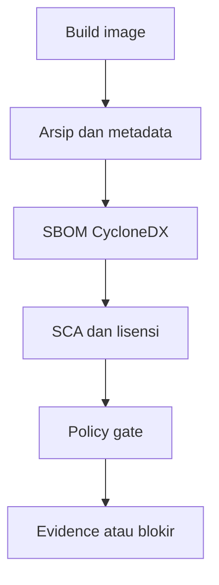

# Cheatsheet Bab 13 — SCA, SBOM, dan Tata Kelola Dependensi

Cheatsheet ini mengikuti pola Bab 4–12. Setiap berkas yang harus dibuat ditempatkan dalam **Kotak Script**, sedangkan setup, build, pemindaian, pengujian, evidence, dan cleanup ditempatkan dalam **Kotak Perintah**. Laboratorium membangun image aplikasi, menyimpannya sebagai arsip, menghasilkan SBOM CycloneDX tanpa memasang Docker socket ke scanner, memindai kerentanan dan lisensi, serta menerapkan policy gate dengan pengecualian yang dapat diaudit.

> **Batas penggunaan.** SBOM adalah inventaris, bukan bukti bahwa perangkat lunak aman. Hasil CVE berubah mengikuti pembaruan advisory database. Kebijakan lisensi pada lab ini hanya contoh teknis dan bukan nasihat hukum. Di produksi, ikat evidence ke digest manifest registry dan minta pemilik risiko atau penasihat hukum meninjau keputusan yang relevan.

## Hasil Belajar

Setelah praktikum, mahasiswa mampu:

1. membedakan inventaris SBOM, hasil SCA, dan keputusan policy gate;
2. membuat SBOM CycloneDX dari arsip image tanpa Docker socket;
3. mengikat SBOM ke image ID, checksum arsip, dan commit sumber;
4. memindai kerentanan serta metadata lisensi menggunakan Trivy;
5. menerapkan kebijakan severity, ketersediaan perbaikan, kelengkapan SBOM, dan lisensi;
6. mengelola exception dengan scope, approver, alasan, serta tanggal kedaluwarsa;
7. membuktikan gate melalui negative test; dan
8. mengumpulkan evidence yang dapat diverifikasi dengan SHA-256.

## Alur Gate Ringkas



| Artefak | Menjawab pertanyaan | Tidak membuktikan |
| --- | --- | --- |
| SBOM | komponen apa yang ditemukan | komponen bebas kerentanan |
| Laporan SCA | advisory apa yang cocok saat scan | kerentanan pasti dapat dieksploitasi |
| Policy result | apakah aturan organisasi dipenuhi | risiko bisnis telah hilang |
| Exception | siapa menerima risiko sampai kapan | finding sudah diperbaiki |

## Versi Baseline

Versi berikut diverifikasi pada 22 Agustus 2026. Periksa kembali versi, digest image, dan advisory sebelum semester berikutnya.

| Komponen | Versi/tag | Fungsi |
| --- | --- | --- |
| Python | 3.13.x | aplikasi dan evaluator lokal |
| Flask | 3.1.3 | aplikasi contoh |
| Gunicorn | 26.1.0 | server aplikasi |
| PyYAML | 6.0.3 | membaca policy dan exception |
| Syft | `anchore/syft:v1.51.0` | membuat SBOM CycloneDX |
| Trivy | `aquasec/trivy:0.74.0` | memindai SBOM |

## Kotak Perintah A — Menyiapkan Direktori Bab 13

```bash
$ mkdir -p ~/docker-lab/bab-13/{app,policy,exceptions,scripts,artifacts,sbom,reports,evidence,cache/trivy}
$ cd ~/docker-lab/bab-13
$ touch artifacts/.gitkeep sbom/.gitkeep reports/.gitkeep evidence/.gitkeep
$ pwd
```

Struktur akhir:

```text
bab-13/
├── .gitignore
├── Makefile
├── requirements-tooling.txt
├── app/
│   ├── .dockerignore
│   ├── Dockerfile
│   ├── app.py
│   └── requirements.txt
├── policy/
│   └── dependency-policy.yaml
├── exceptions/
│   └── exceptions.yaml
└── scripts/
    ├── annotate_sbom.py
    ├── build-artifact.sh
    ├── collect-evidence.sh
    ├── evaluate_policy.py
    ├── generate-sbom.sh
    ├── negative-tests.sh
    └── scan-sbom.sh
```

## Kotak Script 1 — File `.gitignore`

```bash
$ nano .gitignore
```

```gitignore
.venv/
__pycache__/
*.pyc
cache/
artifacts/*
sbom/*
reports/*
evidence/*
!artifacts/.gitkeep
!sbom/.gitkeep
!reports/.gitkeep
!evidence/.gitkeep
```

## Kotak Script 2 — File `requirements-tooling.txt`

```bash
$ nano requirements-tooling.txt
```

```text
PyYAML==6.0.3
```

## Kotak Script 3 — File `app/requirements.txt`

```bash
$ nano app/requirements.txt
```

```text
Flask==3.1.3
gunicorn==26.1.0
```

Dependency dipin agar build dapat ditelusuri. Lock file dengan hash tetap lebih tepat untuk baseline produksi.

## Kotak Script 4 — File `app/app.py`

```bash
$ nano app/app.py
```

```python
from flask import Flask, jsonify

app = Flask(__name__)


@app.get("/")
def index():
    return jsonify(service="bab-13-sbom-lab", status="ok")


@app.get("/health")
def health():
    return jsonify(status="healthy"), 200
```

## Kotak Script 5 — File `app/Dockerfile`

```bash
$ nano app/Dockerfile
```

```dockerfile
FROM python:3.13.7-slim

ENV PYTHONDONTWRITEBYTECODE=1 \
    PYTHONUNBUFFERED=1 \
    PIP_DISABLE_PIP_VERSION_CHECK=1

WORKDIR /app

COPY requirements.txt .
RUN pip install --no-cache-dir --requirement requirements.txt

COPY --chown=65532:65532 app.py .

USER 65532:65532
EXPOSE 5000

HEALTHCHECK --interval=10s --timeout=3s --retries=3 \
  CMD ["python", "-c", "import urllib.request; urllib.request.urlopen('http://127.0.0.1:5000/health')"]

CMD ["gunicorn", "--bind", "0.0.0.0:5000", "--workers", "2", "app:app"]
```

Untuk reproduktibilitas yang lebih kuat, ganti tag base image dengan digest yang telah diuji dan simpan bukti pembaruannya.

## Kotak Script 6 — File `app/.dockerignore`

```bash
$ nano app/.dockerignore
```

```dockerignore
.git
.env
__pycache__
*.pyc
*.pem
*.key
tests
```

## Kotak Script 7 — File `policy/dependency-policy.yaml`

```bash
$ nano policy/dependency-policy.yaml
```

```yaml
policy_version: 1

sbom:
  format: CycloneDX
  allowed_spec_versions:
    - "1.6"
    - "1.7"
  minimum_components: 1
  minimum_purl_ratio: 0.70
  required_properties:
    - org.devsecops.image.id
    - org.devsecops.archive.sha256
    - org.devsecops.git.commit

vulnerability:
  gate_severities:
    - CRITICAL
  require_fix_available: true
  maximum_open_findings: 0

license:
  denied:
    - AGPL-3.0-only
    - SSPL-1.0
  review:
    - UNKNOWN
    - NOASSERTION
```

Kebijakan contoh hanya memblokir finding `CRITICAL` yang mempunyai versi perbaikan. Organisasi dapat memperketat aturan berdasarkan exposure, reachability, SLA, dan klasifikasi sistem.

## Kotak Script 8 — File `exceptions/exceptions.yaml`

```bash
$ nano exceptions/exceptions.yaml
```

```yaml
exceptions: []
```

Contoh entri apabila risiko benar-benar telah disetujui:

```yaml
exceptions:
  - id: EXC-2026-001
    vulnerability_id: CVE-2099-0001
    package_name: example-package
    installed_version: 1.2.3
    scope: devsecops-bab13
    owner: product-owner@example.invalid
    approver: security-owner@example.invalid
    rationale: "Mitigasi kompensasi telah diverifikasi pada lingkungan terisolasi."
    approved_on: 2026-08-22
    expires_on: 2026-09-22
    status: approved
```

Pencocokan dilakukan secara eksak terhadap ID, nama paket, dan versi terpasang. Exception yang kedaluwarsa atau tidak lengkap membuat gate gagal.

## Kotak Script 9 — File `scripts/annotate_sbom.py`

```bash
$ nano scripts/annotate_sbom.py
```

```python
#!/usr/bin/env python3
import argparse
import json
import uuid
from pathlib import Path


def main():
    parser = argparse.ArgumentParser()
    parser.add_argument("--sbom", required=True)
    parser.add_argument("--metadata", required=True)
    args = parser.parse_args()

    sbom_path = Path(args.sbom)
    sbom = json.loads(sbom_path.read_text(encoding="utf-8"))
    metadata = json.loads(Path(args.metadata).read_text(encoding="utf-8"))

    if sbom.get("bomFormat") != "CycloneDX":
        raise SystemExit("FAIL: dokumen bukan CycloneDX")

    archive_sha = metadata["archive_sha256"]
    sbom.setdefault(
        "serialNumber",
        f"urn:uuid:{uuid.uuid5(uuid.NAMESPACE_URL, archive_sha)}",
    )
    document_metadata = sbom.setdefault("metadata", {})
    properties = document_metadata.setdefault("properties", [])

    managed = {
        "org.devsecops.image.tag": metadata["image_tag"],
        "org.devsecops.image.id": metadata["image_id"],
        "org.devsecops.archive.sha256": archive_sha,
        "org.devsecops.git.commit": metadata["git_commit"],
        "org.devsecops.built_at_utc": metadata["built_at_utc"],
    }
    properties[:] = [item for item in properties if item.get("name") not in managed]
    properties.extend(
        {"name": name, "value": value} for name, value in sorted(managed.items())
    )

    sbom_path.write_text(
        json.dumps(sbom, indent=2, sort_keys=True) + "\n",
        encoding="utf-8",
    )
    print(f"PASS: SBOM dianotasi untuk {metadata['image_tag']}")


if __name__ == "__main__":
    main()
```

## Kotak Script 10 — File `scripts/evaluate_policy.py`

```bash
$ nano scripts/evaluate_policy.py
```

```python
#!/usr/bin/env python3
import argparse
import json
from datetime import date
from pathlib import Path

import yaml


REQUIRED_EXCEPTION_FIELDS = {
    "id", "vulnerability_id", "package_name", "installed_version",
    "scope", "owner", "approver", "rationale", "approved_on",
    "expires_on", "status",
}


def load_yaml(path):
    return yaml.safe_load(Path(path).read_text(encoding="utf-8")) or {}


def load_json(path):
    return json.loads(Path(path).read_text(encoding="utf-8"))


def license_ids(component):
    values = set()
    for item in component.get("licenses", []):
        if item.get("expression"):
            values.add(item["expression"])
        license_data = item.get("license", {})
        value = license_data.get("id") or license_data.get("name")
        if value:
            values.add(value)
    return values or {"UNKNOWN"}


def exception_key(item):
    return (
        item.get("vulnerability_id"),
        item.get("package_name"),
        str(item.get("installed_version")),
    )


def main():
    parser = argparse.ArgumentParser()
    parser.add_argument("--sbom", required=True)
    parser.add_argument("--scan", required=True)
    parser.add_argument("--policy", required=True)
    parser.add_argument("--exceptions", required=True)
    parser.add_argument("--output", required=True)
    args = parser.parse_args()

    sbom = load_json(args.sbom)
    scan = load_json(args.scan)
    policy = load_yaml(args.policy)
    exception_document = load_yaml(args.exceptions)
    blockers, warnings = [], []

    sbom_policy = policy["sbom"]
    components = sbom.get("components", [])
    if sbom.get("bomFormat") != sbom_policy["format"]:
        blockers.append("Format SBOM bukan CycloneDX")
    if str(sbom.get("specVersion")) not in sbom_policy["allowed_spec_versions"]:
        blockers.append("Versi spesifikasi SBOM tidak diizinkan")
    if not sbom.get("serialNumber"):
        blockers.append("serialNumber SBOM tidak tersedia")
    if len(components) < sbom_policy["minimum_components"]:
        blockers.append("Jumlah komponen SBOM di bawah minimum")

    purl_count = sum(bool(item.get("purl")) for item in components)
    purl_ratio = purl_count / len(components) if components else 0.0
    if purl_ratio < float(sbom_policy["minimum_purl_ratio"]):
        blockers.append(f"Rasio purl {purl_ratio:.2f} di bawah kebijakan")

    properties = {
        item.get("name"): item.get("value")
        for item in sbom.get("metadata", {}).get("properties", [])
    }
    for name in sbom_policy["required_properties"]:
        if not properties.get(name):
            blockers.append(f"Property wajib hilang: {name}")

    exceptions = exception_document.get("exceptions", [])
    approved = set()
    today = date.today()
    for item in exceptions:
        missing = REQUIRED_EXCEPTION_FIELDS - set(item)
        if missing:
            blockers.append(f"Exception tidak lengkap: {sorted(missing)}")
            continue
        try:
            expires = date.fromisoformat(str(item["expires_on"]))
        except ValueError:
            blockers.append(f"Tanggal expiry tidak valid: {item['id']}")
            continue
        if item["status"] != "approved":
            blockers.append(f"Exception belum approved: {item['id']}")
        elif expires < today:
            blockers.append(f"Exception kedaluwarsa: {item['id']}")
        else:
            approved.add(exception_key(item))

    vuln_policy = policy["vulnerability"]
    gate_severities = set(vuln_policy["gate_severities"])
    open_findings = []
    for result in scan.get("Results", []):
        for vuln in result.get("Vulnerabilities") or []:
            key = (
                vuln.get("VulnerabilityID"),
                vuln.get("PkgName"),
                str(vuln.get("InstalledVersion")),
            )
            fix_available = bool(vuln.get("FixedVersion"))
            gated = vuln.get("Severity") in gate_severities
            if vuln_policy["require_fix_available"]:
                gated = gated and fix_available
            if gated and key not in approved:
                open_findings.append(
                    {
                        "vulnerability_id": key[0],
                        "package_name": key[1],
                        "installed_version": key[2],
                        "fixed_version": vuln.get("FixedVersion"),
                        "severity": vuln.get("Severity"),
                    }
                )

    maximum = int(vuln_policy["maximum_open_findings"])
    if len(open_findings) > maximum:
        blockers.append(
            f"Open finding yang masuk gate: {len(open_findings)}; maksimum {maximum}"
        )

    denied = set(policy["license"]["denied"])
    review = set(policy["license"]["review"])
    denied_hits, review_hits = [], []
    for component in components:
        for license_id in license_ids(component):
            record = {"component": component.get("name"), "license": license_id}
            if license_id in denied:
                denied_hits.append(record)
            elif license_id in review:
                review_hits.append(record)
    if denied_hits:
        blockers.append(f"Lisensi yang ditolak ditemukan: {len(denied_hits)}")
    if review_hits:
        warnings.append(f"Lisensi memerlukan review: {len(review_hits)}")

    report = {
        "status": "PASS" if not blockers else "FAIL",
        "summary": {
            "components": len(components),
            "purl_ratio": round(purl_ratio, 4),
            "open_gated_findings": len(open_findings),
            "denied_license_hits": len(denied_hits),
            "review_license_hits": len(review_hits),
        },
        "blockers": blockers,
        "warnings": warnings,
        "open_findings": open_findings,
        "denied_licenses": denied_hits,
        "review_licenses": review_hits,
    }
    Path(args.output).write_text(
        json.dumps(report, indent=2, sort_keys=True) + "\n",
        encoding="utf-8",
    )
    print(f"{report['status']}: hasil ditulis ke {args.output}")
    raise SystemExit(0 if report["status"] == "PASS" else 1)


if __name__ == "__main__":
    main()
```

Evaluator menggunakan pencocokan lisensi eksak. Ekspresi SPDX kompleks seperti `OR`, `AND`, dan `WITH` memerlukan parser khusus serta peninjauan hukum sebelum dipakai untuk keputusan produksi.

## Kotak Script 11 — File `scripts/build-artifact.sh`

```bash
$ nano scripts/build-artifact.sh
```

```bash
#!/usr/bin/env bash
set -Eeuo pipefail

IMAGE_TAG="devsecops-bab13:1.0"
ARCHIVE="artifacts/devsecops-bab13.tar"
METADATA="artifacts/image-metadata.json"

mkdir -p artifacts
docker build --pull --tag "$IMAGE_TAG" app
docker image inspect "$IMAGE_TAG" >/dev/null
docker save --output "$ARCHIVE" "$IMAGE_TAG"

image_id="$(docker image inspect --format '{{.Id}}' "$IMAGE_TAG")"
archive_sha="$(sha256sum "$ARCHIVE" | awk '{print $1}')"
git_commit="$(git rev-parse HEAD 2>/dev/null || printf 'not-a-git-repository')"
built_at="$(date -u +%Y-%m-%dT%H:%M:%SZ)"

python3 - "$METADATA" "$IMAGE_TAG" "$image_id" "$archive_sha" "$git_commit" "$built_at" <<'PY'
import json
import sys

path, image_tag, image_id, archive_sha, git_commit, built_at = sys.argv[1:]
with open(path, "w", encoding="utf-8") as handle:
    json.dump(
        {
            "image_tag": image_tag,
            "image_id": image_id,
            "archive_sha256": archive_sha,
            "git_commit": git_commit,
            "built_at_utc": built_at,
        },
        handle,
        indent=2,
        sort_keys=True,
    )
    handle.write("\n")
PY

printf 'PASS: %s disimpan dengan SHA-256 %s\n' "$IMAGE_TAG" "$archive_sha"
```

## Kotak Script 12 — File `scripts/generate-sbom.sh`

```bash
$ nano scripts/generate-sbom.sh
```

```bash
#!/usr/bin/env bash
set -Eeuo pipefail

test -s artifacts/devsecops-bab13.tar
test -s artifacts/image-metadata.json
mkdir -p sbom

docker run --rm \
  --user "$(id -u):$(id -g)" \
  --volume "$PWD/artifacts:/input:ro" \
  --volume "$PWD/sbom:/output" \
  anchore/syft:v1.51.0 \
  docker-archive:/input/devsecops-bab13.tar \
  --output cyclonedx-json=/output/devsecops-bab13.cdx.json

.venv/bin/python scripts/annotate_sbom.py \
  --sbom sbom/devsecops-bab13.cdx.json \
  --metadata artifacts/image-metadata.json

python3 -m json.tool sbom/devsecops-bab13.cdx.json >/dev/null
sha256sum sbom/devsecops-bab13.cdx.json > sbom/devsecops-bab13.cdx.json.sha256
printf 'PASS: SBOM CycloneDX dibuat tanpa Docker socket\n'
```

## Kotak Script 13 — File `scripts/scan-sbom.sh`

```bash
$ nano scripts/scan-sbom.sh
```

```bash
#!/usr/bin/env bash
set -Eeuo pipefail

test -s sbom/devsecops-bab13.cdx.json
mkdir -p cache/trivy reports

docker run --rm \
  --user "$(id -u):$(id -g)" \
  --volume "$PWD/cache/trivy:/cache" \
  --volume "$PWD/sbom:/sbom:ro" \
  --volume "$PWD/reports:/reports" \
  aquasec/trivy:0.74.0 \
  sbom \
  --cache-dir /cache \
  --scanners vuln,license \
  --format json \
  --output /reports/trivy-sbom.json \
  /sbom/devsecops-bab13.cdx.json

.venv/bin/python scripts/evaluate_policy.py \
  --sbom sbom/devsecops-bab13.cdx.json \
  --scan reports/trivy-sbom.json \
  --policy policy/dependency-policy.yaml \
  --exceptions exceptions/exceptions.yaml \
  --output reports/policy-result.json
```

Exit code evaluator adalah kontrak gate: `0` berarti PASS dan nilai selain `0` berarti FAIL.

## Kotak Script 14 — File `scripts/negative-tests.sh`

```bash
$ nano scripts/negative-tests.sh
```

```bash
#!/usr/bin/env bash
set -Eeuo pipefail

tmp_dir="$(mktemp -d)"
trap 'rm -rf "$tmp_dir"' EXIT

python3 - "$tmp_dir" <<'PY'
import json
import sys
from pathlib import Path

root = Path(sys.argv[1])
base = {
    "bomFormat": "CycloneDX",
    "specVersion": "1.7",
    "serialNumber": "urn:uuid:00000000-0000-4000-8000-000000000013",
    "metadata": {"properties": [
        {"name": "org.devsecops.image.id", "value": "sha256:lab"},
        {"name": "org.devsecops.archive.sha256", "value": "lab-sha"},
        {"name": "org.devsecops.git.commit", "value": "lab-commit"},
    ]},
    "components": [{
        "type": "library", "name": "demo", "version": "1.0",
        "purl": "pkg:pypi/demo@1.0",
        "licenses": [{"license": {"id": "MIT"}}],
    }],
}
(root / "critical-sbom.json").write_text(json.dumps(base), encoding="utf-8")
critical_scan = {"Results": [{"Vulnerabilities": [{
    "VulnerabilityID": "CVE-LAB-0001", "PkgName": "demo",
    "InstalledVersion": "1.0", "FixedVersion": "1.1", "Severity": "CRITICAL",
}]}]}
(root / "critical-scan.json").write_text(json.dumps(critical_scan), encoding="utf-8")

denied = json.loads(json.dumps(base))
denied["components"][0]["licenses"] = [{"license": {"id": "AGPL-3.0-only"}}]
(root / "license-sbom.json").write_text(json.dumps(denied), encoding="utf-8")
(root / "empty-scan.json").write_text(json.dumps({"Results": []}), encoding="utf-8")
PY

if .venv/bin/python scripts/evaluate_policy.py \
  --sbom "$tmp_dir/critical-sbom.json" \
  --scan "$tmp_dir/critical-scan.json" \
  --policy policy/dependency-policy.yaml \
  --exceptions exceptions/exceptions.yaml \
  --output "$tmp_dir/critical-result.json"; then
  printf 'FAIL: gate menerima finding CRITICAL yang dapat diperbaiki\n' >&2
  exit 1
fi
grep -q 'CVE-LAB-0001' "$tmp_dir/critical-result.json"

if .venv/bin/python scripts/evaluate_policy.py \
  --sbom "$tmp_dir/license-sbom.json" \
  --scan "$tmp_dir/empty-scan.json" \
  --policy policy/dependency-policy.yaml \
  --exceptions exceptions/exceptions.yaml \
  --output "$tmp_dir/license-result.json"; then
  printf 'FAIL: gate menerima lisensi yang ditolak\n' >&2
  exit 1
fi
grep -q 'AGPL-3.0-only' "$tmp_dir/license-result.json"

printf 'PASS: gate menolak finding CRITICAL dan lisensi terlarang sintetis\n'
```

Negative test hanya memakai data sintetis; hasilnya tidak menyatakan aplikasi nyata mempunyai CVE atau lisensi tersebut.

## Kotak Script 15 — File `scripts/collect-evidence.sh`

```bash
$ nano scripts/collect-evidence.sh
```

```bash
#!/usr/bin/env bash
set -Eeuo pipefail

test -s artifacts/image-metadata.json
test -s sbom/devsecops-bab13.cdx.json
test -s reports/trivy-sbom.json
test -s reports/policy-result.json

mkdir -p evidence
cp artifacts/image-metadata.json evidence/
cp sbom/devsecops-bab13.cdx.json evidence/
cp reports/trivy-sbom.json reports/policy-result.json evidence/

{
  printf 'collected_at_utc=%s\n' "$(date -u +%Y-%m-%dT%H:%M:%SZ)"
  printf 'syft_image=anchore/syft:v1.51.0\n'
  printf 'trivy_image=aquasec/trivy:0.74.0\n'
  printf 'git_commit=%s\n' "$(git rev-parse HEAD 2>/dev/null || printf 'not-a-git-repository')"
} > evidence/tool-context.txt

find app policy exceptions scripts artifacts sbom reports \
  -type f ! -name '*.tar' -print0 \
  | sort -z \
  | xargs -0 sha256sum > evidence/SHA256SUMS.txt
sha256sum artifacts/devsecops-bab13.tar >> evidence/SHA256SUMS.txt

printf 'PASS: evidence tersedia pada evidence/\n'
```

## Kotak Script 16 — File `Makefile`

> Baris perintah pada Makefile harus diawali karakter **Tab**, bukan spasi.

```bash
$ nano Makefile
```

```makefile
.PHONY: setup build sbom scan negative-test evidence all clean

setup:
	python3 -m venv .venv
	.venv/bin/pip install --requirement requirements-tooling.txt

build:
	bash scripts/build-artifact.sh

sbom:
	bash scripts/generate-sbom.sh

scan:
	bash scripts/scan-sbom.sh

negative-test:
	bash scripts/negative-tests.sh

evidence:
	bash scripts/collect-evidence.sh

all: build sbom scan negative-test evidence

clean:
	docker image rm devsecops-bab13:1.0 2>/dev/null || true
	rm -f artifacts/devsecops-bab13.tar artifacts/image-metadata.json
	rm -f sbom/*.json sbom/*.sha256 reports/*.json evidence/*
	rm -rf cache/trivy
```

## Kotak Perintah B — Permission dan Validasi Statis

```bash
$ chmod +x scripts/*.sh scripts/*.py
$ bash -n scripts/*.sh
$ python3 -m py_compile app/app.py scripts/*.py
$ python3 -c "import yaml; [yaml.safe_load(open(p)) for p in ['policy/dependency-policy.yaml','exceptions/exceptions.yaml']]"
$ make setup
```

## Kotak Perintah C — Build dan Arsip Image

```bash
$ make build
$ docker image inspect devsecops-bab13:1.0 --format '{{.Id}} {{.Config.User}}'
$ sha256sum --check <(awk -F'"' '/archive_sha256/ {print $4 "  artifacts/devsecops-bab13.tar"}' artifacts/image-metadata.json)
$ python3 -m json.tool artifacts/image-metadata.json
```

Pada Linux, output user harus `65532:65532`. Process substitution `<(...)` memerlukan Bash.

## Kotak Perintah D — Membuat dan Memeriksa SBOM

```bash
$ make sbom
$ sha256sum --check sbom/devsecops-bab13.cdx.json.sha256
$ python3 - <<'PY'
import json
data = json.load(open('sbom/devsecops-bab13.cdx.json', encoding='utf-8'))
print('format       :', data.get('bomFormat'))
print('spec version :', data.get('specVersion'))
print('serial       :', data.get('serialNumber'))
print('components   :', len(data.get('components', [])))
PY
```

## Kotak Perintah E — Menjalankan SCA dan Policy Gate

```bash
$ make scan
$ python3 -m json.tool reports/policy-result.json
$ python3 - <<'PY'
import json
result = json.load(open('reports/policy-result.json', encoding='utf-8'))
print('status  :', result['status'])
print('summary :', result['summary'])
print('blocker :', result['blockers'])
print('warning :', result['warnings'])
PY
```

Jika gate gagal, jangan mengubah laporan atau menambahkan exception agar pipeline sekadar hijau. Perbarui dependency, verifikasi mitigasi, atau jalankan proses penerimaan risiko yang sah.

## Kotak Perintah F — Menjalankan Negative Test

```bash
$ make negative-test
```

Keluaran wajib:

```text
PASS: gate menolak finding CRITICAL dan lisensi terlarang sintetis
```

## Kotak Perintah G — Menguji Aplikasi

```bash
$ docker run --rm -d --name bab13-app -p 127.0.0.1:5013:5000 devsecops-bab13:1.0
$ curl --fail http://127.0.0.1:5013/health
$ docker inspect --format '{{.State.Health.Status}}' bab13-app
$ docker stop bab13-app
```

## Kotak Perintah H — Re-scan Setelah Database Diperbarui

```bash
$ rm -rf cache/trivy
$ mkdir -p cache/trivy
$ make scan
$ cp reports/trivy-sbom.json "reports/trivy-sbom-$(date -u +%Y%m%dT%H%M%SZ).json"
```

Perubahan jumlah finding setelah re-scan tidak selalu berarti image berubah; advisory dan status perbaikannya juga dapat berubah. Bandingkan checksum image/SBOM serta waktu dan versi scanner.

## Kotak Perintah I — Mengumpulkan Evidence

```bash
$ make evidence
$ sha256sum --check evidence/SHA256SUMS.txt
$ find evidence -maxdepth 1 -type f -printf '%f\n' | sort
```

Di produksi, arsip evidence harus disimpan pada penyimpanan immutable atau artifact store dengan access control dan retention policy.

## Kriteria PASS/FAIL

| Pengujian | PASS | FAIL |
| --- | --- | --- |
| Sintaks | Bash, Python, dan YAML valid | parser menghasilkan galat |
| Build | image berhasil dibuat | build atau dependency install gagal |
| Identitas | image ID dan SHA-256 arsip tercatat | metadata kosong atau tidak cocok |
| Isolasi scanner | Syft membaca arsip tanpa Docker socket | `/var/run/docker.sock` dipasang |
| Format SBOM | CycloneDX dan versi diizinkan | format atau versi tidak sesuai |
| Kelengkapan | komponen dan rasio purl memenuhi policy | inventaris di bawah ambang |
| Traceability | image, arsip, dan commit tercatat | property wajib hilang |
| SCA | laporan JSON dapat diproses | scan gagal atau laporan rusak |
| Vulnerability gate | open finding tidak melebihi batas | CRITICAL ber-fix lolos tanpa exception |
| License gate | tidak ada lisensi denied | lisensi denied diterima |
| Exception | lengkap, approved, eksak, belum expiry | wildcard, kedaluwarsa, atau tanpa approver |
| Negative test | kedua fixture sintetis ditolak | salah satu diterima |
| Evidence | checksum seluruh evidence valid | berkas hilang atau berubah |

## Troubleshooting Cepat

| Gejala | Kemungkinan penyebab | Tindakan |
| --- | --- | --- |
| `permission denied` pada output | UID container tidak dapat menulis direktori host | periksa ownership `sbom/`, `reports/`, dan `cache/trivy/` |
| Syft tidak membaca arsip | arsip belum dibuat atau rusak | jalankan `make build` dan cek SHA-256 |
| Trivy gagal mengunduh DB | koneksi, proxy, rate limit, atau cache bermasalah | periksa jaringan lalu ulangi; jangan pakai DB lama tanpa mencatatnya |
| `policy-result` FAIL | finding, lisensi, metadata, atau exception melanggar policy | baca seluruh `blockers`, bukan hanya exit code |
| Banyak lisensi `UNKNOWN` | metadata paket tidak lengkap | review sumber upstream; jangan otomatis menganggap aman atau terlarang |
| Rasio purl rendah | generator tidak mengenali banyak komponen | periksa katalog Syft dan format paket; dokumentasikan batas cakupan |
| Hasil direct scan berbeda | generator SBOM dan scanner memakai metadata berbeda | bandingkan direct image scan dan scan SBOM; simpan kedua evidence |
| Healthcheck tetap `starting` | container baru berjalan atau aplikasi gagal start | tunggu beberapa detik dan periksa `docker logs bab13-app` |

## Kotak Perintah J — Cleanup Aman

```bash
$ docker rm -f bab13-app 2>/dev/null || true
$ make clean
$ rm -rf .venv
```

`make clean` menghapus image serta evidence lokal Bab 13. Jangan menjalankannya sebelum evidence yang diperlukan telah disalin ke penyimpanan yang sesuai.

## Integrasi dengan Bab Sebelumnya

- **Bab 10:** tambahkan `make sbom`, `make scan`, dan `make negative-test` sebelum publikasi image. Publikasikan SBOM serta policy result sebagai artifact CI.
- **Bab 11:** hubungkan risiko supply-chain dengan requirement tentang provenance, vulnerability SLA, exception, dan integritas artifact.
- **Bab 12:** jalankan SAST dan secret scanning sebelum build; jangan memasukkan laporan atau credential ke image.
- **Produksi:** ganti identitas lokal dengan digest manifest registry, tanda tangani image dan attestations, lalu verifikasi pada deployment gate.

## Catatan Interpretasi

1. Trivy menyatakan pemindaian SBOM yang dibuat tool lain dapat kehilangan metadata khusus yang dipakai untuk deteksi; untuk assurance lebih tinggi, bandingkan dengan direct image scan Trivy.
2. Skor severity bukan satu-satunya prioritas. Pertimbangkan reachability, internet exposure, exploit maturity, data sensitivity, serta kontrol kompensasi.
3. `FixedVersion` kosong tidak berarti aman; dapat berarti belum ada patch atau metadata belum tersedia. Lab ini hanya tidak menjadikannya blocker otomatis.
4. Lisensi `UNKNOWN` memerlukan review. Lisensi yang muncul pada daftar contoh bukan berarti selalu dilarang pada seluruh organisasi.
5. CycloneDX dan SPDX adalah standar yang terus berkembang. Versi policy harus dikaji ulang ketika toolchain atau spesifikasi berubah.

## Checklist Akhir

- [ ] Seluruh file berada di `~/docker-lab/bab-13`.
- [ ] Tidak ada Docker socket yang dipasang ke Syft atau Trivy.
- [ ] Image ID, checksum arsip, dan commit tercatat.
- [ ] SBOM CycloneDX valid dan mempunyai komponen serta purl.
- [ ] Laporan SCA dan policy result tersedia.
- [ ] Exception kosong atau memenuhi seluruh field tata kelola.
- [ ] Negative test menolak finding dan lisensi sintetis.
- [ ] Evidence lolos verifikasi SHA-256.
- [ ] Temuan ditindaklanjuti, bukan disembunyikan dengan waiver.

**[High confidence]** Struktur file, alur gate, dan kontrol tata kelola pada cheatsheet dapat divalidasi secara statis.  
**[Medium confidence]** Hasil CVE, lisensi, jumlah komponen, dan kompatibilitas runtime bergantung pada image, advisory database, platform, serta versi tool saat praktikum dijalankan.
