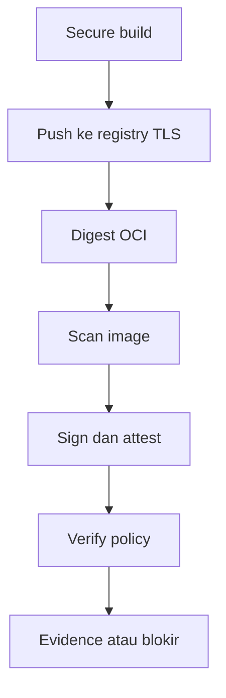

# Cheatsheet Bab 14 — Secure Build, Image Signing, dan Provenance

Cheatsheet ini mengikuti pola Bab 4–13. Setiap berkas ditempatkan dalam **Kotak Script**, sedangkan setup, build, scan, signing, verification, negative test, evidence, dan cleanup ditempatkan dalam **Kotak Perintah**. Laboratorium memakai multi-stage build, BuildKit secret, registry lokal bertLS dan autentikasi, Trivy tanpa Docker socket, referensi image berbasis digest, Cosign, serta provenance SLSA v1 yang divalidasi melalui policy lokal.

> **Batas jaminan.** Signature membuktikan bahwa pihak yang menguasai kunci menandatangani digest tertentu; signature tidak membuktikan image bebas kerentanan. Provenance manual pada lab ini dapat dibuat atau diubah oleh pengguna build sehingga tidak memenuhi SLSA Build L2/L3. Produksi memerlukan platform build terkelola, identitas workload, KMS atau keyless signing, verifikasi issuer/subject, dan policy admission.

## Hasil Belajar

Setelah praktikum, mahasiswa mampu:

1. membuat runtime image minimal melalui multi-stage build;
2. memakai BuildKit secret tanpa memasukkan secret ke `ARG`, `ENV`, layer, atau build context;
3. memublikasikan image ke registry TLS dengan autentikasi;
4. mengikat scan, signature, provenance, dan evidence pada digest OCI;
5. memindai arsip image tanpa memasang Docker socket ke scanner;
6. menandatangani serta memverifikasi image menggunakan Cosign;
7. membuat dan memvalidasi attestation provenance;
8. membuktikan kontrol dengan negative test; dan
9. membedakan SLSA Build L1, L2, dan L3 secara tepat.

## Alur Gate Ringkas



| Bukti | Menjawab | Tidak membuktikan |
| --- | --- | --- |
| Digest | konten manifest mana yang dirujuk | siapa yang menyetujui rilis |
| Scan | finding apa yang cocok saat scan | finding pasti dapat dieksploitasi |
| Signature | kunci mana menandatangani digest | proses build aman |
| Provenance | input dan proses apa yang diklaim | klaim jujur jika builder tidak dipercaya |
| Policy result | apakah bukti memenuhi aturan lokal | semua risiko supply-chain hilang |

## Versi Baseline

Versi berikut diverifikasi pada 22 Agustus 2026. Sebelum semester berikutnya, periksa kembali release, digest image, advisori, dan perubahan CLI.

| Komponen | Versi/tag | Fungsi |
| --- | --- | --- |
| Python | 3.13.x | aplikasi dan validator |
| Flask | 3.1.3 | aplikasi contoh |
| Gunicorn | 26.1.0 | server aplikasi |
| PyYAML | 6.0.3 | membaca policy |
| Distribution Registry | `registry:3.1.1` | registry OCI lokal |
| Trivy | `aquasec/trivy:0.74.0` | image scan |
| Cosign | `ghcr.io/sigstore/cosign/cosign:v3.1.3` | signing dan attestation |

## Kotak Perintah A — Menyiapkan Direktori Bab 14

```bash
$ mkdir -p ~/docker-lab/bab-14/{app,auth,certs,secrets,keys,policy,provenance,fixtures/insecure,scripts,artifacts,reports,evidence,cache/trivy}
$ cd ~/docker-lab/bab-14
$ touch artifacts/.gitkeep reports/.gitkeep evidence/.gitkeep
$ pwd
```

## Kotak Script 1 — File `.gitignore`

```bash
$ nano .gitignore
```

```gitignore
.env
.venv/
__pycache__/
*.pyc
auth/*
certs/*
secrets/*
keys/*
cache/
artifacts/*
reports/*
evidence/*
provenance/provenance.json
!artifacts/.gitkeep
!reports/.gitkeep
!evidence/.gitkeep
!secrets/pip.conf.example
```

File yang sudah pernah masuk Git tidak dilindungi oleh `.gitignore`. Credential atau private key yang terlanjur terpublikasi harus dicabut atau dirotasi.

## Kotak Script 2 — File `.env.example`

```bash
$ nano .env.example
```

```dotenv
REGISTRY_USER=labuser
REGISTRY_PASSWORD=GANTI_DENGAN_HEX_ACAK
COSIGN_PASSWORD=GANTI_DENGAN_HEX_ACAK_LAIN
```

## Kotak Script 3 — File `requirements-tooling.txt`

```bash
$ nano requirements-tooling.txt
```

```text
PyYAML==6.0.3
```

## Kotak Script 4 — File `compose.yaml`

```bash
$ nano compose.yaml
```

```yaml
services:
  registry:
    image: registry:3.1.1
    ports:
      - "127.0.0.1:5443:5000"
    environment:
      REGISTRY_HTTP_ADDR: 0.0.0.0:5000
      REGISTRY_HTTP_TLS_CERTIFICATE: /certs/lab.crt
      REGISTRY_HTTP_TLS_KEY: /certs/lab.key
      REGISTRY_AUTH: htpasswd
      REGISTRY_AUTH_HTPASSWD_REALM: DevSecOps-Lab
      REGISTRY_AUTH_HTPASSWD_PATH: /auth/htpasswd
      REGISTRY_STORAGE_DELETE_ENABLED: "true"
    volumes:
      - registry-data:/var/lib/registry
      - ./certs:/certs:ro
      - ./auth:/auth:ro
    networks:
      - bab14-net
    restart: unless-stopped

networks:
  bab14-net:
    name: bab14-net
    driver: bridge

volumes:
  registry-data:
```

Hanya registry yang dipublikasikan dan port dibatasi ke loopback. Service scanner dan Cosign akan bergabung sementara ke `bab14-net`.

## Kotak Script 5 — File `app/requirements.txt`

```bash
$ nano app/requirements.txt
```

```text
Flask==3.1.3
gunicorn==26.1.0
```

## Kotak Script 6 — File `app/app.py`

```bash
$ nano app/app.py
```

```python
from flask import Flask, jsonify

app = Flask(__name__)


@app.get("/")
def index():
    return jsonify(service="secure-build-lab", status="ok")


@app.get("/health")
def health():
    return jsonify(status="healthy"), 200
```

## Kotak Script 7 — File `app/Dockerfile`

```bash
$ nano app/Dockerfile
```

```dockerfile
# syntax=docker/dockerfile:1.18
FROM python:3.13.7-slim AS builder

ENV PIP_DISABLE_PIP_VERSION_CHECK=1
WORKDIR /build

COPY requirements.txt .
RUN --mount=type=secret,id=pip_config,required=true \
    --mount=type=cache,target=/root/.cache/pip \
    PIP_CONFIG_FILE=/run/secrets/pip_config \
    pip wheel --wheel-dir /wheels --requirement requirements.txt

FROM python:3.13.7-slim AS runtime

ENV PYTHONDONTWRITEBYTECODE=1 \
    PYTHONUNBUFFERED=1 \
    PIP_DISABLE_PIP_VERSION_CHECK=1

WORKDIR /app
COPY --from=builder /wheels /wheels
RUN pip install --no-cache-dir /wheels/* && rm -rf /wheels
COPY --chown=65532:65532 app.py .

USER 65532:65532
EXPOSE 8080

HEALTHCHECK --interval=10s --timeout=3s --retries=3 \
  CMD ["python", "-c", "import urllib.request; urllib.request.urlopen('http://127.0.0.1:8080/health')"]

CMD ["gunicorn", "--bind", "0.0.0.0:8080", "--workers", "2", "app:app"]
```

Untuk produksi, pin kedua base image ke digest yang telah diuji. Tag versi tetap lebih baik daripada `latest`, tetapi masih mutable.

## Kotak Script 8 — File `app/.dockerignore`

```bash
$ nano app/.dockerignore
```

```dockerignore
.git
.env
__pycache__
*.pyc
*.pem
*.key
secrets
keys
reports
```

Build secret diberikan melalui `--secret`, bukan disalin ke build context.

## Kotak Script 9 — File `secrets/pip.conf.example`

```bash
$ nano secrets/pip.conf.example
```

```ini
[global]
index-url = https://pypi.org/simple
disable-pip-version-check = true
```

Contoh ini tidak berisi credential. Jika memakai private index, simpan credential hanya pada `secrets/pip.conf`, batasi permission, jangan commit, dan rotasi sesuai kebijakan.

## Kotak Script 10 — File `policy/supply-chain-policy.yaml`

```bash
$ nano policy/supply-chain-policy.yaml
```

```yaml
policy_version: 1

artifact:
  expected_repository: registry:5000/devsecops-lab
  digest_algorithm: sha256

signature:
  public_key: keys/cosign.pub
  require_signature: true

provenance:
  predicate_type: https://slsa.dev/provenance/v1
  allowed_builder_ids:
    - https://pens.example.invalid/devsecops/local-lab-builder/v1
  required_external_parameters:
    - gitCommit
    - imageTag

scan:
  blocked_severities:
    - CRITICAL
  ignore_unfixed: true
```

Builder ID memakai domain `.invalid` agar tidak mengklaim identitas layanan nyata. Pada produksi, ID harus mewakili platform build yang benar-benar dikendalikan dan diverifikasi organisasi.

## Kotak Script 11 — File `scripts/setup-lab.sh`

```bash
$ nano scripts/setup-lab.sh
```

```bash
#!/usr/bin/env bash
set -Eeuo pipefail

test -s .env || { printf 'FAIL: salin .env.example menjadi .env\n' >&2; exit 1; }
set -a
# shellcheck disable=SC1091
source .env
set +a

for name in REGISTRY_USER REGISTRY_PASSWORD COSIGN_PASSWORD; do
  test -n "${!name:-}" || { printf 'FAIL: %s kosong\n' "$name" >&2; exit 1; }
done
case "$REGISTRY_PASSWORD$COSIGN_PASSWORD" in
  *GANTI_DENGAN*) printf 'FAIL: ganti seluruh placeholder pada .env\n' >&2; exit 1 ;;
esac

mkdir -p auth certs secrets keys cache/trivy artifacts reports evidence provenance
test -e secrets/pip.conf || cp secrets/pip.conf.example secrets/pip.conf
chmod 600 .env secrets/pip.conf

openssl req -x509 -nodes -newkey rsa:3072 -days 365 \
  -keyout certs/lab.key \
  -out certs/lab.crt \
  -subj '/CN=registry/O=DevSecOps Lab' \
  -addext 'subjectAltName=DNS:registry,DNS:localhost,IP:127.0.0.1'
chmod 600 certs/lab.key
chmod 644 certs/lab.crt

docker run --rm --entrypoint htpasswd httpd:2.4.65-alpine \
  -Bbn "$REGISTRY_USER" "$REGISTRY_PASSWORD" > auth/htpasswd
chmod 600 auth/htpasswd

docker compose config >/dev/null
printf 'PASS: credential lab, sertifikat TLS, dan htpasswd tersedia\n'
```

## Kotak Script 12 — File `scripts/build-push.sh`

```bash
$ nano scripts/build-push.sh
```

```bash
#!/usr/bin/env bash
set -Eeuo pipefail

set -a
# shellcheck disable=SC1091
source .env
set +a

IMAGE_TAG="localhost:5443/devsecops-lab:1.0"
mkdir -p artifacts reports auth/docker

python3 - <<'PY'
import base64
import json
import os

token = base64.b64encode(
    f"{os.environ['REGISTRY_USER']}:{os.environ['REGISTRY_PASSWORD']}".encode()
).decode()
with open("auth/docker/config.json", "w", encoding="utf-8") as handle:
    json.dump({"auths": {
        "localhost:5443": {"auth": token},
        "registry:5000": {"auth": token},
    }}, handle)
    handle.write("\n")
PY
chmod 600 auth/docker/config.json
export DOCKER_CONFIG="$PWD/auth/docker"

docker buildx build \
  --pull \
  --secret id=pip_config,src=secrets/pip.conf \
  --provenance=mode=max \
  --sbom=true \
  --tag "$IMAGE_TAG" \
  --push \
  app

headers="$(mktemp)"
trap 'rm -f "$headers"' EXIT
curl --fail --silent --show-error \
  --cacert certs/lab.crt \
  --user "$REGISTRY_USER:$REGISTRY_PASSWORD" \
  --header 'Accept: application/vnd.oci.image.index.v1+json, application/vnd.docker.distribution.manifest.list.v2+json, application/vnd.oci.image.manifest.v1+json' \
  --dump-header "$headers" \
  --output /dev/null \
  "https://localhost:5443/v2/devsecops-lab/manifests/1.0"

digest="$(awk 'BEGIN{IGNORECASE=1} /^Docker-Content-Digest:/ {gsub("\r", "", $2); print $2}' "$headers" | tail -1)"
[[ "$digest" =~ ^sha256:[0-9a-f]{64}$ ]] || { printf 'FAIL: digest registry tidak valid\n' >&2; exit 1; }

git_commit="$(git rev-parse HEAD 2>/dev/null || printf 'not-a-git-repository')"
started_on="$(date -u +%Y-%m-%dT%H:%M:%SZ)"
python3 - "$IMAGE_TAG" "$digest" "$git_commit" "$started_on" > artifacts/build-metadata.json <<'PY'
import json
import sys

image_tag, digest, git_commit, built_at = sys.argv[1:]
print(json.dumps({
    "image_tag": image_tag,
    "registry_reference": f"registry:5000/devsecops-lab@{digest}",
    "digest": digest,
    "git_commit": git_commit,
    "built_at_utc": built_at,
}, indent=2, sort_keys=True))
PY

printf 'PASS: image dipublikasikan sebagai %s@%s\n' "$IMAGE_TAG" "$digest"
```

Digest diambil dari header registry, bukan dari tag atau image ID lokal.

## Kotak Script 13 — File `scripts/scan-image.sh`

```bash
$ nano scripts/scan-image.sh
```

```bash
#!/usr/bin/env bash
set -Eeuo pipefail

set -a
# shellcheck disable=SC1091
source .env
set +a

test -s artifacts/build-metadata.json
IMAGE_TAG="localhost:5443/devsecops-lab:1.0"
ARCHIVE="artifacts/devsecops-lab.tar"
mkdir -p auth/docker cache/trivy reports
test -s auth/docker/config.json
export DOCKER_CONFIG="$PWD/auth/docker"
docker pull "$IMAGE_TAG"
docker save --output "$ARCHIVE" "$IMAGE_TAG"
sha256sum "$ARCHIVE" > artifacts/devsecops-lab.tar.sha256

docker run --rm \
  --user "$(id -u):$(id -g)" \
  --volume "$PWD/cache/trivy:/cache" \
  --volume "$PWD/artifacts:/input:ro" \
  --volume "$PWD/reports:/reports" \
  aquasec/trivy:0.74.0 \
  image --input /input/devsecops-lab.tar \
  --cache-dir /cache \
  --scanners vuln,secret \
  --severity HIGH,CRITICAL \
  --format json \
  --output /reports/trivy-image.json

docker run --rm \
  --user "$(id -u):$(id -g)" \
  --volume "$PWD/cache/trivy:/cache" \
  --volume "$PWD/artifacts:/input:ro" \
  aquasec/trivy:0.74.0 \
  image --input /input/devsecops-lab.tar \
  --cache-dir /cache \
  --scanners vuln \
  --severity CRITICAL \
  --ignore-unfixed \
  --exit-code 1

printf 'PASS: scan selesai tanpa memasang Docker socket\n'
```

Scan kedua adalah gate. Jika terdapat `CRITICAL` yang memiliki perbaikan, script berhenti dengan exit code gagal sebelum signing.

## Kotak Script 14 — File `scripts/create-provenance.py`

```bash
$ nano scripts/create-provenance.py
```

```python
#!/usr/bin/env python3
import argparse
import json
import uuid
from pathlib import Path


def main():
    parser = argparse.ArgumentParser()
    parser.add_argument("--metadata", required=True)
    parser.add_argument("--output", required=True)
    args = parser.parse_args()

    metadata = json.loads(Path(args.metadata).read_text(encoding="utf-8"))
    predicate = {
        "buildDefinition": {
            "buildType": "https://pens.example.invalid/devsecops/docker-build/v1",
            "externalParameters": {
                "gitCommit": metadata["git_commit"],
                "imageTag": metadata["image_tag"],
            },
            "internalParameters": {},
            "resolvedDependencies": [{
                "uri": "git+file://local/devsecops-bab-14",
                "digest": {"gitCommit": metadata["git_commit"]},
            }],
        },
        "runDetails": {
            "builder": {
                "id": "https://pens.example.invalid/devsecops/local-lab-builder/v1"
            },
            "metadata": {
                "invocationId": str(uuid.uuid4()),
                "startedOn": metadata["built_at_utc"],
                "finishedOn": metadata["built_at_utc"],
            },
            "byproducts": [],
        },
    }
    Path(args.output).write_text(
        json.dumps(predicate, indent=2, sort_keys=True) + "\n",
        encoding="utf-8",
    )
    print(f"PASS: predicate ditulis ke {args.output}")


if __name__ == "__main__":
    main()
```

Timestamp awal dan akhir sama karena metadata build sederhana. Ini memadai untuk fixture tata kelola, bukan rekaman build berjaminan tinggi.

## Kotak Script 15 — File `scripts/sign-attest.sh`

```bash
$ nano scripts/sign-attest.sh
```

```bash
#!/usr/bin/env bash
set -Eeuo pipefail

set -a
# shellcheck disable=SC1091
source .env
set +a

test -s artifacts/build-metadata.json
reference="$(python3 -c "import json; print(json.load(open('artifacts/build-metadata.json'))['registry_reference'])")"
mkdir -p keys provenance reports

cosign_run() {
  docker run --rm \
    --network bab14-net \
    --env COSIGN_PASSWORD \
    --env SSL_CERT_FILE=/certs/lab.crt \
    --env DOCKER_CONFIG=/docker-config \
    --volume "$PWD/certs/lab.crt:/certs/lab.crt:ro" \
    --volume "$PWD/auth/docker:/docker-config:ro" \
    --volume "$PWD/keys:/keys" \
    --volume "$PWD/provenance:/provenance" \
    ghcr.io/sigstore/cosign/cosign:v3.1.3 "$@"
}

if [[ ! -s keys/cosign.key || ! -s keys/cosign.pub ]]; then
  cosign_run generate-key-pair --output-key-prefix /keys/cosign
  chmod 600 keys/cosign.key
  chmod 644 keys/cosign.pub
fi

.venv/bin/python scripts/create-provenance.py \
  --metadata artifacts/build-metadata.json \
  --output provenance/provenance.json

cosign_run sign --yes \
  --tlog-upload=false \
  --key /keys/cosign.key \
  "$reference"

cosign_run attest --yes \
  --tlog-upload=false \
  --key /keys/cosign.key \
  --predicate /provenance/provenance.json \
  --type https://slsa.dev/provenance/v1 \
  "$reference"

printf 'PASS: signature dan provenance terikat pada %s\n' "$reference"
```

Private key hanya untuk lab dan tidak boleh masuk Git. Produksi sebaiknya memakai KMS/HSM atau keyless signing dengan identitas OIDC serta policy issuer/subject.

## Kotak Script 16 — File `scripts/verify_supply_chain.py`

```bash
$ nano scripts/verify_supply_chain.py
```

```python
#!/usr/bin/env python3
import argparse
import base64
import json
from pathlib import Path

import yaml


def load_json(path):
    return json.loads(Path(path).read_text(encoding="utf-8"))


def main():
    parser = argparse.ArgumentParser()
    parser.add_argument("--metadata", required=True)
    parser.add_argument("--signature", required=True)
    parser.add_argument("--attestation", required=True)
    parser.add_argument("--policy", required=True)
    parser.add_argument("--output", required=True)
    args = parser.parse_args()

    metadata = load_json(args.metadata)
    signatures = load_json(args.signature)
    attestations = load_json(args.attestation)
    policy = yaml.safe_load(Path(args.policy).read_text(encoding="utf-8"))
    blockers = []

    digest = metadata["digest"]
    algorithm, digest_hex = digest.split(":", 1)
    if algorithm != policy["artifact"]["digest_algorithm"]:
        blockers.append("Algoritma digest tidak diizinkan")
    if not isinstance(signatures, list) or not signatures:
        blockers.append("Signature terverifikasi tidak tersedia")

    statements = []
    for item in attestations if isinstance(attestations, list) else []:
        payload = item.get("payload")
        if not payload:
            continue
        try:
            statements.append(json.loads(base64.b64decode(payload)))
        except (ValueError, json.JSONDecodeError):
            blockers.append("Payload attestation tidak valid")

    expected_type = policy["provenance"]["predicate_type"]
    matching = [item for item in statements if item.get("predicateType") == expected_type]
    if not matching:
        blockers.append("Predicate type provenance tidak ditemukan")
    else:
        statement = matching[0]
        subjects = statement.get("subject", [])
        if not any(item.get("digest", {}).get("sha256") == digest_hex for item in subjects):
            blockers.append("Subject provenance tidak cocok dengan digest image")
        predicate = statement.get("predicate", {})
        builder_id = predicate.get("runDetails", {}).get("builder", {}).get("id")
        if builder_id not in policy["provenance"]["allowed_builder_ids"]:
            blockers.append("Builder ID tidak diizinkan")
        parameters = predicate.get("buildDefinition", {}).get("externalParameters", {})
        for name in policy["provenance"]["required_external_parameters"]:
            if not parameters.get(name):
                blockers.append(f"Parameter provenance hilang: {name}")

    result = {
        "status": "PASS" if not blockers else "FAIL",
        "artifact_digest": digest,
        "verified_signatures": len(signatures) if isinstance(signatures, list) else 0,
        "verified_attestations": len(statements),
        "blockers": blockers,
        "assurance": "LAB-L1-ONLY",
    }
    Path(args.output).write_text(
        json.dumps(result, indent=2, sort_keys=True) + "\n",
        encoding="utf-8",
    )
    print(f"{result['status']}: hasil ditulis ke {args.output}")
    raise SystemExit(0 if result["status"] == "PASS" else 1)


if __name__ == "__main__":
    main()
```

## Kotak Script 17 — File `scripts/verify.sh`

```bash
$ nano scripts/verify.sh
```

```bash
#!/usr/bin/env bash
set -Eeuo pipefail

set -a
# shellcheck disable=SC1091
source .env
set +a

reference="$(python3 -c "import json; print(json.load(open('artifacts/build-metadata.json'))['registry_reference'])")"
mkdir -p reports

cosign_run() {
  docker run --rm \
    --network bab14-net \
    --env SSL_CERT_FILE=/certs/lab.crt \
    --env DOCKER_CONFIG=/docker-config \
    --volume "$PWD/certs/lab.crt:/certs/lab.crt:ro" \
    --volume "$PWD/auth/docker:/docker-config:ro" \
    --volume "$PWD/keys/cosign.pub:/keys/cosign.pub:ro" \
    ghcr.io/sigstore/cosign/cosign:v3.1.3 "$@"
}

cosign_run verify \
  --key /keys/cosign.pub \
  --insecure-ignore-tlog=true \
  --output json \
  "$reference" > reports/cosign-verify.json

cosign_run verify-attestation \
  --key /keys/cosign.pub \
  --insecure-ignore-tlog=true \
  --type https://slsa.dev/provenance/v1 \
  --output json \
  "$reference" > reports/cosign-attestation.json

.venv/bin/python scripts/verify_supply_chain.py \
  --metadata artifacts/build-metadata.json \
  --signature reports/cosign-verify.json \
  --attestation reports/cosign-attestation.json \
  --policy policy/supply-chain-policy.yaml \
  --output reports/supply-chain-policy.json
```

Flag `--insecure-ignore-tlog=true` hanya diperlukan karena lab menggunakan kunci lokal dan tidak mengunggah ke transparency log. Jangan menyalinnya ke baseline keyless production tanpa analisis.

## Kotak Script 18 — File `fixtures/insecure/Dockerfile`

```bash
$ nano fixtures/insecure/Dockerfile
```

```dockerfile
FROM alpine:3.22
ARG LAB_BUILD_SECRET
RUN test -n "$LAB_BUILD_SECRET"
CMD ["sh"]
```

Fixture ini sengaja salah dan hanya memakai marker sintetis. `ARG` bukan tempat aman untuk secret karena nilainya dapat muncul pada metadata atau history build.

## Kotak Script 19 — File `scripts/negative-tests.sh`

```bash
$ nano scripts/negative-tests.sh
```

```bash
#!/usr/bin/env bash
set -Eeuo pipefail

set -a
# shellcheck disable=SC1091
source .env
set +a

reference="$(python3 -c "import json; print(json.load(open('artifacts/build-metadata.json'))['registry_reference'])")"
unsigned_tag="localhost:5443/devsecops-unsigned:1.0"
marker='LAB_BUILD_SECRET_SYNTHETIC_14'
mkdir -p auth/docker

test -s auth/docker/config.json
export DOCKER_CONFIG="$PWD/auth/docker"
docker tag localhost:5443/devsecops-lab:1.0 "$unsigned_tag"
docker push "$unsigned_tag" >/dev/null

if docker run --rm --network bab14-net \
  --env SSL_CERT_FILE=/certs/lab.crt \
  --env DOCKER_CONFIG=/docker-config \
  --volume "$PWD/certs/lab.crt:/certs/lab.crt:ro" \
  --volume "$PWD/auth/docker:/docker-config:ro" \
  --volume "$PWD/keys/cosign.pub:/keys/cosign.pub:ro" \
  ghcr.io/sigstore/cosign/cosign:v3.1.3 verify \
  --key /keys/cosign.pub \
  --insecure-ignore-tlog=true \
  "registry:5000/devsecops-unsigned:1.0"; then
  printf 'FAIL: image tanpa signature diterima\n' >&2
  exit 1
fi

if docker run --rm --network bab14-net \
  --env SSL_CERT_FILE=/certs/lab.crt \
  --env DOCKER_CONFIG=/docker-config \
  --volume "$PWD/certs/lab.crt:/certs/lab.crt:ro" \
  --volume "$PWD/auth/docker:/docker-config:ro" \
  --volume "$PWD/keys/cosign.pub:/keys/cosign.pub:ro" \
  ghcr.io/sigstore/cosign/cosign:v3.1.3 verify-attestation \
  --key /keys/cosign.pub \
  --insecure-ignore-tlog=true \
  --type https://example.invalid/wrong-predicate/v1 \
  "$reference"; then
  printf 'FAIL: predicate type yang salah diterima\n' >&2
  exit 1
fi

docker build --no-cache \
  --build-arg "LAB_BUILD_SECRET=$marker" \
  --tag bab14-insecure-fixture:negative \
  fixtures/insecure >/dev/null
docker history --no-trunc bab14-insecure-fixture:negative | grep -q "$marker"

printf 'PASS: unsigned image dan predicate salah ditolak; ARG leak terdeteksi\n'
```

## Kotak Script 20 — File `scripts/collect-evidence.sh`

```bash
$ nano scripts/collect-evidence.sh
```

```bash
#!/usr/bin/env bash
set -Eeuo pipefail

for path in \
  artifacts/build-metadata.json \
  artifacts/devsecops-lab.tar.sha256 \
  reports/trivy-image.json \
  reports/cosign-verify.json \
  reports/cosign-attestation.json \
  reports/supply-chain-policy.json \
  provenance/provenance.json; do
  test -s "$path" || { printf 'FAIL: evidence hilang: %s\n' "$path" >&2; exit 1; }
done

mkdir -p evidence
cp artifacts/build-metadata.json artifacts/devsecops-lab.tar.sha256 evidence/
cp reports/*.json evidence/
cp provenance/provenance.json evidence/
cp keys/cosign.pub evidence/

{
  printf 'collected_at_utc=%s\n' "$(date -u +%Y-%m-%dT%H:%M:%SZ)"
  printf 'cosign_image=ghcr.io/sigstore/cosign/cosign:v3.1.3\n'
  printf 'trivy_image=aquasec/trivy:0.74.0\n'
  printf 'registry_image=registry:3.1.1\n'
} > evidence/tool-context.txt

find evidence -maxdepth 1 -type f ! -name SHA256SUMS.txt -print0 \
  | sort -z | xargs -0 sha256sum > evidence/SHA256SUMS.txt
printf 'PASS: evidence dan checksum tersedia\n'
```

## Kotak Script 21 — File `Makefile`

> Setiap baris perintah pada Makefile harus diawali karakter **Tab**.

```bash
$ nano Makefile
```

```makefile
.PHONY: setup registry build scan sign verify negative-test evidence all clean

setup:
	bash scripts/setup-lab.sh
	python3 -m venv .venv
	.venv/bin/pip install --requirement requirements-tooling.txt

registry:
	docker compose up -d registry

build:
	bash scripts/build-push.sh

scan:
	bash scripts/scan-image.sh

sign:
	bash scripts/sign-attest.sh

verify:
	bash scripts/verify.sh

negative-test:
	bash scripts/negative-tests.sh

evidence:
	bash scripts/collect-evidence.sh

all: build scan sign verify negative-test evidence

clean:
	docker rm -f bab14-app 2>/dev/null || true
	docker image rm localhost:5443/devsecops-lab:1.0 2>/dev/null || true
	docker image rm localhost:5443/devsecops-unsigned:1.0 2>/dev/null || true
	docker image rm bab14-insecure-fixture:negative 2>/dev/null || true
	rm -f artifacts/*.json artifacts/*.tar artifacts/*.sha256
	rm -f reports/*.json provenance/provenance.json evidence/*
	rm -rf cache/trivy
```

## Kotak Perintah B — Membuat Credential Lab

```bash
$ umask 077
$ printf 'REGISTRY_USER=labuser\nREGISTRY_PASSWORD=%s\nCOSIGN_PASSWORD=%s\n' \
    "$(openssl rand -hex 18)" "$(openssl rand -hex 18)" > .env
```

Perintah menghasilkan dua secret berbeda tanpa menampilkannya pada layar. Jangan menyalin `.env` ke laporan atau screenshot.

## Kotak Perintah C — Setup TLS dan Trust Registry

```bash
$ chmod +x scripts/*.sh scripts/*.py
$ make setup
$ sudo mkdir -p /etc/docker/certs.d/localhost:5443
$ sudo cp certs/lab.crt /etc/docker/certs.d/localhost:5443/ca.crt
$ sudo systemctl restart docker
$ make registry
$ curl --fail --cacert certs/lab.crt https://localhost:5443/v2/
```

Respons `401 Unauthorized` pada request tanpa credential membuktikan TLS aktif dan autentikasi diwajibkan. Uji dengan credential:

```bash
$ set -a; source .env; set +a
$ curl --fail --cacert certs/lab.crt --user "$REGISTRY_USER:$REGISTRY_PASSWORD" https://localhost:5443/v2/
```

Docker Desktop tidak memakai `systemctl`. Impor CA melalui mekanisme Docker Desktop/OS yang didukung, restart Docker Desktop, lalu ulangi `docker login`. Langkah trust ini perlu disesuaikan dan diverifikasi pada platform aktual.

## Kotak Perintah D — Validasi Statis

```bash
$ bash -n scripts/*.sh
$ python3 -m py_compile app/app.py scripts/*.py
$ python3 -c "import yaml; yaml.safe_load(open('policy/supply-chain-policy.yaml'))"
$ docker compose config
$ docker buildx version
```

## Kotak Perintah E — Build dan Push

```bash
$ make build
$ python3 -m json.tool artifacts/build-metadata.json
$ set -a; source .env; set +a
$ curl --fail --cacert certs/lab.crt --user "$REGISTRY_USER:$REGISTRY_PASSWORD" \
    https://localhost:5443/v2/devsecops-lab/tags/list
```

## Kotak Perintah F — Memeriksa Secret dan Runtime Image

```bash
$ docker pull localhost:5443/devsecops-lab:1.0
$ docker history --no-trunc localhost:5443/devsecops-lab:1.0 | grep -Ei 'password|token|secret' && echo FAIL || echo PASS
$ docker run --rm localhost:5443/devsecops-lab:1.0 sh -c \
    'test ! -e /run/secrets/pip_config && test "$(id -u)" = 65532'
$ docker run --rm -d --name bab14-app -p 127.0.0.1:5014:8080 localhost:5443/devsecops-lab:1.0
$ curl --fail http://127.0.0.1:5014/health
$ docker stop bab14-app
```

Pencarian kata pada history adalah pemeriksaan tambahan dan dapat menghasilkan false positive. Bukti utama adalah secret mount, build context minimal, review Dockerfile, dan pengujian marker sintetis.

## Kotak Perintah G — Scan Gate

```bash
$ make scan
$ sha256sum --check artifacts/devsecops-lab.tar.sha256
$ python3 -m json.tool reports/trivy-image.json >/dev/null
```

Jika gate menemukan `CRITICAL` ber-fix, perbarui dependency atau base image, rebuild, scan ulang, dan hasilkan digest baru. Jangan menandatangani digest lama.

## Kotak Perintah H — Sign, Attest, dan Verify

```bash
$ make sign
$ make verify
$ python3 -m json.tool reports/supply-chain-policy.json
```

Hasil wajib memuat:

```json
{
  "assurance": "LAB-L1-ONLY",
  "status": "PASS"
}
```

## Kotak Perintah I — Negative Test

```bash
$ make negative-test
```

Keluaran wajib:

```text
PASS: unsigned image dan predicate salah ditolak; ARG leak terdeteksi
```

## Kotak Perintah J — Mengumpulkan Evidence

```bash
$ make evidence
$ sha256sum --check evidence/SHA256SUMS.txt
$ find evidence -maxdepth 1 -type f -printf '%f\n' | sort
```

Private key, `.env`, `auth/`, dan `secrets/` tidak boleh masuk evidence.

## Kriteria PASS/FAIL

| Pengujian | PASS | FAIL |
| --- | --- | --- |
| Registry | TLS dan autentikasi aktif | HTTP terbuka atau anonymous push |
| Build secret | diberikan melalui secret mount | memakai `ARG`, `ENV`, atau `COPY` |
| Multi-stage | runtime tidak membawa cache builder | wheel/cache/compiler tersisa |
| Runtime identity | UID `65532` | berjalan sebagai root |
| Image identity | digest `sha256:` dari registry tercatat | hanya tag atau image ID lokal |
| Scanner isolation | membaca arsip tanpa Docker socket | scanner menguasai daemon host |
| Scan gate | tidak ada CRITICAL ber-fix | finding blocker diabaikan |
| Signing | signature valid untuk digest | signature hilang atau salah kunci |
| Attestation | predicate dan subject digest cocok | tipe, builder, atau digest salah |
| SLSA claim | diberi label `LAB-L1-ONLY` | mengklaim L2/L3 tanpa hosted builder |
| Negative test | unsigned, wrong predicate, dan ARG leak terdeteksi | kondisi terlarang diterima |
| Evidence | checksum valid dan tanpa private key | evidence berubah atau memuat secret |

## Troubleshooting Cepat

| Gejala | Kemungkinan penyebab | Tindakan |
| --- | --- | --- |
| `x509: certificate signed by unknown authority` | CA belum dipercaya daemon/BuildKit | pasang CA untuk registry, restart runtime, dan validasi dengan `curl --cacert` |
| Buildx tidak dapat push | builder tidak mewarisi trust atau tidak menjangkau loopback | gunakan builder yang dikonfigurasi untuk CA; periksa driver dan network |
| Registry memberi `401` | credential salah atau htpasswd tidak termuat | periksa log registry dan buat ulang `auth/htpasswd` |
| Trivy gate berubah | advisory DB diperbarui | catat waktu scan, digest, dan versi DB; lakukan triage ulang |
| Cosign tidak dapat menjangkau registry | container tidak berada pada `bab14-net` | pastikan Compose aktif dan nama network tepat |
| Cosign meminta password interaktif | `COSIGN_PASSWORD` tidak diteruskan | periksa `.env` dan fungsi `cosign_run` tanpa mencetak nilainya |
| Signature valid tetapi policy gagal | predicate type, builder, parameter, atau digest tidak cocok | buka `blockers` pada policy result |
| Attestation tidak terlihat | registry/referrers atau format Cosign tidak kompatibel | periksa versi registry/Cosign dan OCI referrer support |
| Rebuild menghasilkan digest berbeda | input, timestamp, resolver, atau base berubah | bandingkan provenance dan material; jangan berasumsi reproducible |

## Kotak Perintah K — Cleanup Aman

```bash
$ make clean
$ docker compose down --volumes
$ rm -rf .venv auth certs keys secrets/pip.conf .env
```

Penghapusan volume registry, private key, dan credential bersifat material. Jalankan hanya setelah evidence yang diperlukan dipindahkan dan pastikan tidak ada data lain pada direktori Bab 14.

## Integrasi dengan Bab Sebelumnya

- **Bab 10:** jadikan `scan`, `sign`, dan `verify` sebagai gate setelah build dan sebelum deployment; runner build tidak boleh menerima private key jangka panjang.
- **Bab 11:** tautkan threat `artifact tampering`, `secret leakage`, dan `untrusted builder` ke requirement serta residual risk.
- **Bab 12:** jalankan SAST dan secret scanning sebelum build.
- **Bab 13:** publikasikan SBOM dan policy result bersama digest; signature tidak menggantikan SCA.
- **Produksi:** verifikasi digest, signature identity, issuer, predicate type, builder ID, source revision, dan policy pada admission controller.

## Catatan SLSA dan Interpretasi

| Level | Ringkasan | Status lab ini |
| --- | --- | --- |
| Build L1 | provenance tersedia | tercapai secara edukatif, tetapi mudah dipalsukan pengguna |
| Build L2 | hosted platform membuat dan menandatangani provenance | tidak tercapai |
| Build L3 | hosted builder memiliki isolasi dan hardening kuat | tidak tercapai |

1. BuildKit dapat menghasilkan provenance dan SBOM sebagai attestation. Namun assurance tergantung siapa mengendalikan builder serta bagaimana output diverifikasi.
2. `mode=max` dapat memuat metadata build yang lebih kaya. Tinjau potensi kebocoran parameter sebelum publikasi.
3. Key-pair lokal cocok untuk laboratorium, tetapi distribusi public key, backup, rotasi, revocation, dan perlindungan private key tetap harus dirancang.
4. Tag bersifat mutable. Semua gate rilis harus memakai repository plus digest.
5. SLSA hanya mencakup aspek tertentu dari supply-chain; level build dependency transitif tidak otomatis diwariskan.

## Checklist Akhir

- [ ] Seluruh file berada di `~/docker-lab/bab-14`.
- [ ] Registry memakai TLS, autentikasi, dan binding loopback.
- [ ] Secret tidak dikirim melalui `ARG`, `ENV`, atau build context.
- [ ] Runtime image berjalan non-root dan tidak membawa artefak builder.
- [ ] Digest registry tercatat dan dipakai untuk scan/sign/verify.
- [ ] Trivy tidak memperoleh Docker socket.
- [ ] Signature dan attestation diverifikasi dengan public key yang diharapkan.
- [ ] Provenance subject, predicate type, builder ID, dan parameters memenuhi policy.
- [ ] Negative test menolak unsigned image serta predicate salah dan menemukan ARG leak.
- [ ] Klaim assurance tidak melebihi `LAB-L1-ONLY`.
- [ ] Evidence lolos SHA-256 dan tidak memuat private key atau credential.

## Rujukan Resmi

- [Docker Build secrets](https://docs.docker.com/build/building/secrets/)
- [Docker SLSA provenance attestations](https://docs.docker.com/build/metadata/attestations/slsa-provenance/)
- [Cosign verification](https://docs.sigstore.dev/cosign/verifying/verify/)
- [Cosign in-toto attestations](https://docs.sigstore.dev/cosign/verifying/attestation/)
- [Cosign v3.1.3](https://github.com/sigstore/cosign/releases/tag/v3.1.3)
- [Trivy v0.74.0](https://github.com/aquasecurity/trivy/releases/tag/v0.74.0)
- [Distribution Registry v3.1.1](https://github.com/distribution/distribution/releases/tag/v3.1.1)
- [SLSA specification v1.2](https://slsa.dev/spec/v1.2/)
- [SLSA Build Track basics](https://slsa.dev/spec/v1.2/build-track-basics)

**[High confidence]** Struktur, kebijakan, dan alur verifikasi dapat diperiksa secara statis.  
**[Medium confidence]** Kompatibilitas runtime bergantung pada Docker Engine/Buildx, trust store host, OCI referrer support, dan versi CLI saat praktikum dijalankan.
